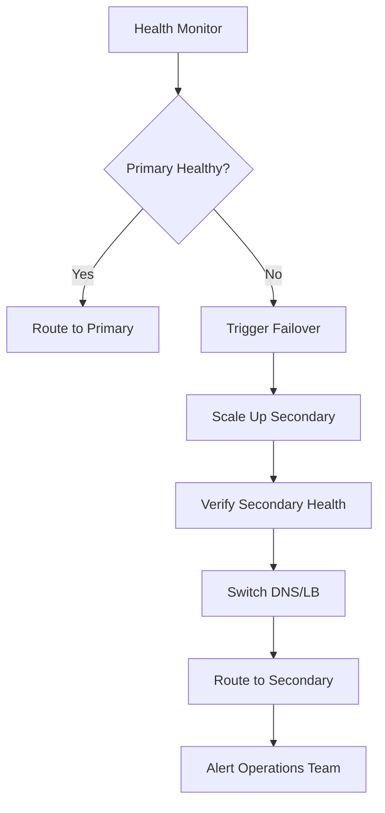

# How to Implement Cluster Failover with ArgoCD

Author: [nawazdhandala](https://github.com/nawazdhandala)

Tags: ArgoCD, GitOps, Kubernetes, Failover, Disaster Recovery

Description: Learn how to implement automated and manual cluster failover with ArgoCD, including health detection, traffic switching, data synchronization, and failback procedures.

---

Cluster failover is the process of redirecting traffic from a failed Kubernetes cluster to a healthy one. With ArgoCD managing your multi-cluster deployments, you can automate much of the failover process while keeping everything tracked through GitOps. This guide covers both automated and manual failover strategies.

## Failover Architecture

A robust failover setup has three components: health detection, traffic switching, and data synchronization.



## Prerequisites

You need:

- ArgoCD running on a management cluster (separate from workload clusters)
- At least two workload clusters registered with ArgoCD
- Applications deployed to both clusters via ApplicationSets
- DNS or load balancer that supports health-based routing

## Step 1: Deploy Applications to Multiple Clusters

Start by deploying your application to both primary and secondary clusters:

```yaml
apiVersion: argoproj.io/v1alpha1
kind: ApplicationSet
metadata:
  name: web-app
  namespace: argocd
spec:
  generators:
    - clusters:
        selector:
          matchLabels:
            environment: production
        values:
          role: '{{metadata.labels.role}}'
  template:
    metadata:
      name: 'web-app-{{name}}'
    spec:
      project: default
      source:
        repoURL: https://github.com/myorg/web-app.git
        targetRevision: main
        path: deploy/overlays/{{values.role}}
      destination:
        server: '{{server}}'
        namespace: web-app
      syncPolicy:
        automated:
          prune: true
          selfHeal: true
        syncOptions:
          - CreateNamespace=true
```

## Step 2: Health Detection

### Option A: DNS Health Checks

AWS Route53 health checks can detect when a cluster is unhealthy and automatically route traffic away:

```yaml
# Managed with Crossplane or Terraform
apiVersion: route53.aws.upbound.io/v1beta1
kind: HealthCheck
metadata:
  name: primary-cluster-health
spec:
  forProvider:
    fqdn: primary-health.internal.example.com
    port: 443
    type: HTTPS
    resourcePath: /healthz
    failureThreshold: 3
    requestInterval: 10
    regions:
      - us-east-1
      - us-west-2
      - eu-west-1
```

### Option B: Custom Health Monitor

Deploy a health monitoring system that checks application health across clusters:

```yaml
apiVersion: apps/v1
kind: Deployment
metadata:
  name: cluster-health-monitor
  namespace: monitoring
spec:
  replicas: 2
  selector:
    matchLabels:
      app: cluster-health-monitor
  template:
    metadata:
      labels:
        app: cluster-health-monitor
    spec:
      containers:
        - name: monitor
          image: myorg/cluster-monitor:v1.0
          env:
            - name: PRIMARY_ENDPOINT
              value: "https://primary.internal.example.com/health"
            - name: SECONDARY_ENDPOINT
              value: "https://secondary.internal.example.com/health"
            - name: CHECK_INTERVAL
              value: "10s"
            - name: FAILURE_THRESHOLD
              value: "3"
            - name: ARGOCD_SERVER
              value: "argocd-server.argocd.svc:443"
            - name: WEBHOOK_URL
              value: "https://hooks.slack.com/services/..."
```

### Option C: ArgoCD Notifications for Health Alerts

Use ArgoCD Notifications to alert when applications become unhealthy:

```yaml
apiVersion: v1
kind: ConfigMap
metadata:
  name: argocd-notifications-cm
  namespace: argocd
data:
  trigger.on-health-degraded: |
    - description: Application health degraded
      when: app.status.health.status == 'Degraded'
      send:
        - cluster-failover-alert
  trigger.on-sync-failed: |
    - description: Application sync failed
      when: app.status.operationState.phase == 'Error'
      send:
        - cluster-failover-alert
  template.cluster-failover-alert: |
    webhook:
      failover-webhook:
        method: POST
        body: |
          {
            "app": "{{.app.metadata.name}}",
            "cluster": "{{.app.spec.destination.server}}",
            "health": "{{.app.status.health.status}}",
            "action": "investigate_failover"
          }
  service.webhook.failover-webhook: |
    url: https://automation.example.com/failover
    headers:
      - name: Authorization
        value: Bearer $webhook-token
```

## Step 3: Automated Failover

For automated failover, create a controller or CronJob that monitors health and triggers failover:

```yaml
apiVersion: batch/v1
kind: CronJob
metadata:
  name: failover-controller
  namespace: argocd
spec:
  schedule: "*/1 * * * *"  # Check every minute
  jobTemplate:
    spec:
      template:
        spec:
          serviceAccountName: failover-controller
          containers:
            - name: controller
              image: bitnami/kubectl:latest
              command:
                - /bin/sh
                - -c
                - |
                  # Check primary cluster application health
                  PRIMARY_HEALTH=$(argocd app get web-app-primary \
                    -o json | jq -r '.status.health.status')

                  SECONDARY_HEALTH=$(argocd app get web-app-secondary \
                    -o json | jq -r '.status.health.status')

                  # Get current active cluster from ConfigMap
                  ACTIVE=$(kubectl get configmap failover-state \
                    -n argocd -o jsonpath='{.data.active}')

                  if [ "$ACTIVE" = "primary" ] && [ "$PRIMARY_HEALTH" != "Healthy" ]; then
                    if [ "$SECONDARY_HEALTH" = "Healthy" ]; then
                      echo "Primary unhealthy, failing over to secondary"

                      # Scale up secondary
                      kubectl patch configmap failover-state \
                        -n argocd --type merge \
                        -p '{"data":{"active":"secondary","failover_time":"'$(date -u +%Y-%m-%dT%H:%M:%SZ)'"}}'

                      # Trigger DNS update
                      kubectl create job --from=cronjob/dns-updater \
                        dns-failover-$(date +%s) -n argocd
                    fi
                  fi
          restartPolicy: Never
```

## Step 4: Manual Failover Procedure

For manual failover, create a runbook-style script:

```bash
#!/bin/bash
# failover.sh - Manual cluster failover script

set -e

PRIMARY_APP="web-app-primary"
SECONDARY_APP="web-app-secondary"

echo "=== Starting Manual Failover ==="
echo "Time: $(date -u)"

# Step 1: Verify secondary is healthy
echo "Step 1: Checking secondary cluster health..."
SECONDARY_HEALTH=$(argocd app get $SECONDARY_APP -o json | jq -r '.status.health.status')
if [ "$SECONDARY_HEALTH" != "Healthy" ]; then
  echo "ERROR: Secondary cluster is not healthy ($SECONDARY_HEALTH). Cannot failover."
  exit 1
fi
echo "Secondary cluster is healthy."

# Step 2: Scale up secondary to production capacity
echo "Step 2: Scaling up secondary cluster..."
argocd app set $SECONDARY_APP --path deploy/overlays/active
argocd app sync $SECONDARY_APP
argocd app wait $SECONDARY_APP --health --timeout 300
echo "Secondary cluster scaled up."

# Step 3: Update DNS
echo "Step 3: Updating DNS..."
aws route53 change-resource-record-sets \
  --hosted-zone-id Z1234567890 \
  --change-batch file://dns-failover.json
echo "DNS updated. Waiting for propagation..."
sleep 60

# Step 4: Scale down primary (if reachable)
echo "Step 4: Scaling down primary..."
argocd app set $PRIMARY_APP --path deploy/overlays/passive || true
argocd app sync $PRIMARY_APP || echo "Warning: Primary cluster may be unreachable"

echo "=== Failover Complete ==="
echo "Active cluster: secondary"
echo "Verify at: https://api.example.com/health"
```

## Step 5: Failback Procedure

After the primary cluster is repaired, you need to fail back:

```bash
#!/bin/bash
# failback.sh - Return to primary cluster

set -e

echo "=== Starting Failback to Primary ==="

# Step 1: Ensure primary is synced and healthy
echo "Step 1: Syncing primary cluster..."
argocd app sync web-app-primary
argocd app wait web-app-primary --health --timeout 300

# Step 2: Scale primary to production capacity
echo "Step 2: Scaling up primary..."
argocd app set web-app-primary --path deploy/overlays/active
argocd app sync web-app-primary
argocd app wait web-app-primary --health --timeout 300

# Step 3: Gradually shift traffic back
echo "Step 3: Shifting traffic - 25% to primary..."
# Update DNS weights
sleep 300  # Monitor for 5 minutes

echo "Step 4: Shifting traffic - 50% to primary..."
sleep 300

echo "Step 5: Shifting traffic - 100% to primary..."
# Final DNS update

# Step 6: Scale down secondary
echo "Step 6: Scaling down secondary..."
argocd app set web-app-secondary --path deploy/overlays/passive
argocd app sync web-app-secondary

echo "=== Failback Complete ==="
```

## Step 6: Testing Failover

Regularly test your failover setup. Here is a test automation approach:

```yaml
apiVersion: batch/v1
kind: CronJob
metadata:
  name: failover-drill
  namespace: argocd
spec:
  # Run monthly on the first Saturday at 2 AM
  schedule: "0 2 1-7 * 6"
  jobTemplate:
    spec:
      template:
        spec:
          containers:
            - name: drill
              image: myorg/failover-drill:v1.0
              command:
                - /bin/sh
                - -c
                - |
                  echo "Starting failover drill..."

                  # Save current state
                  CURRENT_ACTIVE=$(kubectl get configmap failover-state \
                    -n argocd -o jsonpath='{.data.active}')

                  # Execute failover
                  /scripts/failover.sh

                  # Run integration tests against new active
                  /scripts/integration-tests.sh

                  # Execute failback
                  /scripts/failback.sh

                  # Verify original state restored
                  /scripts/integration-tests.sh

                  echo "Failover drill completed successfully"
          restartPolicy: Never
```

## Monitoring Failover Events

Track failover metrics and history:

```yaml
apiVersion: monitoring.coreos.com/v1
kind: PrometheusRule
metadata:
  name: failover-monitoring
  namespace: monitoring
spec:
  groups:
    - name: failover.rules
      rules:
        - alert: FailoverTriggered
          expr: |
            changes(failover_state_changes_total[1h]) > 0
          labels:
            severity: critical
          annotations:
            summary: "Cluster failover was triggered"
        - alert: FailbackNeeded
          expr: |
            failover_active_cluster != 1
          for: 24h
          labels:
            severity: warning
          annotations:
            summary: "Running on secondary cluster for over 24h - consider failback"
```

## Summary

Cluster failover with ArgoCD combines GitOps-managed deployments with health detection and traffic switching. Use ApplicationSets to keep applications deployed across clusters, DNS health checks or custom monitors for detection, and scripted procedures for failover and failback. The most critical element is testing - schedule regular failover drills to ensure your procedures work when you actually need them. For related patterns, see our guides on [active-passive deployments](https://oneuptime.com/blog/post/2026-02-26-how-to-implement-active-passive-deployments-across-clusters-with-argocd/view) and [active-active deployments](https://oneuptime.com/blog/post/2026-02-26-how-to-implement-active-active-deployments-across-clusters-with-argocd/view).
