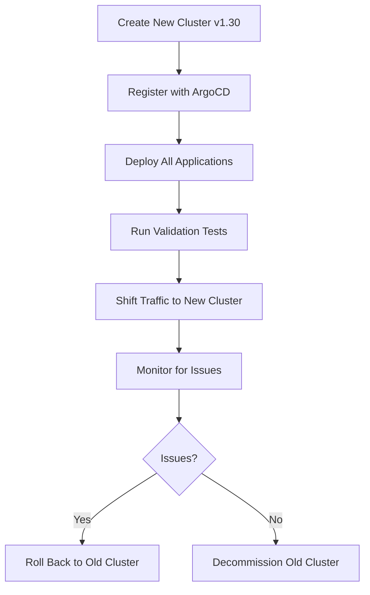

# How to Implement Cluster Upgrades with ArgoCD

Author: [nawazdhandala](https://github.com/nawazdhandala)

Tags: ArgoCD, GitOps, Kubernetes, Multi-Cluster, Cluster Upgrades

Description: Learn how to implement Kubernetes cluster upgrades with ArgoCD using blue-green cluster patterns, rolling upgrades, and in-place upgrade strategies for zero-downtime updates.

---

Kubernetes cluster upgrades are one of the most stressful operations in infrastructure management. A bad upgrade can take down every workload in the cluster. When ArgoCD manages your multi-cluster deployments, you can use GitOps patterns to make cluster upgrades safer and more predictable.

This guide covers three upgrade strategies: in-place upgrades, blue-green cluster replacement, and rolling multi-cluster upgrades.

## The Upgrade Challenge

Kubernetes releases a new minor version roughly every four months, and each version is supported for about 14 months. Falling behind on upgrades means losing security patches and eventually hitting incompatibilities. But upgrading is risky because:

- Deprecated APIs may break your manifests
- Node upgrades can cause pod disruptions
- Control plane upgrades may cause brief API server downtime
- Cluster add-ons may not be compatible with the new version

## Strategy 1: In-Place Upgrade with ArgoCD Pre-Checks

The simplest approach upgrades the existing cluster. ArgoCD helps by validating manifests before the upgrade.

### Step 1: Check API Compatibility

Before upgrading, verify your manifests are compatible with the new Kubernetes version:

```yaml
# Pre-upgrade validation job
apiVersion: batch/v1
kind: Job
metadata:
  name: api-compatibility-check
  namespace: argocd
  annotations:
    argocd.argoproj.io/hook: PreSync
    argocd.argoproj.io/hook-delete-policy: HookSucceeded
spec:
  template:
    spec:
      containers:
        - name: check
          image: registry.k8s.io/kube-apiserver:v1.30.0
          command:
            - /bin/sh
            - -c
            - |
              echo "Checking for deprecated APIs..."

              # Use pluto to detect deprecated APIs
              pluto detect-files -d /manifests --target-versions k8s=v1.30.0

              if [ $? -ne 0 ]; then
                echo "FAILED: Deprecated APIs found"
                exit 1
              fi

              echo "All APIs compatible with v1.30.0"
      restartPolicy: Never
```

### Step 2: Create a Pre-Upgrade ArgoCD Application

Deploy an application that validates cluster readiness:

```yaml
apiVersion: argoproj.io/v1alpha1
kind: Application
metadata:
  name: upgrade-readiness
  namespace: argocd
spec:
  project: default
  source:
    repoURL: https://github.com/myorg/platform.git
    targetRevision: main
    path: cluster-upgrade/pre-checks
  destination:
    server: https://cluster.k8s.example.com
    namespace: kube-system
  syncPolicy:
    automated:
      selfHeal: false
```

Pre-check manifests:

```yaml
# Check PodDisruptionBudgets are in place
apiVersion: batch/v1
kind: Job
metadata:
  name: pdb-check
  annotations:
    argocd.argoproj.io/hook: PreSync
    argocd.argoproj.io/hook-delete-policy: HookSucceeded
spec:
  template:
    spec:
      serviceAccountName: upgrade-checker
      containers:
        - name: check
          image: bitnami/kubectl:latest
          command:
            - /bin/sh
            - -c
            - |
              echo "Checking PodDisruptionBudgets..."

              # Get all deployments with replicas > 1
              DEPLOYMENTS=$(kubectl get deployments --all-namespaces \
                -o jsonpath='{range .items[?(@.spec.replicas > 1)]}{.metadata.namespace}/{.metadata.name}{"\n"}{end}')

              MISSING_PDB=0
              for DEP in $DEPLOYMENTS; do
                NS=$(echo $DEP | cut -d/ -f1)
                NAME=$(echo $DEP | cut -d/ -f2)

                PDB_COUNT=$(kubectl get pdb -n $NS -o json | \
                  jq "[.items[] | select(.spec.selector.matchLabels | to_entries[] | .value == \"$NAME\")] | length")

                if [ "$PDB_COUNT" = "0" ]; then
                  echo "WARNING: No PDB for $DEP"
                  MISSING_PDB=$((MISSING_PDB + 1))
                fi
              done

              if [ $MISSING_PDB -gt 0 ]; then
                echo "WARNING: $MISSING_PDB deployments without PDBs"
              fi

              echo "PDB check complete"
      restartPolicy: Never
```

### Step 3: Upgrade the Cluster

For managed Kubernetes (EKS, GKE, AKS), the control plane upgrade is handled by the cloud provider:

```bash
# EKS upgrade
aws eks update-cluster-version \
  --name my-cluster \
  --kubernetes-version 1.30

# Wait for control plane upgrade
aws eks wait cluster-active --name my-cluster

# Upgrade node groups
aws eks update-nodegroup-version \
  --cluster-name my-cluster \
  --nodegroup-name main-nodes \
  --kubernetes-version 1.30
```

### Step 4: Post-Upgrade Verification

After the upgrade, verify ArgoCD applications are still healthy:

```bash
# Check all applications
argocd app list -o json | jq '.[] | select(.status.health.status != "Healthy" or .status.sync.status != "Synced") | {name: .metadata.name, health: .status.health.status, sync: .status.sync.status}'

# Force sync all applications to pick up any API version changes
for app in $(argocd app list -o name); do
  argocd app sync "$app" --force
done
```

## Strategy 2: Blue-Green Cluster Replacement

The safest upgrade strategy creates a new cluster at the target version and migrates workloads.



### Step 1: Create New Cluster

```bash
# Create new cluster at target version
eksctl create cluster \
  --name my-cluster-v130 \
  --version 1.30 \
  --region us-east-1 \
  --nodegroup-name main \
  --node-type m6i.xlarge \
  --nodes 5
```

### Step 2: Register with ArgoCD

```yaml
apiVersion: v1
kind: Secret
metadata:
  name: new-cluster-v130
  namespace: argocd
  labels:
    argocd.argoproj.io/secret-type: cluster
    environment: production
    region: us-east-1
    k8s-version: "1.30"
    migration-status: target
type: Opaque
stringData:
  name: cluster-v130
  server: https://new-cluster-v130.k8s.example.com
  config: '...'
```

### Step 3: Deploy Applications

If you use ApplicationSets with cluster selectors, temporarily deploy to both clusters:

```yaml
apiVersion: argoproj.io/v1alpha1
kind: ApplicationSet
metadata:
  name: api-service
  namespace: argocd
spec:
  generators:
    - clusters:
        selector:
          matchExpressions:
            - key: environment
              operator: In
              values: ["production"]
            - key: region
              operator: In
              values: ["us-east-1"]
            # Deploy to both old and new during migration
```

### Step 4: Traffic Migration

Gradually shift traffic to the new cluster using DNS weights or load balancer configuration:

```bash
# Phase 1: Canary - 5% traffic to new cluster
# Phase 2: 25% traffic
# Phase 3: 50% traffic
# Phase 4: 100% traffic to new cluster
```

### Step 5: Decommission Old Cluster

Once the new cluster is serving all traffic, follow the [cluster decommissioning process](https://oneuptime.com/blog/post/2026-02-26-how-to-implement-cluster-decommissioning-with-argocd/view).

## Strategy 3: Rolling Multi-Cluster Upgrade

If you have multiple clusters, upgrade them one at a time with traffic shifting:

```yaml
apiVersion: argoproj.io/v1alpha1
kind: ApplicationSet
metadata:
  name: api-service
  namespace: argocd
spec:
  generators:
    - clusters:
        selector:
          matchLabels:
            environment: production
  # Rolling sync ensures we upgrade one cluster at a time
  strategy:
    type: RollingSync
    rollingSync:
      steps:
        # Upgrade cluster A first
        - matchExpressions:
            - key: name
              operator: In
              values:
                - cluster-a
        # Then cluster B
        - matchExpressions:
            - key: name
              operator: In
              values:
                - cluster-b
        # Then cluster C
        - matchExpressions:
            - key: name
              operator: In
              values:
                - cluster-c
```

The upgrade procedure for each cluster in the rolling sequence:

1. Drain traffic from the cluster being upgraded
2. Upgrade the cluster control plane
3. Upgrade the node groups
4. Verify ArgoCD applications are healthy
5. Restore traffic
6. Move to the next cluster

## Handling API Deprecations

When upgrading, you may need to update manifest API versions. ArgoCD can handle this through Git:

```yaml
# Before upgrade: Update deprecated APIs in Git
# Change from:
apiVersion: networking.k8s.io/v1beta1
kind: Ingress

# To:
apiVersion: networking.k8s.io/v1
kind: Ingress
```

Use a script to find and update deprecated APIs:

```bash
# Find deprecated API versions in your manifests
grep -r "apiVersion: networking.k8s.io/v1beta1" .
grep -r "apiVersion: extensions/v1beta1" .
grep -r "apiVersion: policy/v1beta1" .

# Or use pluto
pluto detect-files -d . --target-versions k8s=v1.30.0
```

## Upgrade Monitoring

Create dashboards and alerts specific to cluster upgrades:

```yaml
apiVersion: monitoring.coreos.com/v1
kind: PrometheusRule
metadata:
  name: cluster-upgrade-alerts
  namespace: monitoring
spec:
  groups:
    - name: cluster.upgrade.rules
      rules:
        - alert: NodeNotReady
          expr: |
            kube_node_status_condition{condition="Ready",status="true"} == 0
          for: 5m
          labels:
            severity: critical
          annotations:
            summary: "Node {{ $labels.node }} is not ready after upgrade"
        - alert: PodRestartsDuringUpgrade
          expr: |
            increase(kube_pod_container_status_restarts_total[30m]) > 5
          labels:
            severity: warning
          annotations:
            summary: "Pod {{ $labels.pod }} restarting frequently during upgrade"
        - alert: APIServerErrors
          expr: |
            rate(apiserver_request_total{code=~"5.."}[5m]) > 1
          for: 5m
          labels:
            severity: critical
          annotations:
            summary: "API server returning errors during upgrade"
```

## Upgrade Checklist

- [ ] Review Kubernetes changelog for breaking changes
- [ ] Run pluto to detect deprecated APIs
- [ ] Update deprecated API versions in Git
- [ ] Verify ArgoCD compatibility with target k8s version
- [ ] Ensure PodDisruptionBudgets are in place
- [ ] Back up etcd
- [ ] Upgrade control plane
- [ ] Upgrade node groups with rolling update
- [ ] Verify ArgoCD applications are healthy
- [ ] Run integration tests
- [ ] Monitor for 24 hours
- [ ] Update cluster labels and documentation

## Summary

Cluster upgrades with ArgoCD can follow three patterns: in-place upgrades with pre and post validation, blue-green cluster replacement for zero-risk upgrades, or rolling upgrades across multiple clusters. ArgoCD's GitOps model ensures that manifest compatibility issues are caught in code review, and the self-healing feature automatically reconciles any drift introduced during upgrades. Choose the strategy that matches your risk tolerance and infrastructure setup. For decommissioning the old cluster after a blue-green upgrade, see our guide on [cluster decommissioning with ArgoCD](https://oneuptime.com/blog/post/2026-02-26-how-to-implement-cluster-decommissioning-with-argocd/view).
