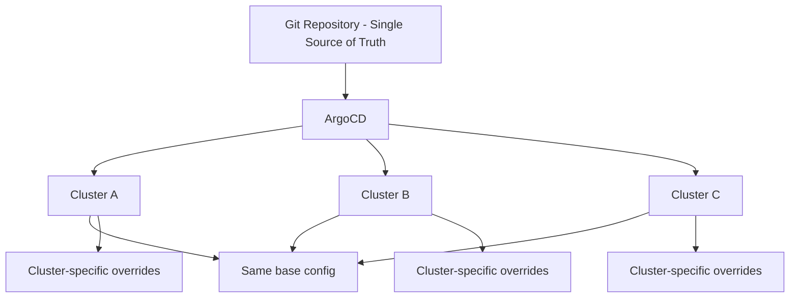

# How to Implement Consistent Configuration Across Clusters with ArgoCD

Author: [nawazdhandala](https://github.com/nawazdhandala)

Tags: ArgoCD, GitOps, Kubernetes, Multi-Cluster, Configuration Management

Description: Learn how to maintain consistent configuration across multiple Kubernetes clusters with ArgoCD using ApplicationSets, Kustomize, Helm, and policy enforcement.

---

Managing multiple Kubernetes clusters is straightforward until configurations start drifting. One cluster gets a security patch that others miss. Network policies differ between staging and production. RBAC rules get manually tweaked in one cluster and forgotten everywhere else. Consistent configuration across clusters is one of the hardest operational challenges in multi-cluster Kubernetes.

ArgoCD solves this by being the single source of truth for all cluster configurations. This guide covers patterns for keeping every cluster consistently configured.

## The Consistency Problem

Configuration drift happens when:

- Someone makes a manual `kubectl` change in one cluster
- A deployment to one cluster succeeds but fails in another
- Environment-specific configurations are not properly abstracted
- Platform components (CNI, ingress, monitoring) are managed differently per cluster



## Pattern 1: ApplicationSets for Platform Components

Use ApplicationSets to deploy platform components consistently to every cluster:

```yaml
apiVersion: argoproj.io/v1alpha1
kind: ApplicationSet
metadata:
  name: platform-components
  namespace: argocd
spec:
  generators:
    - matrix:
        generators:
          # All production clusters
          - clusters:
              selector:
                matchLabels:
                  environment: production
              values:
                region: '{{metadata.labels.region}}'
          # All platform components
          - list:
              elements:
                - component: cert-manager
                  namespace: cert-manager
                  path: platform/cert-manager
                - component: external-dns
                  namespace: external-dns
                  path: platform/external-dns
                - component: ingress-nginx
                  namespace: ingress-nginx
                  path: platform/ingress-nginx
                - component: network-policies
                  namespace: kube-system
                  path: platform/network-policies
                - component: monitoring
                  namespace: monitoring
                  path: platform/monitoring
  template:
    metadata:
      name: '{{component}}-{{name}}'
    spec:
      project: platform
      source:
        repoURL: https://github.com/myorg/platform.git
        targetRevision: main
        path: '{{path}}/overlays/{{values.region}}'
      destination:
        server: '{{server}}'
        namespace: '{{namespace}}'
      syncPolicy:
        automated:
          prune: true
          selfHeal: true
        syncOptions:
          - CreateNamespace=true
          - ServerSideApply=true
```

## Pattern 2: Layered Configuration with Kustomize

Use Kustomize to layer base configuration with cluster-specific overrides:

```
platform/
  network-policies/
    base/
      kustomization.yaml
      default-deny.yaml
      allow-dns.yaml
      allow-monitoring.yaml
    overlays/
      us-east-1/
        kustomization.yaml
        cluster-specific-policies.yaml
      eu-west-1/
        kustomization.yaml
        cluster-specific-policies.yaml
        gdpr-policies.yaml
```

Base configuration (applied to all clusters):

```yaml
# platform/network-policies/base/default-deny.yaml
apiVersion: networking.k8s.io/v1
kind: NetworkPolicy
metadata:
  name: default-deny-all
  namespace: default
spec:
  podSelector: {}
  policyTypes:
    - Ingress
    - Egress
---
# platform/network-policies/base/allow-dns.yaml
apiVersion: networking.k8s.io/v1
kind: NetworkPolicy
metadata:
  name: allow-dns
  namespace: default
spec:
  podSelector: {}
  policyTypes:
    - Egress
  egress:
    - to: []
      ports:
        - protocol: UDP
          port: 53
        - protocol: TCP
          port: 53
---
# platform/network-policies/base/kustomization.yaml
apiVersion: kustomize.config.k8s.io/v1beta1
kind: Kustomization
resources:
  - default-deny.yaml
  - allow-dns.yaml
  - allow-monitoring.yaml
```

EU-specific overlay (adds GDPR policies):

```yaml
# platform/network-policies/overlays/eu-west-1/kustomization.yaml
apiVersion: kustomize.config.k8s.io/v1beta1
kind: Kustomization
resources:
  - ../../base
  - gdpr-policies.yaml
```

## Pattern 3: RBAC Consistency

RBAC is one of the most common sources of drift. Manage it consistently:

```yaml
# platform/rbac/base/developer-role.yaml
apiVersion: rbac.authorization.k8s.io/v1
kind: ClusterRole
metadata:
  name: developer
rules:
  - apiGroups: [""]
    resources: ["pods", "services", "configmaps"]
    verbs: ["get", "list", "watch"]
  - apiGroups: ["apps"]
    resources: ["deployments", "replicasets", "statefulsets"]
    verbs: ["get", "list", "watch"]
  - apiGroups: [""]
    resources: ["pods/log", "pods/exec"]
    verbs: ["get", "create"]
---
apiVersion: rbac.authorization.k8s.io/v1
kind: ClusterRole
metadata:
  name: platform-admin
rules:
  - apiGroups: ["*"]
    resources: ["*"]
    verbs: ["*"]
```

Deploy RBAC via ApplicationSet:

```yaml
apiVersion: argoproj.io/v1alpha1
kind: ApplicationSet
metadata:
  name: rbac-config
  namespace: argocd
spec:
  generators:
    - clusters:
        selector:
          matchLabels:
            environment: production
  template:
    metadata:
      name: 'rbac-{{name}}'
    spec:
      project: platform
      source:
        repoURL: https://github.com/myorg/platform.git
        targetRevision: main
        path: platform/rbac
      destination:
        server: '{{server}}'
      syncPolicy:
        automated:
          prune: true
          selfHeal: true
```

## Pattern 4: ResourceQuotas and LimitRanges

Ensure every namespace has consistent resource constraints:

```yaml
# platform/namespace-defaults/base/quota.yaml
apiVersion: v1
kind: ResourceQuota
metadata:
  name: default-quota
spec:
  hard:
    requests.cpu: "10"
    requests.memory: 20Gi
    limits.cpu: "20"
    limits.memory: 40Gi
    persistentvolumeclaims: "10"
    services.loadbalancers: "2"
---
apiVersion: v1
kind: LimitRange
metadata:
  name: default-limits
spec:
  limits:
    - type: Container
      default:
        cpu: 500m
        memory: 512Mi
      defaultRequest:
        cpu: 100m
        memory: 128Mi
      max:
        cpu: "4"
        memory: 8Gi
    - type: Pod
      max:
        cpu: "8"
        memory: 16Gi
```

## Pattern 5: Policy Enforcement with OPA/Kyverno

Use policy engines to prevent configuration drift and enforce standards. Deploy Kyverno consistently via ArgoCD:

```yaml
apiVersion: argoproj.io/v1alpha1
kind: ApplicationSet
metadata:
  name: kyverno
  namespace: argocd
spec:
  generators:
    - clusters:
        selector:
          matchLabels:
            environment: production
  template:
    metadata:
      name: 'kyverno-{{name}}'
    spec:
      project: platform
      source:
        repoURL: https://kyverno.github.io/kyverno/
        chart: kyverno
        targetRevision: 3.1.0
      destination:
        server: '{{server}}'
        namespace: kyverno
      syncPolicy:
        automated:
          prune: true
          selfHeal: true
        syncOptions:
          - CreateNamespace=true
```

Then deploy policies consistently:

```yaml
# platform/policies/require-labels.yaml
apiVersion: kyverno.io/v1
kind: ClusterPolicy
metadata:
  name: require-labels
spec:
  validationFailureAction: Enforce
  rules:
    - name: require-team-label
      match:
        any:
          - resources:
              kinds:
                - Deployment
                - StatefulSet
                - DaemonSet
      validate:
        message: "The label 'team' is required."
        pattern:
          metadata:
            labels:
              team: "?*"
    - name: require-app-label
      match:
        any:
          - resources:
              kinds:
                - Deployment
                - StatefulSet
      validate:
        message: "The label 'app' is required."
        pattern:
          metadata:
            labels:
              app: "?*"
```

## Pattern 6: Configuration Drift Detection

ArgoCD's self-heal feature automatically corrects drift, but you should also alert on it:

```yaml
apiVersion: monitoring.coreos.com/v1
kind: PrometheusRule
metadata:
  name: config-drift-alerts
  namespace: monitoring
spec:
  groups:
    - name: config.drift.rules
      rules:
        - alert: ApplicationOutOfSync
          expr: |
            argocd_app_info{sync_status="OutOfSync"} == 1
          for: 5m
          labels:
            severity: warning
          annotations:
            summary: "Application {{ $labels.name }} is out of sync"
            description: "This may indicate manual changes were made"
        - alert: SelfHealTriggered
          expr: |
            increase(argocd_app_reconcile_count{
              dest_server!="https://kubernetes.default.svc"
            }[1h]) > 10
          labels:
            severity: info
          annotations:
            summary: "Frequent self-heal in {{ $labels.name }}"
            description: "Someone may be making manual changes"
```

## Verifying Consistency

Run periodic checks to verify configuration consistency:

```bash
#!/bin/bash
# verify-consistency.sh
# Compare configurations across clusters

APPS=$(argocd app list -o name | grep "^platform-")

for APP in $APPS; do
  STATUS=$(argocd app get "$APP" -o json | jq -r '.status.sync.status')
  HEALTH=$(argocd app get "$APP" -o json | jq -r '.status.health.status')

  if [ "$STATUS" != "Synced" ] || [ "$HEALTH" != "Healthy" ]; then
    echo "WARNING: $APP - Sync: $STATUS, Health: $HEALTH"
  else
    echo "OK: $APP"
  fi
done
```

## Summary

Consistent configuration across clusters requires discipline and automation. Use ApplicationSets to deploy the same platform components everywhere, Kustomize for layered configuration with cluster-specific overrides, policy engines to enforce standards, and ArgoCD's self-heal to automatically correct drift. Monitor for drift events so you can identify and address the root cause of manual changes. For handling cluster-specific differences, see our guide on [cluster-specific overrides](https://oneuptime.com/blog/post/2026-02-26-how-to-handle-cluster-specific-overrides-with-argocd/view).
