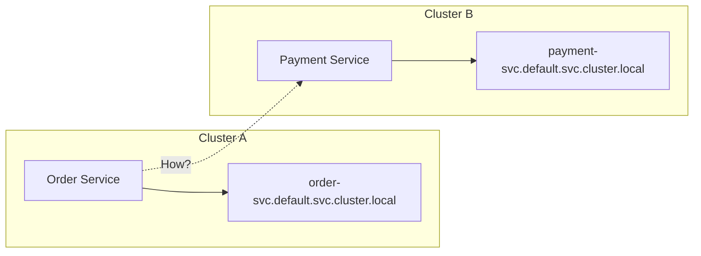

# How to Implement Cross-Cluster Service Discovery with ArgoCD

Author: [nawazdhandala](https://github.com/nawazdhandala)

Tags: ArgoCD, GitOps, Kubernetes, Multi-Cluster, Service Discovery

Description: Learn how to implement cross-cluster service discovery with ArgoCD using DNS, service mesh federation, and Kubernetes MCS API for multi-cluster communication.

---

In a multi-cluster architecture, services running in one cluster often need to communicate with services in another cluster. Standard Kubernetes service discovery only works within a single cluster. When you manage multiple clusters with ArgoCD, you need a cross-cluster service discovery strategy that lets services find and connect to each other across cluster boundaries.

This guide covers practical approaches to cross-cluster service discovery with ArgoCD.

## The Problem

Kubernetes Services use internal DNS names like `my-service.my-namespace.svc.cluster.local`. These names only resolve within the cluster where the Service exists. If your order service runs in cluster A and needs to call the payment service in cluster B, standard Kubernetes DNS will not help.



## Approach 1: ExternalDNS with Global DNS

The simplest approach uses ExternalDNS to register services in an external DNS provider, creating globally resolvable names.

### Deploy ExternalDNS to Each Cluster

```yaml
apiVersion: argoproj.io/v1alpha1
kind: ApplicationSet
metadata:
  name: external-dns
  namespace: argocd
spec:
  generators:
    - clusters:
        selector:
          matchLabels:
            environment: production
        values:
          region: '{{metadata.labels.region}}'
  template:
    metadata:
      name: 'external-dns-{{name}}'
    spec:
      project: default
      source:
        repoURL: https://github.com/myorg/platform.git
        targetRevision: main
        path: external-dns/overlays/{{values.region}}
      destination:
        server: '{{server}}'
        namespace: external-dns
      syncPolicy:
        automated:
          prune: true
          selfHeal: true
        syncOptions:
          - CreateNamespace=true
```

### Annotate Services for External DNS

```yaml
apiVersion: v1
kind: Service
metadata:
  name: payment-service
  namespace: payments
  annotations:
    # Register this service in external DNS
    external-dns.alpha.kubernetes.io/hostname: payment.services.example.com
    # Set TTL low for faster failover
    external-dns.alpha.kubernetes.io/ttl: "30"
spec:
  type: LoadBalancer
  ports:
    - port: 443
      targetPort: 8080
  selector:
    app: payment-service
```

Now any service in any cluster can reach the payment service at `payment.services.example.com`.

### Configure Applications to Use Global DNS

```yaml
apiVersion: apps/v1
kind: Deployment
metadata:
  name: order-service
  namespace: orders
spec:
  template:
    spec:
      containers:
        - name: order-service
          env:
            # Use global DNS name instead of cluster-local
            - name: PAYMENT_SERVICE_URL
              value: "https://payment.services.example.com"
```

## Approach 2: CoreDNS Forwarding

For internal communication without exposing services externally, configure CoreDNS to forward queries between clusters.

### Set Up CoreDNS Forwarding

Deploy a CoreDNS ConfigMap update via ArgoCD:

```yaml
apiVersion: v1
kind: ConfigMap
metadata:
  name: coredns-custom
  namespace: kube-system
data:
  # Forward requests for remote clusters to their DNS servers
  remote-clusters.server: |
    cluster-b.local:53 {
      forward . 10.0.1.10 10.0.1.11 {
        force_tcp
      }
      cache 30
    }
    cluster-c.local:53 {
      forward . 10.0.2.10 10.0.2.11 {
        force_tcp
      }
      cache 30
    }
```

This requires network connectivity between clusters (VPC peering, VPN, or interconnect).

### Register Services with Custom DNS Suffixes

```yaml
apiVersion: v1
kind: Service
metadata:
  name: payment-service
  namespace: payments
  annotations:
    # Additional DNS entry with cluster identifier
    external-dns.alpha.kubernetes.io/hostname: payment.cluster-b.local
spec:
  type: ClusterIP
  ports:
    - port: 8080
  selector:
    app: payment-service
```

## Approach 3: Kubernetes Multi-Cluster Services (MCS) API

The MCS API is the Kubernetes-native approach to cross-cluster service discovery. It uses `ServiceExport` and `ServiceImport` resources.

### Deploy MCS Controller

```yaml
apiVersion: argoproj.io/v1alpha1
kind: ApplicationSet
metadata:
  name: mcs-controller
  namespace: argocd
spec:
  generators:
    - clusters:
        selector:
          matchLabels:
            environment: production
  template:
    metadata:
      name: 'mcs-controller-{{name}}'
    spec:
      project: default
      source:
        repoURL: https://github.com/myorg/platform.git
        targetRevision: main
        path: mcs-controller
      destination:
        server: '{{server}}'
        namespace: mcs-system
      syncPolicy:
        automated:
          prune: true
          selfHeal: true
        syncOptions:
          - CreateNamespace=true
```

### Export a Service

Mark services that should be discoverable from other clusters:

```yaml
# In Cluster B - export the payment service
apiVersion: multicluster.x-k8s.io/v1alpha1
kind: ServiceExport
metadata:
  name: payment-service
  namespace: payments
  annotations:
    argocd.argoproj.io/sync-wave: "1"
```

### Import a Service

In the consuming cluster, import the service:

```yaml
# In Cluster A - import the payment service from Cluster B
apiVersion: multicluster.x-k8s.io/v1alpha1
kind: ServiceImport
metadata:
  name: payment-service
  namespace: payments
  annotations:
    argocd.argoproj.io/sync-wave: "1"
spec:
  type: ClusterSetIP
  ports:
    - port: 8080
      protocol: TCP
```

The imported service becomes available as `payment-service.payments.svc.clusterset.local`.

### Manage MCS Resources with ArgoCD

```yaml
apiVersion: argoproj.io/v1alpha1
kind: ApplicationSet
metadata:
  name: service-exports
  namespace: argocd
spec:
  generators:
    - git:
        repoURL: https://github.com/myorg/service-mesh-config.git
        revision: main
        directories:
          - path: 'exports/*'
  template:
    metadata:
      name: 'exports-{{path.basename}}'
    spec:
      project: default
      source:
        repoURL: https://github.com/myorg/service-mesh-config.git
        targetRevision: main
        path: '{{path}}'
      destination:
        server: '{{path.metadata.annotations.target-cluster}}'
        namespace: '{{path.metadata.annotations.target-namespace}}'
      syncPolicy:
        automated:
          prune: true
          selfHeal: true
```

## Approach 4: Service Mesh Federation

If you are running a service mesh, you can use mesh federation for cross-cluster discovery.

### Istio Multi-Cluster

```yaml
# Deploy Istio with multi-cluster configuration via ArgoCD
apiVersion: argoproj.io/v1alpha1
kind: Application
metadata:
  name: istio-multicluster
  namespace: argocd
spec:
  project: default
  source:
    repoURL: https://github.com/myorg/platform.git
    targetRevision: main
    path: istio/multicluster
  destination:
    server: '{{server}}'
    namespace: istio-system
```

With Istio multi-cluster, services are automatically discoverable across clusters. A service `payment.payments.svc.cluster.local` in cluster B becomes reachable from cluster A through the Istio mesh.

### Linkerd Multi-Cluster

```yaml
# Service mirror configuration for Linkerd
apiVersion: multicluster.linkerd.io/v1alpha1
kind: Link
metadata:
  name: cluster-b
  namespace: linkerd-multicluster
spec:
  targetClusterName: cluster-b
  targetClusterDomain: cluster-b.local
  targetClusterLinkerdNamespace: linkerd
  clusterCredentialsSecret: cluster-b-credentials
  selector:
    matchLabels:
      mirror.linkerd.io/exported: "true"
```

Label services for export:

```yaml
apiVersion: v1
kind: Service
metadata:
  name: payment-service
  namespace: payments
  labels:
    mirror.linkerd.io/exported: "true"
spec:
  type: ClusterIP
  ports:
    - port: 8080
  selector:
    app: payment-service
```

## Git Repository Structure

Organize your cross-cluster service discovery configuration:

```text
platform/
  service-discovery/
    external-dns/
      base/
        deployment.yaml
        rbac.yaml
      overlays/
        us-east-1/
        eu-west-1/
    mcs/
      exports/
        cluster-a/
          payment-export.yaml
        cluster-b/
          order-export.yaml
      imports/
        cluster-a/
          order-import.yaml
        cluster-b/
          payment-import.yaml
    service-mesh/
      istio-multicluster/
      linkerd-multicluster/
```

## Choosing the Right Approach

| Approach | Complexity | Latency | Security | Best For |
|----------|-----------|---------|----------|----------|
| ExternalDNS | Low | Higher (external LB) | TLS required | Simple multi-cluster |
| CoreDNS Forwarding | Medium | Low (direct) | Network policies | Private networks |
| MCS API | Medium | Low | K8s native | Kubernetes-native |
| Service Mesh | High | Low | mTLS built-in | Full mesh features |

For most teams starting with multi-cluster, ExternalDNS is the easiest path. As you mature, consider MCS API or service mesh federation for better security and lower latency.

## Summary

Cross-cluster service discovery with ArgoCD requires choosing the right mechanism for your architecture. ExternalDNS gives you the simplest global service names. CoreDNS forwarding works for private networks. The MCS API provides a Kubernetes-native solution. Service mesh federation adds mTLS and advanced traffic management. Whichever approach you choose, manage it through ArgoCD ApplicationSets for consistency across clusters. For more multi-cluster patterns, see our guide on [active-active deployments](https://oneuptime.com/blog/post/2026-02-26-how-to-implement-active-active-deployments-across-clusters-with-argocd/view).
