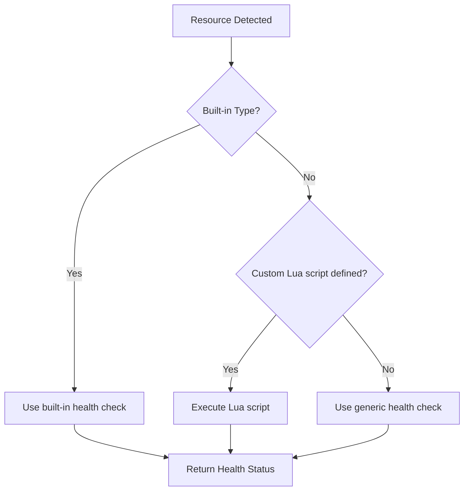

# How to Implement Custom Health Checks via ArgoCD API

Author: [nawazdhandala](https://github.com/nawazdhandala)

Tags: ArgoCD, GitOps, Kubernetes, API, Health Checks

Description: Define and manage custom health checks for ArgoCD applications using Lua scripts and the REST API to accurately assess the health of CRDs and custom resources.

---

ArgoCD has built-in health checks for standard Kubernetes resources like Deployments, StatefulSets, and Services. But when you use Custom Resource Definitions (CRDs) from operators like Istio, Cert-Manager, or your own custom controllers, ArgoCD does not know how to assess their health out of the box. Your CRD might show as "Progressing" forever or "Healthy" when it is actually broken.

This post shows you how to implement custom health checks using Lua scripts and manage them through ArgoCD's configuration API.

## How ArgoCD Health Checks Work

ArgoCD evaluates health by inspecting the status of each Kubernetes resource in an application. For built-in resource types, it has hardcoded logic. For everything else, it falls back to a generic check that looks for standard conditions.

The health assessment flow is straightforward.



The possible health statuses are: `Healthy`, `Progressing`, `Degraded`, `Suspended`, `Missing`, and `Unknown`.

## Defining Custom Health Checks in ConfigMap

Custom health checks are written as Lua scripts and stored in the `argocd-cm` ConfigMap. Each script receives the Kubernetes resource object and must return a health status and an optional message.

### Example: Cert-Manager Certificate Health

```yaml
# argocd-cm ConfigMap with custom health checks
apiVersion: v1
kind: ConfigMap
metadata:
  name: argocd-cm
  namespace: argocd
data:
  # Custom health check for Cert-Manager Certificates
  resource.customizations.health.cert-manager.io_Certificate: |
    hs = {}
    if obj.status ~= nil then
      if obj.status.conditions ~= nil then
        for i, condition in ipairs(obj.status.conditions) do
          if condition.type == "Ready" then
            if condition.status == "True" then
              hs.status = "Healthy"
              hs.message = "Certificate is ready and valid"
            elseif condition.status == "False" then
              if condition.reason == "Issuing" then
                hs.status = "Progressing"
                hs.message = "Certificate is being issued: " .. (condition.message or "")
              else
                hs.status = "Degraded"
                hs.message = "Certificate is not ready: " .. (condition.message or "")
              end
            end
            return hs
          end
        end
      end
    end
    hs.status = "Progressing"
    hs.message = "Waiting for certificate status"
    return hs
```

### Example: Istio VirtualService Health

```yaml
  # Custom health check for Istio VirtualService
  resource.customizations.health.networking.istio.io_VirtualService: |
    hs = {}
    if obj.status ~= nil then
      if obj.status.validationStatus ~= nil then
        if obj.status.validationStatus == "True" then
          hs.status = "Healthy"
          hs.message = "VirtualService is valid and applied"
        else
          hs.status = "Degraded"
          hs.message = "VirtualService validation failed"
        end
      else
        -- Istio VirtualServices may not have status in older versions
        hs.status = "Healthy"
        hs.message = "VirtualService applied (no validation status)"
      end
    else
      hs.status = "Healthy"
      hs.message = "VirtualService applied"
    end
    return hs
```

### Example: Custom Operator CRD Health

Suppose you have a custom operator that manages databases with a `Database` CRD.

```yaml
  # Custom health check for a custom Database CRD
  resource.customizations.health.databases.company.com_Database: |
    hs = {}
    if obj.status == nil then
      hs.status = "Progressing"
      hs.message = "Database resource has no status yet"
      return hs
    end

    -- Check the phase field
    if obj.status.phase == "Ready" then
      hs.status = "Healthy"
      hs.message = "Database is ready. Connections: " .. (obj.status.activeConnections or "unknown")
    elseif obj.status.phase == "Creating" or obj.status.phase == "Updating" then
      hs.status = "Progressing"
      hs.message = "Database is " .. obj.status.phase
    elseif obj.status.phase == "Failed" then
      hs.status = "Degraded"
      hs.message = "Database failed: " .. (obj.status.failureReason or "unknown reason")
    elseif obj.status.phase == "Deleting" then
      hs.status = "Progressing"
      hs.message = "Database is being deleted"
    else
      hs.status = "Unknown"
      hs.message = "Unknown phase: " .. (obj.status.phase or "nil")
    end

    return hs
```

## Managing Health Checks via the API

You can update the `argocd-cm` ConfigMap through the ArgoCD settings API.

```bash
# Get current ArgoCD settings
curl -s -k "$ARGOCD_URL/api/v1/settings" \
  -H "$AUTH_HEADER" | jq '.resourceOverrides'

# Update settings via the ConfigMap
# First, get the current configmap
kubectl get configmap argocd-cm -n argocd -o yaml > argocd-cm.yaml

# Edit and apply
kubectl apply -f argocd-cm.yaml
```

For a more programmatic approach, use kubectl patch.

```bash
# Add a custom health check via kubectl patch
kubectl patch configmap argocd-cm -n argocd --type merge -p '{
  "data": {
    "resource.customizations.health.monitoring.coreos.com_Prometheus": "hs = {}\nif obj.status ~= nil then\n  if obj.status.availableReplicas ~= nil and obj.status.availableReplicas > 0 then\n    hs.status = \"Healthy\"\n    hs.message = \"Prometheus is running with \" .. obj.status.availableReplicas .. \" replicas\"\n  else\n    hs.status = \"Progressing\"\n    hs.message = \"Waiting for Prometheus replicas\"\n  end\nelse\n  hs.status = \"Progressing\"\n  hs.message = \"No status available\"\nend\nreturn hs"
  }
}'
```

## Testing Health Checks Locally

Before deploying a health check, test the Lua script locally using ArgoCD's built-in testing capability.

```bash
# Create a test resource JSON file
cat > test-resource.json <<'EOF'
{
  "apiVersion": "databases.company.com/v1",
  "kind": "Database",
  "metadata": {
    "name": "my-postgres",
    "namespace": "databases"
  },
  "status": {
    "phase": "Ready",
    "activeConnections": 5
  }
}
EOF

# Test the health check script using argocd admin
argocd admin settings resource-overrides health \
  --argocd-cm-path argocd-cm.yaml \
  test-resource.json
```

If you do not have the ArgoCD CLI available, you can test Lua scripts standalone.

```bash
# Install Lua for local testing
# On macOS: brew install lua
# On Ubuntu: apt-get install lua5.3

# Create a test harness
cat > test_health.lua <<'EOF'
-- Test harness for ArgoCD health check scripts
local obj = {
  status = {
    phase = "Ready",
    activeConnections = 5
  }
}

-- Paste your health check script here
hs = {}
if obj.status == nil then
  hs.status = "Progressing"
  hs.message = "Database resource has no status yet"
else
  if obj.status.phase == "Ready" then
    hs.status = "Healthy"
    hs.message = "Database is ready. Connections: " .. (obj.status.activeConnections or "unknown")
  elseif obj.status.phase == "Failed" then
    hs.status = "Degraded"
    hs.message = "Database failed"
  else
    hs.status = "Progressing"
    hs.message = "Database is " .. obj.status.phase
  end
end

print("Status: " .. hs.status)
print("Message: " .. hs.message)
EOF

lua test_health.lua
# Output:
# Status: Healthy
# Message: Database is ready. Connections: 5
```

## Common Health Check Patterns

### Pattern: Condition-Based Health

Many CRDs follow the standard Kubernetes conditions pattern. Here is a generic template.

```lua
-- Generic condition-based health check
-- Works for any CRD that uses standard conditions
hs = {}
if obj.status ~= nil and obj.status.conditions ~= nil then
  for i, condition in ipairs(obj.status.conditions) do
    if condition.type == "Ready" or condition.type == "Available" then
      if condition.status == "True" then
        hs.status = "Healthy"
        hs.message = condition.message or "Resource is ready"
      elseif condition.status == "False" then
        hs.status = "Degraded"
        hs.message = condition.message or "Resource is not ready"
      else
        hs.status = "Progressing"
        hs.message = condition.message or "Resource status is unknown"
      end
      return hs
    end
  end
end
hs.status = "Progressing"
hs.message = "Waiting for conditions"
return hs
```

### Pattern: Replica-Based Health

For CRDs that manage replicas (like custom operators for databases or caches).

```lua
-- Replica-based health check
hs = {}
if obj.status ~= nil then
  local desired = obj.spec.replicas or 1
  local ready = obj.status.readyReplicas or 0
  local updated = obj.status.updatedReplicas or 0

  if ready >= desired and updated >= desired then
    hs.status = "Healthy"
    hs.message = ready .. "/" .. desired .. " replicas ready"
  elseif ready > 0 then
    hs.status = "Progressing"
    hs.message = ready .. "/" .. desired .. " replicas ready (updating)"
  else
    hs.status = "Degraded"
    hs.message = "No replicas ready (desired: " .. desired .. ")"
  end
else
  hs.status = "Progressing"
  hs.message = "Waiting for status"
end
return hs
```

### Pattern: Job-Like Resources

For CRDs that represent one-shot operations (backups, migrations, etc.).

```lua
-- Job-like health check for one-shot operations
hs = {}
if obj.status ~= nil then
  if obj.status.completionTime ~= nil then
    hs.status = "Healthy"
    hs.message = "Completed at " .. obj.status.completionTime
  elseif obj.status.failed ~= nil and obj.status.failed > 0 then
    hs.status = "Degraded"
    hs.message = "Failed with " .. obj.status.failed .. " failures"
  elseif obj.status.active ~= nil and obj.status.active > 0 then
    hs.status = "Progressing"
    hs.message = obj.status.active .. " active"
  else
    hs.status = "Progressing"
    hs.message = "Pending"
  end
else
  hs.status = "Progressing"
  hs.message = "Not started"
end
return hs
```

## Verifying Health Checks Are Working

After applying your custom health checks, verify them through the API.

```bash
# Check an application's resource health details
curl -s -k "$ARGOCD_URL/api/v1/applications/my-app/resource-tree" \
  -H "$AUTH_HEADER" | jq '.nodes[] | select(.kind == "Database") | {
    name: .name,
    health: .health.status,
    message: .health.message
  }'
```

If a health check is not being applied, restart the application controller to pick up the ConfigMap changes.

```bash
# Restart the application controller to reload health checks
kubectl rollout restart deployment argocd-application-controller -n argocd
```

## Wrapping Up

Custom health checks are essential for any ArgoCD deployment that uses CRDs or custom operators. Without them, ArgoCD cannot accurately report application health, which undermines the entire GitOps feedback loop. Write your Lua scripts following the patterns shown here - condition-based, replica-based, or job-like depending on your CRD's status structure. Test locally, apply to the `argocd-cm` ConfigMap, and verify through the resource tree API. For monitoring the health status over time, see [how to use the ArgoCD API for deployment tracking](https://oneuptime.com/blog/post/2026-02-26-how-to-use-argocd-api-for-deployment-tracking/view).
