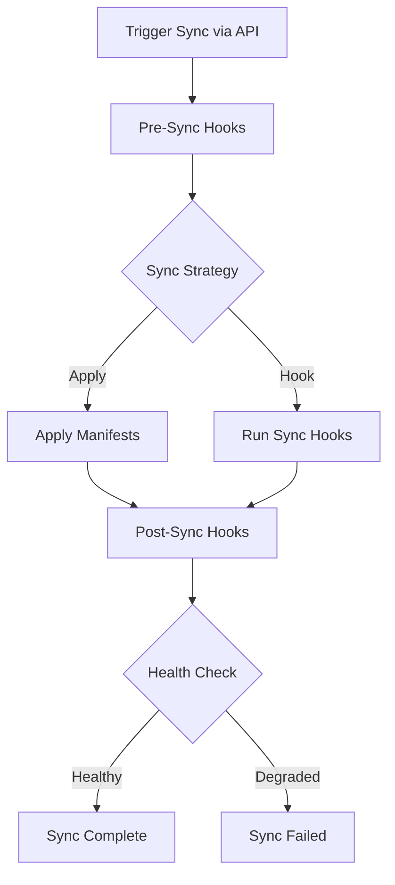

# How to Implement Custom Sync Strategies via ArgoCD API

Author: [nawazdhandala](https://github.com/nawazdhandala)

Tags: ArgoCD, GitOps, Kubernetes, API, Deployment Strategy

Description: Build custom sync strategies for ArgoCD applications using the REST API to implement canary deployments, blue-green rollouts, and conditional sync workflows.

---

ArgoCD's built-in sync handles most deployment scenarios, but sometimes you need more control. Maybe you want to sync specific resources in a particular order, implement a canary deployment that validates metrics before proceeding, or create a conditional sync that only applies changes during maintenance windows.

ArgoCD's REST API gives you granular control over the sync process, allowing you to build custom strategies on top of the standard sync mechanism.

## Understanding ArgoCD's Sync Process

A standard ArgoCD sync applies all out-of-sync resources according to sync waves and hooks. When you trigger a sync through the API, you can control exactly which resources are synced, what strategy is used, and what options are applied.



## Selective Resource Sync

The most basic custom strategy is syncing specific resources rather than everything at once. This is useful when you want to roll out changes incrementally.

```bash
# Sync only the ConfigMap and then the Deployment separately
# Step 1: Sync the ConfigMap first
curl -s -k -X POST "$ARGOCD_URL/api/v1/applications/my-app/sync" \
  -H "$AUTH_HEADER" \
  -H "Content-Type: application/json" \
  -d '{
    "resources": [
      {
        "group": "",
        "kind": "ConfigMap",
        "name": "app-config",
        "namespace": "production"
      }
    ],
    "strategy": {
      "apply": {
        "force": false
      }
    }
  }'

# Step 2: Wait for the ConfigMap sync to complete
# Then sync the Deployment
curl -s -k -X POST "$ARGOCD_URL/api/v1/applications/my-app/sync" \
  -H "$AUTH_HEADER" \
  -H "Content-Type: application/json" \
  -d '{
    "resources": [
      {
        "group": "apps",
        "kind": "Deployment",
        "name": "web-frontend",
        "namespace": "production"
      }
    ]
  }'
```

## Building a Canary Sync Strategy

A canary deployment applies changes to a small subset first, validates them, then rolls out to the rest. Here is how to implement this with the ArgoCD API.

```python
# canary_sync.py
# Implements a canary sync strategy using ArgoCD API
import os
import time
import requests
import json
import sys

ARGOCD_URL = os.environ['ARGOCD_URL']
ARGOCD_TOKEN = os.environ['ARGOCD_AUTH_TOKEN']
PROMETHEUS_URL = os.environ.get('PROMETHEUS_URL', 'http://prometheus:9090')

headers = {
    'Authorization': f'Bearer {ARGOCD_TOKEN}',
    'Content-Type': 'application/json'
}


def argocd_api(method, endpoint, data=None):
    """Make an authenticated ArgoCD API request."""
    resp = requests.request(
        method,
        f'{ARGOCD_URL}{endpoint}',
        headers=headers,
        json=data,
        verify=False,
        timeout=60
    )
    resp.raise_for_status()
    return resp.json()


def wait_for_sync(app_name, timeout=300):
    """Wait for a sync operation to complete."""
    start = time.time()
    while time.time() - start < timeout:
        app = argocd_api('GET', f'/api/v1/applications/{app_name}')
        op_state = app.get('status', {}).get('operationState', {})
        phase = op_state.get('phase', '')

        if phase == 'Succeeded':
            return True
        elif phase in ('Failed', 'Error'):
            print(f'Sync failed: {op_state.get("message", "")}')
            return False

        time.sleep(5)

    print('Sync timed out')
    return False


def wait_for_healthy(app_name, timeout=300):
    """Wait for all application resources to become healthy."""
    start = time.time()
    while time.time() - start < timeout:
        app = argocd_api('GET', f'/api/v1/applications/{app_name}')
        health = app.get('status', {}).get('health', {}).get('status', '')

        if health == 'Healthy':
            return True
        elif health == 'Degraded':
            print(f'Application is degraded')
            return False

        time.sleep(10)

    print('Health check timed out')
    return False


def check_metrics(app_name, duration=120):
    """Check Prometheus metrics to validate the canary."""
    print(f'Validating metrics for {duration} seconds...')
    time.sleep(duration)

    # Query error rate
    query = f'rate(http_requests_total{{app="{app_name}",status=~"5.."}}[2m]) / rate(http_requests_total{{app="{app_name}"}}[2m])'
    resp = requests.get(
        f'{PROMETHEUS_URL}/api/v1/query',
        params={'query': query},
        timeout=30
    )
    result = resp.json()

    if result.get('data', {}).get('result'):
        error_rate = float(result['data']['result'][0]['value'][1])
        print(f'Error rate: {error_rate:.2%}')

        if error_rate > 0.05:  # More than 5% error rate
            print('ERROR: Error rate too high, canary failed')
            return False

    print('Metrics validation passed')
    return True


def canary_sync(app_name, canary_resources, full_resources):
    """Execute a canary sync strategy.

    Args:
        app_name: ArgoCD application name
        canary_resources: Resources to sync first (canary)
        full_resources: All remaining resources to sync
    """
    print(f'Starting canary sync for {app_name}')

    # Step 1: Sync canary resources
    print('\n--- Phase 1: Deploying canary ---')
    sync_data = {
        'resources': canary_resources,
        'strategy': {'apply': {'force': False}},
        'syncOptions': {'items': ['ServerSideApply=true']}
    }

    argocd_api('POST', f'/api/v1/applications/{app_name}/sync', sync_data)

    if not wait_for_sync(app_name):
        print('Canary sync failed, aborting')
        return False

    # Step 2: Wait for canary to be healthy
    print('\n--- Phase 2: Waiting for canary health ---')
    if not wait_for_healthy(app_name, timeout=180):
        print('Canary is not healthy, aborting')
        return False

    # Step 3: Validate metrics
    print('\n--- Phase 3: Validating canary metrics ---')
    if not check_metrics(app_name, duration=120):
        print('Canary metrics validation failed')
        print('Rolling back canary...')
        # Rollback by syncing to the previous revision
        app = argocd_api('GET', f'/api/v1/applications/{app_name}')
        history = app.get('status', {}).get('history', [])
        if len(history) >= 2:
            prev_revision = history[-2].get('revision')
            argocd_api('POST', f'/api/v1/applications/{app_name}/sync', {
                'revision': prev_revision,
                'resources': canary_resources
            })
        return False

    # Step 4: Full rollout
    print('\n--- Phase 4: Full rollout ---')
    argocd_api('POST', f'/api/v1/applications/{app_name}/sync', {
        'resources': full_resources,
        'strategy': {'apply': {'force': False}}
    })

    if not wait_for_sync(app_name):
        print('Full rollout sync failed')
        return False

    if not wait_for_healthy(app_name):
        print('Full rollout not healthy')
        return False

    print('\nCanary deployment completed successfully')
    return True


if __name__ == '__main__':
    app = sys.argv[1] if len(sys.argv) > 1 else 'my-web-app'

    # Define canary and full resource sets
    canary = [
        {'group': 'apps', 'kind': 'Deployment', 'name': 'web-canary', 'namespace': 'production'}
    ]
    full = [
        {'group': 'apps', 'kind': 'Deployment', 'name': 'web-primary', 'namespace': 'production'},
        {'group': '', 'kind': 'Service', 'name': 'web-service', 'namespace': 'production'},
        {'group': '', 'kind': 'ConfigMap', 'name': 'web-config', 'namespace': 'production'}
    ]

    success = canary_sync(app, canary, full)
    sys.exit(0 if success else 1)
```

## Blue-Green Sync Strategy

A blue-green deployment maintains two identical environments and switches traffic after validating the new version.

```python
def blue_green_sync(app_name_blue, app_name_green, service_app_name):
    """Execute a blue-green deployment using two ArgoCD applications.

    Assumes blue and green are separate ArgoCD apps, and a third app
    manages the Service/Ingress that routes traffic.
    """
    # Determine which environment is currently active
    service_app = argocd_api('GET', f'/api/v1/applications/{service_app_name}')
    # Check which backend the service currently points to
    # (This would depend on your specific setup)

    print(f'Current active: blue, deploying to: green')
    inactive_app = app_name_green

    # Step 1: Sync the inactive environment
    print('Syncing green environment...')
    argocd_api('POST', f'/api/v1/applications/{inactive_app}/sync', {
        'prune': True,
        'strategy': {'apply': {'force': False}}
    })

    if not wait_for_sync(inactive_app):
        print('Green sync failed')
        return False

    if not wait_for_healthy(inactive_app, timeout=300):
        print('Green environment is not healthy')
        return False

    # Step 2: Run smoke tests against green
    print('Running smoke tests against green...')
    if not run_smoke_tests(inactive_app):
        print('Smoke tests failed, keeping blue active')
        return False

    # Step 3: Switch traffic to green
    print('Switching traffic to green...')
    argocd_api('POST', f'/api/v1/applications/{service_app_name}/sync', {
        'prune': True
    })

    if not wait_for_sync(service_app_name):
        print('Service switch failed')
        return False

    print('Blue-green deployment complete, green is now active')
    return True


def run_smoke_tests(app_name):
    """Run basic smoke tests against the deployed application."""
    # Implement your smoke test logic here
    # Could be HTTP health checks, integration tests, etc.
    print('  Checking health endpoint...')
    time.sleep(10)
    print('  Smoke tests passed')
    return True
```

## Conditional Sync with Approval Gates

Build a sync strategy that requires manual or automated approval before proceeding.

```python
def conditional_sync(app_name, require_approval=True):
    """Sync with approval gate.

    Checks the application diff, optionally waits for approval,
    then syncs.
    """
    # Step 1: Get the diff
    app = argocd_api('GET', f'/api/v1/applications/{app_name}')
    sync_status = app.get('status', {}).get('sync', {}).get('status')

    if sync_status == 'Synced':
        print(f'{app_name} is already in sync')
        return True

    # Get out-of-sync resources
    resources = app.get('status', {}).get('resources', [])
    changes = [r for r in resources if r.get('status') == 'OutOfSync']

    print(f'Changes pending for {app_name}:')
    for r in changes:
        print(f"  - {r.get('kind')}/{r.get('name')}: {r.get('status')}")

    # Step 2: Check for approval (could query a ticketing system, Slack, etc.)
    if require_approval:
        approved = check_approval(app_name)
        if not approved:
            print('Sync not approved, skipping')
            return False

    # Step 3: Sync only approved resources
    print(f'Syncing {len(changes)} resources...')
    sync_resources = [
        {
            'group': r.get('group', ''),
            'kind': r['kind'],
            'name': r['name'],
            'namespace': r.get('namespace', '')
        }
        for r in changes
    ]

    argocd_api('POST', f'/api/v1/applications/{app_name}/sync', {
        'resources': sync_resources,
        'prune': True
    })

    return wait_for_sync(app_name)


def check_approval(app_name):
    """Check if a sync has been approved.

    In production, this would check a ticketing system,
    Slack approval, or similar mechanism.
    """
    # Example: Check a ConfigMap for approval status
    # Or query JIRA/ServiceNow for an approved change ticket
    print(f'Checking approval for {app_name}...')
    return True  # Replace with actual approval logic
```

## Rate-Limited Sync for Large Applications

For applications with hundreds of resources, syncing everything at once can overwhelm the cluster API server. Implement a rate-limited sync.

```python
def rate_limited_sync(app_name, batch_size=10, delay_seconds=5):
    """Sync resources in batches to avoid overwhelming the API server."""
    app = argocd_api('GET', f'/api/v1/applications/{app_name}')
    resources = app.get('status', {}).get('resources', [])
    out_of_sync = [r for r in resources if r.get('status') == 'OutOfSync']

    total = len(out_of_sync)
    print(f'Syncing {total} resources in batches of {batch_size}')

    for i in range(0, total, batch_size):
        batch = out_of_sync[i:i + batch_size]
        batch_num = (i // batch_size) + 1
        total_batches = (total + batch_size - 1) // batch_size

        print(f'\nBatch {batch_num}/{total_batches}: syncing {len(batch)} resources')

        sync_resources = [
            {
                'group': r.get('group', ''),
                'kind': r['kind'],
                'name': r['name'],
                'namespace': r.get('namespace', '')
            }
            for r in batch
        ]

        argocd_api('POST', f'/api/v1/applications/{app_name}/sync', {
            'resources': sync_resources
        })

        wait_for_sync(app_name, timeout=120)
        print(f'Batch {batch_num} complete, waiting {delay_seconds}s...')
        time.sleep(delay_seconds)

    print(f'\nAll {total} resources synced')
```

## Wrapping Up

Custom sync strategies let you go beyond ArgoCD's built-in sync behavior to implement deployment patterns that match your specific requirements. Whether you need canary deployments with metric validation, blue-green switches, approval gates, or rate-limited rollouts, the ArgoCD REST API provides the building blocks. The key is the selective resource sync capability - being able to sync specific resources independently gives you the granularity needed for any deployment strategy. For securing these API-driven workflows, see [how to rate limit and secure ArgoCD API access](https://oneuptime.com/blog/post/2026-02-26-how-to-rate-limit-and-secure-argocd-api-access/view).
