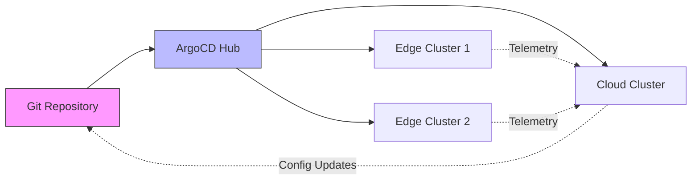

# How to Implement Edge-to-Cloud Sync with ArgoCD

Author: [nawazdhandala](https://github.com/nawazdhandala)

Tags: ArgoCD, GitOps, Kubernetes, Edge Computing, Cloud Sync

Description: Learn how to synchronize application deployments and configurations between edge Kubernetes clusters and cloud infrastructure using ArgoCD with multi-cluster GitOps patterns.

---

In a hybrid edge-cloud architecture, applications run at the edge for low latency and local processing, while the cloud handles aggregation, analytics, and centralized management. Keeping configurations, application versions, and operational state synchronized between edge and cloud is critical - and ArgoCD gives you a GitOps-native way to do it.

This post covers patterns for bidirectional synchronization between edge clusters and cloud Kubernetes clusters using ArgoCD, Git as the source of truth, and ApplicationSets for scale.

## The Edge-to-Cloud Sync Challenge

Edge-to-cloud sync is not just about deploying the same app everywhere. It involves several distinct synchronization patterns.

Configuration flows down from cloud to edge. Application updates roll out from a central repository to edge sites. Telemetry and data flow up from edge to cloud. Sometimes, edge-specific state needs to be reflected back into the central Git repository for auditability.



## Architecture: Single ArgoCD Hub

The simplest and most common pattern is a single ArgoCD instance in the cloud that manages both cloud and edge clusters. This gives you one control plane for everything.

```yaml
# Cloud cluster registration (in-cluster, automatic)
# Edge clusters registered as external clusters
# ArgoCD hub manages both from the same Git repo

# Example repo structure
# deployments/
#   cloud/
#     data-aggregator/
#     api-gateway/
#     dashboard/
#   edge/
#     base/
#       sensor-collector/
#       local-processor/
#     overlays/
#       site-001/
#       site-002/
#   shared/
#     monitoring/
#     networking/
```

## Deploying Cloud Components

The cloud cluster typically runs data aggregation, API endpoints, and dashboards that consume edge data.

```yaml
# appset-cloud-services.yaml
# Deploy cloud-side services that receive edge data
apiVersion: argoproj.io/v1alpha1
kind: ApplicationSet
metadata:
  name: cloud-services
  namespace: argocd
spec:
  generators:
    - list:
        elements:
          - app: data-aggregator
            namespace: aggregation
          - app: api-gateway
            namespace: gateway
          - app: edge-dashboard
            namespace: monitoring
  template:
    metadata:
      name: 'cloud-{{app}}'
    spec:
      project: cloud-infra
      source:
        repoURL: https://github.com/company/deployments
        targetRevision: main
        path: 'cloud/{{app}}'
      destination:
        # Deploy to the in-cluster (cloud) cluster
        server: https://kubernetes.default.svc
        namespace: '{{namespace}}'
      syncPolicy:
        automated:
          prune: true
          selfHeal: true
        syncOptions:
          - CreateNamespace=true
```

## Deploying Edge Components with Cloud Endpoints

Edge applications need to know where to send their data. The cloud cluster's endpoints are injected into edge configurations via Kustomize or Helm values.

```yaml
# edge/base/sensor-collector/deployment.yaml
apiVersion: apps/v1
kind: Deployment
metadata:
  name: sensor-collector
spec:
  replicas: 1
  selector:
    matchLabels:
      app: sensor-collector
  template:
    metadata:
      labels:
        app: sensor-collector
    spec:
      containers:
        - name: collector
          image: company/sensor-collector:v3.2.0
          env:
            # These get overridden per-site by Kustomize
            - name: CLOUD_ENDPOINT
              value: "https://ingest.cloud.company.com"
            - name: SITE_ID
              value: "default"
            - name: UPLOAD_INTERVAL
              value: "60"
            - name: BATCH_SIZE
              value: "500"
            - name: OFFLINE_BUFFER_SIZE
              value: "10000"
          volumeMounts:
            - name: local-buffer
              mountPath: /data/buffer
      volumes:
        # Local storage for buffering data when cloud is unreachable
        - name: local-buffer
          persistentVolumeClaim:
            claimName: sensor-buffer
```

The per-site overlay customizes the cloud endpoint and site identifier.

```yaml
# edge/overlays/site-001/kustomization.yaml
apiVersion: kustomize.config.k8s.io/v1beta1
kind: Kustomization
resources:
  - ../../base/sensor-collector
patches:
  - target:
      kind: Deployment
      name: sensor-collector
    patch: |
      - op: replace
        path: /spec/template/spec/containers/0/env/1/value
        value: "site-001"
      - op: replace
        path: /spec/template/spec/containers/0/env/2/value
        value: "30"
```

## Coordinated Rollouts: Edge and Cloud Together

When you update the data format or API contract between edge and cloud, you need to deploy the cloud changes first (since the cloud should be backwards-compatible) and then roll out the edge updates.

Use sync waves across your ApplicationSets to enforce ordering.

```yaml
# appset-coordinated-rollout.yaml
# Cloud services deploy first (wave 0), edge follows (wave 1)
apiVersion: argoproj.io/v1alpha1
kind: ApplicationSet
metadata:
  name: coordinated-update-v3
  namespace: argocd
spec:
  generators:
    - clusters:
        selector:
          matchLabels:
            cluster-role: cloud
        values:
          syncWave: "0"
    - clusters:
        selector:
          matchLabels:
            cluster-role: edge
        values:
          syncWave: "1"
  template:
    metadata:
      name: 'data-pipeline-{{name}}'
      annotations:
        argocd.argoproj.io/sync-wave: '{{values.syncWave}}'
    spec:
      project: data-pipeline
      source:
        repoURL: https://github.com/company/deployments
        targetRevision: main
        path: 'pipeline/{{metadata.labels.cluster-role}}'
      destination:
        server: '{{server}}'
        namespace: data-pipeline
      syncPolicy:
        automated:
          prune: true
          selfHeal: true
```

## Shared Configuration with Kustomize Components

Some configurations need to be consistent between edge and cloud - TLS certificates, shared secrets, service mesh settings. Use Kustomize components to share these.

```yaml
# shared/tls-config/kustomization.yaml
apiVersion: kustomize.config.k8s.io/v1beta1
kind: Component
configMapGenerator:
  - name: tls-config
    literals:
      - ca-bundle.crt=<shared-ca-cert>
      - min-tls-version=1.3
```

Both cloud and edge kustomizations reference this component.

```yaml
# cloud/data-aggregator/kustomization.yaml
apiVersion: kustomize.config.k8s.io/v1beta1
kind: Kustomization
resources:
  - deployment.yaml
  - service.yaml
components:
  - ../../shared/tls-config
```

## Handling Edge-to-Cloud Data Buffering

Edge applications need to handle cloud unavailability gracefully. The pattern is to buffer data locally and upload when connectivity is restored.

Here is a ConfigMap that controls the buffering behavior, managed through ArgoCD.

```yaml
# edge/base/sensor-collector/buffer-config.yaml
apiVersion: v1
kind: ConfigMap
metadata:
  name: buffer-config
data:
  # Buffer settings managed via GitOps
  buffer.yaml: |
    storage:
      path: /data/buffer
      maxSizeMB: 500
      rotationPolicy: oldest-first
    upload:
      endpoint: https://ingest.cloud.company.com/v2/batch
      batchSize: 1000
      intervalSeconds: 60
      retryPolicy:
        maxRetries: 10
        backoffMultiplier: 2
        maxBackoffSeconds: 3600
    compression:
      enabled: true
      algorithm: gzip
      level: 6
---
# PVC for local data buffering
apiVersion: v1
kind: PersistentVolumeClaim
metadata:
  name: sensor-buffer
spec:
  accessModes:
    - ReadWriteOnce
  resources:
    requests:
      storage: 1Gi
  storageClassName: local-path
```

## Monitoring Sync Status Across Tiers

You need visibility into whether edge and cloud are running compatible versions. Create a monitoring setup that tracks version parity.

```yaml
# PrometheusRule for version sync monitoring
apiVersion: monitoring.coreos.com/v1
kind: PrometheusRule
metadata:
  name: edge-cloud-sync-alerts
spec:
  groups:
    - name: edge-cloud-sync
      rules:
        # Alert when edge and cloud pipeline versions diverge
        - alert: EdgeCloudVersionMismatch
          expr: |
            count(
              count by (sync_status) (
                argocd_app_info{name=~"data-pipeline-.*"}
              )
            ) > 1
          for: 1h
          labels:
            severity: warning
          annotations:
            summary: "Edge and cloud data pipeline versions are out of sync"

        # Track how many edge sites are fully synced
        - record: edge_sites_synced_ratio
          expr: |
            count(argocd_app_info{name=~"data-pipeline-edge.*",sync_status="Synced"})
            /
            count(argocd_app_info{name=~"data-pipeline-edge.*"})
```

## Git-Based State Feedback Loop

Sometimes edge sites generate configuration state that needs to flow back into Git. For example, an edge device might auto-discover local hardware capabilities and need to update its own configuration.

The pattern here is to use a small agent on each edge site that commits back to Git.

```yaml
# edge/base/config-reporter/cronjob.yaml
# Runs periodically to report edge state back to Git
apiVersion: batch/v1
kind: CronJob
metadata:
  name: config-reporter
spec:
  schedule: "0 */6 * * *"  # Every 6 hours
  jobTemplate:
    spec:
      template:
        spec:
          containers:
            - name: reporter
              image: company/config-reporter:v1.0.0
              env:
                - name: SITE_ID
                  valueFrom:
                    configMapKeyRef:
                      name: site-identity
                      key: site-id
                - name: GIT_REPO
                  value: "https://github.com/company/edge-state"
                - name: GIT_BRANCH
                  value: "main"
              command:
                - /bin/sh
                - -c
                - |
                  # Collect local state
                  /app/collect-state.sh > /tmp/state.json
                  # Push to a separate state repo (not the config repo)
                  /app/push-state.sh /tmp/state.json
          restartPolicy: OnFailure
```

Importantly, the state feedback goes to a separate Git repository from the configuration repository. This prevents circular sync loops where ArgoCD detects its own state changes and triggers another sync.

## Wrapping Up

Edge-to-cloud sync with ArgoCD works best when you treat Git as the single source of truth for both cloud and edge configurations, use ApplicationSets to manage fleet-wide deployments from the same repository, coordinate rollouts with sync waves to ensure cloud deploys before edge, share common configuration through Kustomize components, and keep state feedback in a separate repository from configuration. This gives you a clean, auditable, and scalable way to keep your entire hybrid infrastructure in sync, regardless of how many edge sites you manage.
