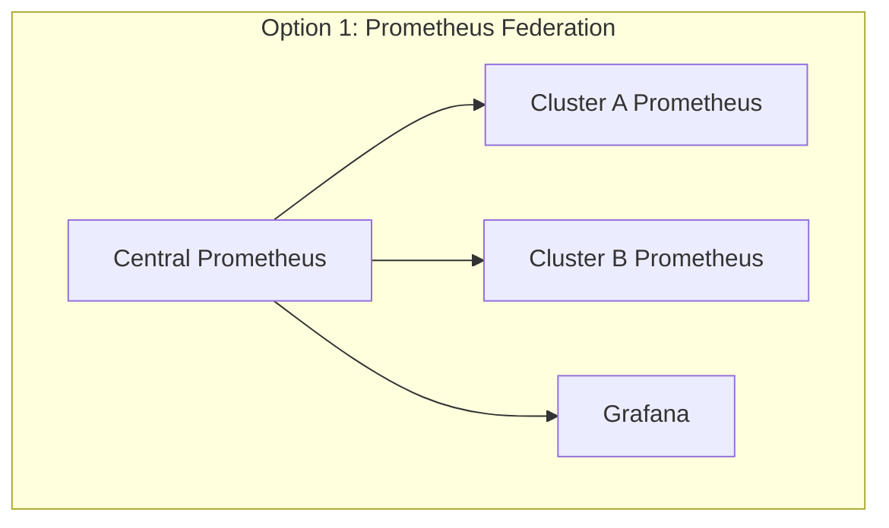
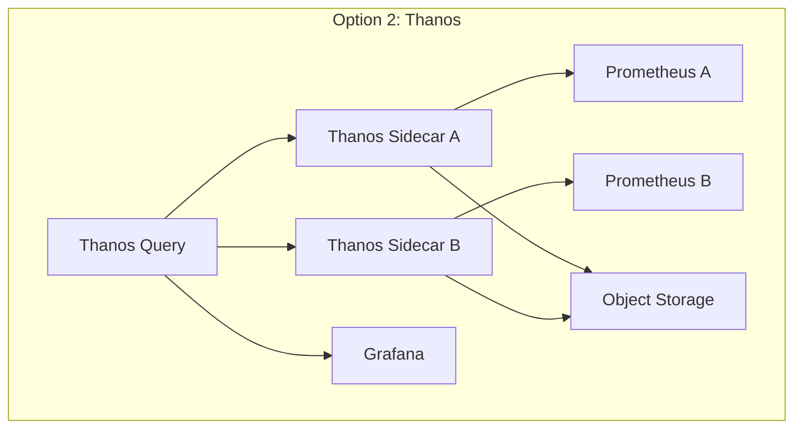
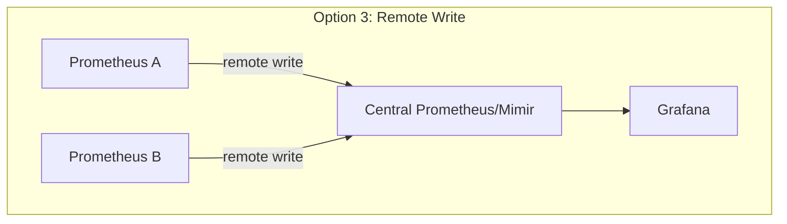

# How to Implement Federated Monitoring with ArgoCD

Author: [nawazdhandala](https://github.com/nawazdhandala)

Tags: ArgoCD, GitOps, Kubernetes, Monitoring, Prometheus Federation

Description: Learn how to implement federated monitoring across multiple Kubernetes clusters with ArgoCD using Prometheus federation, Thanos, and Grafana for unified observability.

---

When you run applications across multiple Kubernetes clusters, monitoring each cluster independently creates blind spots. You need a unified view of metrics, logs, and alerts across all clusters. Federated monitoring solves this by aggregating observability data from all clusters into a central location. Managing this infrastructure with ArgoCD means your entire monitoring stack is GitOps-controlled.

This guide covers implementing federated monitoring with ArgoCD using Prometheus, Thanos, and Grafana.

## Architecture Options

There are three common patterns for federated monitoring:







## Option 1: Prometheus Federation with ArgoCD

### Deploy Prometheus to Each Cluster

Use an ApplicationSet to deploy the Prometheus stack to every cluster:

```yaml
apiVersion: argoproj.io/v1alpha1
kind: ApplicationSet
metadata:
  name: prometheus-stack
  namespace: argocd
spec:
  generators:
    - clusters:
        selector:
          matchLabels:
            environment: production
        values:
          region: '{{metadata.labels.region}}'
          clusterName: '{{name}}'
  template:
    metadata:
      name: 'prometheus-{{name}}'
    spec:
      project: default
      source:
        repoURL: https://prometheus-community.github.io/helm-charts
        chart: kube-prometheus-stack
        targetRevision: 55.5.0
        helm:
          values: |
            prometheus:
              prometheusSpec:
                retention: 48h
                externalLabels:
                  cluster: "{{values.clusterName}}"
                  region: "{{values.region}}"
                # Expose federation endpoint
                enableFeatures:
                  - remote-write-receiver
                storageSpec:
                  volumeClaimTemplate:
                    spec:
                      storageClassName: gp3
                      resources:
                        requests:
                          storage: 50Gi
                serviceMonitorSelectorNilUsesHelmValues: false
                podMonitorSelectorNilUsesHelmValues: false
                ruleSelectorNilUsesHelmValues: false
            # Disable Grafana on leaf clusters
            grafana:
              enabled: false
            alertmanager:
              alertmanagerSpec:
                externalUrl: "https://alertmanager.example.com"
      destination:
        server: '{{server}}'
        namespace: monitoring
      syncPolicy:
        automated:
          prune: true
          selfHeal: true
        syncOptions:
          - CreateNamespace=true
          - ServerSideApply=true
```

### Deploy Central Federation Prometheus

On the central monitoring cluster, deploy a Prometheus instance that federates from all leaf clusters:

```yaml
apiVersion: argoproj.io/v1alpha1
kind: Application
metadata:
  name: central-prometheus
  namespace: argocd
spec:
  project: default
  source:
    repoURL: https://prometheus-community.github.io/helm-charts
    chart: kube-prometheus-stack
    targetRevision: 55.5.0
    helm:
      values: |
        prometheus:
          prometheusSpec:
            retention: 90d
            externalLabels:
              role: "federation-central"
            storageSpec:
              volumeClaimTemplate:
                spec:
                  storageClassName: gp3
                  resources:
                    requests:
                      storage: 500Gi
            additionalScrapeConfigs:
              # Federate from cluster A
              - job_name: 'federate-cluster-a'
                scrape_interval: 30s
                honor_labels: true
                metrics_path: '/federate'
                params:
                  'match[]':
                    - '{__name__=~"job:.*"}'
                    - '{__name__=~"node:.*"}'
                    - 'up'
                    - 'container_cpu_usage_seconds_total'
                    - 'container_memory_working_set_bytes'
                static_configs:
                  - targets:
                      - 'prometheus-cluster-a.monitoring.svc:9090'
                    labels:
                      cluster: 'cluster-a'
              # Federate from cluster B
              - job_name: 'federate-cluster-b'
                scrape_interval: 30s
                honor_labels: true
                metrics_path: '/federate'
                params:
                  'match[]':
                    - '{__name__=~"job:.*"}'
                    - '{__name__=~"node:.*"}'
                    - 'up'
                    - 'container_cpu_usage_seconds_total'
                    - 'container_memory_working_set_bytes'
                static_configs:
                  - targets:
                      - 'prometheus-cluster-b.monitoring.svc:9090'
                    labels:
                      cluster: 'cluster-b'
        grafana:
          enabled: true
          persistence:
            enabled: true
            size: 10Gi
  destination:
    server: https://central-monitoring.k8s.example.com
    namespace: monitoring
  syncPolicy:
    automated:
      prune: true
      selfHeal: true
    syncOptions:
      - CreateNamespace=true
      - ServerSideApply=true
```

## Option 2: Thanos with ArgoCD (Recommended)

Thanos provides a more scalable approach to multi-cluster monitoring.

### Deploy Thanos Sidecar with Prometheus

Modify the Prometheus deployment to include the Thanos sidecar:

```yaml
apiVersion: argoproj.io/v1alpha1
kind: ApplicationSet
metadata:
  name: prometheus-thanos
  namespace: argocd
spec:
  generators:
    - clusters:
        selector:
          matchLabels:
            environment: production
        values:
          region: '{{metadata.labels.region}}'
          clusterName: '{{name}}'
  template:
    metadata:
      name: 'prometheus-{{name}}'
    spec:
      project: default
      source:
        repoURL: https://prometheus-community.github.io/helm-charts
        chart: kube-prometheus-stack
        targetRevision: 55.5.0
        helm:
          values: |
            prometheus:
              prometheusSpec:
                retention: 48h
                externalLabels:
                  cluster: "{{values.clusterName}}"
                  region: "{{values.region}}"
                # Thanos sidecar configuration
                thanos:
                  image: quay.io/thanos/thanos:v0.34.0
                  objectStorageConfig:
                    existingSecret:
                      name: thanos-objstore-config
                      key: objstore.yml
                storageSpec:
                  volumeClaimTemplate:
                    spec:
                      storageClassName: gp3
                      resources:
                        requests:
                          storage: 50Gi
            grafana:
              enabled: false
      destination:
        server: '{{server}}'
        namespace: monitoring
      syncPolicy:
        automated:
          prune: true
          selfHeal: true
        syncOptions:
          - CreateNamespace=true
          - ServerSideApply=true
```

### Deploy Object Storage Secret

Each cluster needs access to the shared object store:

```yaml
apiVersion: external-secrets.io/v1beta1
kind: ExternalSecret
metadata:
  name: thanos-objstore-config
  namespace: monitoring
spec:
  refreshInterval: 1h
  secretStoreRef:
    name: aws-secrets-manager
    kind: ClusterSecretStore
  target:
    name: thanos-objstore-config
  data:
    - secretKey: objstore.yml
      remoteRef:
        key: monitoring/thanos-objstore
```

The object store configuration:

```yaml
type: S3
config:
  bucket: my-thanos-metrics
  endpoint: s3.us-east-1.amazonaws.com
  region: us-east-1
```

### Deploy Thanos Query on Central Cluster

```yaml
apiVersion: argoproj.io/v1alpha1
kind: Application
metadata:
  name: thanos-query
  namespace: argocd
spec:
  project: default
  source:
    repoURL: https://charts.bitnami.com/bitnami
    chart: thanos
    targetRevision: 14.0.0
    helm:
      values: |
        query:
          enabled: true
          replicaCount: 2
          stores:
            # Thanos sidecars on each cluster
            - "prometheus-thanos-sidecar.monitoring.cluster-a.svc:10901"
            - "prometheus-thanos-sidecar.monitoring.cluster-b.svc:10901"
            # Thanos store gateway for historical data
            - "thanos-storegateway.monitoring.svc:10901"
          resources:
            requests:
              cpu: 500m
              memory: 1Gi
            limits:
              memory: 2Gi

        queryFrontend:
          enabled: true
          replicaCount: 2

        storegateway:
          enabled: true
          replicaCount: 2
          persistence:
            size: 20Gi
          resources:
            requests:
              cpu: 500m
              memory: 1Gi

        compactor:
          enabled: true
          persistence:
            size: 50Gi
          retentionResolutionRaw: 30d
          retentionResolution5m: 90d
          retentionResolution1h: 1y

        existingObjstoreSecret: thanos-objstore-config
  destination:
    server: https://central-monitoring.k8s.example.com
    namespace: monitoring
  syncPolicy:
    automated:
      prune: true
      selfHeal: true
    syncOptions:
      - CreateNamespace=true
```

### Deploy Unified Grafana

```yaml
apiVersion: argoproj.io/v1alpha1
kind: Application
metadata:
  name: grafana
  namespace: argocd
spec:
  project: default
  source:
    repoURL: https://grafana.github.io/helm-charts
    chart: grafana
    targetRevision: 7.3.0
    helm:
      values: |
        persistence:
          enabled: true
          size: 10Gi
        datasources:
          datasources.yaml:
            apiVersion: 1
            datasources:
              - name: Thanos
                type: prometheus
                url: http://thanos-query.monitoring.svc:9090
                isDefault: true
                jsonData:
                  httpMethod: POST
                  timeInterval: 30s
        dashboardProviders:
          dashboardproviders.yaml:
            apiVersion: 1
            providers:
              - name: default
                orgId: 1
                folder: Multi-Cluster
                type: file
                disableDeletion: false
                editable: true
                options:
                  path: /var/lib/grafana/dashboards
  destination:
    server: https://central-monitoring.k8s.example.com
    namespace: monitoring
  syncPolicy:
    automated:
      prune: true
      selfHeal: true
```

## Cross-Cluster Alert Aggregation

Deploy a central Alertmanager that receives alerts from all clusters:

```yaml
alertmanager:
  alertmanagerSpec:
    # Cluster deduplication
    externalUrl: "https://alertmanager.example.com"
  config:
    global:
      resolve_timeout: 5m
    route:
      group_by: ['alertname', 'cluster', 'namespace']
      group_wait: 30s
      group_interval: 5m
      repeat_interval: 12h
      receiver: 'default'
      routes:
        - match:
            severity: critical
          receiver: 'pagerduty'
        - match:
            severity: warning
          receiver: 'slack'
    receivers:
      - name: 'default'
        slack_configs:
          - channel: '#alerts'
      - name: 'pagerduty'
        pagerduty_configs:
          - service_key_file: /etc/alertmanager/secrets/pagerduty-key
      - name: 'slack'
        slack_configs:
          - channel: '#alerts-warning'
```

## Multi-Cluster Dashboards

Create Grafana dashboards that show data from all clusters with cluster selectors:

```json
{
  "templating": {
    "list": [
      {
        "name": "cluster",
        "type": "query",
        "query": "label_values(up, cluster)",
        "multi": true,
        "includeAll": true
      },
      {
        "name": "namespace",
        "type": "query",
        "query": "label_values(kube_namespace_labels{cluster=~\"$cluster\"}, namespace)"
      }
    ]
  }
}
```

## Summary

Federated monitoring with ArgoCD gives you a unified observability platform across all your Kubernetes clusters. For small deployments, Prometheus federation is sufficient. For production scale, Thanos with object storage provides unlimited retention and global query capabilities. Deploy everything through ApplicationSets for consistency, and add cross-cluster dashboards and alert aggregation for a complete picture. For more on multi-cluster management, see our guide on [active-active deployments](https://oneuptime.com/blog/post/2026-02-26-how-to-implement-active-active-deployments-across-clusters-with-argocd/view).
