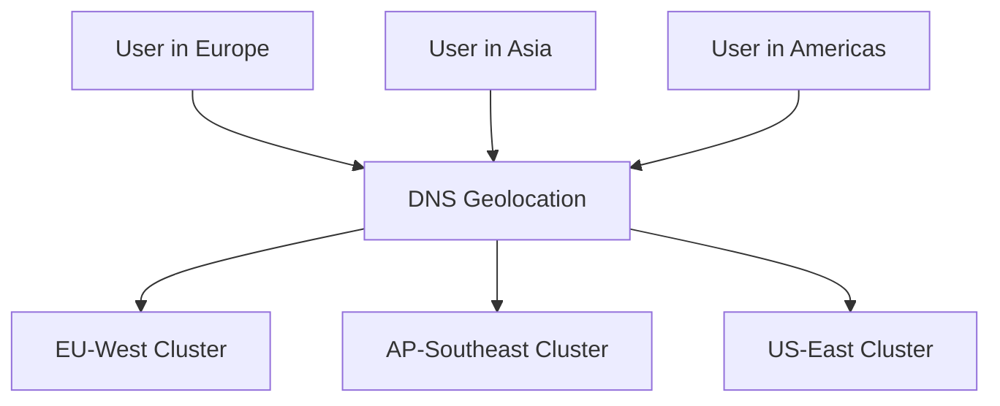

# How to Implement Geo-Based Routing with ArgoCD

Author: [nawazdhandala](https://github.com/nawazdhandala)

Tags: ArgoCD, GitOps, Kubernetes, Multi-Cluster, Geo-Routing

Description: Learn how to implement geographic routing with ArgoCD for multi-cluster deployments, using DNS geolocation, ApplicationSets, and region-specific configurations.

---

Geo-based routing directs users to the closest Kubernetes cluster based on their geographic location. This reduces latency, improves user experience, and helps with data residency compliance. ArgoCD makes it possible to manage deployments across geographically distributed clusters through a single GitOps workflow.

This guide covers implementing geo-based routing with ArgoCD, from cluster setup to DNS configuration.

## Why Geo-Based Routing?

Without geographic routing, all your users hit the same cluster regardless of location. A user in Tokyo connecting to a cluster in Virginia adds 150-200ms of network latency to every request. With geo-routing, that same user connects to a cluster in Tokyo with sub-10ms latency.

Common use cases include:

- Global SaaS applications serving users worldwide
- Data residency requirements (GDPR, data sovereignty)
- Gaming and real-time applications where latency matters
- CDN-like architectures for API responses



## Step 1: Multi-Cluster Setup

Register your geographically distributed clusters with ArgoCD. Label them with their region:

```yaml
# EU-West cluster
apiVersion: v1
kind: Secret
metadata:
  name: eu-west-cluster
  namespace: argocd
  labels:
    argocd.argoproj.io/secret-type: cluster
    environment: production
    region: eu-west-1
    continent: europe
type: Opaque
stringData:
  name: eu-west
  server: https://eu-west.k8s.example.com
  config: |
    {
      "bearerToken": "<token>",
      "tlsClientConfig": {
        "insecure": false,
        "caData": "<base64-ca>"
      }
    }
---
# AP-Southeast cluster
apiVersion: v1
kind: Secret
metadata:
  name: ap-southeast-cluster
  namespace: argocd
  labels:
    argocd.argoproj.io/secret-type: cluster
    environment: production
    region: ap-southeast-1
    continent: asia
type: Opaque
stringData:
  name: ap-southeast
  server: https://ap-southeast.k8s.example.com
  config: |
    {
      "bearerToken": "<token>",
      "tlsClientConfig": {
        "insecure": false,
        "caData": "<base64-ca>"
      }
    }
---
# US-East cluster
apiVersion: v1
kind: Secret
metadata:
  name: us-east-cluster
  namespace: argocd
  labels:
    argocd.argoproj.io/secret-type: cluster
    environment: production
    region: us-east-1
    continent: americas
type: Opaque
stringData:
  name: us-east
  server: https://us-east.k8s.example.com
  config: |
    {
      "bearerToken": "<token>",
      "tlsClientConfig": {
        "insecure": false,
        "caData": "<base64-ca>"
      }
    }
```

## Step 2: Deploy with ApplicationSets

Use an ApplicationSet with cluster generators to deploy to all regions:

```yaml
apiVersion: argoproj.io/v1alpha1
kind: ApplicationSet
metadata:
  name: api-global
  namespace: argocd
spec:
  generators:
    - clusters:
        selector:
          matchLabels:
            environment: production
        values:
          region: '{{metadata.labels.region}}'
          continent: '{{metadata.labels.continent}}'
  template:
    metadata:
      name: 'api-{{name}}'
      labels:
        app: api
        region: '{{values.region}}'
    spec:
      project: default
      source:
        repoURL: https://github.com/myorg/api-service.git
        targetRevision: main
        path: deploy/overlays/{{values.region}}
      destination:
        server: '{{server}}'
        namespace: api
      syncPolicy:
        automated:
          prune: true
          selfHeal: true
        syncOptions:
          - CreateNamespace=true
```

## Step 3: Region-Specific Configuration

Each region may need different configurations - database endpoints, cache clusters, feature flags, or scaling parameters:

```yaml
# deploy/overlays/eu-west-1/kustomization.yaml
apiVersion: kustomize.config.k8s.io/v1beta1
kind: Kustomization
resources:
  - ../../base
patches:
  - target:
      kind: Deployment
      name: api
    patch: |
      - op: replace
        path: /spec/template/spec/containers/0/env
        value:
          - name: REGION
            value: "eu-west-1"
          - name: DATABASE_URL
            value: "postgresql://db.eu-west-1.internal:5432/app"
          - name: REDIS_URL
            value: "redis://cache.eu-west-1.internal:6379"
          - name: CDN_BASE_URL
            value: "https://cdn-eu.example.com"
          - name: DATA_RESIDENCY
            value: "EU"
  - target:
      kind: HorizontalPodAutoscaler
      name: api
    patch: |
      - op: replace
        path: /spec/minReplicas
        value: 5
      - op: replace
        path: /spec/maxReplicas
        value: 30
```

```yaml
# deploy/overlays/ap-southeast-1/kustomization.yaml
apiVersion: kustomize.config.k8s.io/v1beta1
kind: Kustomization
resources:
  - ../../base
patches:
  - target:
      kind: Deployment
      name: api
    patch: |
      - op: replace
        path: /spec/template/spec/containers/0/env
        value:
          - name: REGION
            value: "ap-southeast-1"
          - name: DATABASE_URL
            value: "postgresql://db.ap-southeast-1.internal:5432/app"
          - name: REDIS_URL
            value: "redis://cache.ap-southeast-1.internal:6379"
          - name: CDN_BASE_URL
            value: "https://cdn-apac.example.com"
          - name: DATA_RESIDENCY
            value: "APAC"
  - target:
      kind: HorizontalPodAutoscaler
      name: api
    patch: |
      - op: replace
        path: /spec/minReplicas
        value: 3
      - op: replace
        path: /spec/maxReplicas
        value: 20
```

## Step 4: DNS Geolocation Routing

Configure your DNS provider for geolocation routing. Here are examples for common providers.

### AWS Route53 Geolocation

```yaml
# Managed via Terraform or Crossplane
# US-East record for Americas
resource "aws_route53_record" "api_americas" {
  zone_id = aws_route53_zone.main.zone_id
  name    = "api.example.com"
  type    = "A"

  alias {
    name                   = aws_lb.us_east.dns_name
    zone_id                = aws_lb.us_east.zone_id
    evaluate_target_health = true
  }

  geolocation_routing_policy {
    continent = "NA"
  }

  set_identifier = "americas"
  health_check_id = aws_route53_health_check.us_east.id
}

# EU-West record for Europe
resource "aws_route53_record" "api_europe" {
  zone_id = aws_route53_zone.main.zone_id
  name    = "api.example.com"
  type    = "A"

  alias {
    name                   = aws_lb.eu_west.dns_name
    zone_id                = aws_lb.eu_west.zone_id
    evaluate_target_health = true
  }

  geolocation_routing_policy {
    continent = "EU"
  }

  set_identifier = "europe"
  health_check_id = aws_route53_health_check.eu_west.id
}

# Default record for unmatched locations
resource "aws_route53_record" "api_default" {
  zone_id = aws_route53_zone.main.zone_id
  name    = "api.example.com"
  type    = "A"

  alias {
    name                   = aws_lb.us_east.dns_name
    zone_id                = aws_lb.us_east.zone_id
    evaluate_target_health = true
  }

  geolocation_routing_policy {
    country = "*"
  }

  set_identifier = "default"
}
```

### Cloudflare Load Balancing

For Cloudflare, you can use the load balancing API with geo-steering:

```json
{
  "description": "API geo-routing",
  "default_pools": ["pool-us-east"],
  "region_pools": {
    "WNAM": ["pool-us-east"],
    "ENAM": ["pool-us-east"],
    "WEU": ["pool-eu-west"],
    "EEU": ["pool-eu-west"],
    "SEAS": ["pool-ap-southeast"],
    "NEAS": ["pool-ap-southeast"],
    "OC": ["pool-ap-southeast"]
  },
  "fallback_pool": "pool-us-east",
  "steering_policy": "geo"
}
```

## Step 5: Health Checks with Failover

Geographic routing needs health checks. If a regional cluster goes down, traffic should automatically route to the next closest healthy cluster:

```yaml
# Health check endpoints deployed to each cluster
apiVersion: apps/v1
kind: Deployment
metadata:
  name: health-probe
  namespace: api
spec:
  replicas: 2
  selector:
    matchLabels:
      app: health-probe
  template:
    metadata:
      labels:
        app: health-probe
    spec:
      containers:
        - name: probe
          image: myorg/health-probe:v1.0
          ports:
            - containerPort: 8080
          livenessProbe:
            httpGet:
              path: /healthz
              port: 8080
          # The health probe checks:
          # - API pods are running
          # - Database connectivity
          # - Redis connectivity
          # Returns 200 only if all dependencies are healthy
```

## Step 6: Data Residency with ArgoCD

For GDPR and data sovereignty, use ArgoCD to enforce region-specific policies:

```yaml
apiVersion: argoproj.io/v1alpha1
kind: AppProject
metadata:
  name: eu-applications
  namespace: argocd
spec:
  description: "Applications that must run in EU regions"
  sourceRepos:
    - https://github.com/myorg/eu-services.git
  destinations:
    # Only allow deployment to EU clusters
    - server: https://eu-west.k8s.example.com
      namespace: '*'
  # Deny deployment to non-EU clusters
  clusterResourceBlacklist: []
```

## Monitoring Geo-Routing

Track latency and traffic distribution across regions:

```yaml
apiVersion: monitoring.coreos.com/v1
kind: PrometheusRule
metadata:
  name: geo-routing-alerts
  namespace: monitoring
spec:
  groups:
    - name: geo.routing.rules
      rules:
        - alert: RegionTrafficImbalance
          expr: |
            max(rate(http_requests_total{region!=""}[5m]))
            / min(rate(http_requests_total{region!=""}[5m])) > 10
          for: 30m
          labels:
            severity: warning
          annotations:
            summary: "Traffic imbalance between regions detected"
        - alert: RegionHighLatency
          expr: |
            histogram_quantile(0.95,
              rate(http_request_duration_seconds_bucket[5m])
            ) > 2
          for: 10m
          labels:
            severity: warning
          annotations:
            summary: "High latency in region {{ $labels.region }}"
```

## Summary

Geo-based routing with ArgoCD combines multi-cluster management with DNS geolocation to serve users from the closest regional cluster. Use ApplicationSets for consistent multi-cluster deployment, Kustomize overlays for region-specific configuration, and DNS geolocation policies for traffic steering. Health checks ensure automatic failover when a region becomes unhealthy. For more on multi-cluster patterns, see our guide on [active-active deployments across clusters](https://oneuptime.com/blog/post/2026-02-26-how-to-implement-active-active-deployments-across-clusters-with-argocd/view).
