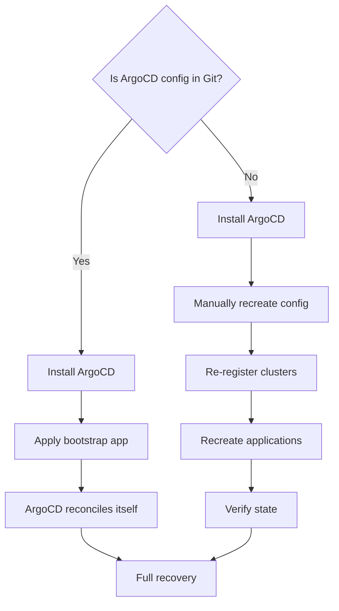

# How to Rebuild ArgoCD State from Scratch

Author: [nawazdhandala](https://github.com/nawazdhandala)

Tags: ArgoCD, GitOps, Kubernetes, Disaster Recovery, State Management

Description: Step-by-step guide to rebuilding ArgoCD's complete state from scratch after a catastrophic failure, including application definitions, credentials, and cluster registrations.

---

Sometimes you need to rebuild ArgoCD from nothing. Maybe the cluster running ArgoCD was destroyed, the namespace was accidentally deleted, or a misconfigured backup restore left ArgoCD in an inconsistent state. If you follow GitOps practices, rebuilding should be possible because the source of truth is in Git, not in ArgoCD itself.

This post walks through rebuilding ArgoCD's complete state from scratch, covering both the ideal case (you have everything in Git) and the more realistic case (some configuration was managed manually).

## The GitOps Recovery Advantage

If your ArgoCD configuration is managed through GitOps (ArgoCD managing itself, often called the "App of Apps" pattern), recovery is straightforward: install ArgoCD, point it at the bootstrap repository, and let it reconcile everything.

If your ArgoCD was configured manually through the UI or CLI, recovery is harder. This post covers both scenarios.



## Scenario 1: GitOps-Managed ArgoCD (App of Apps)

If you manage ArgoCD with the App of Apps pattern, recovery takes minutes.

### Step 1: Install ArgoCD

```bash
# Install ArgoCD on a fresh or recovered cluster
kubectl create namespace argocd
kubectl apply -n argocd -f https://raw.githubusercontent.com/argoproj/argo-cd/stable/manifests/ha/install.yaml

# Wait for base components to be ready
kubectl wait --for=condition=ready pod \
  -l app.kubernetes.io/part-of=argocd \
  -n argocd --timeout=300s
```

### Step 2: Configure Repository Access

ArgoCD needs credentials to access your Git repository. Apply the repository secret.

```yaml
# repo-secret.yaml - Git repository credentials
apiVersion: v1
kind: Secret
metadata:
  name: company-repo
  namespace: argocd
  labels:
    argocd.argoproj.io/secret-type: repository
type: Opaque
stringData:
  url: https://github.com/company/argocd-config
  password: <github-token>
  username: git
  type: git
```

```bash
kubectl apply -f repo-secret.yaml
```

### Step 3: Apply the Bootstrap Application

The bootstrap application points to your Git repository that contains all ArgoCD configuration.

```yaml
# bootstrap.yaml - The root application that manages everything
apiVersion: argoproj.io/v1alpha1
kind: Application
metadata:
  name: argocd-bootstrap
  namespace: argocd
spec:
  project: default
  source:
    repoURL: https://github.com/company/argocd-config
    targetRevision: main
    path: bootstrap
  destination:
    server: https://kubernetes.default.svc
    namespace: argocd
  syncPolicy:
    automated:
      prune: true
      selfHeal: true
    syncOptions:
      - CreateNamespace=true
```

```bash
kubectl apply -f bootstrap.yaml

# ArgoCD will now sync all configuration from Git:
# - ConfigMaps (argocd-cm, argocd-rbac-cm, etc.)
# - AppProjects
# - ApplicationSets
# - Applications
# - Repository credentials
```

### Step 4: Re-register External Clusters

If your Git configuration includes cluster secrets, they will be applied automatically. Otherwise, re-register clusters.

```bash
# Re-register each managed cluster
argocd cluster add staging-cluster --name staging
argocd cluster add production-cluster --name production

# Verify cluster connectivity
argocd cluster list
```

### Step 5: Verify Recovery

```bash
# Check that all applications are syncing
argocd app list

# Force a hard refresh to speed up cache rebuilding
for app in $(argocd app list -o name); do
  argocd app get "$app" --hard-refresh &
done
wait
```

## Scenario 2: Manually Configured ArgoCD

If your ArgoCD was not managed through GitOps, you need to reconstruct the configuration from available sources.

### Step 1: Gather Configuration Sources

Check what configuration you can recover from.

```bash
# Check if you have backups
# Velero backup
velero backup describe argocd-backup-latest

# etcd snapshot
# If you have an etcd snapshot from the old cluster, you can extract ArgoCD resources

# Git repositories
# Your application configs are in Git even if ArgoCD config is not

# CI/CD pipelines
# Check if your pipelines have ArgoCD configuration steps
```

### Step 2: Install and Configure ArgoCD

```bash
# Install ArgoCD
kubectl create namespace argocd
kubectl apply -n argocd -f https://raw.githubusercontent.com/argoproj/argo-cd/stable/manifests/ha/install.yaml
kubectl wait --for=condition=ready pod -l app.kubernetes.io/part-of=argocd -n argocd --timeout=300s

# Set the admin password
argocd admin initial-password -n argocd
argocd login argocd.company.com --username admin --password <initial-password>
argocd account update-password
```

### Step 3: Recreate ConfigMaps

Rebuild the core configuration. If you have documentation or configuration management records, use those. Otherwise, start with defaults and customize.

```yaml
# argocd-cm - core configuration
apiVersion: v1
kind: ConfigMap
metadata:
  name: argocd-cm
  namespace: argocd
data:
  # Disable admin if using SSO
  # admin.enabled: "false"

  # OIDC configuration (if you used SSO)
  oidc.config: |
    name: Okta
    issuer: https://company.okta.com
    clientID: argocd-client-id
    clientSecret: $oidc.okta.clientSecret
    requestedScopes: ["openid", "profile", "email", "groups"]

  # Resource tracking method
  application.resourceTrackingMethod: annotation

  # Custom health checks (if you had any)
  resource.customizations.health.cert-manager.io_Certificate: |
    hs = {}
    if obj.status ~= nil then
      if obj.status.conditions ~= nil then
        for i, condition in ipairs(obj.status.conditions) do
          if condition.type == "Ready" and condition.status == "True" then
            hs.status = "Healthy"
            return hs
          end
        end
      end
    end
    hs.status = "Progressing"
    return hs
```

```yaml
# argocd-rbac-cm - RBAC policies
apiVersion: v1
kind: ConfigMap
metadata:
  name: argocd-rbac-cm
  namespace: argocd
data:
  policy.default: role:readonly
  policy.csv: |
    p, role:admin, *, *, */*, allow
    g, platform-team, role:admin
    g, engineering, role:readonly
```

```bash
kubectl apply -f argocd-cm.yaml
kubectl apply -f argocd-rbac-cm.yaml
```

### Step 4: Recreate Repository Connections

```bash
# Add Git repositories
argocd repo add https://github.com/company/k8s-configs \
  --username git \
  --password <github-token>

argocd repo add https://github.com/company/helm-charts \
  --username git \
  --password <github-token>

# Add Helm chart repositories
argocd repo add https://charts.bitnami.com/bitnami \
  --type helm \
  --name bitnami
```

### Step 5: Recreate Projects

```bash
# Recreate AppProjects
cat <<EOF | kubectl apply -f -
apiVersion: argoproj.io/v1alpha1
kind: AppProject
metadata:
  name: production
  namespace: argocd
spec:
  description: Production applications
  sourceRepos:
    - 'https://github.com/company/*'
  destinations:
    - namespace: '*'
      server: 'https://production-cluster:6443'
  clusterResourceWhitelist:
    - group: ''
      kind: Namespace
EOF
```

### Step 6: Recreate Applications

This is the most time-consuming step if you had many applications. Reconstruct from your Git repository structure.

```bash
# If your Git repo has a clear structure, you can script application creation
# Example: create an app for each directory in the repo
for dir in $(ls /path/to/k8s-configs/apps/); do
  argocd app create "$dir" \
    --repo https://github.com/company/k8s-configs \
    --path "apps/$dir" \
    --dest-server https://kubernetes.default.svc \
    --dest-namespace "$dir" \
    --sync-policy automated \
    --auto-prune \
    --self-heal
done
```

### Step 7: Verify Everything

```bash
# Check all applications
argocd app list

# Look for any sync or health issues
argocd app list -o json | jq '.[] | select(.status.health.status != "Healthy") | .metadata.name'

# Check for missing applications by comparing with your Git repos
# List directories in your config repo that are not yet ArgoCD apps
```

## Preventing Future State Loss

After rebuilding, take steps to prevent this from happening again.

### Adopt App of Apps Pattern

Move all ArgoCD configuration into Git so recovery is automated.

```text
argocd-config/
  bootstrap/
    argocd-cm.yaml
    argocd-rbac-cm.yaml
    argocd-cmd-params-cm.yaml
    projects/
      production.yaml
      staging.yaml
    applications/
      app-of-apps.yaml
  repos/
    company-repo.yaml
  clusters/
    staging.yaml
    production.yaml
```

### Set Up Backups

```yaml
# Velero backup schedule for ArgoCD namespace
apiVersion: velero.io/v1
kind: Schedule
metadata:
  name: argocd-backup
  namespace: velero
spec:
  schedule: "0 */6 * * *"  # Every 6 hours
  template:
    includedNamespaces:
      - argocd
    includedResources:
      - applications.argoproj.io
      - applicationsets.argoproj.io
      - appprojects.argoproj.io
      - configmaps
      - secrets
    labelSelector:
      matchExpressions:
        - key: app.kubernetes.io/part-of
          operator: In
          values:
            - argocd
    ttl: 720h  # Retain for 30 days
```

### Export State Regularly

```bash
#!/bin/bash
# export-argocd-state.sh - Run as a CronJob
BACKUP_DIR="/backups/argocd/$(date +%Y%m%d)"
mkdir -p "$BACKUP_DIR"

kubectl get applications -n argocd -o yaml > "$BACKUP_DIR/applications.yaml"
kubectl get applicationsets -n argocd -o yaml > "$BACKUP_DIR/applicationsets.yaml"
kubectl get appprojects -n argocd -o yaml > "$BACKUP_DIR/projects.yaml"
kubectl get configmap argocd-cm argocd-rbac-cm -n argocd -o yaml > "$BACKUP_DIR/configmaps.yaml"

echo "ArgoCD state exported to $BACKUP_DIR"
```

## Wrapping Up

Rebuilding ArgoCD from scratch is straightforward if you follow GitOps practices and keep your ArgoCD configuration in Git. The App of Apps pattern makes recovery a matter of installing ArgoCD and applying a single bootstrap application. If your configuration was managed manually, the rebuild is more work but still achievable by reconstructing from Git repository structure, documentation, and backups. The key takeaway: invest in making your ArgoCD configuration fully declarative and stored in Git. It is the best insurance against catastrophic state loss. For exporting and importing state in a controlled manner, see [how to export and import ArgoCD application state](https://oneuptime.com/blog/post/2026-02-26-how-to-export-and-import-argocd-application-state/view).
