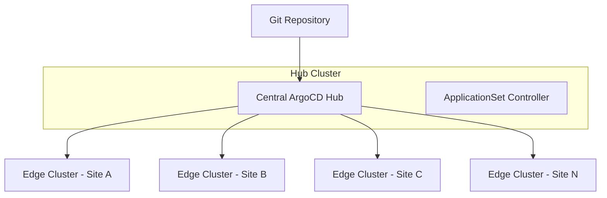

# How to Use ArgoCD for Edge Device Fleet Management

Author: [nawazdhandala](https://github.com/nawazdhandala)

Tags: ArgoCD, GitOps, Kubernetes, Edge Computing, Fleet Management

Description: Learn how to manage hundreds or thousands of edge devices using ArgoCD's GitOps approach, ApplicationSets, and cluster generators for scalable fleet operations.

---

Managing a fleet of edge devices is one of the hardest challenges in modern infrastructure. You might have hundreds of retail locations, factory floors, or remote sites - each running a small Kubernetes cluster. Keeping them all in sync, deploying updates reliably, and handling the inevitable connectivity hiccups requires a thoughtful approach.

ArgoCD, combined with its ApplicationSet controller, gives you a powerful way to manage edge fleets through GitOps. Instead of pushing updates to each device individually, you declare what each device should run, and ArgoCD handles convergence. This post walks through the architecture and implementation patterns for edge fleet management with ArgoCD.

## Architecture Overview

The typical edge fleet architecture with ArgoCD uses a hub-and-spoke model. A central ArgoCD instance (the hub) manages applications across many remote clusters (the spokes). Each edge device runs a lightweight Kubernetes distribution like K3s, and the central ArgoCD watches the Git repository and reconciles state across all registered clusters.



## Registering Edge Clusters

Each edge device needs to be registered as a cluster in ArgoCD. You can do this with the CLI or by creating cluster secrets directly.

For automated registration at scale, create cluster secrets in the ArgoCD namespace. This is the pattern that works best for fleet management because you can template it.

```yaml
# cluster-secret-site-a.yaml
# Each edge cluster is registered as a secret in ArgoCD's namespace
apiVersion: v1
kind: Secret
metadata:
  name: edge-site-a
  namespace: argocd
  labels:
    argocd.argoproj.io/secret-type: cluster
    # Custom labels for fleet filtering
    edge-region: us-west
    edge-type: retail
    edge-tier: standard
type: Opaque
stringData:
  name: edge-site-a
  server: https://edge-site-a.internal:6443
  config: |
    {
      "bearerToken": "<service-account-token>",
      "tlsClientConfig": {
        "insecure": false,
        "caData": "<base64-ca-cert>"
      }
    }
```

For large fleets, you would automate this registration as part of your device provisioning pipeline. When a new K3s cluster comes online, it registers itself by creating its cluster secret in the hub.

## Using ApplicationSets for Fleet-Wide Deployment

The ApplicationSet controller is the real workhorse for fleet management. It dynamically generates ArgoCD Applications based on cluster inventory.

Here is an ApplicationSet that deploys a monitoring agent to every edge cluster.

```yaml
# appset-edge-monitoring.yaml
# Deploys monitoring agent to all clusters labeled as edge devices
apiVersion: argoproj.io/v1alpha1
kind: ApplicationSet
metadata:
  name: edge-monitoring-agent
  namespace: argocd
spec:
  generators:
    # Cluster generator finds all clusters matching the label selector
    - clusters:
        selector:
          matchLabels:
            edge-type: retail
        values:
          # Pass cluster-specific values to the template
          metricsEndpoint: "https://metrics.company.com/ingest"
  template:
    metadata:
      name: 'monitoring-{{name}}'
    spec:
      project: edge-fleet
      source:
        repoURL: https://github.com/company/edge-configs
        targetRevision: main
        path: apps/monitoring
        helm:
          valuesObject:
            clusterName: '{{name}}'
            metricsEndpoint: '{{values.metricsEndpoint}}'
            region: '{{metadata.labels.edge-region}}'
      destination:
        server: '{{server}}'
        namespace: monitoring
      syncPolicy:
        automated:
          prune: true
          selfHeal: true
        syncOptions:
          - CreateNamespace=true
          # Retry on failure - critical for edge devices
          - Retry=true
        retry:
          limit: 5
          backoff:
            duration: 30s
            factor: 2
            maxDuration: 5m
```

## Tiered Rollouts Across the Fleet

You do not want to push updates to every edge device simultaneously. A bad update could take down your entire fleet. Instead, use a canary or tiered rollout strategy.

Label your clusters by tier and use multiple ApplicationSets or a matrix generator to control rollout order.

```yaml
# appset-tiered-rollout.yaml
# Uses matrix generator to combine cluster selection with Git directories
apiVersion: argoproj.io/v1alpha1
kind: ApplicationSet
metadata:
  name: edge-app-tiered
  namespace: argocd
spec:
  generators:
    - matrix:
        generators:
          # First dimension: select clusters by rollout tier
          - clusters:
              selector:
                matchLabels:
                  edge-tier: canary
              values:
                wave: "1"
          # Second dimension: the apps to deploy
          - git:
              repoURL: https://github.com/company/edge-configs
              revision: main
              directories:
                - path: apps/*
  strategy:
    type: RollingSync
    rollingSync:
      steps:
        # Deploy to canary tier first
        - matchExpressions:
            - key: edge-tier
              operator: In
              values:
                - canary
          # Wait for manual approval before proceeding
          maxUpdate: 100%
        # Then roll out to standard tier
        - matchExpressions:
            - key: edge-tier
              operator: In
              values:
                - standard
          maxUpdate: 25%
  template:
    metadata:
      name: '{{path.basename}}-{{name}}'
    spec:
      project: edge-fleet
      source:
        repoURL: https://github.com/company/edge-configs
        targetRevision: main
        path: '{{path}}'
      destination:
        server: '{{server}}'
        namespace: '{{path.basename}}'
      syncPolicy:
        automated:
          prune: true
          selfHeal: true
```

## Managing Cluster-Specific Configurations

Edge devices often need site-specific configurations - different WiFi settings, local IP ranges, hardware-specific drivers, or regulatory compliance settings per region.

The best pattern is to use a combination of a base configuration and per-cluster overlays stored in Git.

```text
edge-configs/
  base/
    monitoring/
      kustomization.yaml
      deployment.yaml
    networking/
      kustomization.yaml
      config.yaml
  overlays/
    edge-site-a/
      kustomization.yaml     # References base + patches
      site-config.yaml       # Site-specific values
    edge-site-b/
      kustomization.yaml
      site-config.yaml
```

The ApplicationSet can reference per-cluster paths.

```yaml
# Use the cluster name to select the right overlay directory
source:
  repoURL: https://github.com/company/edge-configs
  targetRevision: main
  path: 'overlays/{{name}}'
```

## Monitoring Fleet Health

With hundreds of edge clusters, you need visibility into which ones are healthy and which are drifting. ArgoCD exposes Prometheus metrics that you can scrape for fleet-wide dashboards.

Key metrics to watch include:

- `argocd_app_info` with labels for sync status and health status per application
- `argocd_app_sync_total` to track sync attempts and failures
- `argocd_cluster_api_server_requests_total` to detect unreachable edge clusters

You can build a Grafana dashboard that shows the overall fleet health at a glance and lets you drill into individual sites. For alerting, set up rules that fire when a cluster has been out of sync for more than a threshold - maybe 30 minutes for standard updates or 5 minutes for critical security patches.

If you are looking for an integrated monitoring solution that works well with ArgoCD fleet management, check out [OneUptime for Kubernetes monitoring](https://oneuptime.com/blog/post/2026-02-26-how-to-use-argocd-api-for-deployment-tracking/view) which can track deployment status across clusters.

## Handling Scale

ArgoCD can comfortably manage several hundred clusters from a single instance, but at true fleet scale (thousands of devices), you will need to tune it.

Key scaling considerations include increasing the application controller's `--status-processors` and `--operation-processors` flags, sharding the application controller across multiple replicas, increasing Redis memory limits for the larger cache footprint, and setting longer reconciliation intervals for edge clusters since they do not need the same 3-minute default as development clusters.

```yaml
# argocd-cmd-params-cm ConfigMap tuning for fleet scale
apiVersion: v1
kind: ConfigMap
metadata:
  name: argocd-cmd-params-cm
  namespace: argocd
data:
  # Increase reconciliation timeout for edge clusters
  timeout.reconciliation: "300"
  # Increase controller processors for parallel sync
  controller.status.processors: "50"
  controller.operation.processors: "25"
  # Enable sharding for large fleet
  controller.sharding.algorithm: "round-robin"
```

## Wrapping Up

ArgoCD's hub-and-spoke model with ApplicationSets provides a scalable, GitOps-native approach to edge fleet management. The key patterns are: registering clusters as secrets for automation, using ApplicationSets with cluster generators for fleet-wide deployments, implementing tiered rollouts to avoid fleet-wide outages, leveraging Kustomize overlays for site-specific configs, and monitoring fleet health through Prometheus metrics.

The beauty of this approach is that adding a new edge device to the fleet is as simple as creating a cluster secret with the right labels. The ApplicationSet controller picks it up automatically and deploys everything it needs. No manual intervention, no imperative scripts - just Git as the source of truth for your entire edge infrastructure.
