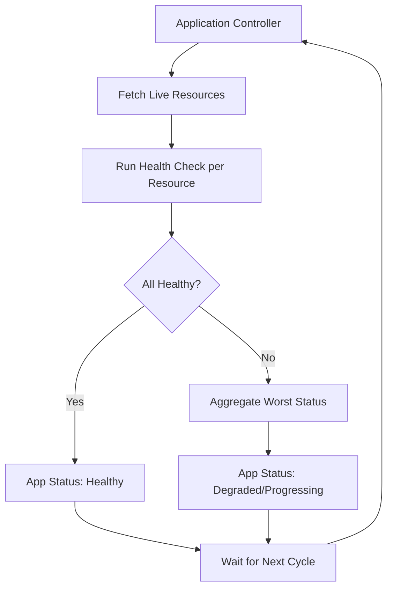

# How to Implement Automated Health Verification in ArgoCD

Author: [nawazdhandala](https://github.com/nawazdhandala)

Tags: ArgoCD, GitOps, Kubernetes, Health Verification, Automation

Description: Learn how to set up automated health verification in ArgoCD that continuously monitors application health and triggers alerts when deployments degrade.

---

Health verification in ArgoCD is not a one-time check after deployment. It is a continuous process where ArgoCD monitors the health of every resource in your applications and reports when things degrade. Setting up automated health verification means configuring ArgoCD to understand what "healthy" means for each resource type and building automation around health state changes.

## How ArgoCD Health Assessment Works

ArgoCD runs health assessments on a continuous loop. The application controller checks every resource in every Application against its health check definition. The default check interval is controlled by the `timeout.reconciliation` setting (default 180 seconds).



The application-level health is the worst status among all its resources. If one Pod is Degraded and everything else is Healthy, the Application shows as Degraded.

## Configuring Health Checks for Common Resources

ArgoCD has built-in health checks for standard Kubernetes resources. But you can override them or add new ones in the argocd-cm ConfigMap.

### Deployment Health with Rollout Awareness

```yaml
apiVersion: v1
kind: ConfigMap
metadata:
  name: argocd-cm
  namespace: argocd
data:
  resource.customizations.health.apps_Deployment: |
    hs = {}
    if obj.status == nil then
      hs.status = "Progressing"
      hs.message = "No status available"
      return hs
    end

    -- Check if the controller has processed the latest version
    if obj.metadata.generation ~= obj.status.observedGeneration then
      hs.status = "Progressing"
      hs.message = "Waiting for controller to observe latest generation"
      return hs
    end

    -- Check for available condition
    if obj.status.conditions ~= nil then
      for _, condition in ipairs(obj.status.conditions) do
        if condition.type == "Available" then
          if condition.status == "False" then
            hs.status = "Degraded"
            hs.message = condition.message or "Deployment not available"
            return hs
          end
        end
        if condition.type == "Progressing" then
          if condition.reason == "ProgressDeadlineExceeded" then
            hs.status = "Degraded"
            hs.message = "Deployment progress deadline exceeded"
            return hs
          end
        end
      end
    end

    -- Check replica counts
    local desired = obj.spec.replicas or 1
    local updated = obj.status.updatedReplicas or 0
    local available = obj.status.availableReplicas or 0
    local ready = obj.status.readyReplicas or 0

    if updated == desired and available == desired and ready == desired then
      hs.status = "Healthy"
      hs.message = string.format("All %d replicas ready", desired)
    else
      hs.status = "Progressing"
      hs.message = string.format("%d/%d updated, %d/%d available, %d/%d ready",
        updated, desired, available, desired, ready, desired)
    end
    return hs
```

### StatefulSet Health

```yaml
  resource.customizations.health.apps_StatefulSet: |
    hs = {}
    if obj.status == nil then
      hs.status = "Progressing"
      hs.message = "No status"
      return hs
    end

    if obj.metadata.generation ~= obj.status.observedGeneration then
      hs.status = "Progressing"
      hs.message = "Update in progress"
      return hs
    end

    local desired = obj.spec.replicas or 1
    local ready = obj.status.readyReplicas or 0
    local current = obj.status.currentReplicas or 0

    if ready == desired and current == desired then
      hs.status = "Healthy"
      hs.message = string.format("All %d replicas ready", desired)
    else
      hs.status = "Progressing"
      hs.message = string.format("%d/%d ready, %d/%d current",
        ready, desired, current, desired)
    end
    return hs
```

### Ingress Health

```yaml
  resource.customizations.health.networking.k8s.io_Ingress: |
    hs = {}
    if obj.status ~= nil and obj.status.loadBalancer ~= nil then
      if obj.status.loadBalancer.ingress ~= nil and #obj.status.loadBalancer.ingress > 0 then
        hs.status = "Healthy"
        hs.message = "Load balancer assigned"
        return hs
      end
    end
    hs.status = "Progressing"
    hs.message = "Waiting for load balancer"
    return hs
```

## Automated Health-Based Notifications

Configure ArgoCD notifications to alert when health status changes:

```yaml
apiVersion: v1
kind: ConfigMap
metadata:
  name: argocd-notifications-cm
  namespace: argocd
data:
  # Trigger when app becomes degraded
  trigger.on-health-degraded: |
    - when: app.status.health.status == 'Degraded'
      send: [health-degraded-alert]
      oncePer: app.status.sync.revision

  # Trigger when app recovers
  trigger.on-health-recovered: |
    - when: app.status.health.status == 'Healthy' and
            time.Now().Sub(time.Parse(app.status.operationState.finishedAt)).Minutes() < 10
      send: [health-recovered-alert]

  # Trigger when app is stuck progressing
  trigger.on-health-stuck: |
    - when: app.status.health.status == 'Progressing' and
            time.Now().Sub(time.Parse(app.status.operationState.startedAt)).Minutes() > 15
      send: [health-stuck-alert]

  template.health-degraded-alert: |
    message: |
      Application {{.app.metadata.name}} is DEGRADED
      Health: {{.app.status.health.status}}
      {{range .app.status.resources}}
      {{if eq .health.status "Degraded"}}
      - {{.kind}}/{{.name}}: {{.health.message}}
      {{end}}
      {{end}}

  template.health-recovered-alert: |
    message: |
      Application {{.app.metadata.name}} has RECOVERED
      Health: {{.app.status.health.status}}
      All resources are healthy.

  template.health-stuck-alert: |
    message: |
      Application {{.app.metadata.name}} is STUCK PROGRESSING for over 15 minutes
      This may indicate a rollout that cannot complete.
      {{range .app.status.resources}}
      {{if eq .health.status "Progressing"}}
      - {{.kind}}/{{.name}}: {{.health.message}}
      {{end}}
      {{end}}
```

## Health-Based Auto-Remediation

ArgoCD's self-heal feature automatically fixes drift, but you can extend this with custom automation:

```yaml
# Enable self-heal on the Application
apiVersion: argoproj.io/v1alpha1
kind: Application
metadata:
  name: backend-api
spec:
  syncPolicy:
    automated:
      selfHeal: true    # Auto-fix drift from desired state
      prune: true
    retry:
      limit: 3          # Retry failed syncs
      backoff:
        duration: 30s
        factor: 2
        maxDuration: 3m
```

For more advanced remediation, use a controller that watches Application health:

```yaml
# CronJob that checks health and takes action
apiVersion: batch/v1
kind: CronJob
metadata:
  name: health-monitor
  namespace: argocd
spec:
  schedule: "*/5 * * * *"  # Every 5 minutes
  jobTemplate:
    spec:
      template:
        spec:
          serviceAccountName: argocd-health-monitor
          containers:
            - name: monitor
              image: bitnami/kubectl:latest
              command:
                - /bin/sh
                - -c
                - |
                  # Get all degraded applications
                  DEGRADED=$(kubectl get applications -n argocd -o json | \
                    jq -r '.items[] | select(.status.health.status == "Degraded") | .metadata.name')

                  for app in $DEGRADED; do
                    echo "Application $app is degraded"

                    # Check how long it has been degraded
                    # If degraded for more than 30 minutes, try a refresh
                    LAST_SYNC=$(kubectl get application "$app" -n argocd -o json | \
                      jq -r '.status.operationState.finishedAt')

                    echo "Last sync: $LAST_SYNC"
                    echo "Triggering hard refresh for $app"
                    kubectl patch application "$app" -n argocd --type merge \
                      -p '{"metadata":{"annotations":{"argocd.argoproj.io/refresh":"hard"}}}'
                  done
          restartPolicy: Never
```

## Integration with External Monitoring

Connect ArgoCD health status with your monitoring stack for a complete picture:

```yaml
# ServiceMonitor for ArgoCD metrics
apiVersion: monitoring.coreos.com/v1
kind: ServiceMonitor
metadata:
  name: argocd-metrics
  namespace: argocd
spec:
  selector:
    matchLabels:
      app.kubernetes.io/name: argocd-application-controller
  endpoints:
    - port: metrics
```

Create Prometheus alerting rules based on ArgoCD metrics:

```yaml
apiVersion: monitoring.coreos.com/v1
kind: PrometheusRule
metadata:
  name: argocd-health-alerts
  namespace: argocd
spec:
  groups:
    - name: argocd-health
      rules:
        - alert: ArgoCDAppDegraded
          expr: |
            argocd_app_info{health_status="Degraded"} == 1
          for: 5m
          labels:
            severity: warning
          annotations:
            summary: "ArgoCD application {{ $labels.name }} is degraded"
            description: "Application {{ $labels.name }} has been in Degraded health for 5+ minutes"

        - alert: ArgoCDAppNotHealthy
          expr: |
            argocd_app_info{health_status!="Healthy",health_status!="Suspended"} == 1
          for: 30m
          labels:
            severity: critical
          annotations:
            summary: "ArgoCD application {{ $labels.name }} is not healthy for 30 minutes"

        - alert: ArgoCDAppSyncFailed
          expr: |
            argocd_app_info{sync_status="OutOfSync"} == 1
          for: 15m
          labels:
            severity: warning
          annotations:
            summary: "ArgoCD application {{ $labels.name }} is out of sync"
```

## Tuning Health Check Frequency

For critical applications, you might want more frequent health checks. Adjust the reconciliation timeout:

```yaml
apiVersion: v1
kind: ConfigMap
metadata:
  name: argocd-cm
  namespace: argocd
data:
  # Global reconciliation interval (default: 180s)
  timeout.reconciliation: "60"
```

For individual applications, force more frequent checks:

```yaml
apiVersion: argoproj.io/v1alpha1
kind: Application
metadata:
  name: critical-service
  annotations:
    # Override reconciliation interval for this app
    argocd.argoproj.io/refresh: "30"
```

Be careful with aggressive intervals. Each reconciliation cycle uses API server resources. For clusters with hundreds of Applications, setting the interval too low can overload the Kubernetes API server.

## Summary

Automated health verification in ArgoCD is a combination of custom health check definitions, notification triggers, and monitoring integration. Configure Lua health checks that accurately reflect resource health for your workloads. Set up notifications for health transitions - degraded, recovered, and stuck progressing. Integrate ArgoCD metrics with Prometheus for alerting and dashboards. Enable self-heal with retry policies for automatic remediation. The goal is a system where you are immediately notified when a deployment causes health issues and where many issues are automatically remediated before you even see the alert.
