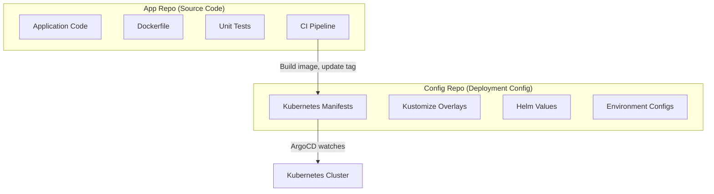
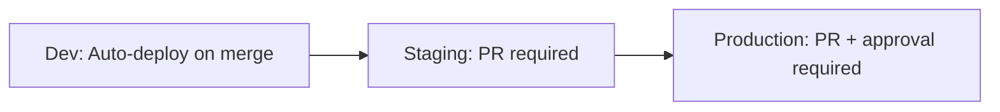

# How to Implement Config Repo vs App Repo Pattern

Author: [nawazdhandala](https://github.com/nawazdhandala)

Tags: ArgoCD, GitOps, Kubernetes, Repository Pattern, CI/CD

Description: Learn the config repo vs app repo separation pattern for ArgoCD to cleanly divide application code from deployment configuration.

---

One of the most important architectural decisions when adopting ArgoCD is how to separate your application source code from your deployment configuration. The config repo vs app repo pattern is the industry standard approach, but many teams get the boundaries wrong. This guide explains exactly where to draw the line and why.

## The Problem with Keeping Everything Together

When you first start with GitOps, it seems natural to keep Kubernetes manifests in the same repository as your application code. Your Dockerfile, your source code, and your deployment.yaml all live together. It works fine for a single developer.

But it breaks down fast:

- Every commit to the app repo (even README changes) triggers ArgoCD reconciliation
- CI pipelines that build images also modify deployment configs, creating circular triggers
- Developers who should not have access to production configs can see and modify them
- Rollback is complicated because app code and config are versioned together

## The Two-Repo Pattern

The clean separation looks like this:



The app repo contains everything needed to build the application. The config repo contains everything needed to deploy it.

## What Goes in the App Repo

The app repo is where developers work daily:

```
backend-api/
├── src/                    # Application source code
│   ├── main.go
│   ├── handlers/
│   └── models/
├── tests/                  # Unit and integration tests
├── Dockerfile              # Container build instructions
├── .github/workflows/      # CI pipeline
│   └── build.yaml
├── go.mod
└── go.sum
```

The CI pipeline in the app repo builds the container image and then updates the config repo:

```yaml
# .github/workflows/build.yaml
name: Build and Update Config
on:
  push:
    branches: [main]

jobs:
  build:
    runs-on: ubuntu-latest
    steps:
      - uses: actions/checkout@v4

      - name: Build and push image
        run: |
          docker build -t myorg/backend-api:${{ github.sha }} .
          docker push myorg/backend-api:${{ github.sha }}

      - name: Update config repo
        run: |
          git clone https://x-access-token:${{ secrets.CONFIG_REPO_TOKEN }}@github.com/myorg/backend-api-config.git
          cd backend-api-config

          # Update the image tag in the config repo
          cd overlays/dev
          kustomize edit set image myorg/backend-api:${{ github.sha }}

          git config user.name "CI Bot"
          git config user.email "ci@myorg.com"
          git add .
          git commit -m "chore: update backend-api to ${{ github.sha }}"
          git push

      - name: Create promotion PR for staging
        run: |
          cd backend-api-config
          git checkout -b promote/staging-${{ github.sha }}
          cd overlays/staging
          kustomize edit set image myorg/backend-api:${{ github.sha }}
          git add .
          git commit -m "promote: backend-api ${{ github.sha }} to staging"
          git push -u origin promote/staging-${{ github.sha }}
          gh pr create --title "Promote backend-api to staging" \
            --body "Image: myorg/backend-api:${{ github.sha }}"
```

## What Goes in the Config Repo

The config repo is what ArgoCD watches. It contains only deployment configuration:

```
backend-api-config/
├── base/
│   ├── kustomization.yaml
│   ├── deployment.yaml
│   ├── service.yaml
│   ├── configmap.yaml
│   ├── hpa.yaml
│   └── service-monitor.yaml
├── overlays/
│   ├── dev/
│   │   ├── kustomization.yaml
│   │   └── patches/
│   │       ├── replicas.yaml
│   │       └── resources.yaml
│   ├── staging/
│   │   ├── kustomization.yaml
│   │   └── patches/
│   └── production/
│       ├── kustomization.yaml
│       └── patches/
│           ├── replicas.yaml
│           ├── resources.yaml
│           └── pod-disruption-budget.yaml
└── README.md
```

ArgoCD Application points to this repo:

```yaml
apiVersion: argoproj.io/v1alpha1
kind: Application
metadata:
  name: backend-api-production
  namespace: argocd
spec:
  project: team-alpha
  source:
    repoURL: https://github.com/myorg/backend-api-config
    targetRevision: main
    path: overlays/production
  destination:
    server: https://kubernetes.default.svc
    namespace: production
  syncPolicy:
    automated:
      prune: true
      selfHeal: true
```

## Preventing Circular Triggers

The biggest gotcha with this pattern is circular triggers. If your CI pipeline updates the config repo, and ArgoCD watches the config repo, and something triggers the app repo again, you get an infinite loop.

Prevent this by:

1. **Using a bot account** for config repo updates. ArgoCD should ignore commits from this account.
2. **Commit message conventions** - Skip CI on config repo commits:

```bash
git commit -m "chore: update image tag [skip ci]"
```

3. **Branch protection rules** - The CI pipeline pushes directly to main in the config repo (for dev), but creates PRs for staging and production.

## Environment Promotion Flow

The promotion flow is explicit and auditable:



For dev, the CI pipeline updates the image tag directly:

```bash
# Auto-deploys to dev
cd overlays/dev
kustomize edit set image myorg/backend-api:${COMMIT_SHA}
git commit -m "auto: deploy backend-api ${COMMIT_SHA} to dev"
git push
```

For staging and production, create a pull request:

```bash
# Create PR for staging promotion
git checkout -b promote/staging-${VERSION}
cd overlays/staging
kustomize edit set image myorg/backend-api:${VERSION}
git commit -m "promote: backend-api ${VERSION} to staging"
git push -u origin promote/staging-${VERSION}
gh pr create --title "Promote backend-api ${VERSION} to staging"
```

This gives you a clear audit trail. Every production deployment has an approved PR with a review.

## Shared Config Across Services

When multiple services share common configuration (like monitoring settings or network policies), create a shared config repo:

```
shared-config/
├── monitoring/
│   ├── prometheus-rules/
│   └── grafana-dashboards/
├── network-policies/
│   ├── base/
│   └── overlays/
└── security/
    ├── pod-security-policies/
    └── rbac/
```

Services reference shared configs through Kustomize remote bases:

```yaml
# backend-api-config/base/kustomization.yaml
apiVersion: kustomize.config.k8s.io/v1beta1
kind: Kustomization

resources:
  - deployment.yaml
  - service.yaml
  - https://github.com/myorg/shared-config//monitoring/prometheus-rules?ref=v1.2.0
```

## Access Control Benefits

The separation enables granular permissions:

| Repo | Developers | DevOps | ArgoCD Bot |
|------|-----------|--------|------------|
| App Repo | Read/Write | Read | None |
| Config Repo (dev) | Read/Write | Read/Write | Write |
| Config Repo (staging) | Read | Read/Write | Write |
| Config Repo (production) | Read | Read/Write (with review) | Write |

Developers can see production configs but cannot modify them directly. All changes go through the PR process.

## Handling Rollbacks

Rollbacks in this pattern are straightforward. Since the config repo tracks image versions per environment, you just revert the commit:

```bash
# Rollback production to previous version
cd backend-api-config
git log --oneline overlays/production/
# Find the commit to revert
git revert <commit-sha>
git push
# ArgoCD automatically syncs the previous version
```

This is cleaner than trying to rollback app code + config together. The application binary (container image) still exists in the registry. You are just telling ArgoCD to deploy a different tag.

## When This Pattern Is Overkill

For small teams with fewer than 5 services, this pattern adds overhead without much benefit. You end up maintaining twice as many repos for a simple setup. In that case, keeping configs in the app repo with a dedicated `deploy/` directory is fine. Just make sure ArgoCD only watches the `deploy/` path:

```yaml
spec:
  source:
    path: deploy/overlays/production
```

Migrate to the two-repo pattern when you start feeling the pain of tightly coupled code and config.

## Summary

The config repo vs app repo pattern cleanly separates what developers build from how it gets deployed. App repos contain source code and CI pipelines that build container images. Config repos contain Kubernetes manifests that ArgoCD watches. CI pipelines bridge the two by updating image tags in the config repo after successful builds. This separation enables proper access control, clean rollbacks, and an auditable promotion workflow from dev through staging to production.
