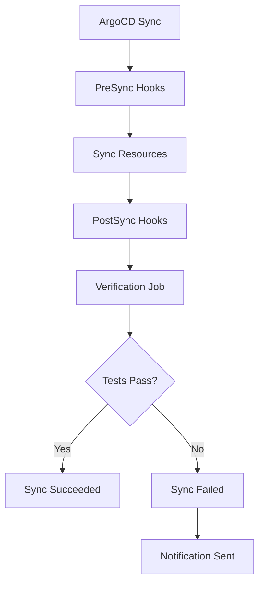

# How to Implement Custom Verification Scripts in ArgoCD

Author: [nawazdhandala](https://github.com/nawazdhandala)

Tags: ArgoCD, GitOps, Kubernetes, Verification Scripts, Testing

Description: Learn how to write and deploy custom verification scripts in ArgoCD using sync hooks to validate deployments with smoke tests and integration checks.

---

ArgoCD sync hooks give you a powerful mechanism to run arbitrary verification scripts before, during, and after deployments. While basic health checks confirm that pods are running, custom verification scripts can test actual application behavior - checking API responses, verifying data integrity, testing connectivity to dependencies, and confirming that business-critical flows work after a deployment.

## The Verification Script Architecture

Custom verification scripts run as Kubernetes Jobs that ArgoCD manages through hook annotations. They have access to the cluster network and can reach your services directly:



## Building a Verification Script Container

Create a dedicated verification container with the tools you need:

```dockerfile
# Dockerfile for verification scripts
FROM python:3.12-slim

RUN pip install requests pytest pyyaml

# Install kubectl for Kubernetes checks
RUN apt-get update && apt-get install -y curl jq && \
    curl -LO "https://dl.k8s.io/release/$(curl -L -s https://dl.k8s.io/release/stable.txt)/bin/linux/amd64/kubectl" && \
    chmod +x kubectl && mv kubectl /usr/local/bin/

COPY scripts/ /scripts/
WORKDIR /scripts

ENTRYPOINT ["python", "-m", "pytest"]
```

The verification scripts:

```python
# scripts/test_api_health.py
import requests
import os
import time

SERVICE_URL = os.environ.get("SERVICE_URL", "http://backend-api:8080")
EXPECTED_VERSION = os.environ.get("EXPECTED_VERSION", "")


def test_health_endpoint():
    """Verify the health endpoint returns 200."""
    response = requests.get(f"{SERVICE_URL}/healthz", timeout=10)
    assert response.status_code == 200, f"Health check failed: {response.status_code}"


def test_readiness():
    """Verify the service is ready to accept traffic."""
    response = requests.get(f"{SERVICE_URL}/readyz", timeout=10)
    assert response.status_code == 200, f"Readiness check failed: {response.status_code}"


def test_version_deployed():
    """Verify the expected version is deployed."""
    if not EXPECTED_VERSION:
        return  # Skip if no version specified

    response = requests.get(f"{SERVICE_URL}/api/v1/version", timeout=10)
    assert response.status_code == 200
    data = response.json()
    assert data["version"] == EXPECTED_VERSION, \
        f"Expected version {EXPECTED_VERSION}, got {data['version']}"


def test_database_connectivity():
    """Verify the service can connect to its database."""
    response = requests.get(f"{SERVICE_URL}/api/v1/status", timeout=10)
    assert response.status_code == 200
    data = response.json()
    assert data.get("database") == "connected", \
        f"Database connectivity issue: {data.get('database')}"


def test_critical_endpoint():
    """Verify a critical business endpoint works."""
    response = requests.get(
        f"{SERVICE_URL}/api/v1/products",
        params={"limit": 1},
        timeout=10
    )
    assert response.status_code == 200
    data = response.json()
    assert len(data.get("items", [])) > 0, "No products returned from critical endpoint"
```

## Deploying Verification as PostSync Hook

Wire the verification container into your ArgoCD manifests:

```yaml
# verification-job.yaml
apiVersion: batch/v1
kind: Job
metadata:
  name: post-deploy-verification
  annotations:
    argocd.argoproj.io/hook: PostSync
    argocd.argoproj.io/hook-delete-policy: BeforeHookCreation
spec:
  backoffLimit: 1
  activeDeadlineSeconds: 300  # 5-minute timeout
  template:
    metadata:
      labels:
        app: verification
    spec:
      serviceAccountName: verification-runner
      containers:
        - name: verify
          image: myorg/verification-scripts:latest
          args: ["-v", "--tb=short", "test_api_health.py"]
          env:
            - name: SERVICE_URL
              value: "http://backend-api.production.svc.cluster.local:8080"
            - name: EXPECTED_VERSION
              value: "v2.3.5"
          resources:
            requests:
              cpu: 100m
              memory: 128Mi
            limits:
              cpu: 500m
              memory: 256Mi
      restartPolicy: Never
```

The `hook-delete-policy: BeforeHookCreation` ensures the old verification Job is cleaned up before a new one runs. This avoids Job name conflicts on subsequent syncs.

## PreSync Verification: Checking Prerequisites

Some checks should run before the deployment starts:

```yaml
# pre-deploy-checks.yaml
apiVersion: batch/v1
kind: Job
metadata:
  name: pre-deploy-checks
  annotations:
    argocd.argoproj.io/hook: PreSync
    argocd.argoproj.io/hook-delete-policy: BeforeHookCreation
spec:
  backoffLimit: 0  # No retries for pre-checks
  activeDeadlineSeconds: 120
  template:
    spec:
      serviceAccountName: verification-runner
      containers:
        - name: precheck
          image: myorg/verification-scripts:latest
          command:
            - /bin/sh
            - -c
            - |
              echo "=== Pre-Deployment Checks ==="

              # Check if the target image exists in the registry
              echo "Checking image availability..."
              RESPONSE=$(curl -s -o /dev/null -w "%{http_code}" \
                "https://registry.example.com/v2/myorg/backend-api/manifests/v2.3.5" \
                -H "Accept: application/vnd.docker.distribution.manifest.v2+json")
              if [ "$RESPONSE" != "200" ]; then
                echo "FAILED: Image v2.3.5 not found in registry"
                exit 1
              fi
              echo "Image exists in registry"

              # Check database migration status
              echo "Checking database migration status..."
              MIGRATION_STATUS=$(curl -s http://backend-api:8080/api/v1/migrations/status)
              PENDING=$(echo "$MIGRATION_STATUS" | jq '.pending')
              if [ "$PENDING" != "0" ]; then
                echo "WARNING: $PENDING pending migrations detected"
                echo "Migrations should be applied before deployment"
              fi

              # Check cluster resource availability
              echo "Checking cluster resources..."
              NODES=$(kubectl get nodes --no-headers | wc -l)
              if [ "$NODES" -lt 3 ]; then
                echo "WARNING: Only $NODES nodes available (expected 3+)"
              fi

              echo "=== Pre-deployment checks passed ==="
      restartPolicy: Never
```

## SyncFail Hook: Cleanup on Failure

When verification fails, use a SyncFail hook to run cleanup or send detailed reports:

```yaml
apiVersion: batch/v1
kind: Job
metadata:
  name: verification-failure-report
  annotations:
    argocd.argoproj.io/hook: SyncFail
    argocd.argoproj.io/hook-delete-policy: BeforeHookCreation
spec:
  template:
    spec:
      containers:
        - name: reporter
          image: curlimages/curl:latest
          command:
            - /bin/sh
            - -c
            - |
              # Collect diagnostic information
              echo "=== Deployment Verification Failed ==="
              echo "Collecting diagnostic information..."

              # Get pod statuses
              kubectl get pods -n production -l app=backend-api -o wide

              # Get recent events
              kubectl get events -n production --sort-by=.lastTimestamp | tail -20

              # Get pod logs from the latest pod
              POD=$(kubectl get pods -n production -l app=backend-api \
                --sort-by=.metadata.creationTimestamp -o name | tail -1)
              if [ -n "$POD" ]; then
                echo "=== Recent logs from $POD ==="
                kubectl logs "$POD" -n production --tail=50
              fi

              # Send to Slack
              curl -X POST "$SLACK_WEBHOOK_URL" \
                -H "Content-Type: application/json" \
                -d "{\"text\":\"Deployment verification FAILED for backend-api in production. Check ArgoCD dashboard for details.\"}"
          env:
            - name: SLACK_WEBHOOK_URL
              valueFrom:
                secretKeyRef:
                  name: slack-webhook
                  key: url
      restartPolicy: Never
```

## Parameterized Verification Scripts

Make your verification scripts reusable across services by parameterizing them:

```yaml
# verification-configmap.yaml
apiVersion: v1
kind: ConfigMap
metadata:
  name: verification-config
data:
  config.yaml: |
    service:
      name: backend-api
      url: http://backend-api.production.svc.cluster.local:8080

    checks:
      - name: health
        endpoint: /healthz
        expected_status: 200

      - name: readiness
        endpoint: /readyz
        expected_status: 200

      - name: api_status
        endpoint: /api/v1/status
        expected_status: 200
        expected_body:
          database: connected
          cache: connected

      - name: critical_flow
        endpoint: /api/v1/products
        method: GET
        params:
          limit: 1
        expected_status: 200
        expected_body_check: "items_not_empty"
```

The verification script reads this config:

```python
# scripts/configurable_verify.py
import yaml
import requests
import sys
import os


def load_config():
    config_path = os.environ.get("CONFIG_PATH", "/config/config.yaml")
    with open(config_path) as f:
        return yaml.safe_load(f)


def run_checks(config):
    base_url = config["service"]["url"]
    failures = []

    for check in config["checks"]:
        name = check["name"]
        url = f"{base_url}{check['endpoint']}"
        method = check.get("method", "GET").upper()

        print(f"Running check: {name}")
        try:
            response = requests.request(
                method, url,
                params=check.get("params"),
                timeout=10
            )

            if response.status_code != check["expected_status"]:
                failures.append(
                    f"{name}: Expected status {check['expected_status']}, "
                    f"got {response.status_code}"
                )
                continue

            if "expected_body" in check:
                data = response.json()
                for key, value in check["expected_body"].items():
                    if data.get(key) != value:
                        failures.append(
                            f"{name}: Expected {key}={value}, got {data.get(key)}"
                        )

            print(f"  PASSED: {name}")
        except Exception as e:
            failures.append(f"{name}: Exception - {str(e)}")

    return failures


if __name__ == "__main__":
    config = load_config()
    failures = run_checks(config)

    if failures:
        print("\nFAILED CHECKS:")
        for f in failures:
            print(f"  - {f}")
        sys.exit(1)

    print("\nAll checks passed!")
```

Mount the ConfigMap in the verification Job:

```yaml
apiVersion: batch/v1
kind: Job
metadata:
  name: post-deploy-verification
  annotations:
    argocd.argoproj.io/hook: PostSync
    argocd.argoproj.io/hook-delete-policy: BeforeHookCreation
spec:
  template:
    spec:
      containers:
        - name: verify
          image: myorg/verification-scripts:latest
          command: ["python", "configurable_verify.py"]
          env:
            - name: CONFIG_PATH
              value: /config/config.yaml
          volumeMounts:
            - name: config
              mountPath: /config
      volumes:
        - name: config
          configMap:
            name: verification-config
      restartPolicy: Never
```

## Summary

Custom verification scripts extend ArgoCD's deployment validation beyond basic health checks. Build dedicated verification containers with your testing tools, deploy them as PostSync hooks for post-deployment validation and PreSync hooks for prerequisite checks. Use SyncFail hooks to collect diagnostics when verification fails. Parameterize your scripts with ConfigMaps so the same verification container works across multiple services. The key is making verification automatic and reliable so every deployment is tested before it is considered complete.
