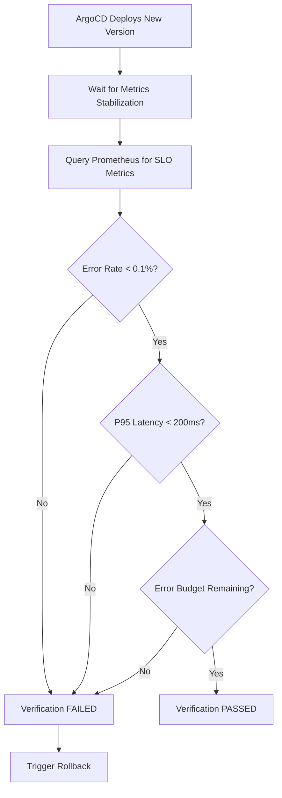

# How to Implement SLO-Based Deployment Verification

Author: [nawazdhandala](https://github.com/nawazdhandala)

Tags: ArgoCD, GitOps, Kubernetes, SLO, Observability

Description: Learn how to use SLO metrics to automatically verify ArgoCD deployments by checking error budgets and latency targets after each rollout.

---

SLO-based deployment verification takes a fundamentally different approach from traditional health checks. Instead of asking "are the pods running?", you ask "is the service meeting its reliability targets?". A deployment might have all pods healthy but still be degrading user experience due to increased latency or elevated error rates. SLO verification catches these subtle regressions that container-level health checks miss.

## What SLO Verification Looks Like

An SLO (Service Level Objective) defines what "good" looks like for your service. Common SLOs include:

- **Availability**: 99.9% of requests return non-5xx responses
- **Latency**: 95% of requests complete within 200ms
- **Error rate**: Less than 0.1% of requests return errors

After a deployment, SLO verification checks whether the service still meets these targets:



## Setting Up Prometheus Metrics

Your services need to expose metrics that Prometheus scrapes. The standard approach uses the RED method (Rate, Errors, Duration):

```yaml
# ServiceMonitor for Prometheus scraping
apiVersion: monitoring.coreos.com/v1
kind: ServiceMonitor
metadata:
  name: backend-api
  namespace: production
spec:
  selector:
    matchLabels:
      app: backend-api
  endpoints:
    - port: http
      interval: 15s
      path: /metrics
```

Your application should expose these standard metrics:

```text
# Request rate
http_requests_total{method="GET", path="/api/v1/products", status="200"} 15234

# Request duration histogram
http_request_duration_seconds_bucket{method="GET", path="/api/v1/products", le="0.05"} 14500
http_request_duration_seconds_bucket{method="GET", path="/api/v1/products", le="0.1"} 14800
http_request_duration_seconds_bucket{method="GET", path="/api/v1/products", le="0.2"} 15100
http_request_duration_seconds_bucket{method="GET", path="/api/v1/products", le="0.5"} 15200
http_request_duration_seconds_bucket{method="GET", path="/api/v1/products", le="+Inf"} 15234
```

## The SLO Verification Job

Create a PostSync hook that queries Prometheus and evaluates SLOs:

```yaml
apiVersion: batch/v1
kind: Job
metadata:
  name: slo-verification
  annotations:
    argocd.argoproj.io/hook: PostSync
    argocd.argoproj.io/hook-delete-policy: BeforeHookCreation
spec:
  backoffLimit: 0
  activeDeadlineSeconds: 600  # 10-minute timeout
  template:
    spec:
      containers:
        - name: slo-check
          image: curlimages/curl:latest
          command:
            - /bin/sh
            - -c
            - |
              PROMETHEUS="http://prometheus.monitoring.svc.cluster.local:9090"
              SERVICE="backend-api"
              NAMESPACE="production"

              # Wait for new pods to receive traffic and generate metrics
              echo "Waiting 120 seconds for metrics to stabilize..."
              sleep 120

              echo "=== SLO Verification for $SERVICE ==="

              # Check 1: Error Rate SLO (target: < 0.1%)
              echo "Checking error rate..."
              ERROR_RATE=$(curl -s "$PROMETHEUS/api/v1/query" \
                --data-urlencode "query=sum(rate(http_requests_total{service=\"$SERVICE\",namespace=\"$NAMESPACE\",code=~\"5..\"}[5m])) / sum(rate(http_requests_total{service=\"$SERVICE\",namespace=\"$NAMESPACE\"}[5m])) * 100" \
                | jq -r '.data.result[0].value[1] // "0"')

              echo "Error rate: ${ERROR_RATE}%"
              ERROR_THRESHOLD="0.1"
              if [ "$(echo "$ERROR_RATE > $ERROR_THRESHOLD" | bc -l 2>/dev/null || echo "0")" = "1" ]; then
                echo "FAILED: Error rate ${ERROR_RATE}% exceeds SLO threshold of ${ERROR_THRESHOLD}%"
                exit 1
              fi
              echo "PASSED: Error rate within SLO"

              # Check 2: Latency SLO (target: P95 < 200ms)
              echo "Checking P95 latency..."
              P95_LATENCY=$(curl -s "$PROMETHEUS/api/v1/query" \
                --data-urlencode "query=histogram_quantile(0.95, sum(rate(http_request_duration_seconds_bucket{service=\"$SERVICE\",namespace=\"$NAMESPACE\"}[5m])) by (le))" \
                | jq -r '.data.result[0].value[1] // "0"')

              echo "P95 latency: ${P95_LATENCY}s"
              LATENCY_THRESHOLD="0.2"
              if [ "$(echo "$P95_LATENCY > $LATENCY_THRESHOLD" | bc -l 2>/dev/null || echo "0")" = "1" ]; then
                echo "FAILED: P95 latency ${P95_LATENCY}s exceeds SLO threshold of ${LATENCY_THRESHOLD}s"
                exit 1
              fi
              echo "PASSED: Latency within SLO"

              # Check 3: Error Budget (target: > 0%)
              echo "Checking error budget..."
              # Calculate error budget consumption for the current 30-day window
              ERROR_BUDGET_CONSUMED=$(curl -s "$PROMETHEUS/api/v1/query" \
                --data-urlencode "query=1 - (sum(increase(http_requests_total{service=\"$SERVICE\",namespace=\"$NAMESPACE\",code!~\"5..\"}[30d])) / sum(increase(http_requests_total{service=\"$SERVICE\",namespace=\"$NAMESPACE\"}[30d])))" \
                | jq -r '.data.result[0].value[1] // "0"')

              BUDGET_TARGET="0.001"  # 0.1% error budget (99.9% SLO)
              REMAINING=$(echo "$BUDGET_TARGET - $ERROR_BUDGET_CONSUMED" | bc -l 2>/dev/null || echo "0")
              echo "Error budget remaining: $REMAINING"

              if [ "$(echo "$REMAINING < 0" | bc -l 2>/dev/null || echo "0")" = "1" ]; then
                echo "FAILED: Error budget exhausted"
                exit 1
              fi
              echo "PASSED: Error budget available"

              echo ""
              echo "=== All SLO checks passed ==="
      restartPolicy: Never
```

## Python-Based SLO Verification

For more sophisticated SLO checks, use a Python script:

```python
# slo_verify.py
import requests
import sys
import time
import os

PROMETHEUS_URL = os.environ.get(
    "PROMETHEUS_URL",
    "http://prometheus.monitoring.svc.cluster.local:9090"
)
SERVICE = os.environ.get("SERVICE_NAME", "backend-api")
NAMESPACE = os.environ.get("NAMESPACE", "production")
STABILIZATION_SECONDS = int(os.environ.get("STABILIZATION_SECONDS", "120"))


class SLOChecker:
    def __init__(self, prometheus_url, service, namespace):
        self.prometheus_url = prometheus_url
        self.service = service
        self.namespace = namespace

    def query(self, promql):
        """Execute a PromQL query and return the result value."""
        response = requests.get(
            f"{self.prometheus_url}/api/v1/query",
            params={"query": promql},
            timeout=30
        )
        response.raise_for_status()
        data = response.json()

        if data["status"] != "success":
            raise Exception(f"Prometheus query failed: {data}")

        results = data["data"]["result"]
        if not results:
            return None

        return float(results[0]["value"][1])

    def check_error_rate(self, threshold=0.001, window="5m"):
        """Check that error rate is below threshold."""
        error_rate = self.query(
            f'sum(rate(http_requests_total{{'
            f'service="{self.service}",'
            f'namespace="{self.namespace}",'
            f'code=~"5.."}}[{window}])) / '
            f'sum(rate(http_requests_total{{'
            f'service="{self.service}",'
            f'namespace="{self.namespace}"}}[{window}]))'
        )

        if error_rate is None:
            print("  WARNING: No error rate data available")
            return True  # No data means no errors

        print(f"  Error rate: {error_rate:.4%} (threshold: {threshold:.4%})")
        return error_rate <= threshold

    def check_latency(self, percentile=0.95, threshold_seconds=0.2, window="5m"):
        """Check that latency percentile is below threshold."""
        latency = self.query(
            f'histogram_quantile({percentile}, '
            f'sum(rate(http_request_duration_seconds_bucket{{'
            f'service="{self.service}",'
            f'namespace="{self.namespace}"}}[{window}])) by (le))'
        )

        if latency is None:
            print("  WARNING: No latency data available")
            return True

        print(f"  P{int(percentile*100)} latency: {latency*1000:.1f}ms "
              f"(threshold: {threshold_seconds*1000:.1f}ms)")
        return latency <= threshold_seconds

    def check_availability(self, threshold=0.999, window="5m"):
        """Check that availability is above threshold."""
        availability = self.query(
            f'sum(rate(http_requests_total{{'
            f'service="{self.service}",'
            f'namespace="{self.namespace}",'
            f'code!~"5.."}}[{window}])) / '
            f'sum(rate(http_requests_total{{'
            f'service="{self.service}",'
            f'namespace="{self.namespace}"}}[{window}]))'
        )

        if availability is None:
            print("  WARNING: No availability data available")
            return True

        print(f"  Availability: {availability:.4%} (threshold: {threshold:.4%})")
        return availability >= threshold

    def check_traffic_volume(self, min_rps=1.0, window="5m"):
        """Ensure there is enough traffic to make SLO checks meaningful."""
        rps = self.query(
            f'sum(rate(http_requests_total{{'
            f'service="{self.service}",'
            f'namespace="{self.namespace}"}}[{window}]))'
        )

        if rps is None or rps < min_rps:
            print(f"  WARNING: Traffic too low ({rps or 0:.2f} rps) "
                  f"for meaningful SLO verification")
            return False

        print(f"  Traffic: {rps:.2f} rps (minimum: {min_rps:.2f} rps)")
        return True


def main():
    checker = SLOChecker(PROMETHEUS_URL, SERVICE, NAMESPACE)

    print(f"Waiting {STABILIZATION_SECONDS}s for metrics to stabilize...")
    time.sleep(STABILIZATION_SECONDS)

    print(f"\nSLO Verification for {SERVICE} in {NAMESPACE}")
    print("=" * 50)

    failures = []

    # Check traffic volume first
    print("\n[Traffic Volume]")
    has_traffic = checker.check_traffic_volume(min_rps=1.0)

    if not has_traffic:
        print("\nInsufficient traffic for SLO verification - SKIPPING")
        print("This may indicate a routing issue")
        sys.exit(0)

    # Error rate check
    print("\n[Error Rate SLO]")
    if not checker.check_error_rate(threshold=0.001):
        failures.append("Error rate exceeds SLO")

    # Latency check
    print("\n[Latency SLO]")
    if not checker.check_latency(percentile=0.95, threshold_seconds=0.2):
        failures.append("P95 latency exceeds SLO")

    # Availability check
    print("\n[Availability SLO]")
    if not checker.check_availability(threshold=0.999):
        failures.append("Availability below SLO")

    print("\n" + "=" * 50)
    if failures:
        print("VERIFICATION FAILED:")
        for f in failures:
            print(f"  - {f}")
        sys.exit(1)
    else:
        print("All SLO checks PASSED")


if __name__ == "__main__":
    main()
```

## Comparing Pre and Post Deployment Metrics

A more sophisticated approach compares metrics before and after deployment to detect regressions:

```yaml
apiVersion: batch/v1
kind: Job
metadata:
  name: slo-comparison
  annotations:
    argocd.argoproj.io/hook: PostSync
    argocd.argoproj.io/hook-delete-policy: BeforeHookCreation
spec:
  template:
    spec:
      containers:
        - name: compare
          image: curlimages/curl:latest
          command:
            - /bin/sh
            - -c
            - |
              PROMETHEUS="http://prometheus.monitoring.svc.cluster.local:9090"
              SERVICE="backend-api"

              # Wait for post-deploy metrics
              sleep 120

              # Get pre-deployment error rate (from 1 hour before deployment)
              PRE_ERROR=$(curl -s "$PROMETHEUS/api/v1/query" \
                --data-urlencode "query=sum(rate(http_requests_total{service=\"$SERVICE\",code=~\"5..\"}[5m] offset 1h)) / sum(rate(http_requests_total{service=\"$SERVICE\"}[5m] offset 1h))" \
                | jq -r '.data.result[0].value[1] // "0"')

              # Get post-deployment error rate
              POST_ERROR=$(curl -s "$PROMETHEUS/api/v1/query" \
                --data-urlencode "query=sum(rate(http_requests_total{service=\"$SERVICE\",code=~\"5..\"}[5m])) / sum(rate(http_requests_total{service=\"$SERVICE\"}[5m]))" \
                | jq -r '.data.result[0].value[1] // "0"')

              echo "Pre-deployment error rate: $PRE_ERROR"
              echo "Post-deployment error rate: $POST_ERROR"

              # Fail if error rate increased by more than 2x
              if [ "$(echo "$POST_ERROR > ($PRE_ERROR * 2 + 0.001)" | bc -l)" = "1" ]; then
                echo "FAILED: Error rate increased significantly after deployment"
                echo "Pre: $PRE_ERROR, Post: $POST_ERROR"
                exit 1
              fi

              echo "Error rate comparison: PASSED"
      restartPolicy: Never
```

## Integrating with Error Budget Policies

For mature SLO practices, gate deployments on error budget availability. If the error budget is already exhausted, block new deployments:

```yaml
apiVersion: batch/v1
kind: Job
metadata:
  name: error-budget-gate
  annotations:
    argocd.argoproj.io/hook: PreSync
    argocd.argoproj.io/hook-delete-policy: BeforeHookCreation
spec:
  template:
    spec:
      containers:
        - name: budget-check
          image: curlimages/curl:latest
          command:
            - /bin/sh
            - -c
            - |
              PROMETHEUS="http://prometheus.monitoring.svc.cluster.local:9090"

              # Check 30-day error budget
              BUDGET_REMAINING=$(curl -s "$PROMETHEUS/api/v1/query" \
                --data-urlencode "query=(0.001 - (1 - sum(increase(http_requests_total{service=\"backend-api\",code!~\"5..\"}[30d])) / sum(increase(http_requests_total{service=\"backend-api\"}[30d])))) / 0.001 * 100" \
                | jq -r '.data.result[0].value[1] // "100"')

              echo "Error budget remaining: ${BUDGET_REMAINING}%"

              if [ "$(echo "$BUDGET_REMAINING < 10" | bc -l)" = "1" ]; then
                echo "BLOCKED: Error budget is below 10%"
                echo "This deployment requires manual approval when error budget is low"
                exit 1
              fi

              echo "Error budget gate: PASSED"
      restartPolicy: Never
```

## Summary

SLO-based deployment verification ensures that deployments not only succeed technically but also maintain the reliability your users expect. Query Prometheus after deployments to check error rates, latency percentiles, and availability against defined thresholds. Compare pre and post deployment metrics to catch regressions. Gate deployments on error budget availability to prevent deploying when reliability is already compromised. The combination of traditional health checks and SLO verification gives you full confidence that a deployment is truly successful from both an infrastructure and user experience perspective.
