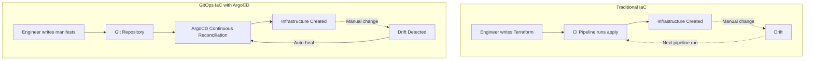

# How to Implement Infrastructure as Code with ArgoCD

Author: [nawazdhandala](https://github.com/nawazdhandala)

Tags: ArgoCD, GitOps, Kubernetes, Infrastructure as Code, Crossplane

Description: Learn how to implement infrastructure as code through ArgoCD using Crossplane, Terraform Operator, and Kubernetes-native tools for a unified GitOps-driven infrastructure management workflow.

---

Infrastructure as Code (IaC) has been around for years with tools like Terraform, Pulumi, and CloudFormation. But the traditional IaC workflow - where an engineer runs `terraform apply` from their laptop or a CI pipeline - has a fundamental gap: there is no continuous reconciliation. If someone changes a resource manually, your infrastructure drifts from the declared state, and nothing fixes it until the next pipeline run.

ArgoCD changes this by applying the same continuous reconciliation model from application deployments to infrastructure management. Define your infrastructure in Git, and ArgoCD ensures reality matches the declaration at all times.

## The IaC-GitOps Architecture

Traditional IaC is imperative at the execution level - you run a command, it makes changes. GitOps IaC is declarative all the way through:



## Approach 1: Crossplane - Kubernetes-Native IaC

Crossplane is the most natural fit for ArgoCD because it represents infrastructure as Kubernetes custom resources. ArgoCD manages them the same way it manages any other Kubernetes resource.

### Setting Up Crossplane with ArgoCD

Deploy Crossplane as an ArgoCD Application:

```yaml
apiVersion: argoproj.io/v1alpha1
kind: Application
metadata:
  name: crossplane
  namespace: argocd
spec:
  project: infrastructure
  source:
    repoURL: https://charts.crossplane.io/stable
    chart: crossplane
    targetRevision: 1.14.5
    helm:
      values: |
        replicas: 2
        resourcesCrossplane:
          requests:
            cpu: 100m
            memory: 256Mi
  destination:
    server: https://kubernetes.default.svc
    namespace: crossplane-system
  syncPolicy:
    automated:
      prune: true
      selfHeal: true
    syncOptions:
      - CreateNamespace=true
```

Then manage providers and infrastructure through additional Applications:

```yaml
# Provider installation
apiVersion: argoproj.io/v1alpha1
kind: Application
metadata:
  name: crossplane-providers
  namespace: argocd
  annotations:
    argocd.argoproj.io/sync-wave: "1"
spec:
  project: infrastructure
  source:
    repoURL: https://github.com/myorg/gitops.git
    path: crossplane/providers
  destination:
    server: https://kubernetes.default.svc

---
# Infrastructure resources
apiVersion: argoproj.io/v1alpha1
kind: Application
metadata:
  name: cloud-infrastructure
  namespace: argocd
  annotations:
    argocd.argoproj.io/sync-wave: "2"
spec:
  project: infrastructure
  source:
    repoURL: https://github.com/myorg/gitops.git
    path: crossplane/resources
  destination:
    server: https://kubernetes.default.svc
  syncPolicy:
    automated:
      prune: false
      selfHeal: true
```

### Crossplane Compositions for Abstraction

Create platform-level abstractions that hide cloud provider complexity:

```yaml
# Define a "DatabaseClaim" API
apiVersion: apiextensions.crossplane.io/v1
kind: CompositeResourceDefinition
metadata:
  name: xdatabases.platform.myorg.io
spec:
  group: platform.myorg.io
  names:
    kind: XDatabase
    plural: xdatabases
  claimNames:
    kind: Database
    plural: databases
  versions:
    - name: v1
      served: true
      referenceable: true
      schema:
        openAPIV3Schema:
          type: object
          properties:
            spec:
              type: object
              properties:
                size:
                  type: string
                  enum: [small, medium, large]
                engine:
                  type: string
                  enum: [postgres, mysql]
                region:
                  type: string
              required: [size, engine]
            status:
              type: object
              properties:
                connectionSecret:
                  type: string
```

Teams request infrastructure through simple claims:

```yaml
# This is all a developer needs to write
apiVersion: platform.myorg.io/v1
kind: Database
metadata:
  name: orders-db
  namespace: orders
spec:
  size: medium
  engine: postgres
  region: us-east-1
```

## Approach 2: Terraform Operator

If you have existing Terraform modules, the Terraform Operator for Kubernetes lets you run Terraform through ArgoCD:

```yaml
# Install tf-controller
apiVersion: argoproj.io/v1alpha1
kind: Application
metadata:
  name: tf-controller
  namespace: argocd
spec:
  project: infrastructure
  source:
    repoURL: https://weaveworks.github.io/tf-controller
    chart: tf-controller
    targetRevision: 0.16.0
  destination:
    server: https://kubernetes.default.svc
    namespace: flux-system
  syncPolicy:
    automated:
      prune: true
      selfHeal: true
    syncOptions:
      - CreateNamespace=true
```

Define Terraform runs as Kubernetes resources:

```yaml
apiVersion: infra.contrib.fluxcd.io/v1alpha2
kind: Terraform
metadata:
  name: vpc
  namespace: terraform
spec:
  path: ./modules/vpc
  sourceRef:
    kind: GitRepository
    name: infra-repo
    namespace: terraform
  interval: 10m
  approvePlan: auto
  vars:
    - name: environment
      value: production
    - name: region
      value: us-east-1
    - name: vpc_cidr
      value: "10.0.0.0/16"
  varsFrom:
    - kind: Secret
      name: terraform-vars
  writeOutputsToSecret:
    name: vpc-outputs
```

ArgoCD manages the Terraform resource, which triggers the tf-controller to run `terraform plan` and `terraform apply`.

## Approach 3: Config Connector (GCP)

For GCP-only environments, Config Connector provides Kubernetes-native GCP resource management:

```yaml
apiVersion: sql.cnrm.cloud.google.com/v1beta1
kind: SQLInstance
metadata:
  name: app-database
  namespace: config-connector
  annotations:
    cnrm.cloud.google.com/project-id: my-project
spec:
  databaseVersion: POSTGRES_15
  region: us-central1
  settings:
    tier: db-custom-2-8192
    availabilityType: REGIONAL
    backupConfiguration:
      enabled: true
      startTime: "03:00"
```

## Organizing Your Infrastructure Repository

A well-organized GitOps repository separates concerns:

```text
gitops-repo/
  infrastructure/
    crossplane/
      providers/           # Cloud provider installations
        aws-provider.yaml
        gcp-provider.yaml
      compositions/        # Platform abstractions
        database.yaml
        cache.yaml
        storage.yaml
      provider-configs/    # Authentication configs
        aws-config.yaml
    shared/
      cert-manager/       # Cluster services
      ingress-nginx/
      monitoring/
      external-secrets/
  environments/
    staging/
      resources/          # Environment-specific infra
        database.yaml
        cache.yaml
    production/
      resources/
        database.yaml
        cache.yaml
  apps/
    api-service/
    frontend/
    worker/
```

## Multi-Environment Infrastructure

Use ApplicationSets to manage infrastructure across environments:

```yaml
apiVersion: argoproj.io/v1alpha1
kind: ApplicationSet
metadata:
  name: infrastructure
  namespace: argocd
spec:
  generators:
    - list:
        elements:
          - environment: staging
            cluster: staging-cluster
            path: environments/staging/resources
          - environment: production
            cluster: production-cluster
            path: environments/production/resources
  template:
    metadata:
      name: "infra-{{environment}}"
    spec:
      project: infrastructure
      source:
        repoURL: https://github.com/myorg/gitops.git
        targetRevision: main
        path: "{{path}}"
      destination:
        server: "{{cluster}}"
      syncPolicy:
        automated:
          prune: false
          selfHeal: true
```

## Drift Detection and Self-Healing

One of the biggest advantages of IaC through ArgoCD is automatic drift detection and remediation:

```yaml
syncPolicy:
  automated:
    selfHeal: true  # Fix drift automatically
    prune: false    # Do NOT auto-delete (safety for infra)
```

ArgoCD checks for drift on a configurable interval (default 3 minutes). When it detects that the live state does not match the desired state in Git, it automatically reapplies the correct configuration.

For infrastructure resources, set `prune: false` to prevent accidental deletion. If someone removes a database manifest from Git, you do not want ArgoCD to delete the database.

## Monitoring Infrastructure State

Track your infrastructure health through ArgoCD and monitoring:

```bash
# Check all infrastructure applications
argocd app list --project infrastructure

# Get sync status
argocd app get cloud-infrastructure

# Check for out-of-sync resources
argocd app diff cloud-infrastructure
```

Use OneUptime to monitor the health and availability of your infrastructure resources and correlate infrastructure changes with application performance metrics.

For detailed guides on managing specific cloud providers, see our posts on [AWS resources with Crossplane and ArgoCD](https://oneuptime.com/blog/post/2026-02-26-crossplane-argocd-aws-resources/view), [GCP resources with Crossplane and ArgoCD](https://oneuptime.com/blog/post/2026-02-26-crossplane-argocd-gcp-resources/view), and [Azure resources with Crossplane and ArgoCD](https://oneuptime.com/blog/post/2026-02-26-crossplane-argocd-azure-resources/view).

## Best Practices

1. **Separate infrastructure from applications** - Use different ArgoCD Projects and potentially different repositories.
2. **Disable auto-prune for infrastructure** - Accidental deletion of databases is catastrophic. Use `prune: false`.
3. **Use Compositions for abstraction** - Do not expose raw cloud provider APIs to application teams.
4. **Implement approval workflows** - Use PR-based reviews for infrastructure changes with mandatory approvals.
5. **Track costs** - Tag all resources and monitor cloud spending through your cost management tools.
6. **Start small** - Begin with non-critical resources (storage, DNS) before moving to databases and networking.
7. **Keep secrets out of Git** - Use External Secrets Operator or Sealed Secrets for credentials.
8. **Document dependencies** - Infrastructure dependency graphs should be documented and maintained.

Infrastructure as Code through ArgoCD gives you the best of both worlds: the declarative power of IaC tools with the continuous reconciliation of GitOps. Your infrastructure self-heals, drift is detected automatically, and every change goes through code review.
