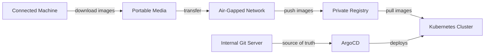

# How to Install ArgoCD in an Air-Gapped Environment

Author: [nawazdhandala](https://github.com/nawazdhandala)

Tags: ArgoCD, GitOps, Kubernetes, Security

Description: A practical guide to installing ArgoCD in air-gapped Kubernetes environments where nodes have no internet access, covering image mirroring and offline setup.

---

Air-gapped environments are common in government, defense, financial services, and healthcare where regulations prevent production clusters from accessing the internet. Installing ArgoCD in these environments requires extra preparation because you need to pre-download container images, manifests, and Helm charts, then transfer them to the isolated network.

This guide walks through the complete process of preparing ArgoCD for offline installation, mirroring images to a private registry, modifying manifests, and running a fully functional ArgoCD in a network with zero internet access.

## Understanding the Challenge

A standard ArgoCD installation pulls images from public registries like `quay.io` and `ghcr.io`. In an air-gapped cluster, these registries are unreachable. You need to:

1. Download all container images on a connected machine
2. Transfer images to the air-gapped network
3. Push images to a private registry inside the air-gapped network
4. Modify ArgoCD manifests to reference the private registry
5. Serve Git repositories from an internal Git server



## Step 1: Download ArgoCD Manifests

On a machine with internet access, download the ArgoCD installation manifests.

```bash
# Download the specific version you want to install
ARGOCD_VERSION=v2.13.3

# Download the install manifest
curl -L -o argocd-install.yaml \
  https://raw.githubusercontent.com/argoproj/argo-cd/${ARGOCD_VERSION}/manifests/install.yaml

# Download the HA install manifest if you need high availability
curl -L -o argocd-ha-install.yaml \
  https://raw.githubusercontent.com/argoproj/argo-cd/${ARGOCD_VERSION}/manifests/ha/install.yaml
```

## Step 2: Identify Required Images

Extract all container images from the manifests.

```bash
# List all images referenced in the manifest
grep -E "image:" argocd-install.yaml | sort -u | awk '{print $2}'
```

The typical images for ArgoCD v2.13.x are:

```text
quay.io/argoproj/argocd:v2.13.3
ghcr.io/dexidp/dex:v2.38.0
redis:7.0.15-alpine
```

## Step 3: Pull and Save Images

On the connected machine, pull each image and save them to tar files.

```bash
# Pull all required images
docker pull quay.io/argoproj/argocd:v2.13.3
docker pull ghcr.io/dexidp/dex:v2.38.0
docker pull redis:7.0.15-alpine

# Save images to tar files
docker save quay.io/argoproj/argocd:v2.13.3 -o argocd.tar
docker save ghcr.io/dexidp/dex:v2.38.0 -o dex.tar
docker save redis:7.0.15-alpine -o redis.tar
```

Alternatively, bundle everything into a single archive.

```bash
# Save all images into one tar
docker save \
  quay.io/argoproj/argocd:v2.13.3 \
  ghcr.io/dexidp/dex:v2.38.0 \
  redis:7.0.15-alpine \
  -o argocd-images.tar

# Compress it for transfer
gzip argocd-images.tar
```

## Step 4: Download the ArgoCD CLI

Download the CLI binary for transfer.

```bash
# Download the CLI for Linux
curl -L -o argocd-cli \
  https://github.com/argoproj/argo-cd/releases/download/${ARGOCD_VERSION}/argocd-linux-amd64
chmod +x argocd-cli
```

## Step 5: Transfer to Air-Gapped Network

Copy everything to portable media (USB drive, secure file transfer, or whatever your organization allows).

Files to transfer:
- `argocd-install.yaml` (or `argocd-ha-install.yaml`)
- `argocd-images.tar.gz`
- `argocd-cli`

## Step 6: Load Images into Private Registry

On a machine inside the air-gapped network that can access your private registry, load and push the images.

```bash
# Load the images into local Docker
docker load -i argocd-images.tar.gz

# Tag images for your private registry
PRIVATE_REGISTRY=registry.internal.example.com

docker tag quay.io/argoproj/argocd:v2.13.3 \
  ${PRIVATE_REGISTRY}/argoproj/argocd:v2.13.3

docker tag ghcr.io/dexidp/dex:v2.38.0 \
  ${PRIVATE_REGISTRY}/dexidp/dex:v2.38.0

docker tag redis:7.0.15-alpine \
  ${PRIVATE_REGISTRY}/library/redis:7.0.15-alpine

# Push to private registry
docker push ${PRIVATE_REGISTRY}/argoproj/argocd:v2.13.3
docker push ${PRIVATE_REGISTRY}/dexidp/dex:v2.38.0
docker push ${PRIVATE_REGISTRY}/library/redis:7.0.15-alpine
```

## Step 7: Modify ArgoCD Manifests

Update the installation manifest to reference your private registry.

```bash
# Replace all image references
PRIVATE_REGISTRY=registry.internal.example.com

sed -i "s|quay.io/argoproj/argocd|${PRIVATE_REGISTRY}/argoproj/argocd|g" argocd-install.yaml
sed -i "s|ghcr.io/dexidp/dex|${PRIVATE_REGISTRY}/dexidp/dex|g" argocd-install.yaml
sed -i "s|redis:7.0.15-alpine|${PRIVATE_REGISTRY}/library/redis:7.0.15-alpine|g" argocd-install.yaml
```

Verify the changes.

```bash
# Confirm all images point to the private registry
grep -E "image:" argocd-install.yaml
```

## Step 8: Install ArgoCD

Apply the modified manifests to your air-gapped cluster.

```bash
# Create the namespace
kubectl create namespace argocd

# Install ArgoCD with modified manifests
kubectl apply -n argocd -f argocd-install.yaml

# Watch pods come up
kubectl get pods -n argocd -w
```

All pods should pull images from your private registry and start successfully.

## Step 9: Configure Internal Git Repository

In an air-gapped environment, ArgoCD cannot reach GitHub or GitLab. You need an internal Git server like Gitea, GitLab CE, or a bare Git server.

```bash
# Add your internal Git repository to ArgoCD
argocd repo add https://git.internal.example.com/team/app-manifests.git \
  --username git-user \
  --password <token>
```

Or configure via a Kubernetes Secret.

```yaml
# internal-repo-secret.yaml
apiVersion: v1
kind: Secret
metadata:
  name: internal-repo
  namespace: argocd
  labels:
    argocd.argoproj.io/secret-type: repository
type: Opaque
stringData:
  type: git
  url: https://git.internal.example.com/team/app-manifests.git
  username: git-user
  password: <token>
```

```bash
kubectl apply -f internal-repo-secret.yaml
```

## Step 10: Configure Helm Repository for Air-Gapped Charts

If you use Helm charts, you need a private Helm repository as well.

```bash
# Add a private Helm repository
argocd repo add https://charts.internal.example.com \
  --type helm \
  --name internal-charts
```

For ChartMuseum as your private Helm repo:

```bash
# Push charts to ChartMuseum
curl --data-binary "@my-chart-0.1.0.tgz" \
  https://charts.internal.example.com/api/charts
```

## Handling ArgoCD Updates in Air-Gapped Environments

When it is time to update ArgoCD, repeat the process:

1. Download new version manifests and images on the connected machine
2. Transfer to the air-gapped network
3. Push new images to the private registry
4. Update the manifests with private registry references
5. Apply the updated manifests

```bash
# Create a script to automate manifest patching
#!/bin/bash
PRIVATE_REGISTRY=$1
MANIFEST=$2

sed -i "s|quay.io/argoproj/argocd|${PRIVATE_REGISTRY}/argoproj/argocd|g" ${MANIFEST}
sed -i "s|ghcr.io/dexidp/dex|${PRIVATE_REGISTRY}/dexidp/dex|g" ${MANIFEST}
sed -i "s|redis:|${PRIVATE_REGISTRY}/library/redis:|g" ${MANIFEST}

echo "Patched ${MANIFEST} to use ${PRIVATE_REGISTRY}"
```

## Using Skopeo for Image Mirroring

If Docker is not available, use Skopeo to copy images without a Docker daemon.

```bash
# Copy images directly between registries (on connected machine)
skopeo copy \
  docker://quay.io/argoproj/argocd:v2.13.3 \
  docker-archive:/tmp/argocd.tar

# On the air-gapped side, load into the private registry
skopeo copy \
  docker-archive:/tmp/argocd.tar \
  docker://${PRIVATE_REGISTRY}/argoproj/argocd:v2.13.3
```

## Troubleshooting

### ImagePullBackOff Errors

This means the images are not in your private registry or the cluster cannot reach it.

```bash
# Check which image is failing
kubectl describe pod <pod-name> -n argocd | grep -A5 "Events"

# Verify the image exists in your registry
curl -s https://${PRIVATE_REGISTRY}/v2/argoproj/argocd/tags/list
```

### TLS Certificate Issues with Private Registry

If your private registry uses a self-signed certificate, configure containerd or Docker on each node to trust it.

```bash
# For containerd, add the CA cert
sudo mkdir -p /etc/containerd/certs.d/${PRIVATE_REGISTRY}
sudo cp ca.crt /etc/containerd/certs.d/${PRIVATE_REGISTRY}/ca.crt
sudo systemctl restart containerd
```

### Git Repository Connection Failures

Make sure ArgoCD can resolve the internal Git server hostname.

```bash
# Check DNS resolution from the ArgoCD repo-server pod
kubectl exec -n argocd deployment/argocd-repo-server -- \
  nslookup git.internal.example.com
```

## Further Reading

- Upgrade ArgoCD safely: [Upgrade ArgoCD without downtime](https://oneuptime.com/blog/post/2026-02-26-upgrade-argocd-without-downtime/view)
- Configure private repositories: [ArgoCD private repos](https://oneuptime.com/blog/post/2026-01-25-private-git-repositories-argocd/view)
- Set up high availability: [ArgoCD HA](https://oneuptime.com/blog/post/2026-02-02-argocd-high-availability/view)

Air-gapped ArgoCD installations take more upfront effort, but once set up, the GitOps workflow works exactly the same as in connected environments. The key is having a reliable process for mirroring images and keeping your internal Git and Helm repositories up to date.
