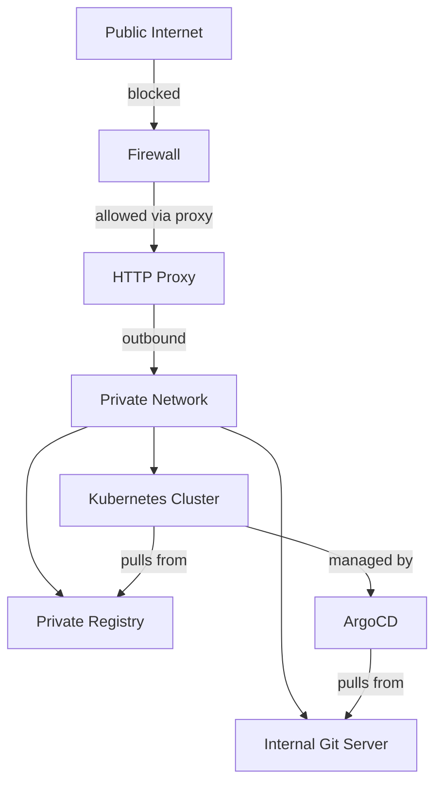

# How to Install ArgoCD in a Private Network Without Internet Access

Author: [nawazdhandala](https://github.com/nawazdhandala)

Tags: ArgoCD, GitOps, Kubernetes, Networking

Description: Learn how to install and configure ArgoCD in a private network environment where Kubernetes nodes cannot access the public internet directly.

---

Private networks differ from fully air-gapped environments. In a private network, your Kubernetes cluster sits behind a firewall with no direct internet access, but you may have a proxy server, a bastion host, or a DMZ that bridges the gap. This is common in enterprise data centers, regulated industries, and cloud VPCs configured with strict egress rules.

This guide focuses on installing ArgoCD when your cluster nodes cannot pull images from public registries directly, but you have some path to the outside world through a proxy or a jumpbox.

## Understanding Your Network Topology

Before installing anything, map out your network constraints. Ask these questions:

- Can nodes reach an HTTP/HTTPS proxy?
- Is there a private container registry already in the network?
- Can pods resolve external DNS, or is DNS restricted?
- Is there a bastion host with internet access?
- Are there firewall rules that allow specific outbound connections?



## Option 1: Install via HTTP Proxy

If your cluster nodes can reach the internet through an HTTP proxy, configure the proxy on ArgoCD components.

### Configure Node-Level Proxy

First, make sure your container runtime (containerd or CRI-O) is configured to use the proxy for pulling images.

For containerd, create or edit the systemd override.

```bash
# On each node, configure containerd to use the proxy
sudo mkdir -p /etc/systemd/system/containerd.service.d/
```

Create the proxy configuration file.

```ini
# /etc/systemd/system/containerd.service.d/http-proxy.conf
[Service]
Environment="HTTP_PROXY=http://proxy.internal.example.com:3128"
Environment="HTTPS_PROXY=http://proxy.internal.example.com:3128"
Environment="NO_PROXY=10.0.0.0/8,172.16.0.0/12,192.168.0.0/16,.internal.example.com,.svc,.cluster.local"
```

```bash
sudo systemctl daemon-reload
sudo systemctl restart containerd
```

With this in place, standard `kubectl apply` commands will work because nodes can pull images through the proxy.

### Install ArgoCD Normally

```bash
# Create namespace
kubectl create namespace argocd

# Install ArgoCD - nodes will pull images through the proxy
kubectl apply -n argocd -f https://raw.githubusercontent.com/argoproj/argo-cd/stable/manifests/install.yaml
```

### Configure ArgoCD Pods to Use the Proxy

ArgoCD's repo-server needs to reach Git repositories. If your Git server is external, configure proxy environment variables on ArgoCD components.

```yaml
# argocd-repo-server-proxy.yaml
apiVersion: apps/v1
kind: Deployment
metadata:
  name: argocd-repo-server
  namespace: argocd
spec:
  template:
    spec:
      containers:
      - name: argocd-repo-server
        env:
        - name: HTTP_PROXY
          value: "http://proxy.internal.example.com:3128"
        - name: HTTPS_PROXY
          value: "http://proxy.internal.example.com:3128"
        - name: NO_PROXY
          value: "argocd-repo-server,argocd-application-controller,argocd-server,argocd-redis,argocd-dex-server,.svc,.cluster.local,10.0.0.0/8"
```

Apply this as a patch.

```bash
# Patch the repo-server with proxy settings
kubectl patch deployment argocd-repo-server -n argocd --patch-file argocd-repo-server-proxy.yaml
```

Do the same for the application controller if it needs to reach external APIs.

```bash
# Patch the application controller
kubectl set env statefulset/argocd-application-controller -n argocd \
  HTTP_PROXY=http://proxy.internal.example.com:3128 \
  HTTPS_PROXY=http://proxy.internal.example.com:3128 \
  NO_PROXY=argocd-repo-server,argocd-server,argocd-redis,.svc,.cluster.local,10.0.0.0/8
```

## Option 2: Mirror Images via Bastion Host

If you have a bastion host with internet access, use it to pull images and push them to a private registry.

### On the Bastion Host

```bash
# Pull ArgoCD images
docker pull quay.io/argoproj/argocd:v2.13.3
docker pull ghcr.io/dexidp/dex:v2.38.0
docker pull redis:7.0.15-alpine

# Tag for private registry
REGISTRY=registry.internal.example.com
docker tag quay.io/argoproj/argocd:v2.13.3 ${REGISTRY}/argoproj/argocd:v2.13.3
docker tag ghcr.io/dexidp/dex:v2.38.0 ${REGISTRY}/dexidp/dex:v2.38.0
docker tag redis:7.0.15-alpine ${REGISTRY}/library/redis:7.0.15-alpine

# Push to private registry
docker push ${REGISTRY}/argoproj/argocd:v2.13.3
docker push ${REGISTRY}/dexidp/dex:v2.38.0
docker push ${REGISTRY}/library/redis:7.0.15-alpine
```

### Modify and Apply Manifests

Download and patch the manifests on the bastion host, then apply them.

```bash
# Download manifests
curl -L -o argocd-install.yaml \
  https://raw.githubusercontent.com/argoproj/argo-cd/v2.13.3/manifests/install.yaml

# Replace image references
REGISTRY=registry.internal.example.com
sed -i "s|quay.io/argoproj/argocd|${REGISTRY}/argoproj/argocd|g" argocd-install.yaml
sed -i "s|ghcr.io/dexidp/dex|${REGISTRY}/dexidp/dex|g" argocd-install.yaml
sed -i "s|redis:7.0.15-alpine|${REGISTRY}/library/redis:7.0.15-alpine|g" argocd-install.yaml

# Copy to the cluster and apply
scp argocd-install.yaml user@cluster-node:/tmp/
ssh user@cluster-node "kubectl create namespace argocd && kubectl apply -n argocd -f /tmp/argocd-install.yaml"
```

## Option 3: Use a Registry Mirror

If your container runtime supports registry mirrors, you can transparently redirect image pulls to your private registry without modifying manifests.

### Configure containerd Mirror

```toml
# /etc/containerd/config.toml (add to the plugins section)
[plugins."io.containerd.grpc.v1.cri".registry.mirrors]
  [plugins."io.containerd.grpc.v1.cri".registry.mirrors."quay.io"]
    endpoint = ["https://registry.internal.example.com"]
  [plugins."io.containerd.grpc.v1.cri".registry.mirrors."ghcr.io"]
    endpoint = ["https://registry.internal.example.com"]
  [plugins."io.containerd.grpc.v1.cri".registry.mirrors."docker.io"]
    endpoint = ["https://registry.internal.example.com"]
```

Restart containerd on each node.

```bash
sudo systemctl restart containerd
```

With mirrors configured, you can apply the unmodified ArgoCD manifests and the runtime will redirect pulls to your private registry.

## Configuring ArgoCD for Internal Git

In most private networks, you will use an internal Git server like GitLab, Gitea, or Bitbucket Server.

```bash
# Add your internal Git repository
kubectl -n argocd exec deployment/argocd-server -- \
  argocd repo add https://gitlab.internal.example.com/team/manifests.git \
  --username deploy-token \
  --password <token> \
  --insecure-skip-server-verification
```

If the Git server uses a self-signed TLS certificate, add the CA certificate to ArgoCD.

```yaml
# argocd-tls-certs.yaml
apiVersion: v1
kind: ConfigMap
metadata:
  name: argocd-tls-certs-cm
  namespace: argocd
data:
  gitlab.internal.example.com: |
    -----BEGIN CERTIFICATE-----
    <your CA certificate content>
    -----END CERTIFICATE-----
```

```bash
kubectl apply -f argocd-tls-certs.yaml
```

## Configuring DNS

If your cluster uses internal DNS that cannot resolve external hostnames, make sure ArgoCD pods can resolve your internal services.

```yaml
# Check CoreDNS configuration
kubectl get configmap coredns -n kube-system -o yaml
```

If needed, add custom DNS entries.

```yaml
# coredns-custom.yaml - add to CoreDNS ConfigMap
apiVersion: v1
kind: ConfigMap
metadata:
  name: coredns-custom
  namespace: kube-system
data:
  internal.server: |
    internal.example.com:53 {
      forward . 10.0.0.2
    }
```

## Firewall Rules

If you can open specific firewall rules instead of using a proxy, here are the minimum outbound rules ArgoCD needs:

| Destination | Port | Purpose |
|---|---|---|
| Your Git server | 443 or 22 | Clone repositories |
| Your Helm repo | 443 | Fetch Helm charts |
| Your registry | 443 | Pull container images |
| Kubernetes API | 6443 | Manage downstream clusters |

If using external services, you would also need:

| Destination | Port | Purpose |
|---|---|---|
| github.com | 443/22 | Public Git repos |
| quay.io | 443 | ArgoCD images |
| ghcr.io | 443 | Dex images |

## Troubleshooting

### Pods Stuck in ImagePullBackOff

The container runtime cannot reach the registry. Check proxy configuration or registry mirrors.

```bash
# Check events on the failing pod
kubectl describe pod <pod-name> -n argocd

# Test registry access from a node
curl -v https://registry.internal.example.com/v2/
```

### ArgoCD Cannot Clone Git Repository

Check if the repo-server can reach the Git server.

```bash
# Test from inside the repo-server pod
kubectl exec -n argocd deployment/argocd-repo-server -- \
  git ls-remote https://gitlab.internal.example.com/team/manifests.git
```

### Certificate Errors

Self-signed certificates are common in private networks. Add them to the ArgoCD TLS ConfigMap as shown above, or set `--insecure-skip-server-verification` for testing.

### Proxy Not Working for Pods

Some Kubernetes network plugins do not forward proxy environment variables properly. Verify the environment is set.

```bash
kubectl exec -n argocd deployment/argocd-repo-server -- env | grep -i proxy
```

## Further Reading

- For fully air-gapped environments with no proxy: [Install ArgoCD in air-gapped environment](https://oneuptime.com/blog/post/2026-02-26-install-argocd-in-air-gapped-environment/view)
- Configure private repositories: [ArgoCD private repos](https://oneuptime.com/blog/post/2026-01-25-private-git-repositories-argocd/view)
- Repository credentials management: [ArgoCD repository credentials](https://oneuptime.com/blog/post/2026-01-25-repository-credentials-argocd/view)

Private network installations require understanding your specific network topology. Once you get images flowing and Git connections working, ArgoCD operates the same as in any other environment. The proxy or mirror approach is usually simpler than full air-gap image transfers, so use it when your network allows.
