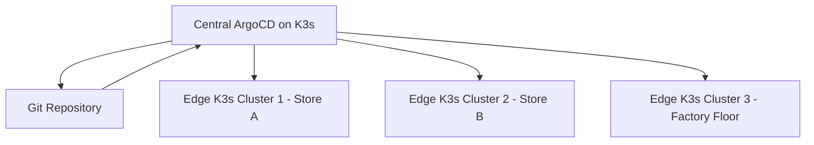

# How to Install ArgoCD on K3s Lightweight Kubernetes

Author: [nawazdhandala](https://github.com/nawazdhandala)

Tags: ArgoCD, GitOps, Kubernetes, K3s, Edge Computing

Description: A practical guide to installing ArgoCD on K3s lightweight Kubernetes for edge computing, IoT, home labs, and resource-constrained environments.

---

K3s is a lightweight Kubernetes distribution built by Rancher Labs (now SUSE). It packages the entire Kubernetes control plane into a single binary under 100MB. This makes it ideal for edge computing, IoT devices, home labs, and any environment where running a full Kubernetes distribution is overkill. ArgoCD runs beautifully on K3s, giving you GitOps capabilities even on resource-constrained hardware.

This guide covers installing K3s, deploying ArgoCD on top of it, and configuring everything for a production-ready setup.

## Why K3s for ArgoCD?

K3s is appealing for ArgoCD deployments because:

- **Low resource usage** - runs on machines with as little as 512MB RAM for the control plane
- **Single binary** - no complex multi-component installation
- **Built-in features** - includes Traefik ingress, local storage, and CoreDNS out of the box
- **Fast installation** - one curl command to install
- **Edge-ready** - perfect for deploying GitOps to remote locations, retail stores, or factory floors

## Prerequisites

You need a Linux machine (physical or virtual) with:

- 2+ CPU cores (recommended for K3s + ArgoCD)
- 4GB+ RAM (2GB for K3s, 2GB for ArgoCD)
- 20GB+ disk space
- A supported Linux distribution (Ubuntu, Debian, RHEL, CentOS, SLES, or any systemd-based distro)

```bash
# Verify system resources
free -h
nproc
df -h /
```

## Step 1: Install K3s

Install K3s with a single command:

```bash
# Install K3s
curl -sfL https://get.k3s.io | sh -

# Wait for K3s to be ready
sudo k3s kubectl get nodes
# NAME         STATUS   ROLES                  AGE   VERSION
# my-server    Ready    control-plane,master   30s   v1.x.x+k3s1

# Set up kubectl access for your user
mkdir -p ~/.kube
sudo cp /etc/rancher/k3s/k3s.yaml ~/.kube/config
sudo chown $(id -u):$(id -g) ~/.kube/config
export KUBECONFIG=~/.kube/config

# Verify kubectl works
kubectl get nodes
```

If you want to install a specific version or customize the installation:

```bash
# Install a specific K3s version
curl -sfL https://get.k3s.io | INSTALL_K3S_VERSION="v1.28.5+k3s1" sh -

# Install without the default Traefik ingress (if you prefer nginx)
curl -sfL https://get.k3s.io | INSTALL_K3S_EXEC="--disable=traefik" sh -
```

## Step 2: Install ArgoCD

Now install ArgoCD on your K3s cluster:

```bash
# Create the argocd namespace
kubectl create namespace argocd

# Install ArgoCD
kubectl apply -n argocd -f https://raw.githubusercontent.com/argoproj/argo-cd/stable/manifests/install.yaml

# Wait for all ArgoCD pods to be ready
kubectl wait --for=condition=Ready pods --all -n argocd --timeout=600s

# Verify the installation
kubectl get pods -n argocd
```

On resource-constrained machines, the initial pull of container images may take a few minutes. If pods are stuck in `ImagePullBackOff`, check your internet connection and disk space.

## Step 3: Access ArgoCD

K3s comes with Traefik as the default ingress controller. Let us use it to expose ArgoCD.

### Option A: Using Traefik IngressRoute (K3s Default)

K3s ships with Traefik v2, which uses IngressRoute CRDs:

```yaml
# Save as argocd-ingress.yaml
apiVersion: traefik.containo.us/v1alpha1
kind: IngressRoute
metadata:
  name: argocd-server
  namespace: argocd
spec:
  entryPoints:
  - websecure
  routes:
  - match: Host(`argocd.local`)
    kind: Rule
    services:
    - name: argocd-server
      port: 443
    # Pass through TLS to ArgoCD
  tls:
    passthrough: true
```

```bash
kubectl apply -f argocd-ingress.yaml

# Add argocd.local to your hosts file
echo "$(hostname -I | awk '{print $1}') argocd.local" | sudo tee -a /etc/hosts

# Access at https://argocd.local
```

### Option B: Using Standard Kubernetes Ingress

```yaml
# Save as argocd-ingress.yaml
apiVersion: networking.k8s.io/v1
kind: Ingress
metadata:
  name: argocd-server
  namespace: argocd
  annotations:
    traefik.ingress.kubernetes.io/router.tls: "true"
    ingress.kubernetes.io/ssl-passthrough: "true"
spec:
  rules:
  - host: argocd.local
    http:
      paths:
      - path: /
        pathType: Prefix
        backend:
          service:
            name: argocd-server
            port:
              number: 443
```

### Option C: NodePort (Simplest)

```bash
# Patch ArgoCD server to use NodePort
kubectl patch svc argocd-server -n argocd -p '{"spec": {"type": "NodePort"}}'

# Get the assigned port
NODE_PORT=$(kubectl get svc argocd-server -n argocd -o jsonpath='{.spec.ports[0].nodePort}')
echo "ArgoCD available at https://$(hostname -I | awk '{print $1}'):$NODE_PORT"
```

### Option D: Port-Forward (Quick Testing)

```bash
kubectl port-forward svc/argocd-server -n argocd 8080:443 --address 0.0.0.0 &
# Access at https://<your-ip>:8080
```

## Step 4: Login and Initial Configuration

```bash
# Get the initial admin password
ARGOCD_PASSWORD=$(kubectl get secret argocd-initial-admin-secret -n argocd \
  -o jsonpath='{.data.password}' | base64 -d)

# Install the ArgoCD CLI
curl -sSL -o /usr/local/bin/argocd \
  https://github.com/argoproj/argo-cd/releases/latest/download/argocd-linux-amd64
chmod +x /usr/local/bin/argocd

# Login
argocd login argocd.local --insecure --username admin --password $ARGOCD_PASSWORD

# Change the password
argocd account update-password \
  --current-password $ARGOCD_PASSWORD \
  --new-password YourSecurePassword

# Verify
argocd cluster list
```

## Step 5: Deploy Your First Application

```bash
# Create a test application
argocd app create nginx-test \
  --repo https://github.com/argoproj/argocd-example-apps.git \
  --path guestbook \
  --dest-server https://kubernetes.default.svc \
  --dest-namespace default \
  --sync-policy automated

# Watch the sync
argocd app get nginx-test --refresh

# Verify pods are running
kubectl get pods -n default
```

## Optimizing ArgoCD for K3s

K3s environments are typically resource-constrained. Here are optimizations to reduce ArgoCD's footprint.

### Reduce Resource Requests

```yaml
# Save as argocd-resource-patch.yaml and apply with kubectl
# Reduce API server resources
apiVersion: apps/v1
kind: Deployment
metadata:
  name: argocd-server
  namespace: argocd
spec:
  template:
    spec:
      containers:
      - name: argocd-server
        resources:
          requests:
            cpu: 50m
            memory: 128Mi
          limits:
            cpu: 500m
            memory: 256Mi
```

Apply similar patches for the repo server and other components:

```bash
# Reduce resource requests across ArgoCD components
kubectl patch deployment argocd-server -n argocd --type=json \
  -p='[{"op":"replace","path":"/spec/template/spec/containers/0/resources","value":{"requests":{"cpu":"50m","memory":"128Mi"},"limits":{"cpu":"500m","memory":"256Mi"}}}]'

kubectl patch deployment argocd-repo-server -n argocd --type=json \
  -p='[{"op":"replace","path":"/spec/template/spec/containers/0/resources","value":{"requests":{"cpu":"50m","memory":"128Mi"},"limits":{"cpu":"500m","memory":"512Mi"}}}]'

kubectl patch deployment argocd-redis -n argocd --type=json \
  -p='[{"op":"replace","path":"/spec/template/spec/containers/0/resources","value":{"requests":{"cpu":"25m","memory":"64Mi"},"limits":{"cpu":"250m","memory":"128Mi"}}}]'
```

### Increase Polling Interval

If your Git repo does not change frequently, increase the polling interval to reduce CPU usage:

```yaml
# In argocd-cm ConfigMap
apiVersion: v1
kind: ConfigMap
metadata:
  name: argocd-cm
  namespace: argocd
data:
  # Increase polling from 3 minutes to 10 minutes
  timeout.reconciliation: "600"
```

### Use Core Install for Minimal Footprint

If you do not need the web UI, use ArgoCD's core installation:

```bash
# Core install - no UI, no API server, no Dex
kubectl apply -n argocd -f https://raw.githubusercontent.com/argoproj/argo-cd/stable/manifests/core-install.yaml
```

This significantly reduces resource usage but means you can only manage ArgoCD through kubectl and the ArgoCD CLI.

## K3s Multi-Node Setup

For production K3s clusters, you may want multiple nodes. Here is how to add worker nodes:

```bash
# On the server node, get the token
sudo cat /var/lib/rancher/k3s/server/node-token

# On each worker node
curl -sfL https://get.k3s.io | K3S_URL=https://server-ip:6443 K3S_TOKEN=<token> sh -

# Verify nodes
kubectl get nodes
# NAME         STATUS   ROLES                  AGE   VERSION
# server       Ready    control-plane,master   10m   v1.x.x
# worker-1     Ready    <none>                 2m    v1.x.x
# worker-2     Ready    <none>                 1m    v1.x.x
```

ArgoCD will automatically use the additional nodes for scheduling its pods.

## Edge Deployment Pattern

A common K3s + ArgoCD pattern is managing edge clusters from a central ArgoCD instance:



Register edge clusters with the central ArgoCD:

```bash
# From the central ArgoCD cluster
# Add each edge cluster
argocd cluster add edge-cluster-1 --name "Store A"
argocd cluster add edge-cluster-2 --name "Store B"

# Use ApplicationSets to deploy to all edge clusters
```

For more on multi-cluster management, see [how to configure multi-cluster management in ArgoCD](https://oneuptime.com/blog/post/2026-01-25-multi-cluster-management-argocd/view).

## Automatic K3s Upgrades

Keep K3s updated alongside ArgoCD:

```bash
# Install the system-upgrade-controller for automated K3s upgrades
kubectl apply -f https://github.com/rancher/system-upgrade-controller/releases/latest/download/system-upgrade-controller.yaml

# Create an upgrade plan
cat <<EOF | kubectl apply -f -
apiVersion: upgrade.cattle.io/v1
kind: Plan
metadata:
  name: k3s-upgrade
  namespace: system-upgrade
spec:
  concurrency: 1
  nodeSelector:
    matchExpressions:
    - key: node-role.kubernetes.io/control-plane
      operator: Exists
  serviceAccountName: system-upgrade
  upgrade:
    image: rancher/k3s-upgrade
  version: v1.28.5+k3s1
EOF
```

## Troubleshooting

**Problem: ArgoCD pods are evicted due to memory pressure**

K3s has built-in eviction thresholds. If the node runs low on memory, it evicts pods. Solution: reduce ArgoCD resource usage or add more RAM.

```bash
# Check node memory pressure
kubectl describe node | grep -A5 "Conditions"
```

**Problem: Traefik conflicts with ArgoCD TLS**

ArgoCD uses its own TLS certificates. Use TLS passthrough in Traefik to avoid certificate conflicts.

**Problem: Slow image pulls**

K3s uses containerd instead of Docker. Pre-pull ArgoCD images or use a local registry:

```bash
# Pre-pull images on the K3s node
sudo k3s ctr images pull quay.io/argoproj/argocd:latest
```

**Problem: K3s service not starting after reboot**

Check the systemd service:

```bash
sudo systemctl status k3s
sudo journalctl -u k3s -f
```

## The Bottom Line

K3s and ArgoCD make a great combination for lightweight GitOps deployments. Whether you are running a home lab, managing edge devices, or setting up a development environment, K3s gives you a fully functional Kubernetes cluster with minimal overhead, and ArgoCD gives you GitOps on top of it. The entire stack can run on a Raspberry Pi or a small cloud VM, making enterprise GitOps practices accessible to everyone.
