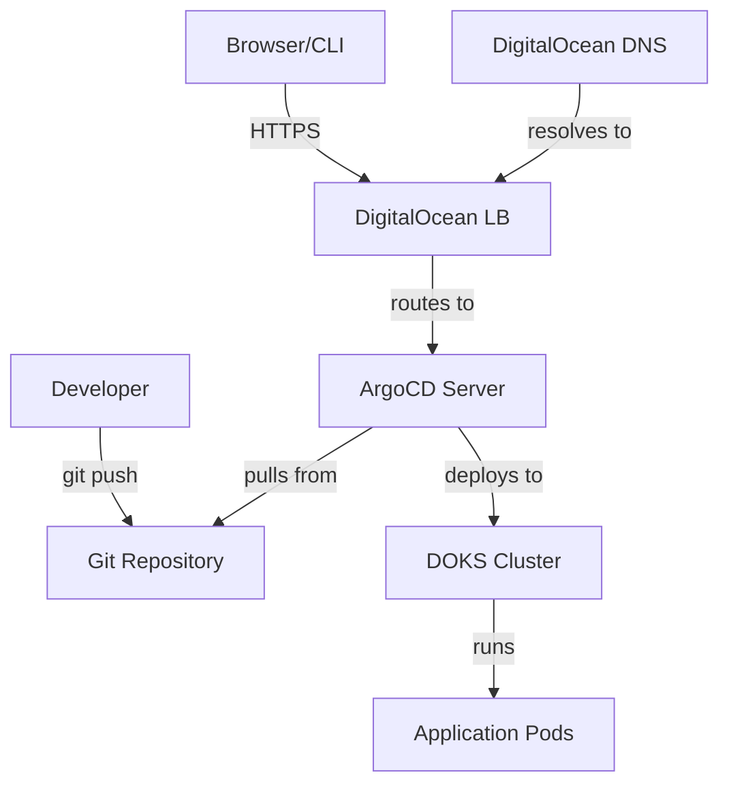

# How to Install ArgoCD on DigitalOcean Kubernetes

Author: [nawazdhandala](https://github.com/nawazdhandala)

Tags: ArgoCD, GitOps, Kubernetes, DigitalOcean

Description: A complete guide to installing ArgoCD on DigitalOcean Kubernetes (DOKS) for GitOps-driven continuous delivery with cloud-native load balancing and DNS.

---

DigitalOcean Kubernetes (DOKS) is one of the most developer-friendly managed Kubernetes services available. It strips away the complexity that comes with AWS EKS or Google GKE, giving you a clean cluster in a few clicks. Installing ArgoCD on DOKS is straightforward, but there are a few DigitalOcean-specific details around load balancers, DNS, and TLS that you should know about.

This guide covers the full process: provisioning a DOKS cluster, installing ArgoCD, exposing it with a DigitalOcean Load Balancer, configuring DNS, and deploying your first application.

## Prerequisites

- A DigitalOcean account with billing enabled
- The `doctl` CLI installed and authenticated
- `kubectl` installed locally
- A domain name (optional, but recommended for production)

## Step 1: Create a DOKS Cluster

If you do not already have a cluster, create one with `doctl`.

```bash
# Create a 3-node cluster in the NYC1 region
doctl kubernetes cluster create argocd-cluster \
  --region nyc1 \
  --version 1.28.2-do.0 \
  --size s-2vcpu-4gb \
  --count 3
```

This takes a few minutes. Once ready, `doctl` automatically updates your kubeconfig.

```bash
# Verify you can connect
kubectl get nodes
```

You should see three nodes in `Ready` state.

## Step 2: Install ArgoCD

Create the ArgoCD namespace and apply the official manifests.

```bash
# Create namespace
kubectl create namespace argocd

# Install ArgoCD
kubectl apply -n argocd -f https://raw.githubusercontent.com/argoproj/argo-cd/stable/manifests/install.yaml
```

Wait for all pods to become ready.

```bash
# Check pod status
kubectl get pods -n argocd -w
```

All six ArgoCD pods should reach `Running` state within a few minutes.

## Step 3: Expose ArgoCD with a DigitalOcean Load Balancer

For production access, expose ArgoCD using a DigitalOcean Load Balancer by changing the argocd-server service type.

```bash
# Patch the argocd-server service to use a LoadBalancer
kubectl patch svc argocd-server -n argocd -p '{"spec": {"type": "LoadBalancer"}}'
```

DigitalOcean will automatically provision a cloud load balancer. Wait for the external IP to be assigned.

```bash
# Watch for the external IP
kubectl get svc argocd-server -n argocd -w
```

Once you see an external IP (it looks like a DigitalOcean IP address), you can access ArgoCD at `https://<external-ip>`.

### Customize the Load Balancer

DigitalOcean Load Balancers can be configured using annotations. Here is a service manifest with common annotations.

```yaml
# argocd-server-lb.yaml
apiVersion: v1
kind: Service
metadata:
  name: argocd-server
  namespace: argocd
  annotations:
    # Use HTTPS on the load balancer
    service.beta.kubernetes.io/do-loadbalancer-protocol: "http"
    # Health check configuration
    service.beta.kubernetes.io/do-loadbalancer-healthcheck-port: "8080"
    service.beta.kubernetes.io/do-loadbalancer-healthcheck-protocol: "http"
    service.beta.kubernetes.io/do-loadbalancer-healthcheck-path: "/healthz"
    # Give it a name you can find in the DO console
    service.beta.kubernetes.io/do-loadbalancer-name: "argocd-lb"
spec:
  type: LoadBalancer
  ports:
  - name: http
    port: 80
    targetPort: 8080
    protocol: TCP
  - name: https
    port: 443
    targetPort: 8080
    protocol: TCP
  selector:
    app.kubernetes.io/name: argocd-server
```

## Step 4: Configure DNS

If you have a domain, point it to the load balancer IP.

```bash
# Get the external IP
export ARGOCD_IP=$(kubectl get svc argocd-server -n argocd -o jsonpath='{.status.loadBalancer.ingress[0].ip}')
echo $ARGOCD_IP

# Create a DNS record using doctl
doctl compute domain records create yourdomain.com \
  --record-type A \
  --record-name argocd \
  --record-data $ARGOCD_IP \
  --record-ttl 300
```

Now ArgoCD will be accessible at `https://argocd.yourdomain.com`.

## Step 5: Set Up TLS with cert-manager

For a proper TLS certificate, install cert-manager.

```bash
# Install cert-manager
kubectl apply -f https://github.com/cert-manager/cert-manager/releases/latest/download/cert-manager.yaml

# Wait for cert-manager pods
kubectl get pods -n cert-manager -w
```

Create a ClusterIssuer for Let's Encrypt.

```yaml
# cluster-issuer.yaml
apiVersion: cert-manager.io/v1
kind: ClusterIssuer
metadata:
  name: letsencrypt-prod
spec:
  acme:
    server: https://acme-v02.api.letsencrypt.org/directory
    email: your-email@example.com
    privateKeySecretRef:
      name: letsencrypt-prod
    solvers:
    - http01:
        ingress:
          class: nginx
```

```bash
kubectl apply -f cluster-issuer.yaml
```

If you installed the NGINX Ingress Controller, create an Ingress for ArgoCD with TLS.

```yaml
# argocd-ingress.yaml
apiVersion: networking.k8s.io/v1
kind: Ingress
metadata:
  name: argocd-server-ingress
  namespace: argocd
  annotations:
    cert-manager.io/cluster-issuer: letsencrypt-prod
    nginx.ingress.kubernetes.io/ssl-passthrough: "true"
    nginx.ingress.kubernetes.io/backend-protocol: "HTTPS"
spec:
  tls:
  - hosts:
    - argocd.yourdomain.com
    secretName: argocd-server-tls
  rules:
  - host: argocd.yourdomain.com
    http:
      paths:
      - path: /
        pathType: Prefix
        backend:
          service:
            name: argocd-server
            port:
              number: 443
```

```bash
kubectl apply -f argocd-ingress.yaml
```

## Step 6: Get the Admin Password and Login

Retrieve the initial admin password.

```bash
# Get the admin password
kubectl -n argocd get secret argocd-initial-admin-secret \
  -o jsonpath="{.data.password}" | base64 -d
echo
```

Install the ArgoCD CLI and login.

```bash
# Install ArgoCD CLI
curl -sSL -o argocd https://github.com/argoproj/argo-cd/releases/latest/download/argocd-linux-amd64
chmod +x argocd
sudo mv argocd /usr/local/bin/

# Login
argocd login argocd.yourdomain.com --username admin --password <your-password>
```

## Step 7: Deploy a Sample Application

Create and sync a test application.

```bash
# Create the guestbook application
argocd app create guestbook \
  --repo https://github.com/argoproj/argocd-example-apps.git \
  --path guestbook \
  --dest-server https://kubernetes.default.svc \
  --dest-namespace default \
  --sync-policy automated

# Check status
argocd app get guestbook
```

## Architecture on DigitalOcean

Here is how the setup looks on DOKS:



## DigitalOcean-Specific Tips

### Using DigitalOcean Spaces for Helm Charts

If you store Helm charts in DigitalOcean Spaces (S3-compatible), configure ArgoCD to use them.

```bash
# Add a Helm repository hosted on DO Spaces
argocd repo add https://your-space.nyc3.digitaloceanspaces.com/charts \
  --type helm \
  --name do-charts
```

### Monitoring Costs

The DigitalOcean Load Balancer adds about $12/month to your bill. If you are running a development cluster, use port-forwarding instead.

```bash
# Free alternative: port-forward
kubectl port-forward svc/argocd-server -n argocd 8080:443
```

### Node Pool Sizing

ArgoCD uses roughly 1 GB of memory across all its components. For a dedicated ArgoCD setup, a single `s-2vcpu-4gb` node is sufficient. For production clusters running workloads alongside ArgoCD, use at least 3 nodes with `s-4vcpu-8gb`.

### DigitalOcean Container Registry

If you use the DigitalOcean Container Registry (DOCR), ArgoCD Image Updater can watch it for new images. See [ArgoCD Image Updater](https://oneuptime.com/blog/post/2026-01-25-image-updater-argocd/view) for details.

## Troubleshooting

### Load Balancer Stuck in Pending

If the external IP never appears, check your DigitalOcean account limits.

```bash
# Check service events
kubectl describe svc argocd-server -n argocd
```

You may need to contact DigitalOcean support to increase your load balancer quota.

### Connection Timeout to ArgoCD

Make sure the DigitalOcean firewall allows traffic on ports 80 and 443.

```bash
# List firewalls
doctl compute firewall list
```

### DNS Not Resolving

Wait a few minutes for DNS propagation. Check with dig.

```bash
dig argocd.yourdomain.com
```

## What to Do Next

With ArgoCD running on DOKS, explore these next steps:

- Set up RBAC for team access (see [ArgoCD RBAC](https://oneuptime.com/blog/post/2026-01-25-rbac-policies-argocd/view))
- Configure automated sync policies (see [ArgoCD automated sync](https://oneuptime.com/blog/post/2026-01-30-argocd-automated-sync-policy/view))
- Set up the App of Apps pattern for managing multiple services (see [App of Apps](https://oneuptime.com/blog/post/2026-01-30-argocd-app-of-apps-pattern/view))

DigitalOcean Kubernetes with ArgoCD is a cost-effective and developer-friendly setup for teams that want GitOps without the complexity of AWS or GCP. The managed control plane and straightforward networking make it easy to get started and maintain over time.
