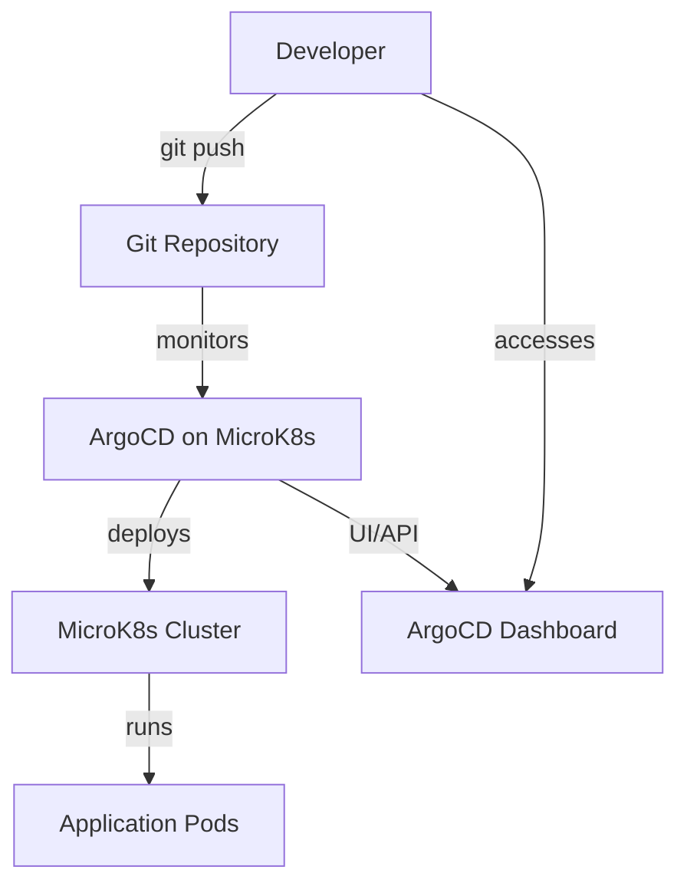

# How to Install ArgoCD on MicroK8s

Author: [nawazdhandala](https://github.com/nawazdhandala)

Tags: ArgoCD, GitOps, Kubernetes, MicroK8s

Description: A step-by-step guide to installing and configuring ArgoCD on MicroK8s for lightweight GitOps workflows on local or edge Kubernetes clusters.

---

MicroK8s is Canonical's lightweight, snap-based Kubernetes distribution that runs on a single node. It is great for development, IoT, edge computing, and CI environments where you want a full Kubernetes experience without the overhead of a full cluster. Pairing MicroK8s with ArgoCD gives you a GitOps-driven deployment pipeline that is both lightweight and production-capable.

This guide walks you through installing ArgoCD on MicroK8s from scratch, including enabling the right MicroK8s addons, deploying ArgoCD, accessing the UI, and deploying your first application.

## Prerequisites

Before you start, make sure you have:

- A machine running Ubuntu 20.04 or later (MicroK8s works best on Ubuntu)
- At least 4 GB of RAM and 2 CPU cores
- snap installed (comes pre-installed on Ubuntu)

## Step 1: Install MicroK8s

Install MicroK8s using snap.

```bash
# Install the latest stable MicroK8s
sudo snap install microk8s --classic --channel=1.28/stable

# Add your user to the microk8s group so you don't need sudo
sudo usermod -a -G microk8s $USER
sudo chown -f -R $USER ~/.kube

# Re-enter the session for group changes to take effect
newgrp microk8s
```

Wait for MicroK8s to be ready.

```bash
# Check that MicroK8s is running
microk8s status --wait-ready
```

## Step 2: Enable Required Addons

ArgoCD needs DNS, storage, and RBAC to function. MicroK8s ships these as optional addons you need to enable.

```bash
# Enable core addons that ArgoCD depends on
microk8s enable dns storage rbac

# Optional: enable ingress if you want to expose ArgoCD via a domain
microk8s enable ingress
```

Wait a minute for the addons to stabilize.

```bash
# Verify all pods are running
microk8s kubectl get pods -A
```

## Step 3: Set Up kubectl Alias

MicroK8s bundles its own kubectl. You can either use `microk8s kubectl` everywhere or create an alias.

```bash
# Option 1: Create a shell alias
alias kubectl='microk8s kubectl'

# Option 2: Export the kubeconfig so external kubectl works
microk8s config > ~/.kube/config
```

For the rest of this guide, we will assume `kubectl` points to the MicroK8s cluster.

## Step 4: Create the ArgoCD Namespace

ArgoCD installs into its own namespace.

```bash
# Create the namespace for ArgoCD
kubectl create namespace argocd
```

## Step 5: Install ArgoCD

Apply the official ArgoCD manifests to your MicroK8s cluster.

```bash
# Install the latest stable ArgoCD
kubectl apply -n argocd -f https://raw.githubusercontent.com/argoproj/argo-cd/stable/manifests/install.yaml
```

This installs the full ArgoCD stack including the API server, repo server, application controller, Redis, and Dex.

Wait for all pods to become ready.

```bash
# Watch pods come up
kubectl get pods -n argocd -w
```

You should see something like this once everything is healthy:

```text
NAME                                  READY   STATUS    RESTARTS   AGE
argocd-application-controller-0       1/1     Running   0          2m
argocd-dex-server-6dcf645b6-xxxxx     1/1     Running   0          2m
argocd-redis-5b6967fdfc-xxxxx         1/1     Running   0          2m
argocd-repo-server-7598bf5999-xxxxx   1/1     Running   0          2m
argocd-server-7d5f8c4bc-xxxxx         1/1     Running   0          2m
```

## Step 6: Access the ArgoCD UI

The simplest way to access ArgoCD is through port-forwarding.

```bash
# Forward the ArgoCD server to localhost:8080
kubectl port-forward svc/argocd-server -n argocd 8080:443
```

Open your browser and go to `https://localhost:8080`. You will see a certificate warning since ArgoCD uses a self-signed cert by default - accept it to proceed.

### Alternative: Use MicroK8s Ingress

If you enabled the ingress addon, you can create an Ingress resource to expose ArgoCD.

```yaml
# argocd-ingress.yaml
apiVersion: networking.k8s.io/v1
kind: Ingress
metadata:
  name: argocd-server-ingress
  namespace: argocd
  annotations:
    nginx.ingress.kubernetes.io/force-ssl-redirect: "true"
    nginx.ingress.kubernetes.io/ssl-passthrough: "true"
    nginx.ingress.kubernetes.io/backend-protocol: "HTTPS"
spec:
  rules:
  - host: argocd.local
    http:
      paths:
      - path: /
        pathType: Prefix
        backend:
          service:
            name: argocd-server
            port:
              number: 443
```

Apply this and add `argocd.local` to your `/etc/hosts` file pointing to `127.0.0.1`.

```bash
kubectl apply -f argocd-ingress.yaml
```

## Step 7: Get the Admin Password

ArgoCD generates an initial admin password stored in a Kubernetes secret.

```bash
# Retrieve the initial admin password
kubectl -n argocd get secret argocd-initial-admin-secret \
  -o jsonpath="{.data.password}" | base64 -d
echo
```

Log in with username `admin` and the password from the command above.

## Step 8: Install the ArgoCD CLI

The CLI lets you manage ArgoCD from the terminal.

```bash
# Download the latest ArgoCD CLI for Linux
curl -sSL -o argocd https://github.com/argoproj/argo-cd/releases/latest/download/argocd-linux-amd64
chmod +x argocd
sudo mv argocd /usr/local/bin/
```

Log in via CLI.

```bash
# Login to ArgoCD (use --insecure if using self-signed certs)
argocd login localhost:8080 --insecure --username admin --password <your-password>
```

## Step 9: Deploy Your First Application

Let us deploy a sample application to verify everything works.

```bash
# Create a sample application from the ArgoCD example repo
argocd app create guestbook \
  --repo https://github.com/argoproj/argocd-example-apps.git \
  --path guestbook \
  --dest-server https://kubernetes.default.svc \
  --dest-namespace default
```

Sync the application.

```bash
# Trigger a sync to deploy the application
argocd app sync guestbook
```

Check the status.

```bash
# Verify the application is healthy and synced
argocd app get guestbook
```

You should see the application status as `Synced` and health as `Healthy`.

## MicroK8s-Specific Considerations

### Memory Limits

MicroK8s on constrained hardware can struggle with ArgoCD's default resource requests. If you are running on a machine with limited memory, consider reducing the resource requests.

```bash
# Patch the ArgoCD components to use less memory
kubectl -n argocd patch deployment argocd-server --type='json' \
  -p='[{"op": "replace", "path": "/spec/template/spec/containers/0/resources/requests/memory", "value": "128Mi"}]'

kubectl -n argocd patch deployment argocd-repo-server --type='json' \
  -p='[{"op": "replace", "path": "/spec/template/spec/containers/0/resources/requests/memory", "value": "128Mi"}]'
```

### Storage Class

MicroK8s uses the `microk8s-hostpath` storage class by default. If ArgoCD components need persistent volumes, make sure this storage class is available.

```bash
# Check available storage classes
kubectl get storageclass
```

### Multi-Node MicroK8s

If you are running a multi-node MicroK8s cluster, ArgoCD works the same way. Just make sure all nodes have joined the cluster before installing ArgoCD.

```bash
# On the primary node, generate a join token
microk8s add-node

# On the worker node, run the join command provided
microk8s join <primary-ip>:25000/<token>
```

## Architecture Overview

Here is how ArgoCD fits into a MicroK8s environment:



## Troubleshooting

### Pods Stuck in Pending State

This usually means MicroK8s addons are not fully ready. Wait a few minutes and check.

```bash
# Check if DNS and storage are running
microk8s status
```

### CoreDNS Not Resolving

If ArgoCD cannot reach external Git repos, DNS might not be working.

```bash
# Restart the DNS addon
microk8s disable dns
microk8s enable dns
```

### Insufficient Resources

If pods keep getting OOMKilled, you need more memory or you need to reduce resource requests as shown above.

## What to Do Next

Now that ArgoCD is running on MicroK8s, you can:

- Connect your own Git repositories and deploy real applications
- Configure SSO for team access (see [ArgoCD SSO setup](https://oneuptime.com/blog/post/2026-01-25-sso-oidc-argocd/view))
- Set up notifications for deployment events (see [ArgoCD notifications](https://oneuptime.com/blog/post/2026-01-25-notifications-argocd/view))
- Explore ApplicationSets for managing multiple applications (see [ArgoCD ApplicationSets](https://oneuptime.com/blog/post/2026-01-25-application-sets-argocd/view))

MicroK8s paired with ArgoCD is a practical combination for development environments, edge deployments, and CI pipelines. It gives you the full power of GitOps without the infrastructure overhead of a multi-node cluster.
