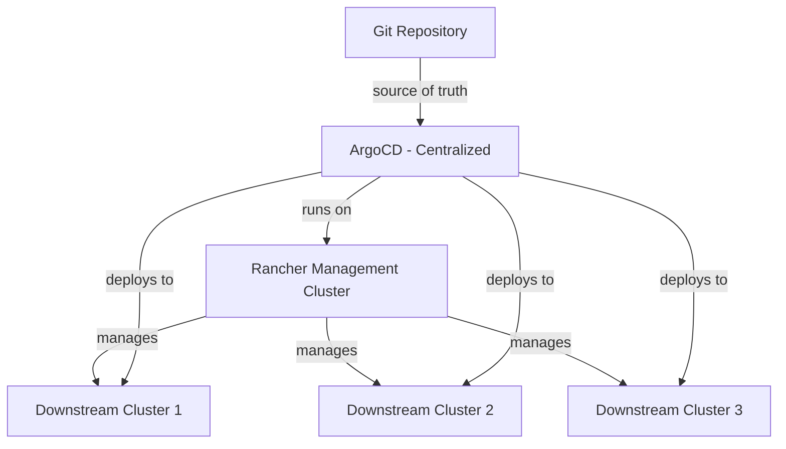

# How to Install ArgoCD on Rancher Managed Clusters

Author: [nawazdhandala](https://github.com/nawazdhandala)

Tags: ArgoCD, GitOps, Kubernetes, Rancher

Description: Learn how to install and configure ArgoCD on Rancher-managed Kubernetes clusters, including RKE2 and K3s downstream clusters.

---

Rancher is a popular multi-cluster management platform that manages downstream Kubernetes clusters across different providers. When you add ArgoCD to a Rancher-managed environment, you get GitOps-driven deployments across all your clusters from a single ArgoCD instance. This guide covers installing ArgoCD on Rancher-managed clusters, whether they run RKE2, K3s, or imported cloud clusters.

## Understanding the Architecture

There are two common patterns for running ArgoCD with Rancher:

1. **Install ArgoCD on the Rancher management cluster** and manage all downstream clusters from there
2. **Install ArgoCD on each downstream cluster** for independent GitOps per cluster

Pattern 1 is better for centralized control. Pattern 2 is better for team autonomy. This guide covers both, starting with centralized.



## Prerequisites

- A Rancher management cluster (v2.7+)
- At least one downstream cluster managed by Rancher
- `kubectl` configured to access the management cluster
- The Rancher CLI or web console access

## Step 1: Get Kubeconfig from Rancher

Rancher provides kubeconfig files for all managed clusters. You need the management cluster kubeconfig to install ArgoCD.

```bash
# Using Rancher CLI, login to Rancher
rancher login https://rancher.yourdomain.com --token <your-api-token>

# List available clusters
rancher cluster ls

# Switch to the management cluster (local)
rancher cluster switch local

# Get the kubeconfig
rancher cluster kf local > ~/.kube/rancher-local.yaml
export KUBECONFIG=~/.kube/rancher-local.yaml
```

Alternatively, download the kubeconfig from the Rancher UI by clicking on your cluster and selecting "Download KubeConfig".

## Step 2: Install ArgoCD on the Management Cluster

Create the namespace and install ArgoCD.

```bash
# Create the ArgoCD namespace
kubectl create namespace argocd

# Install ArgoCD
kubectl apply -n argocd -f https://raw.githubusercontent.com/argoproj/argo-cd/stable/manifests/install.yaml

# Wait for pods
kubectl get pods -n argocd -w
```

## Step 3: Register Downstream Clusters

To deploy applications to downstream clusters, ArgoCD needs access to them. Rancher already has credentials for these clusters, but ArgoCD needs its own ServiceAccount on each target.

### Extract Downstream Cluster Kubeconfig

For each downstream cluster you want to manage, get its kubeconfig from Rancher.

```bash
# Get kubeconfig for a downstream cluster
rancher cluster kf <cluster-name> > /tmp/downstream-cluster.yaml
```

### Register with ArgoCD CLI

Install the ArgoCD CLI and register the downstream clusters.

```bash
# Get the ArgoCD admin password
kubectl -n argocd get secret argocd-initial-admin-secret \
  -o jsonpath="{.data.password}" | base64 -d
echo

# Port-forward to access ArgoCD
kubectl port-forward svc/argocd-server -n argocd 8080:443 &

# Login to ArgoCD
argocd login localhost:8080 --insecure --username admin --password <password>

# Add the downstream cluster
# First, set the downstream kubeconfig
export KUBECONFIG=/tmp/downstream-cluster.yaml

# Get the cluster's API server URL
kubectl cluster-info

# Switch back to management cluster kubeconfig
export KUBECONFIG=~/.kube/rancher-local.yaml

# Register the downstream cluster with ArgoCD
argocd cluster add <downstream-context-name> \
  --kubeconfig /tmp/downstream-cluster.yaml \
  --name downstream-cluster-1
```

### Verify Cluster Registration

```bash
# List registered clusters
argocd cluster list
```

You should see both the local (in-cluster) and downstream clusters listed.

## Step 4: Handle Rancher's Cluster Agent Authentication

Rancher uses its own proxy to route kubectl commands to downstream clusters. If ArgoCD cannot reach the downstream cluster API servers directly, you can use Rancher's proxy URL.

```bash
# The Rancher proxy URL format is:
# https://rancher.yourdomain.com/k8s/clusters/<cluster-id>

# Find the cluster ID from Rancher
rancher cluster ls

# Add cluster using the Rancher proxy URL
argocd cluster add --name production-cluster \
  --server https://rancher.yourdomain.com/k8s/clusters/c-m-xxxxxxxx \
  --auth-token <rancher-bearer-token>
```

Alternatively, create a Kubernetes Secret with the cluster credentials directly.

```yaml
# downstream-cluster-secret.yaml
apiVersion: v1
kind: Secret
metadata:
  name: downstream-cluster-1
  namespace: argocd
  labels:
    argocd.argoproj.io/secret-type: cluster
type: Opaque
stringData:
  name: downstream-cluster-1
  server: https://downstream-api-server:6443
  config: |
    {
      "bearerToken": "<service-account-token>",
      "tlsClientConfig": {
        "insecure": false,
        "caData": "<base64-ca-cert>"
      }
    }
```

```bash
kubectl apply -f downstream-cluster-secret.yaml
```

## Step 5: Deploy Applications to Downstream Clusters

Now create an ArgoCD Application targeting a downstream cluster.

```yaml
# app-on-downstream.yaml
apiVersion: argoproj.io/v1alpha1
kind: Application
metadata:
  name: guestbook-production
  namespace: argocd
spec:
  project: default
  source:
    repoURL: https://github.com/argoproj/argocd-example-apps.git
    targetRevision: HEAD
    path: guestbook
  destination:
    # Use the downstream cluster's server URL
    server: https://downstream-api-server:6443
    namespace: default
  syncPolicy:
    automated:
      prune: true
      selfHeal: true
```

```bash
kubectl apply -f app-on-downstream.yaml
```

## Step 6: Use ApplicationSets for Multi-Cluster Deployment

If you manage many Rancher clusters, ApplicationSets can automatically deploy to all of them.

```yaml
# multi-cluster-appset.yaml
apiVersion: argoproj.io/v1alpha1
kind: ApplicationSet
metadata:
  name: guestbook-all-clusters
  namespace: argocd
spec:
  generators:
  - clusters:
      # Select all registered clusters except the management cluster
      selector:
        matchExpressions:
        - key: name
          operator: NotIn
          values:
            - in-cluster
  template:
    metadata:
      name: 'guestbook-{{name}}'
    spec:
      project: default
      source:
        repoURL: https://github.com/argoproj/argocd-example-apps.git
        targetRevision: HEAD
        path: guestbook
      destination:
        server: '{{server}}'
        namespace: default
      syncPolicy:
        automated:
          prune: true
          selfHeal: true
```

```bash
kubectl apply -f multi-cluster-appset.yaml
```

This automatically creates an ArgoCD Application for every downstream cluster registered with ArgoCD. For more on ApplicationSets, see [ArgoCD ApplicationSets](https://oneuptime.com/blog/post/2026-01-25-application-sets-argocd/view).

## Installing ArgoCD Per Downstream Cluster

For the per-cluster approach, repeat the ArgoCD installation on each downstream cluster.

```bash
# Switch to the downstream cluster
export KUBECONFIG=/tmp/downstream-cluster.yaml

# Install ArgoCD
kubectl create namespace argocd
kubectl apply -n argocd -f https://raw.githubusercontent.com/argoproj/argo-cd/stable/manifests/install.yaml
```

This gives each team their own ArgoCD instance with full autonomy. The tradeoff is more infrastructure to manage.

## Expose ArgoCD via Rancher

Rancher can expose ArgoCD through its built-in proxy without requiring an Ingress or LoadBalancer.

Access ArgoCD through the Rancher dashboard by navigating to the cluster, going to Service Discovery > Services, and clicking on the argocd-server service.

For direct access, Rancher's kubectl proxy provides a URL like:

```text
https://rancher.yourdomain.com/k8s/clusters/local/api/v1/namespaces/argocd/services/https:argocd-server:https/proxy/
```

## Troubleshooting

### ArgoCD Cannot Reach Downstream Cluster

Check network connectivity between the management cluster and the downstream cluster API server.

```bash
# From a pod in the management cluster, test connectivity
kubectl run test-connectivity --rm -i --tty --image=curlimages/curl -- \
  curl -k https://downstream-api-server:6443/healthz
```

### Rancher Token Expired

If using Rancher bearer tokens, they may expire. Use a ServiceAccount token instead for long-lived access.

```bash
# On the downstream cluster, create a service account for ArgoCD
kubectl create serviceaccount argocd-manager -n kube-system
kubectl create clusterrolebinding argocd-manager-role \
  --clusterrole=cluster-admin \
  --serviceaccount=kube-system:argocd-manager
```

### RBAC Conflicts

Rancher creates its own RBAC rules. If ArgoCD encounters permission errors, check for conflicting ClusterRoles.

```bash
kubectl get clusterrolebinding | grep argocd
```

## Further Reading

- Multi-cluster management patterns: [ArgoCD multi-cluster](https://oneuptime.com/blog/post/2026-02-02-argocd-multi-cluster/view)
- RBAC configuration for teams: [ArgoCD RBAC](https://oneuptime.com/blog/post/2026-01-25-rbac-policies-argocd/view)
- High availability setup: [ArgoCD HA](https://oneuptime.com/blog/post/2026-02-02-argocd-high-availability/view)

Rancher and ArgoCD complement each other well. Rancher handles cluster lifecycle and access management, while ArgoCD handles application delivery through GitOps. Together they give you a complete platform for managing Kubernetes at scale.
