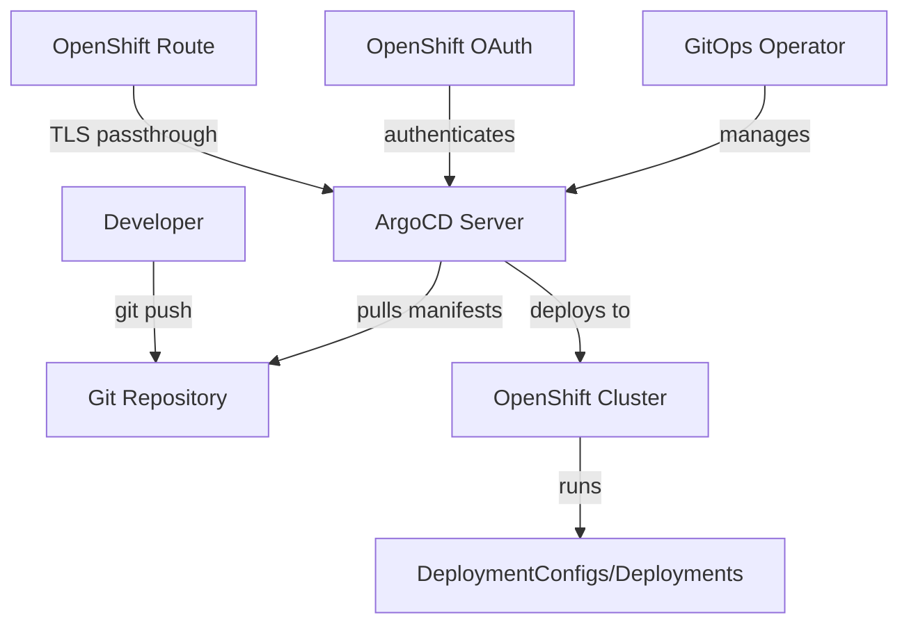

# How to Install ArgoCD on Red Hat OpenShift

Author: [nawazdhandala](https://github.com/nawazdhandala)

Tags: ArgoCD, GitOps, Kubernetes, OpenShift

Description: Learn how to install and configure ArgoCD on Red Hat OpenShift using both the OpenShift GitOps Operator and manual installation methods.

---

Red Hat OpenShift has its own opinionated approach to running Kubernetes. It adds security constraints, routes instead of ingresses, and an operator-centric model that changes how you install and run tools like ArgoCD. You have two paths: use the official Red Hat OpenShift GitOps Operator (which wraps ArgoCD), or install upstream ArgoCD manually. This guide covers both approaches so you can pick what fits your organization.

## Option 1: OpenShift GitOps Operator (Recommended)

The OpenShift GitOps Operator is Red Hat's supported distribution of ArgoCD. It integrates deeply with OpenShift, handling Routes, SCCs, and RBAC automatically. For most OpenShift users, this is the right choice.

### Install the Operator

You can install from the OpenShift web console or using the CLI.

Using the CLI, create a Subscription resource to install the operator.

```yaml
# openshift-gitops-subscription.yaml
apiVersion: operators.coreos.com/v1alpha1
kind: Subscription
metadata:
  name: openshift-gitops-operator
  namespace: openshift-operators
spec:
  channel: latest
  installPlanApproval: Automatic
  name: openshift-gitops-operator
  source: redhat-operators
  sourceNamespace: openshift-marketplace
```

Apply it to the cluster.

```bash
# Install the GitOps operator
oc apply -f openshift-gitops-subscription.yaml
```

Wait for the operator to install.

```bash
# Watch the operator pod come up
oc get pods -n openshift-operators -w

# Check that the ArgoCD instance is created in openshift-gitops namespace
oc get pods -n openshift-gitops
```

The operator automatically creates an ArgoCD instance in the `openshift-gitops` namespace.

### Access the ArgoCD UI

The operator creates an OpenShift Route automatically.

```bash
# Get the ArgoCD route URL
oc get route openshift-gitops-server -n openshift-gitops -o jsonpath='{.spec.host}'
```

Open the URL in your browser. You can log in using OpenShift credentials (the operator integrates with OpenShift OAuth by default) or use the admin password.

```bash
# Get the admin password
oc extract secret/openshift-gitops-cluster -n openshift-gitops --to=-
```

### Grant Permissions to Manage Other Namespaces

By default, the operator-created ArgoCD can only manage the `openshift-gitops` namespace. To manage other namespaces, you need to label them.

```bash
# Label a namespace for ArgoCD management
oc label namespace my-app-namespace argocd.argoproj.io/managed-by=openshift-gitops
```

Or create a custom ArgoCD instance scoped to specific namespaces.

```yaml
# custom-argocd.yaml
apiVersion: argoproj.io/v1beta1
kind: ArgoCD
metadata:
  name: team-argocd
  namespace: team-gitops
spec:
  server:
    route:
      enabled: true
  sourceNamespaces:
    - team-app-dev
    - team-app-staging
    - team-app-prod
```

```bash
oc apply -f custom-argocd.yaml
```

## Option 2: Manual Upstream ArgoCD Installation

If you need the latest upstream ArgoCD features or do not want the OpenShift operator, you can install ArgoCD manually. This requires more work to handle OpenShift security constraints.

### Create the Namespace

```bash
# Create the ArgoCD namespace
oc new-project argocd
```

### Handle Security Context Constraints

OpenShift uses Security Context Constraints (SCCs) that are stricter than default Kubernetes. ArgoCD components need the right SCC to run.

```bash
# Grant the anyuid SCC to ArgoCD service accounts
oc adm policy add-scc-to-user anyuid -z argocd-application-controller -n argocd
oc adm policy add-scc-to-user anyuid -z argocd-server -n argocd
oc adm policy add-scc-to-user anyuid -z argocd-repo-server -n argocd
oc adm policy add-scc-to-user anyuid -z argocd-dex-server -n argocd
oc adm policy add-scc-to-user anyuid -z argocd-redis -n argocd
```

### Install ArgoCD

Apply the standard manifests.

```bash
# Install ArgoCD
oc apply -n argocd -f https://raw.githubusercontent.com/argoproj/argo-cd/stable/manifests/install.yaml
```

Wait for pods to start.

```bash
oc get pods -n argocd -w
```

### Create an OpenShift Route

Instead of an Ingress, OpenShift uses Routes.

```yaml
# argocd-route.yaml
apiVersion: route.openshift.io/v1
kind: Route
metadata:
  name: argocd-server
  namespace: argocd
  annotations:
    haproxy.router.openshift.io/timeout: 300s
spec:
  to:
    kind: Service
    name: argocd-server
    weight: 100
  port:
    targetPort: https
  tls:
    termination: passthrough
    insecureEdgeTerminationPolicy: Redirect
  wildcardPolicy: None
```

```bash
oc apply -f argocd-route.yaml

# Get the route URL
oc get route argocd-server -n argocd -o jsonpath='{.spec.host}'
```

### Get the Admin Password

```bash
# Retrieve the initial admin password
oc -n argocd get secret argocd-initial-admin-secret \
  -o jsonpath="{.data.password}" | base64 -d
echo
```

## Configure ArgoCD for OpenShift

### Handle OpenShift-Specific Resources

ArgoCD needs custom health checks for OpenShift resources like DeploymentConfigs and Routes. Add these to the ArgoCD ConfigMap.

```yaml
# argocd-cm-openshift.yaml
apiVersion: v1
kind: ConfigMap
metadata:
  name: argocd-cm
  namespace: argocd
data:
  resource.customizations.health.route.openshift.io_Route: |
    hs = {}
    if obj.status ~= nil then
      if obj.status.ingress ~= nil then
        hs.status = "Healthy"
        hs.message = "Route is admitted"
        return hs
      end
    end
    hs.status = "Progressing"
    hs.message = "Route is not yet admitted"
    return hs
  resource.customizations.health.apps.openshift.io_DeploymentConfig: |
    hs = {}
    if obj.status ~= nil then
      if obj.status.availableReplicas == obj.status.replicas then
        hs.status = "Healthy"
        return hs
      end
    end
    hs.status = "Progressing"
    return hs
```

```bash
oc apply -f argocd-cm-openshift.yaml
```

### Integrate with OpenShift OAuth

To let users log in with their OpenShift credentials, configure the Dex connector.

```yaml
# argocd-cm-oauth.yaml
apiVersion: v1
kind: ConfigMap
metadata:
  name: argocd-cm
  namespace: argocd
data:
  url: https://argocd-server-argocd.apps.your-cluster.example.com
  dex.config: |
    connectors:
    - type: openshift
      id: openshift
      name: OpenShift
      config:
        issuer: https://api.your-cluster.example.com:6443
        clientID: argocd
        clientSecret: $dex.openshift.clientSecret
        redirectURI: https://argocd-server-argocd.apps.your-cluster.example.com/api/dex/callback
        insecureCA: true
```

Create the OAuth client in OpenShift.

```yaml
# oauth-client.yaml
apiVersion: oauth.openshift.io/v1
kind: OAuthClient
metadata:
  name: argocd
grantMethod: prompt
redirectURIs:
  - https://argocd-server-argocd.apps.your-cluster.example.com/api/dex/callback
secret: your-client-secret-here
```

```bash
oc apply -f oauth-client.yaml
```

## Deploy an Application

Create a test application to confirm everything works.

```bash
# Install the ArgoCD CLI
curl -sSL -o argocd https://github.com/argoproj/argo-cd/releases/latest/download/argocd-linux-amd64
chmod +x argocd
sudo mv argocd /usr/local/bin/

# Login
ARGOCD_URL=$(oc get route argocd-server -n argocd -o jsonpath='{.spec.host}')
argocd login $ARGOCD_URL --insecure --username admin --password <password>

# Create and sync an application
argocd app create guestbook \
  --repo https://github.com/argoproj/argocd-example-apps.git \
  --path guestbook \
  --dest-server https://kubernetes.default.svc \
  --dest-namespace default

argocd app sync guestbook
```

## Architecture on OpenShift



## Operator vs Manual: Which to Choose

| Feature | OpenShift GitOps Operator | Manual Install |
|---|---|---|
| Red Hat Support | Yes | No |
| Auto SCC handling | Yes | Manual |
| OpenShift Routes | Automatic | Manual |
| OAuth integration | Built-in | Manual config |
| Latest features | Lags upstream | Immediate |
| Custom CRDs | Limited | Full control |

For enterprise environments with Red Hat support contracts, the OpenShift GitOps Operator is the clear choice. For teams that need cutting-edge ArgoCD features, manual installation gives full control.

## Troubleshooting

### Pods Failing with SCC Errors

If pods fail to start with permission errors, check the SCC assignments.

```bash
oc get pod <pod-name> -n argocd -o yaml | grep -i scc
oc adm policy who-can use scc anyuid -n argocd
```

### Route Not Working

Verify the route is admitted.

```bash
oc describe route argocd-server -n argocd
```

### ArgoCD Cannot Deploy to Other Namespaces

Check that the ArgoCD service account has the right cluster role.

```bash
oc get clusterrolebinding | grep argocd
```

For the OpenShift GitOps Operator, remember to label target namespaces.

## Further Reading

- Configure RBAC for team-based access: [ArgoCD RBAC](https://oneuptime.com/blog/post/2026-01-25-rbac-policies-argocd/view)
- Set up sync waves for ordered deployments: [ArgoCD sync waves](https://oneuptime.com/blog/post/2026-01-25-sync-waves-argocd/view)
- Manage secrets securely: [ArgoCD secrets management](https://oneuptime.com/blog/post/2026-02-02-argocd-secrets/view)

OpenShift adds some extra steps compared to vanilla Kubernetes, but both the operator path and manual path work well. Choose the one that matches your support requirements and feature needs.
