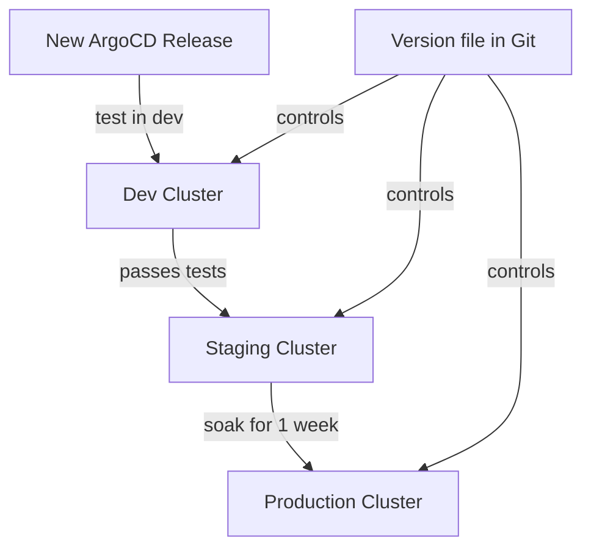

# How to Install a Specific Version of ArgoCD

Author: [nawazdhandala](https://github.com/nawazdhandala)

Tags: ArgoCD, GitOps, Kubernetes, DevOps

Description: Learn how to install a specific version of ArgoCD on Kubernetes instead of the latest release, including version pinning strategies and compatibility checks.

---

When you run `kubectl apply -f https://raw.githubusercontent.com/argoproj/argo-cd/stable/manifests/install.yaml`, you get whatever ArgoCD version is currently tagged as stable. That is fine for a first try, but in production you want to pin to a specific version. Version pinning ensures reproducible deployments, avoids surprise breaking changes, and lets you test upgrades before rolling them out.

This guide covers how to install a specific ArgoCD version, how to find which version is right for your cluster, and how to pin versions across different installation methods.

## Finding the Right Version

### Check Available Versions

ArgoCD follows semantic versioning. You can see all available releases on GitHub.

```bash
# List the 20 most recent ArgoCD releases
curl -s https://api.github.com/repos/argoproj/argo-cd/releases | \
  jq -r '.[0:20] | .[].tag_name'
```

### Check Kubernetes Compatibility

Each ArgoCD version supports specific Kubernetes versions. Check the compatibility matrix before picking a version.

| ArgoCD Version | Minimum Kubernetes | Maximum Kubernetes |
|---|---|---|
| v2.13.x | 1.27 | 1.31 |
| v2.12.x | 1.26 | 1.30 |
| v2.11.x | 1.25 | 1.29 |
| v2.10.x | 1.24 | 1.28 |

Check your cluster version.

```bash
# Get your Kubernetes version
kubectl version --short
```

Pick an ArgoCD version that supports your cluster version.

## Method 1: kubectl with Version-Pinned URL

The simplest method is to replace `stable` in the URL with a specific version tag.

```bash
# Install ArgoCD v2.13.3
ARGOCD_VERSION=v2.13.3

kubectl create namespace argocd

kubectl apply -n argocd -f \
  https://raw.githubusercontent.com/argoproj/argo-cd/${ARGOCD_VERSION}/manifests/install.yaml
```

For high availability mode:

```bash
# Install ArgoCD v2.13.3 in HA mode
kubectl apply -n argocd -f \
  https://raw.githubusercontent.com/argoproj/argo-cd/${ARGOCD_VERSION}/manifests/ha/install.yaml
```

For core-only installation (no UI):

```bash
# Install ArgoCD v2.13.3 core only
kubectl apply -n argocd -f \
  https://raw.githubusercontent.com/argoproj/argo-cd/${ARGOCD_VERSION}/manifests/core-install.yaml
```

### Download the Manifest for Offline Use

Always keep a local copy of the manifest you install. This makes it easy to reapply or diff against future versions.

```bash
# Download the manifest
curl -L -o argocd-v2.13.3-install.yaml \
  https://raw.githubusercontent.com/argoproj/argo-cd/v2.13.3/manifests/install.yaml

# Store it in version control
git add argocd-v2.13.3-install.yaml
git commit -m "Pin ArgoCD install to v2.13.3"
```

## Method 2: Helm with Version Pinning

The ArgoCD Helm chart has its own versioning that is separate from the ArgoCD application version. You need to specify both.

```bash
# Add the ArgoCD Helm repo
helm repo add argo https://argoproj.github.io/argo-helm
helm repo update

# List available chart versions
helm search repo argo/argo-cd --versions | head -20
```

Install with a specific chart version and application version.

```bash
# Install with Helm, pinning both chart and app version
helm install argocd argo/argo-cd \
  --namespace argocd \
  --create-namespace \
  --version 7.7.10 \
  --set global.image.tag=v2.13.3
```

For reproducibility, use a values file.

```yaml
# argocd-values.yaml
global:
  image:
    # Pin the ArgoCD image version
    tag: v2.13.3

# Pin the Dex image version
dex:
  image:
    tag: v2.38.0

# Pin the Redis image version
redis:
  image:
    tag: 7.0.15-alpine
```

```bash
helm install argocd argo/argo-cd \
  --namespace argocd \
  --create-namespace \
  --version 7.7.10 \
  -f argocd-values.yaml
```

## Method 3: Kustomize with Version Pinning

Kustomize lets you reference a versioned remote manifest and add your own patches.

```yaml
# kustomization.yaml
apiVersion: kustomize.config.k8s.io/v1beta1
kind: Kustomization

namespace: argocd

resources:
  # Pin to v2.13.3
  - https://raw.githubusercontent.com/argoproj/argo-cd/v2.13.3/manifests/install.yaml
```

Apply with Kustomize.

```bash
kubectl apply -k .
```

For more on this approach, see [Install ArgoCD using Kustomize](https://oneuptime.com/blog/post/2026-02-26-install-argocd-using-kustomize/view).

## Method 4: Terraform with Version Pinning

If you manage infrastructure with Terraform, pin the ArgoCD version in your Terraform code.

```hcl
# main.tf
resource "helm_release" "argocd" {
  name             = "argocd"
  repository       = "https://argoproj.github.io/argo-helm"
  chart            = "argo-cd"
  version          = "7.7.10"  # Helm chart version
  namespace        = "argocd"
  create_namespace = true

  set {
    name  = "global.image.tag"
    value = "v2.13.3"  # ArgoCD app version
  }
}
```

## Verifying the Installed Version

After installation, confirm you are running the expected version.

```bash
# Check the ArgoCD server version
kubectl -n argocd exec deployment/argocd-server -- argocd version --short

# Check all ArgoCD component image versions
kubectl get pods -n argocd -o jsonpath='{range .items[*]}{.metadata.name}{"\t"}{.spec.containers[*].image}{"\n"}{end}'
```

You should see the version you pinned in all image tags.

## Pinning the CLI Version

The ArgoCD CLI should match the server version. Download a specific CLI version.

```bash
# Download a specific CLI version
ARGOCD_VERSION=v2.13.3

# For Linux
curl -sSL -o argocd \
  https://github.com/argoproj/argo-cd/releases/download/${ARGOCD_VERSION}/argocd-linux-amd64

# For macOS (Intel)
curl -sSL -o argocd \
  https://github.com/argoproj/argo-cd/releases/download/${ARGOCD_VERSION}/argocd-darwin-amd64

# For macOS (Apple Silicon)
curl -sSL -o argocd \
  https://github.com/argoproj/argo-cd/releases/download/${ARGOCD_VERSION}/argocd-darwin-arm64

chmod +x argocd
sudo mv argocd /usr/local/bin/

# Verify
argocd version --client
```

## Version Pinning Strategy

Here is a practical version pinning strategy for teams:



1. **Keep a version file in Git** that specifies the ArgoCD version for each environment
2. **Test new versions in dev first** by updating the dev version file
3. **Promote to staging** after dev runs stable for a few days
4. **Promote to production** after staging runs stable for at least a week
5. **Never auto-update production** - always test first

Example version file:

```yaml
# argocd-versions.yaml
environments:
  dev:
    argocd: v2.14.0  # Testing new version
    chart: 7.8.0
  staging:
    argocd: v2.13.3  # Proven stable
    chart: 7.7.10
  production:
    argocd: v2.13.3  # Same as staging after soak
    chart: 7.7.10
```

## Avoiding Version Drift

To prevent someone from accidentally installing a different version, add a label or annotation to track the intended version.

```yaml
# Add version metadata to the namespace
apiVersion: v1
kind: Namespace
metadata:
  name: argocd
  labels:
    argocd-version: v2.13.3
  annotations:
    argocd.install-date: "2026-02-26"
    argocd.install-method: "kubectl"
```

## Troubleshooting

### Wrong Version Running After Apply

If the pods are not using the expected image, they may not have restarted.

```bash
# Force a rollout restart
kubectl rollout restart deployment -n argocd
kubectl rollout restart statefulset -n argocd
```

### Version Not Found

If the URL returns a 404, the version tag may not exist.

```bash
# Check if the version exists
curl -I https://raw.githubusercontent.com/argoproj/argo-cd/v2.13.3/manifests/install.yaml
```

### CLI and Server Version Mismatch

The CLI warns you if its version does not match the server. Update the CLI to match.

```bash
# Check for mismatches
argocd version
```

## Further Reading

- Upgrade between versions: [Upgrade ArgoCD from v2.x to v3.x](https://oneuptime.com/blog/post/2026-02-26-upgrade-argocd-v2-to-v3/view)
- Zero-downtime upgrades: [Upgrade ArgoCD without downtime](https://oneuptime.com/blog/post/2026-02-26-upgrade-argocd-without-downtime/view)
- Verify your installation: [Verify ArgoCD installation is healthy](https://oneuptime.com/blog/post/2026-02-26-verify-argocd-installation-healthy/view)

Pinning ArgoCD to a specific version is a basic but critical practice. It prevents surprise breakages, makes your deployments reproducible, and gives you control over when upgrades happen. Always pin, always test, and always promote through environments.
