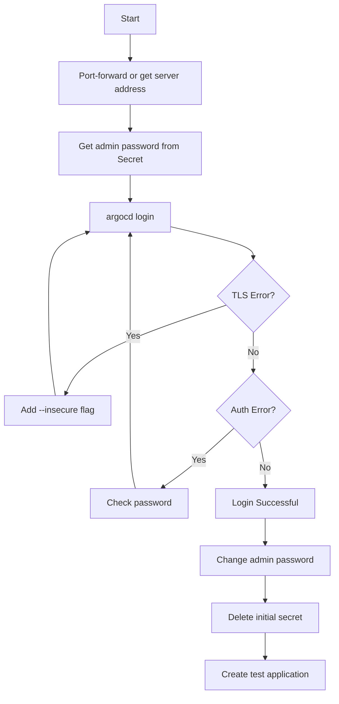

# How to Login to ArgoCD Using CLI for the First Time

Author: [nawazdhandala](https://github.com/nawazdhandala)

Tags: ArgoCD, GitOps, Kubernetes, CLI

Description: A beginner-friendly walkthrough of logging into ArgoCD for the first time using the CLI, including password retrieval, common errors, and initial configuration.

---

You have installed ArgoCD on your cluster and the ArgoCD CLI on your machine. Now you need to actually connect to it. The first login can be confusing because ArgoCD generates a random initial password, uses self-signed certificates that your CLI will reject, and requires port-forwarding if you have not set up an Ingress.

This guide walks through every step of the first login process, handles the common errors you will hit, and gets you ready to start using ArgoCD.

## Step 1: Make ArgoCD Accessible

Before you can login, the CLI needs to reach the ArgoCD API server. If you have not configured an Ingress or LoadBalancer, use port-forwarding.

```bash
# Start port-forwarding to the ArgoCD server
kubectl port-forward svc/argocd-server -n argocd 8080:443 &
```

This forwards `localhost:8080` to the ArgoCD server. The `&` runs it in the background so you can continue using your terminal.

Verify it is working:

```bash
# Test the connection
curl -sk https://localhost:8080/healthz
# Should return: ok
```

If you already have ArgoCD exposed through an Ingress or LoadBalancer, you can skip this step and use that address instead.

## Step 2: Get the Initial Admin Password

ArgoCD creates a random password during installation and stores it in a Kubernetes Secret.

```bash
# Retrieve the initial admin password
kubectl -n argocd get secret argocd-initial-admin-secret \
  -o jsonpath="{.data.password}" | base64 -d
echo
```

This prints the password. Copy it - you will need it for the next step.

If the secret does not exist, it may have been deleted (ArgoCD recommends deleting it after first login). In that case, you need to reset the password. See the troubleshooting section below.

## Step 3: Login with the CLI

Now connect the CLI to the server.

```bash
# Login to ArgoCD
argocd login localhost:8080 --username admin --password '<your-password>' --insecure
```

Let us break down the flags:

- `localhost:8080` - The ArgoCD server address (from port-forwarding)
- `--username admin` - The default admin account
- `--password '<your-password>'` - The password from Step 2
- `--insecure` - Skip TLS certificate verification (needed because ArgoCD uses a self-signed cert by default)

If the login succeeds, you will see:

```
'admin:login' logged in successfully
Context 'localhost:8080' updated
```

## Step 4: Verify the Connection

Run a few commands to make sure everything works.

```bash
# Check the ArgoCD server version
argocd version

# List clusters (should show at least the in-cluster connection)
argocd cluster list

# List applications (empty if you have not created any)
argocd app list

# Check your account info
argocd account get-user-info
```

## Step 5: Change the Admin Password

The initial password is randomly generated and hard to remember. Change it to something secure.

```bash
# Change the admin password
argocd account update-password \
  --current-password '<initial-password>' \
  --new-password '<new-secure-password>'
```

After changing the password, delete the initial admin secret since it is no longer needed.

```bash
# Delete the initial admin secret
kubectl -n argocd delete secret argocd-initial-admin-secret
```

## Step 6: Test with a Sample Application

Create a simple application to verify the full pipeline works.

```bash
# Create the guestbook sample application
argocd app create guestbook \
  --repo https://github.com/argoproj/argocd-example-apps.git \
  --path guestbook \
  --dest-server https://kubernetes.default.svc \
  --dest-namespace default

# Check its status
argocd app get guestbook
```

You should see the application in `OutOfSync` status (because you have not synced it yet).

```bash
# Sync the application
argocd app sync guestbook

# Check again - should be Synced and Healthy
argocd app get guestbook
```

If this works, your ArgoCD installation and CLI are fully operational.

## Step 7: Access the Web UI

While you are at it, test the web UI too. Open your browser to `https://localhost:8080` (or your ArgoCD URL). You will see a certificate warning - accept it. Log in with username `admin` and your new password.

You should see the guestbook application you just created displayed in the dashboard.

## Login Without Interactive Prompts

For scripts and CI/CD, you may want to login without any prompts.

```bash
# Login with all flags specified (no prompts)
argocd login localhost:8080 \
  --username admin \
  --password '<password>' \
  --insecure \
  --grpc-web

# Or use environment variables
export ARGOCD_SERVER=localhost:8080
export ARGOCD_AUTH_TOKEN=$(argocd account generate-token)

# Now commands work without explicit login
argocd app list
```

## Login Flow Diagram



## Common Errors and Fixes

### Error: "x509: certificate signed by unknown authority"

This happens because ArgoCD uses a self-signed certificate.

```bash
# Fix: Add --insecure flag
argocd login localhost:8080 --insecure --username admin --password '<password>'

# Or import the ArgoCD CA cert
kubectl -n argocd get secret argocd-server-tls -o jsonpath='{.data.tls\.crt}' | base64 -d > argocd-ca.crt
argocd login localhost:8080 --certificate-authority argocd-ca.crt --username admin --password '<password>'
```

### Error: "rpc error: code = Unavailable"

The CLI cannot reach the server. Check port-forwarding.

```bash
# Is port-forwarding still running?
ps aux | grep port-forward

# If not, restart it
kubectl port-forward svc/argocd-server -n argocd 8080:443 &
```

### Error: "rpc error: code = Unauthenticated"

Wrong password or expired session.

```bash
# Re-check the password
kubectl -n argocd get secret argocd-initial-admin-secret \
  -o jsonpath="{.data.password}" | base64 -d
echo

# Try logging in again
argocd login localhost:8080 --insecure --username admin --password '<correct-password>'
```

### Error: "FATA[0000] Argo CD server address unspecified"

You did not specify which server to connect to.

```bash
# Specify the server
argocd login localhost:8080

# Or set the environment variable
export ARGOCD_SERVER=localhost:8080
```

### Error: "secret argocd-initial-admin-secret not found"

The initial secret has been deleted. Reset the admin password manually.

```bash
# Generate a bcrypt hash of your new password
# You can use Python
HASH=$(python3 -c "import bcrypt; print(bcrypt.hashpw(b'new-password', bcrypt.gensalt()).decode())")

# Or use the argocd binary
NEW_HASH=$(argocd account bcrypt --password 'new-password')

# Update the admin password in the argocd-secret
kubectl -n argocd patch secret argocd-secret -p \
  "{\"stringData\": {\"admin.password\": \"$NEW_HASH\", \"admin.passwordMtime\": \"$(date +%FT%T%Z)\"}}"
```

### Error: "transport: Error while dialing dial tcp"

If you see connection refused, the port-forward may have timed out.

```bash
# Kill existing port-forwards
pkill -f "port-forward.*argocd"

# Start a fresh one
kubectl port-forward svc/argocd-server -n argocd 8080:443 &
```

## Tips for First-Time Users

### Use the Web UI for Exploration

While the CLI is powerful, the web UI is better for your first time because it visualizes the application tree, shows health status with colors, and lets you browse diffs interactively.

### Start with Read-Only Operations

Before creating or syncing applications, get comfortable with read commands.

```bash
argocd app list
argocd cluster list
argocd repo list
argocd project list
```

### Save Your Context

After logging in, the CLI saves the connection info. You do not need to login again unless the token expires.

```bash
# Check your current context
argocd context

# Your context is saved in
cat ~/.config/argocd/config
```

## Further Reading

- Install the CLI: [Install ArgoCD CLI](https://oneuptime.com/blog/post/2026-02-26-install-argocd-cli/view)
- Configure CLI for different environments: [Configure ArgoCD CLI with cluster](https://oneuptime.com/blog/post/2026-02-26-configure-argocd-cli-with-cluster/view)
- Change the admin password: [Change ArgoCD admin password](https://oneuptime.com/blog/post/2026-02-26-change-argocd-admin-password/view)
- Disable admin for security: [Disable ArgoCD admin account](https://oneuptime.com/blog/post/2026-02-26-disable-argocd-admin-account/view)

The first login is always the hardest part. Once you are in, ArgoCD is intuitive. If you hit certificate errors, use `--insecure`. If you hit authentication errors, double-check the password from the secret. And always change the admin password after your first login.
