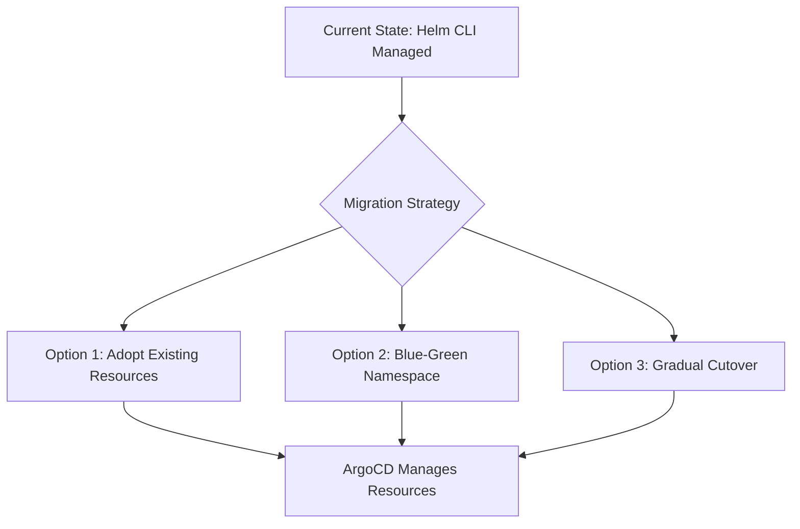

# How to Migrate from Helm CLI to ArgoCD Managed Helm Deployments

Author: [nawazdhandala](https://github.com/nawazdhandala)

Tags: ArgoCD, GitOps, Kubernetes, Helm, Migration

Description: Step-by-step guide to migrating existing Helm CLI deployments to ArgoCD-managed GitOps workflows without downtime or resource recreation.

---

You have been running `helm install` and `helm upgrade` from your laptop or CI pipeline for months. Your releases work, but you have no drift detection, no visual resource tree, and rollbacks mean digging through Helm release history. Moving to ArgoCD-managed Helm deployments gives you all of that, but the migration needs care to avoid recreating resources or causing downtime.

This guide walks through the complete migration process, from capturing your current Helm state to handing control over to ArgoCD.

## The Challenge

When ArgoCD deploys a Helm chart, it renders the templates and applies the resulting manifests using `kubectl apply`. It does not use `helm install` or `helm upgrade` under the hood. This means ArgoCD does not create or manage Helm release secrets (the `sh.helm.release.v1.*` secrets in the namespace). Your existing Helm release metadata and ArgoCD's management model are fundamentally different.

The key challenge: resources already exist in the cluster. If ArgoCD tries to create them, you get conflicts. If you delete them first, you get downtime.



## Step 1: Document Current State

Before migrating, capture everything about your current Helm releases:

```bash
# List all Helm releases across namespaces
helm list --all-namespaces

# Export the values for each release
helm get values my-app -n production -o yaml > my-app-values.yaml

# Export the full manifest to compare later
helm get manifest my-app -n production > my-app-manifest.yaml

# Check the chart version
helm list -n production -o json | jq '.[] | {name, chart, app_version, revision}'
```

Save these files in your Git repository. You will need them for the ArgoCD Application configuration.

## Step 2: Set Up Git Repository Structure

Create a Git repo structure that ArgoCD can consume:

```
k8s-deployments/
  apps/
    my-app/
      Chart.yaml        # Points to the same chart
      values.yaml       # Base values from helm get values
      values-prod.yaml  # Production overrides
```

If your chart comes from a Helm repository, the ArgoCD Application will reference the repo directly. If it is a local chart in Git, commit the chart source.

For a chart from a repository:

```yaml
# No Chart.yaml needed - ArgoCD pulls directly from the repo
# Just commit the values files
```

For a chart from Git:

```yaml
# Chart.yaml should match your current chart exactly
apiVersion: v2
name: my-app
version: 1.2.3  # Match current deployed version
```

## Step 3: Create ArgoCD Application with Replace Sync

The critical step is telling ArgoCD to adopt existing resources instead of failing on conflicts. Use the `Replace` or `ServerSideApply` sync option:

```yaml
# argocd-application.yaml
apiVersion: argoproj.io/v1alpha1
kind: Application
metadata:
  name: my-app
  namespace: argocd
spec:
  project: default
  source:
    # Option A: Chart from Helm repository
    repoURL: https://charts.myorg.com
    chart: my-app
    targetRevision: 1.2.3
    helm:
      valueFiles:
        - values.yaml
      # Inline values if needed
      values: |
        replicaCount: 3
  destination:
    server: https://kubernetes.default.svc
    namespace: production
  syncPolicy:
    # Do NOT enable automated sync yet
    syncOptions:
      - ServerSideApply=true  # Allows adopting existing resources
      - CreateNamespace=false  # Namespace already exists
```

Apply the Application but do not sync yet:

```bash
# Create the ArgoCD application in a paused state
kubectl apply -f argocd-application.yaml
```

## Step 4: Verify the Diff

Check what ArgoCD sees as the difference between your running resources and the chart output:

```bash
# View the diff without applying
argocd app diff my-app

# Check the sync status
argocd app get my-app
```

The diff should be minimal. Common differences include:
- Labels added by Helm CLI that ArgoCD does not add
- Annotations like `meta.helm.sh/release-name` and `meta.helm.sh/release-namespace`
- Default values that Helm CLI applied but are not in your values file

If the diff shows significant changes, adjust your values files until the rendered output matches what is currently deployed.

## Step 5: Configure Ignore Differences

Helm CLI adds management labels that ArgoCD does not use. Tell ArgoCD to ignore these:

```yaml
spec:
  ignoreDifferences:
    - group: ""
      kind: "*"
      jsonPointers:
        - /metadata/labels/app.kubernetes.io~1managed-by
        - /metadata/annotations/meta.helm.sh~1release-name
        - /metadata/annotations/meta.helm.sh~1release-namespace
    - group: apps
      kind: Deployment
      jsonPointers:
        - /metadata/labels/app.kubernetes.io~1managed-by
```

## Step 6: Perform the Initial Sync

Once the diff looks clean, sync the application:

```bash
# Sync with server-side apply to adopt resources
argocd app sync my-app --server-side

# Verify health after sync
argocd app get my-app
```

ArgoCD now manages the resources. The existing Pods continue running - no restart, no downtime.

## Step 7: Clean Up Helm Release Secrets

After ArgoCD takes over, the old Helm release secrets are orphaned. They consume etcd space and can confuse anyone running `helm list`:

```bash
# List Helm release secrets
kubectl get secrets -n production -l owner=helm

# Delete the release secrets for the migrated app
# Be careful - only delete for the app you migrated
kubectl delete secret -n production -l name=my-app,owner=helm
```

After cleanup, `helm list` no longer shows the release, and ArgoCD is the sole owner.

## Step 8: Enable Automated Sync

Once you have verified everything works:

```yaml
spec:
  syncPolicy:
    automated:
      prune: true
      selfHeal: true
    syncOptions:
      - ServerSideApply=true
```

Update the Application:

```bash
kubectl apply -f argocd-application.yaml
```

## Migrating Multiple Releases

For teams with dozens of Helm releases, script the migration:

```bash
#!/bin/bash
# migrate-helm-releases.sh

RELEASES=$(helm list -A -o json | jq -r '.[] | "\(.name) \(.namespace) \(.chart)"')

while IFS=' ' read -r name namespace chart; do
  echo "Exporting values for ${name} in ${namespace}..."
  helm get values "${name}" -n "${namespace}" -o yaml > "values/${name}-values.yaml"

  echo "Creating ArgoCD Application for ${name}..."
  # Generate ArgoCD Application YAML from a template
  envsubst < templates/application.tmpl.yaml > "applications/${name}.yaml"
done <<< "${RELEASES}"
```

## Rollback Strategy

If something goes wrong during migration:

```bash
# Delete the ArgoCD application without deleting resources
argocd app delete my-app --cascade=false

# Resources remain untouched in the cluster
# Re-import into Helm if needed
helm upgrade my-app my-chart -n production \
  --install \
  --values my-app-values.yaml \
  --description "Re-imported after ArgoCD migration rollback"
```

## Post-Migration Checklist

- ArgoCD Application shows Healthy and Synced
- `helm list` no longer shows the release (after secret cleanup)
- CI pipeline updated to commit values changes to Git instead of running `helm upgrade`
- Team members have ArgoCD UI access
- Notifications configured for sync failures
- Self-heal and auto-prune enabled

The migration from Helm CLI to ArgoCD is a one-time effort that pays off immediately in visibility and control. For more on how ArgoCD handles Helm charts, see our [Helm and ArgoCD GitOps guide](https://oneuptime.com/blog/post/2026-01-17-helm-argocd-gitops-deployment/view).
