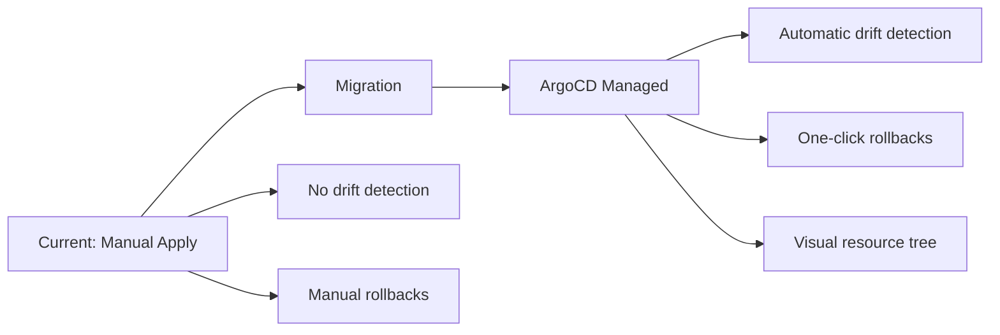

# How to Migrate from Kustomize CLI to ArgoCD Managed Kustomize

Author: [nawazdhandala](https://github.com/nawazdhandala)

Tags: ArgoCD, GitOps, Kubernetes, Kustomize, Migration

Description: Step-by-step guide to migrating from manual kustomize build and kubectl apply workflows to ArgoCD-managed Kustomize deployments without downtime or resource disruption.

---

Your team has been running `kustomize build overlays/production | kubectl apply -f -` from CI pipelines or developer laptops. It works, but there is no drift detection, no visual dashboard, and no one knows if the cluster matches Git. Migrating to ArgoCD-managed Kustomize deployments adds all of that without changing your Kustomize structure or manifests.

This guide covers the migration process step by step, from auditing your current state to handing ownership to ArgoCD and updating your team's workflow.

## Why Migrate

The manual Kustomize workflow has gaps:

- **No drift detection**: If someone runs `kubectl edit` on a resource, nobody knows
- **No rollback visibility**: Rolling back means finding the right Git commit and reapplying
- **No sync status**: Is production up to date? You have to check manually
- **No coordination**: Two people running `kubectl apply` at the same time causes conflicts

ArgoCD fills all of these gaps while keeping your Kustomize structure untouched.



## Step 1: Audit Your Current Deployments

Document what is currently deployed and how:

```bash
# List all resources in the target namespace
kubectl get all -n production -o wide

# Export current state for comparison
kubectl get deployments,services,configmaps,secrets,ingress \
  -n production -o yaml > current-state.yaml

# Check if your kustomize build matches what is deployed
kustomize build overlays/production > desired-state.yaml
diff <(kubectl get all -n production -o yaml) desired-state.yaml
```

Note any differences between Git and the cluster. These are existing drift that you should resolve before migration.

## Step 2: Resolve Existing Drift

Before ArgoCD takes over, make sure Git accurately represents the desired state:

```bash
# Build and diff against the live state
kustomize build overlays/production | kubectl diff -f -
```

If there are differences:
- **Git is behind the cluster**: Update your Kustomize manifests to match the live state (e.g., updated image tags, changed replica counts)
- **Cluster is behind Git**: Apply the current Git state to catch up

```bash
# Apply to resolve drift (make cluster match Git)
kustomize build overlays/production | kubectl apply -f -
```

## Step 3: Ensure Git Repository Is ArgoCD-Accessible

ArgoCD needs to clone your Git repository. If it is private, register the credentials:

```bash
# Add the repository to ArgoCD
argocd repo add https://github.com/myorg/k8s-configs.git \
  --username git \
  --password <github-token>

# Verify access
argocd repo list
```

## Step 4: Create the ArgoCD Application

Create an Application that points to your Kustomize overlay:

```yaml
# argocd-app.yaml
apiVersion: argoproj.io/v1alpha1
kind: Application
metadata:
  name: my-app-production
  namespace: argocd
spec:
  project: default
  source:
    repoURL: https://github.com/myorg/k8s-configs.git
    targetRevision: main
    path: overlays/production
  destination:
    server: https://kubernetes.default.svc
    namespace: production
  # Start WITHOUT auto-sync to control the first sync manually
  syncPolicy:
    syncOptions:
      - ServerSideApply=true  # Adopt existing resources
```

Apply but do not sync yet:

```bash
kubectl apply -f argocd-app.yaml
```

## Step 5: Check the Diff

Before syncing, verify that ArgoCD sees minimal differences:

```bash
# View the diff
argocd app diff my-app-production

# Get detailed status
argocd app get my-app-production
```

Expected differences include:
- Labels like `app.kubernetes.io/managed-by` that ArgoCD adds
- Annotations related to `kubectl.kubernetes.io/last-applied-configuration`

If the diff shows unexpected changes, check your kustomization.yaml build options match what you have been using in CI.

## Step 6: Configure Ignore Differences

Set up ArgoCD to ignore fields that will naturally differ:

```yaml
spec:
  ignoreDifferences:
    - group: apps
      kind: Deployment
      jsonPointers:
        - /spec/replicas  # If using HPA
    - group: ""
      kind: Service
      jsonPointers:
        - /spec/clusterIP  # Assigned by Kubernetes
    - group: ""
      kind: "*"
      managedFieldsManagers:
        - kube-controller-manager  # Ignore controller-managed fields
```

## Step 7: Perform the Initial Sync

With server-side apply, ArgoCD adopts existing resources without recreating them:

```bash
# Sync with server-side apply
argocd app sync my-app-production --server-side

# Watch the sync progress
argocd app get my-app-production --watch

# Verify all resources are healthy
argocd app resources my-app-production
```

No Pods should restart. No resources should be deleted and recreated. The existing resources are now tracked by ArgoCD.

## Step 8: Verify Application Health

Check that everything is green:

```bash
# Overall health
argocd app get my-app-production

# Resource-level health
argocd app resources my-app-production

# Check in the UI
echo "https://argocd.myorg.com/applications/my-app-production"
```

## Step 9: Enable Auto-Sync

Once you are confident ArgoCD is managing resources correctly:

```yaml
spec:
  syncPolicy:
    automated:
      prune: true
      selfHeal: true
    syncOptions:
      - ServerSideApply=true
    retry:
      limit: 5
      backoff:
        duration: 30s
        factor: 2
        maxDuration: 5m
```

```bash
# Update the application
kubectl apply -f argocd-app.yaml

# Verify auto-sync is enabled
argocd app get my-app-production -o json | jq '.spec.syncPolicy'
```

## Step 10: Update CI/CD Pipeline

Replace `kubectl apply` in your CI pipeline with Git operations:

Before (manual apply):

```yaml
# Old CI pipeline
deploy:
  script:
    - kustomize build overlays/production | kubectl apply -f -
```

After (GitOps):

```yaml
# New CI pipeline - just update Git
deploy:
  script:
    # Update image tag in the overlay
    - cd overlays/production
    - kustomize edit set image myorg/my-app:${CI_COMMIT_TAG}
    - git add kustomization.yaml
    - git commit -m "Deploy ${CI_COMMIT_TAG} to production"
    - git push origin main
    # ArgoCD detects the change and syncs automatically
```

## Step 11: Remove Direct Cluster Access

After the migration is stable, restrict direct `kubectl` access:

- Remove CI pipeline service accounts that had cluster write access
- Update RBAC to make ArgoCD the only writer
- Keep read-only `kubectl` access for debugging

## Rollback Plan

If something goes wrong, you can remove ArgoCD management without affecting resources:

```bash
# Delete the ArgoCD application without deleting its resources
argocd app delete my-app-production --cascade=false

# Resources continue running untouched
# Revert to manual kubectl apply workflow
kustomize build overlays/production | kubectl apply -f -
```

## Migration Checklist

- [ ] Current state documented and drift resolved
- [ ] Git repository accessible to ArgoCD
- [ ] ArgoCD Application created (without auto-sync)
- [ ] Diff reviewed and ignore-differences configured
- [ ] Initial sync completed with server-side apply
- [ ] All resources healthy in ArgoCD
- [ ] Auto-sync enabled with prune and self-heal
- [ ] CI pipeline updated to push to Git instead of kubectl apply
- [ ] Team trained on ArgoCD UI and CLI
- [ ] Notifications configured for sync failures
- [ ] Direct cluster write access restricted

For more on deploying Kustomize applications with ArgoCD, see our [Kustomize deployment guide](https://oneuptime.com/blog/post/2026-02-26-argocd-deploy-kustomize-applications/view).
