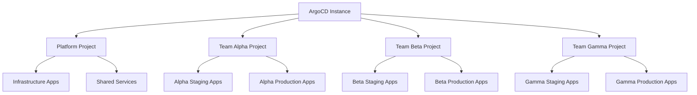
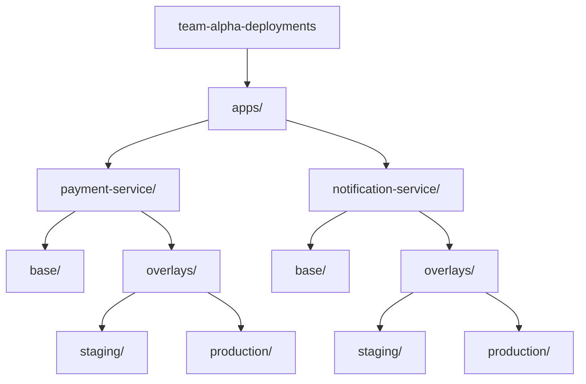

# How Platform Teams Should Structure ArgoCD for Developers

Author: [nawazdhandala](https://github.com/nawazdhandala)

Tags: ArgoCD, GitOps, Kubernetes, Platform Engineering, Developer Experience

Description: Learn how platform teams should structure ArgoCD with projects, RBAC, ApplicationSets, and self-service patterns to enable developer productivity while maintaining governance.

---

Platform engineering is about reducing cognitive load for developers while maintaining security and operational standards. ArgoCD is a powerful tool, but if poorly structured, it becomes a bottleneck rather than an enabler. Platform teams need to design their ArgoCD installation so developers can deploy confidently without needing deep Kubernetes expertise or waiting for platform team approvals.

This guide covers the organizational patterns, RBAC models, project structures, and self-service mechanisms that successful platform teams use with ArgoCD.

## The Core Principles

Before diving into configuration, establish these principles:

1. **Developers own their applications, platform owns the infrastructure**
2. **Self-service by default, manual approval by exception**
3. **Guardrails instead of gates** - prevent bad deployments rather than approving good ones
4. **Visibility for everyone, control where it matters**

## Multi-Tenancy Model

Structure ArgoCD around teams, not individual applications:



## Step 1: Define AppProjects per Team

Each team gets an AppProject that defines what they can deploy and where.

```yaml
# projects/team-alpha.yaml
apiVersion: argoproj.io/v1alpha1
kind: AppProject
metadata:
  name: team-alpha
  namespace: argocd
spec:
  description: "Team Alpha - Payment Services"

  # Allowed source repositories
  sourceRepos:
    - https://github.com/company/team-alpha-*
    - https://github.com/company/shared-charts

  # Allowed destination namespaces
  destinations:
    - namespace: alpha-staging
      server: https://kubernetes.default.svc
    - namespace: alpha-production
      server: https://kubernetes.default.svc
    - namespace: alpha-*
      server: https://kubernetes.default.svc

  # Allowed cluster resources (restricted)
  clusterResourceWhitelist: []  # No cluster-scoped resources

  # Allowed namespace resources
  namespaceResourceWhitelist:
    - group: ""
      kind: ConfigMap
    - group: ""
      kind: Secret
    - group: ""
      kind: Service
    - group: apps
      kind: Deployment
    - group: apps
      kind: StatefulSet
    - group: batch
      kind: Job
    - group: batch
      kind: CronJob
    - group: networking.k8s.io
      kind: Ingress
    - group: autoscaling
      kind: HorizontalPodAutoscaler
    - group: policy
      kind: PodDisruptionBudget

  # Deny list - resources teams cannot create
  namespaceResourceBlacklist:
    - group: ""
      kind: ResourceQuota
    - group: ""
      kind: LimitRange
    - group: rbac.authorization.k8s.io
      kind: Role
    - group: rbac.authorization.k8s.io
      kind: RoleBinding

  # RBAC roles
  roles:
    - name: developer
      description: Developer access - deploy and view
      policies:
        - p, proj:team-alpha:developer, applications, get, team-alpha/*, allow
        - p, proj:team-alpha:developer, applications, sync, team-alpha/*, allow
        - p, proj:team-alpha:developer, applications, override, team-alpha/*, allow
        - p, proj:team-alpha:developer, applications, action/*, team-alpha/*, allow
        - p, proj:team-alpha:developer, logs, get, team-alpha/*, allow
      groups:
        - team-alpha-developers

    - name: lead
      description: Team lead - full access including delete
      policies:
        - p, proj:team-alpha:lead, applications, *, team-alpha/*, allow
        - p, proj:team-alpha:lead, logs, get, team-alpha/*, allow
        - p, proj:team-alpha:lead, exec, create, team-alpha/*, allow
      groups:
        - team-alpha-leads

  # Sync windows for production
  syncWindows:
    - kind: allow
      schedule: "0 9-17 * * 1-5"  # Business hours, weekdays
      duration: 8h
      applications:
        - "*-production"
      namespaces:
        - alpha-production
      manualSync: true
    - kind: deny
      schedule: "0 0 25 12 *"  # Christmas day
      duration: 24h
      applications:
        - "*"
```

## Step 2: RBAC Configuration

Configure ArgoCD RBAC to map SSO groups to project roles.

```yaml
# argocd-rbac-cm ConfigMap
apiVersion: v1
kind: ConfigMap
metadata:
  name: argocd-rbac-cm
  namespace: argocd
data:
  # Default policy - read-only for authenticated users
  policy.default: role:readonly

  policy.csv: |
    # Platform team - full admin access
    g, platform-admins, role:admin

    # Team-specific roles mapped from SSO groups
    g, team-alpha-developers, proj:team-alpha:developer
    g, team-alpha-leads, proj:team-alpha:lead

    g, team-beta-developers, proj:team-beta:developer
    g, team-beta-leads, proj:team-beta:lead

    # Cross-team read access for observability
    p, role:readonly, applications, get, */*, allow
    p, role:readonly, logs, get, */*, allow

    # Prevent non-admins from modifying ArgoCD settings
    p, role:readonly, certificates, get, *, allow
    p, role:readonly, clusters, get, *, allow
    p, role:readonly, repositories, get, *, allow
    p, role:readonly, projects, get, *, allow

  # Use SSO groups for RBAC
  scopes: "[groups]"
```

## Step 3: Namespace Provisioning

Platform teams should pre-provision namespaces with proper quotas and network policies, then expose them to teams through AppProjects.

```yaml
# platform/namespaces/team-alpha.yaml
apiVersion: v1
kind: Namespace
metadata:
  name: alpha-production
  labels:
    team: alpha
    environment: production
    managed-by: platform
---
apiVersion: v1
kind: ResourceQuota
metadata:
  name: default-quota
  namespace: alpha-production
spec:
  hard:
    requests.cpu: "20"
    requests.memory: 40Gi
    limits.cpu: "40"
    limits.memory: 80Gi
    persistentvolumeclaims: "20"
    services.loadbalancers: "2"
---
apiVersion: networking.k8s.io/v1
kind: NetworkPolicy
metadata:
  name: default-deny
  namespace: alpha-production
spec:
  podSelector: {}
  policyTypes:
    - Ingress
    - Egress
  ingress:
    - from:
        - namespaceSelector:
            matchLabels:
              team: alpha
    - from:
        - namespaceSelector:
            matchLabels:
              name: ingress-nginx
  egress:
    - to:
        - namespaceSelector:
            matchLabels:
              team: alpha
    - to: []  # Allow DNS
      ports:
        - port: 53
          protocol: UDP
    - to: []  # Allow HTTPS egress
      ports:
        - port: 443
          protocol: TCP
```

## Step 4: Standardize Application Onboarding

Use ApplicationSets to automate application creation when teams add manifests to their repositories.

```yaml
# platform/applicationsets/team-alpha.yaml
apiVersion: argoproj.io/v1alpha1
kind: ApplicationSet
metadata:
  name: team-alpha-apps
  namespace: argocd
spec:
  generators:
    - git:
        repoURL: https://github.com/company/team-alpha-deployments.git
        revision: main
        directories:
          - path: apps/*/overlays/*
  template:
    metadata:
      name: "alpha-{{path[1]}}-{{path[3]}}"
      labels:
        team: alpha
        app: "{{path[1]}}"
        environment: "{{path[3]}}"
      annotations:
        notifications.argoproj.io/subscribe.on-sync-failed.slack: alpha-deployments
        notifications.argoproj.io/subscribe.on-health-degraded.slack: alpha-alerts
    spec:
      project: team-alpha
      source:
        repoURL: https://github.com/company/team-alpha-deployments.git
        targetRevision: main
        path: "apps/{{path[1]}}/overlays/{{path[3]}}"
      destination:
        server: https://kubernetes.default.svc
        namespace: "alpha-{{path[3]}}"
      syncPolicy:
        automated:
          prune: true
          selfHeal: true
        syncOptions:
          - CreateNamespace=false  # Namespace must exist
```

## Step 5: Developer-Facing Documentation

Create a clear developer guide in your internal documentation:

```text
# Deploying with ArgoCD - Developer Guide

## Adding a New Application

1. Create a directory in your team's deployment repo:
   apps/<app-name>/overlays/<environment>/

2. Add your Kustomization and patches:
   apps/my-service/overlays/staging/kustomization.yaml

3. Push to main. ArgoCD automatically creates the application.

## Checking Deployment Status

- ArgoCD UI: https://argocd.company.com
- CLI: argocd app get alpha-my-service-staging

## Triggering a Manual Sync

- UI: Click "Sync" on your application
- CLI: argocd app sync alpha-my-service-staging

## Rolling Back

- UI: Click "History" then "Rollback" on a previous revision
- CLI: argocd app rollback alpha-my-service-staging <revision>
```

## Step 6: Provide Shared Components

Platform teams should offer shared components that developers reference:

```yaml
# shared-charts/service-template/values.yaml
# Platform-provided template with sensible defaults
replicaCount: 2
image:
  pullPolicy: IfNotPresent

resources:
  requests:
    cpu: 100m
    memory: 128Mi
  limits:
    cpu: 500m
    memory: 256Mi

autoscaling:
  enabled: true
  minReplicas: 2
  maxReplicas: 10
  targetCPUUtilizationPercentage: 70

podDisruptionBudget:
  minAvailable: 1

# Platform-managed monitoring
serviceMonitor:
  enabled: true
  interval: 30s

# Platform-managed ingress
ingress:
  enabled: true
  className: nginx
  annotations:
    cert-manager.io/cluster-issuer: letsencrypt-prod
```

## Repository Structure



## Monitoring Platform Health

Use [OneUptime](https://oneuptime.com) to monitor the health of the platform itself - ArgoCD controller lag, sync queue depth, and application health across all teams.

## Conclusion

Structuring ArgoCD for developers is about creating the right abstractions. AppProjects define boundaries, RBAC controls access, ApplicationSets automate onboarding, and shared charts provide sensible defaults. The platform team's job is to make the happy path easy and the wrong path hard. Developers should be able to deploy without filing tickets, while the platform ensures security, resource limits, and operational standards are maintained. This balance between freedom and governance is what separates a good platform from a bureaucratic one.
