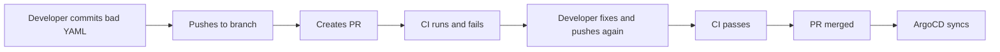
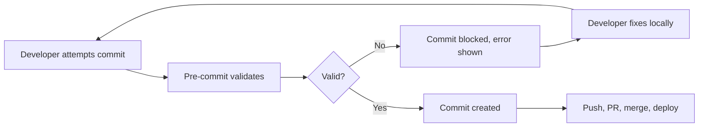

# How to Set Up Pre-Commit Hooks for ArgoCD Manifests

Author: [nawazdhandala](https://github.com/nawazdhandala)

Tags: ArgoCD, GitOps, Kubernetes, Pre-Commit, Automation

Description: Learn how to set up pre-commit hooks that validate ArgoCD manifests for YAML syntax, schema compliance, and policy violations before they are committed to Git.

---

The earlier you catch manifest errors, the cheaper they are to fix. Pre-commit hooks run validation on your local machine before the commit is created. This means bad YAML, invalid schemas, and policy violations never make it into the Git history at all - not in the branch, not in the PR, and definitely not in ArgoCD.

This guide sets up a comprehensive pre-commit hook pipeline for ArgoCD manifest repositories.

## Why Pre-Commit Hooks for Manifests

Without pre-commit hooks, the error discovery timeline looks like this:



With pre-commit hooks:



The feedback loop shrinks from minutes to seconds.

## Setting Up the pre-commit Framework

The `pre-commit` framework manages hook installation and execution:

```bash
# Install pre-commit
pip install pre-commit
# or
brew install pre-commit

# Verify installation
pre-commit --version
```

Create a `.pre-commit-config.yaml` in your repository root:

```yaml
# .pre-commit-config.yaml
repos:
  # YAML linting
  - repo: https://github.com/adrienverge/yamllint
    rev: v1.35.1
    hooks:
    - id: yamllint
      args: [-c, .yamllint.yaml]
      types: [yaml]

  # Kubernetes manifest validation
  - repo: https://github.com/yannh/kubeconform
    rev: v0.6.4
    hooks:
    - id: kubeconform
      args:
      - -strict
      - -kubernetes-version
      - "1.28.0"
      - -summary
      types: [yaml]

  # General file checks
  - repo: https://github.com/pre-commit/pre-commit-hooks
    rev: v4.5.0
    hooks:
    - id: trailing-whitespace
    - id: end-of-file-fixer
    - id: check-yaml
      args: [--allow-multiple-documents]
    - id: check-merge-conflict
    - id: detect-private-key
```

Install the hooks:

```bash
pre-commit install
```

## YAML Lint Configuration

Create a `.yamllint.yaml` configuration tailored for Kubernetes manifests:

```yaml
# .yamllint.yaml
extends: default

rules:
  # Allow long lines for base64 encoded values and URLs
  line-length:
    max: 200
    allow-non-breakable-words: true
    allow-non-breakable-inline-mappings: true

  # Kubernetes manifests use 2-space indentation
  indentation:
    spaces: 2
    indent-sequences: consistent

  # Allow multiple documents (---) in a single file
  document-start: disable

  # Be lenient with comments
  comments:
    require-starting-space: true
    min-spaces-from-content: 1

  # Allow empty values (common in Kustomize patches)
  empty-values: enable

  truthy:
    # Allow 'on' and 'yes' values (common in Kubernetes)
    allowed-values: ['true', 'false', 'yes', 'no', 'on', 'off']
```

## Custom Hook: Kustomize Build Validation

Add a custom hook that validates Kustomize builds:

```bash
#!/bin/bash
# scripts/validate-kustomize.sh

# Find all kustomization.yaml files in staged changes
KUSTOMIZATION_DIRS=$(git diff --cached --name-only | \
  xargs -I{} dirname {} | \
  sort -u | \
  while read dir; do
    if [ -f "$dir/kustomization.yaml" ] || [ -f "$dir/kustomization.yml" ]; then
      echo "$dir"
    fi
  done)

if [ -z "$KUSTOMIZATION_DIRS" ]; then
  exit 0
fi

ERRORS=0

for dir in $KUSTOMIZATION_DIRS; do
  echo "Validating kustomize build: $dir"
  if ! kustomize build "$dir" > /dev/null 2>&1; then
    echo "FAIL: Kustomize build failed for $dir"
    kustomize build "$dir" 2>&1
    ERRORS=$((ERRORS + 1))
  fi
done

exit $ERRORS
```

Add it to `.pre-commit-config.yaml`:

```yaml
  # Custom Kustomize validation
  - repo: local
    hooks:
    - id: validate-kustomize
      name: Validate Kustomize builds
      entry: scripts/validate-kustomize.sh
      language: script
      files: '(kustomization\.yaml|kustomization\.yml|.*\.yaml)$'
      pass_filenames: false
```

## Custom Hook: Helm Template Validation

```bash
#!/bin/bash
# scripts/validate-helm.sh

# Find Helm charts that have changed files
CHANGED_CHARTS=$(git diff --cached --name-only | \
  grep "^charts/" | \
  cut -d/ -f1-2 | \
  sort -u)

if [ -z "$CHANGED_CHARTS" ]; then
  exit 0
fi

ERRORS=0

for chart in $CHANGED_CHARTS; do
  if [ ! -f "$chart/Chart.yaml" ]; then
    continue
  fi

  echo "Linting Helm chart: $chart"

  # Helm lint
  if ! helm lint "$chart" --strict 2>&1; then
    ERRORS=$((ERRORS + 1))
    continue
  fi

  # Template and validate
  for values in "$chart"/values*.yaml; do
    [ -f "$values" ] || continue
    echo "  Templating with $values..."
    if ! helm template test "$chart" --values "$values" | \
         kubeconform -strict -summary -kubernetes-version 1.28.0 2>&1; then
      ERRORS=$((ERRORS + 1))
    fi
  done
done

exit $ERRORS
```

Add to config:

```yaml
  - repo: local
    hooks:
    - id: validate-helm
      name: Validate Helm charts
      entry: scripts/validate-helm.sh
      language: script
      files: '^charts/'
      pass_filenames: false
```

## Custom Hook: Prevent Secrets in Git

A critical safety hook that prevents accidentally committing Kubernetes Secrets:

```bash
#!/bin/bash
# scripts/no-secrets.sh

# Check staged files for plain Kubernetes Secrets
ERRORS=0

for file in $(git diff --cached --name-only --diff-filter=ACM | grep -E '\.(yaml|yml)$'); do
  # Check if the file contains a plain Kubernetes Secret
  if grep -q "kind: Secret" "$file"; then
    # Allow SealedSecrets and ExternalSecrets
    if grep -q "kind: SealedSecret" "$file" || grep -q "kind: ExternalSecret" "$file"; then
      continue
    fi

    echo "BLOCKED: $file contains a plain Kubernetes Secret"
    echo "  Use SealedSecrets or ExternalSecrets instead"
    ERRORS=$((ERRORS + 1))
  fi
done

exit $ERRORS
```

```yaml
  - repo: local
    hooks:
    - id: no-plain-secrets
      name: Block plain Kubernetes Secrets
      entry: scripts/no-secrets.sh
      language: script
      files: '\.(yaml|yml)$'
      pass_filenames: false
```

## Custom Hook: ArgoCD Application Validation

Validate ArgoCD Application resources specifically:

```bash
#!/bin/bash
# scripts/validate-argocd-apps.sh

ERRORS=0

for file in $(git diff --cached --name-only --diff-filter=ACM | grep -E '\.(yaml|yml)$'); do
  # Check if this is an ArgoCD Application
  if ! grep -q "kind: Application" "$file" 2>/dev/null; then
    continue
  fi

  if ! grep -q "argoproj.io" "$file" 2>/dev/null; then
    continue
  fi

  echo "Validating ArgoCD Application: $file"

  # Check for required fields
  if ! grep -q "project:" "$file"; then
    echo "FAIL: $file missing 'project' field"
    ERRORS=$((ERRORS + 1))
  fi

  if ! grep -q "destination:" "$file"; then
    echo "FAIL: $file missing 'destination' field"
    ERRORS=$((ERRORS + 1))
  fi

  if ! grep -q "source:" "$file" && ! grep -q "sources:" "$file"; then
    echo "FAIL: $file missing 'source' or 'sources' field"
    ERRORS=$((ERRORS + 1))
  fi

  # Warn if using default project
  if grep -q "project: default" "$file"; then
    echo "WARN: $file uses the 'default' project - consider using a dedicated project"
  fi
done

exit $ERRORS
```

## Full Configuration

Here is the complete `.pre-commit-config.yaml`:

```yaml
# .pre-commit-config.yaml
repos:
  # Standard checks
  - repo: https://github.com/pre-commit/pre-commit-hooks
    rev: v4.5.0
    hooks:
    - id: trailing-whitespace
    - id: end-of-file-fixer
    - id: check-yaml
      args: [--allow-multiple-documents]
    - id: check-merge-conflict
    - id: detect-private-key
    - id: check-added-large-files
      args: ['--maxkb=500']

  # YAML linting
  - repo: https://github.com/adrienverge/yamllint
    rev: v1.35.1
    hooks:
    - id: yamllint
      args: [-c, .yamllint.yaml]
      types: [yaml]

  # Custom hooks
  - repo: local
    hooks:
    - id: no-plain-secrets
      name: Block plain Kubernetes Secrets
      entry: scripts/no-secrets.sh
      language: script
      files: '\.(yaml|yml)$'
      pass_filenames: false

    - id: validate-kustomize
      name: Validate Kustomize builds
      entry: scripts/validate-kustomize.sh
      language: script
      files: '\.(yaml|yml)$'
      pass_filenames: false

    - id: validate-helm
      name: Validate Helm charts
      entry: scripts/validate-helm.sh
      language: script
      files: '^charts/'
      pass_filenames: false

    - id: validate-argocd-apps
      name: Validate ArgoCD Applications
      entry: scripts/validate-argocd-apps.sh
      language: script
      files: '\.(yaml|yml)$'
      pass_filenames: false
```

## Onboarding the Team

Make hook installation automatic by adding it to the repository's setup process:

```json
// package.json (if using Node.js tooling)
{
  "scripts": {
    "prepare": "pre-commit install"
  }
}
```

Or add a Makefile target:

```makefile
# Makefile
setup:
	pip install pre-commit
	pre-commit install
	@echo "Pre-commit hooks installed!"
```

Document the hooks in your repository's contributing guide:

```markdown
## Development Setup

1. Install pre-commit: `pip install pre-commit`
2. Install hooks: `pre-commit install`
3. Hooks run automatically on `git commit`
4. Run all hooks manually: `pre-commit run --all-files`
5. Skip hooks in emergency: `git commit --no-verify` (document why!)
```

For monitoring the end-to-end pipeline from pre-commit hooks through ArgoCD deployment, [OneUptime](https://oneuptime.com/blog/post/2026-02-26-argocd-alerts-outofsync-applications/view) can help you track deployment health and alert on sync issues.

## Summary

Pre-commit hooks provide the fastest feedback loop for manifest validation. Set up YAML linting, schema validation with kubeconform, Kustomize build checks, Helm template validation, secret prevention, and ArgoCD Application validation. Use the pre-commit framework for easy hook management and team onboarding. The goal is to catch every avoidable error before it enters the Git history, reducing CI failures, PR review cycles, and ArgoCD sync errors. The few seconds each commit takes to validate saves minutes to hours of downstream troubleshooting.
