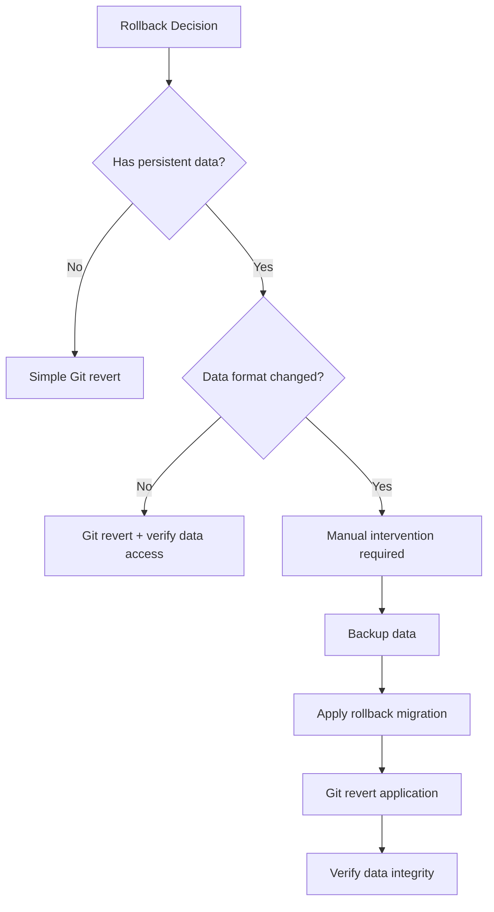

# How to Handle Rollbacks in a GitOps Paradigm

Author: [nawazdhandala](https://github.com/nawazdhandala)

Tags: ArgoCD, GitOps, Kubernetes, Rollback, Deployment

Description: Learn how to perform rollbacks in a GitOps workflow using ArgoCD including git revert strategies, ArgoCD history, and handling stateful application rollbacks safely.

---

Rollbacks in a GitOps paradigm work differently than traditional Kubernetes rollbacks. With `kubectl rollout undo`, Kubernetes reverts to the previous ReplicaSet. This is fast but bypasses Git entirely, meaning your Git repository says one thing while the cluster runs another.

In GitOps, the correct rollback is a Git operation. But the details of how to do this - and what to do when a Git revert is not enough - are more nuanced than most guides suggest.

## The Simple Case: Git Revert

The most straightforward rollback in GitOps is reverting the Git commit that introduced the bad change:

```bash
# Find the commit that broke things
git log --oneline -10
# Output:
# a1b2c3d Update payment-api to v2.1.0
# e4f5g6h Update monitoring dashboards
# i7j8k9l Update payment-api to v2.0.9

# Revert the problematic commit
git revert a1b2c3d --no-edit
git push origin main
```

ArgoCD detects the new commit (the revert), compares the desired state to the live state, and syncs. The application rolls back to its previous configuration.

This works perfectly when:
- A single commit introduced the problem
- The commit only changed the application you want to roll back
- There are no dependencies between the reverted change and other changes

## The Complex Case: Multiple Commits

Often the bad deployment involved multiple commits - maybe an image update, a config change, and a resource limit adjustment:

```bash
# Multiple commits to roll back
# d1e2f3g Update resource limits
# a1b2c3d Update payment-api to v2.1.0
# b4c5d6e Add new environment variable
```

Reverting these individually can create intermediate states that are also broken. Instead, revert them as a group:

```bash
# Revert a range of commits (oldest..newest)
git revert --no-commit b4c5d6e..d1e2f3g
git commit -m "Rollback payment-api v2.1.0 deployment (commits b4c5d6e through d1e2f3g)"
git push origin main
```

The `--no-commit` flag stages all reverts without committing each one, letting you create a single clean rollback commit.

## Using ArgoCD's Built-In History

ArgoCD maintains a history of sync operations. You can roll back to a previous sync revision directly:

```bash
# View application history
argocd app history my-app
# Output:
# ID  DATE                 REVISION
# 3   2026-02-26 10:00:00  a1b2c3d
# 2   2026-02-25 14:30:00  i7j8k9l
# 1   2026-02-24 09:00:00  m1n2o3p

# Rollback to a previous revision
argocd app rollback my-app 2
```

This tells ArgoCD to sync the application to the state it was in at history entry 2 (revision `i7j8k9l`). However, this creates a discrepancy between what ArgoCD has deployed and what the HEAD of your Git branch says.

ArgoCD will show the application as "OutOfSync" because the deployed revision does not match the latest commit. This is intentional - it reminds you to update Git to match:

```bash
# After ArgoCD rollback, update Git to match
git checkout i7j8k9l -- apps/my-app/
git add . && git commit -m "Rollback payment-api to v2.0.9 (matching ArgoCD rollback)"
git push origin main
```

## Rollback Strategy by Application Type

### Stateless Applications

Stateless applications (web servers, API services) are the easiest to roll back. The container image change is the primary rollback action:

```yaml
# Before (broken)
spec:
  containers:
  - name: api
    image: payment-api:v2.1.0

# After rollback (working)
spec:
  containers:
  - name: api
    image: payment-api:v2.0.9
```

### Applications with Database Migrations

This is where rollbacks get tricky. If version 2.1.0 ran a database migration that added a column, reverting the application code to 2.0.9 does not undo the migration.

**Approach 1: Forward-compatible migrations**

Design migrations so that the previous version of the application can work with the new database schema:

```sql
-- Migration for v2.1.0
-- Adding a column with a default value
-- v2.0.9 can still work because it ignores the new column
ALTER TABLE payments ADD COLUMN currency VARCHAR(3) DEFAULT 'USD';
```

**Approach 2: Separate rollback migration**

Include a rollback migration alongside each forward migration:

```yaml
# In your GitOps repo, include both directions
apiVersion: batch/v1
kind: Job
metadata:
  name: db-rollback-v2.1.0
  annotations:
    argocd.argoproj.io/hook: PreSync
    argocd.argoproj.io/hook-delete-policy: BeforeHookCreation
spec:
  template:
    spec:
      containers:
      - name: migrate
        image: payment-api:v2.0.9
        command: ["./migrate.sh", "rollback", "--to", "v2.0.9"]
      restartPolicy: Never
```

### Applications with Persistent State

Applications like databases, message queues, or cache systems require extra care:



## Automating Rollback Decisions

For critical services, you can automate rollback decisions using ArgoCD's health checks and sync hooks:

```yaml
apiVersion: argoproj.io/v1alpha1
kind: Application
metadata:
  name: payment-api
spec:
  source:
    repoURL: https://github.com/org/gitops-repo
    path: apps/payment-api/production
  syncPolicy:
    automated:
      selfHeal: true
    retry:
      limit: 3
      backoff:
        duration: 30s
        factor: 2
        maxDuration: 3m
```

If the sync fails after 3 retries, ArgoCD stops trying and marks the application as degraded. You can set up a webhook or notification to trigger an automated rollback:

```yaml
# Post-sync hook that checks health and reverts if unhealthy
apiVersion: batch/v1
kind: Job
metadata:
  name: health-check-or-rollback
  annotations:
    argocd.argoproj.io/hook: PostSync
    argocd.argoproj.io/hook-delete-policy: HookSucceeded
spec:
  template:
    spec:
      containers:
      - name: health-check
        image: curlimages/curl:latest
        command:
        - /bin/sh
        - -c
        - |
          # Wait for pods to be ready
          sleep 30

          # Check application health endpoint
          HTTP_STATUS=$(curl -s -o /dev/null -w "%{http_code}" http://payment-api:8080/health)

          if [ "$HTTP_STATUS" != "200" ]; then
            echo "Health check failed with status $HTTP_STATUS"
            # Trigger rollback via ArgoCD API
            curl -X POST http://argocd-server:8080/api/v1/applications/payment-api/rollback \
              -H "Authorization: Bearer $ARGOCD_TOKEN" \
              -d '{"id": "previous"}'
            exit 1
          fi

          echo "Health check passed"
      restartPolicy: Never
```

## Preventing the Need for Rollbacks

The best rollback is one you never need. Reduce rollback frequency with:

**Progressive delivery**: Use Argo Rollouts to canary new versions:

```yaml
apiVersion: argoproj.io/v1alpha1
kind: Rollout
metadata:
  name: payment-api
spec:
  strategy:
    canary:
      steps:
      - setWeight: 5
      - pause: {duration: 5m}
      - analysis:
          templates:
          - templateName: success-rate
      - setWeight: 50
      - pause: {duration: 10m}
      - setWeight: 100
```

**Pre-sync validation**: Run tests before deploying:

```yaml
apiVersion: batch/v1
kind: Job
metadata:
  name: pre-deploy-validation
  annotations:
    argocd.argoproj.io/hook: PreSync
spec:
  template:
    spec:
      containers:
      - name: validate
        image: payment-api:v2.1.0
        command: ["./validate.sh"]
      restartPolicy: Never
```

For monitoring deployment health and getting early warnings before you need to roll back, integrate ArgoCD with [OneUptime alerting](https://oneuptime.com/blog/post/2026-02-26-argocd-alerts-degraded-applications/view) to catch degraded applications within minutes.

## Rollback Checklist

When performing a rollback, follow this checklist:

1. Identify the exact commit or revision to roll back to
2. Check if the rollback involves database changes
3. If stateful, verify data compatibility with the target version
4. Perform the rollback (Git revert or ArgoCD rollback)
5. Verify the application is healthy after rollback
6. If using ArgoCD rollback, update Git to match
7. Create an incident report documenting the rollback
8. Address the root cause before re-deploying

## Summary

Rollbacks in GitOps should go through Git whenever possible. Use `git revert` for single-commit rollbacks and `git revert --no-commit` for multi-commit rollbacks. ArgoCD's built-in rollback provides quick recovery but requires a follow-up Git commit to maintain consistency. Stateful applications and database migrations require additional care - design migrations to be forward-compatible and include rollback procedures. Automate health checking after deployments to catch failures early, and invest in progressive delivery to reduce the need for rollbacks altogether.
