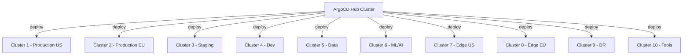
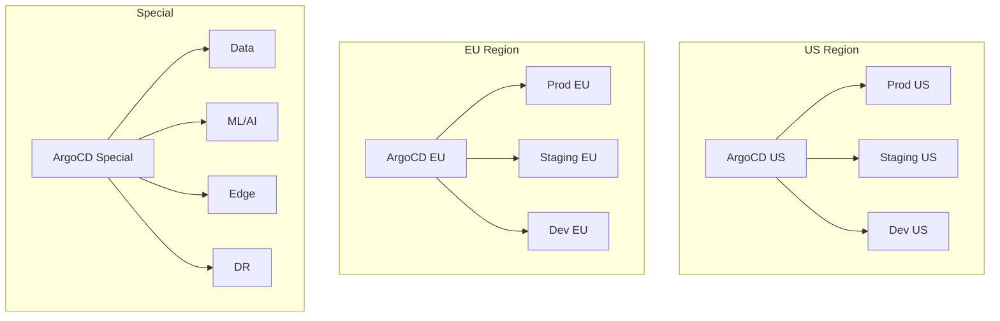

# How to Scale ArgoCD Across 10+ Clusters

Author: [nawazdhandala](https://github.com/nawazdhandala)

Tags: ArgoCD, GitOps, Kubernetes, Multi-Cluster, Scaling

Description: Learn how to scale ArgoCD across 10 or more Kubernetes clusters with cluster management, ApplicationSets, network configuration, and operational strategies.

---

Managing applications on a single Kubernetes cluster with ArgoCD is straightforward. Managing 10 or more clusters introduces a different set of challenges: network connectivity, credential management, cluster registration, and the organizational question of how to distribute applications across clusters. This guide covers the practical aspects of running ArgoCD across 10+ clusters, from the initial setup to operational best practices.

## Multi-Cluster Architecture Patterns

There are two main patterns for multi-cluster ArgoCD:

### Hub and Spoke (Centralized)

A single ArgoCD installation manages all target clusters.



**Pros**: Single pane of glass, centralized management
**Cons**: Single point of failure, network complexity

### Federated (Decentralized)

Multiple ArgoCD installations, each managing a subset of clusters.



**Pros**: Better isolation, lower latency, independent failure domains
**Cons**: More infrastructure to manage, no single dashboard

For 10 clusters, the hub-and-spoke pattern works well. At 20+ clusters, federated starts making more sense.

## Step 1: Register Clusters

### Using the CLI

```bash
# Register each cluster using the ArgoCD CLI
argocd cluster add production-us --name production-us
argocd cluster add production-eu --name production-eu
argocd cluster add staging --name staging
argocd cluster add development --name development
# ... repeat for all clusters
```

### Using Declarative Cluster Secrets

For GitOps, define clusters as Kubernetes Secrets.

```yaml
# cluster-production-us.yaml
apiVersion: v1
kind: Secret
metadata:
  name: cluster-production-us
  namespace: argocd
  labels:
    argocd.argoproj.io/secret-type: cluster
  annotations:
    # Custom annotations for metadata
    cluster.example.com/environment: production
    cluster.example.com/region: us-east-1
    cluster.example.com/provider: aws
stringData:
  name: production-us
  server: https://production-us.k8s.example.com
  config: |
    {
      "bearerToken": "eyJhbG...",
      "tlsClientConfig": {
        "insecure": false,
        "caData": "LS0tLS1..."
      }
    }
```

### Using ExternalSecrets for Cluster Credentials

For better security, store cluster credentials in a secrets manager and use ExternalSecrets to populate them.

```yaml
apiVersion: external-secrets.io/v1beta1
kind: ExternalSecret
metadata:
  name: cluster-production-us
  namespace: argocd
spec:
  refreshInterval: 1h
  secretStoreRef:
    name: vault
    kind: ClusterSecretStore
  target:
    name: cluster-production-us
    template:
      metadata:
        labels:
          argocd.argoproj.io/secret-type: cluster
      data:
        name: production-us
        server: https://production-us.k8s.example.com
        config: |
          {
            "bearerToken": "{{ .token }}",
            "tlsClientConfig": {
              "insecure": false,
              "caData": "{{ .ca }}"
            }
          }
  data:
    - secretKey: token
      remoteRef:
        key: k8s/production-us/argocd-token
    - secretKey: ca
      remoteRef:
        key: k8s/production-us/ca-cert
```

## Step 2: Network Connectivity

ArgoCD needs to reach the API servers of all target clusters. This is often the trickiest part.

### VPN/Private Networking

If clusters are in different VPCs or networks, set up VPN peering or a mesh network.

```bash
# Example: AWS VPC peering between ArgoCD cluster and target cluster
# The ArgoCD cluster needs outbound access to port 443 on each target cluster's API server
```

### Using a Service Mesh

If all clusters are connected through a service mesh like Istio, you can use the mesh for cross-cluster connectivity.

### Verifying Connectivity

```bash
# From the ArgoCD cluster, verify you can reach each target
for cluster in production-us production-eu staging development; do
  kubectl exec -n argocd deployment/argocd-server -- \
    curl -sk https://${cluster}.k8s.example.com/healthz
done
```

## Step 3: Use ApplicationSets for Multi-Cluster Deployment

ApplicationSets are the primary tool for deploying across multiple clusters.

### Cluster Generator

Deploy the same application to all clusters matching certain criteria.

```yaml
apiVersion: argoproj.io/v1alpha1
kind: ApplicationSet
metadata:
  name: nginx-ingress
  namespace: argocd
spec:
  generators:
    - clusters:
        selector:
          matchLabels:
            environment: production
  template:
    metadata:
      name: "nginx-ingress-{{name}}"
    spec:
      project: platform
      source:
        repoURL: https://kubernetes.github.io/ingress-nginx
        chart: ingress-nginx
        targetRevision: 4.x
        helm:
          values: |
            controller:
              replicaCount: 2
      destination:
        server: "{{server}}"
        namespace: ingress-nginx
      syncPolicy:
        automated:
          prune: true
          selfHeal: true
        syncOptions:
          - CreateNamespace=true
```

### Cluster Labels for Targeting

Add labels to your cluster secrets to enable targeted deployment.

```yaml
metadata:
  labels:
    argocd.argoproj.io/secret-type: cluster
    environment: production
    region: us-east
    provider: aws
    tier: critical
```

### Matrix Generator for Complex Patterns

Deploy different configurations per cluster.

```yaml
apiVersion: argoproj.io/v1alpha1
kind: ApplicationSet
metadata:
  name: monitoring-stack
  namespace: argocd
spec:
  generators:
    - matrix:
        generators:
          - clusters:
              selector:
                matchLabels:
                  environment: production
          - list:
              elements:
                - component: prometheus
                  chart: kube-prometheus-stack
                  version: "55.x"
                - component: loki
                  chart: loki-stack
                  version: "2.x"
  template:
    metadata:
      name: "{{component}}-{{name}}"
    spec:
      project: monitoring
      source:
        repoURL: https://prometheus-community.github.io/helm-charts
        chart: "{{chart}}"
        targetRevision: "{{version}}"
      destination:
        server: "{{server}}"
        namespace: monitoring
      syncPolicy:
        automated:
          prune: true
          selfHeal: true
        syncOptions:
          - CreateNamespace=true
```

## Step 4: Per-Cluster Configuration

Different clusters often need different configurations for the same application.

### Using Values Files Per Cluster

```
manifests/
  monitoring/
    base/
      values.yaml         # Shared values
    overlays/
      production-us/
        values.yaml       # US-specific overrides
      production-eu/
        values.yaml       # EU-specific overrides
      staging/
        values.yaml       # Staging overrides
```

```yaml
apiVersion: argoproj.io/v1alpha1
kind: ApplicationSet
metadata:
  name: monitoring
  namespace: argocd
spec:
  generators:
    - clusters:
        selector:
          matchLabels:
            monitoring: enabled
  template:
    metadata:
      name: "monitoring-{{name}}"
    spec:
      project: platform
      sources:
        - repoURL: https://prometheus-community.github.io/helm-charts
          chart: kube-prometheus-stack
          targetRevision: "55.x"
          helm:
            valueFiles:
              - $values/monitoring/base/values.yaml
              - $values/monitoring/overlays/{{name}}/values.yaml
        - repoURL: https://github.com/my-org/cluster-config
          targetRevision: main
          ref: values
      destination:
        server: "{{server}}"
        namespace: monitoring
```

## Step 5: RBAC for Multi-Cluster

Define who can deploy to which clusters.

```yaml
apiVersion: v1
kind: ConfigMap
metadata:
  name: argocd-rbac-cm
  namespace: argocd
data:
  policy.csv: |
    # Platform team can deploy to all clusters
    p, role:platform-admin, applications, *, */*, allow
    p, role:platform-admin, clusters, get, *, allow

    # Dev team can only deploy to dev and staging
    p, role:developer, applications, *, development/*, allow
    p, role:developer, applications, *, staging/*, allow
    p, role:developer, applications, get, production-*/*, allow
    p, role:developer, clusters, get, *, allow

    # Read-only for auditors
    p, role:auditor, applications, get, */*, allow
    p, role:auditor, clusters, get, *, allow

    g, platform-team, role:platform-admin
    g, dev-team, role:developer
    g, audit-team, role:auditor
```

## Step 6: Performance Tuning for Multi-Cluster

### Controller Sharding by Cluster

You can assign specific clusters to specific controller shards for predictable load distribution.

```yaml
# Annotate cluster secrets to assign to specific shards
metadata:
  annotations:
    # Assign this cluster to shard 0
    argocd.argoproj.io/shard: "0"
```

### Cluster Connection Pooling

```yaml
data:
  # Limit concurrent connections to each cluster
  controller.k8s.client.qps: "50"
  controller.k8s.client.burst: "100"
```

### Resource Sizing for 10 Clusters

With 10 clusters and moderate application count per cluster:

```yaml
# Controller with 3 shards
controller:
  replicas: 3
  resources:
    requests:
      cpu: "1"
      memory: 2Gi
    limits:
      cpu: "3"
      memory: 4Gi

# 3-5 repo server replicas
repoServer:
  replicas: 4
  resources:
    requests:
      cpu: 500m
      memory: 1Gi
    limits:
      cpu: "2"
      memory: 2Gi

# Redis HA
redis-ha:
  enabled: true
```

## Step 7: Monitoring Multi-Cluster Deployments

### Cluster Health Dashboard

```
# Per-cluster application count
count(argocd_app_info) by (dest_server)

# Per-cluster sync status
count(argocd_app_info{sync_status="OutOfSync"}) by (dest_server)

# Per-cluster health status
count(argocd_app_info{health_status!="Healthy"}) by (dest_server)

# Cluster connection status
argocd_cluster_info
```

### Alerts for Multi-Cluster

```yaml
rules:
  - alert: ClusterUnreachable
    expr: argocd_cluster_info{connection_state!="Successful"} == 1
    for: 5m
    labels:
      severity: critical
    annotations:
      summary: "Cluster {{ $labels.name }} is unreachable from ArgoCD"

  - alert: ClusterHighSyncFailure
    expr: |
      count(argocd_app_info{sync_status="OutOfSync"}) by (dest_server) /
      count(argocd_app_info) by (dest_server) > 0.2
    for: 15m
    labels:
      severity: warning
    annotations:
      summary: "More than 20% of apps on cluster {{ $labels.dest_server }} are OutOfSync"
```

## Step 8: Disaster Recovery for Multi-Cluster

### Cluster Failover

If a target cluster goes down, ArgoCD continues to show applications as degraded. Prepare failover strategies:

```yaml
# Standby applications in DR cluster
apiVersion: argoproj.io/v1alpha1
kind: Application
metadata:
  name: my-app-dr
  namespace: argocd
  annotations:
    # Disable auto-sync for DR - only enable during failover
    argocd.argoproj.io/sync-policy: none
spec:
  project: default
  source:
    repoURL: https://github.com/my-org/my-app
    path: k8s/overlays/dr
    targetRevision: main
  destination:
    server: https://dr-cluster.k8s.example.com
    namespace: production
```

### ArgoCD Hub Recovery

If the ArgoCD hub cluster itself goes down, target clusters continue running their last deployed state. Recovery involves:

1. Deploy ArgoCD to a new hub cluster
2. Re-register all target clusters
3. ArgoCD automatically reconciles with the desired state from Git

## Conclusion

Scaling ArgoCD across 10+ clusters is primarily a network and organizational challenge rather than a performance one. The hub-and-spoke pattern works well at this scale, with ApplicationSets as the primary mechanism for multi-cluster deployments. The key considerations are reliable network connectivity between the hub and all target clusters, secure credential management (preferably through ExternalSecrets), and cluster-specific configuration management. Use cluster labels extensively to target deployments, implement proper RBAC to control who can deploy where, and monitor both the ArgoCD hub and each cluster's connection status. With these foundations in place, managing 10+ clusters with ArgoCD becomes a routine operation.
