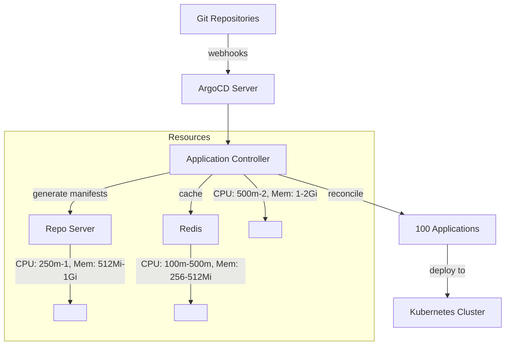

# How to Scale ArgoCD for 100 Applications

Author: [nawazdhandala](https://github.com/nawazdhandala)

Tags: ArgoCD, GitOps, Kubernetes, Scaling, Performance

Description: Learn how to configure ArgoCD to handle 100 applications efficiently with proper resource allocation, monitoring, and organizational best practices.

---

When you first install ArgoCD, it handles a handful of applications without any tuning. But as your team grows and you reach around 100 applications, the default configuration starts showing strain. Reconciliation takes longer, the UI feels sluggish, and sync operations queue up. The good news is that 100 applications is well within ArgoCD's comfort zone - you just need to make some adjustments.

This guide covers the specific changes you need to make when scaling ArgoCD from a handful of applications to 100, including resource sizing, configuration tuning, and organizational patterns.

## Signs You Need to Scale

Before making changes, identify the actual bottlenecks. Here are symptoms that indicate your ArgoCD installation is struggling at the 100-application mark:

- Applications take more than 5 minutes to show updated sync status after a Git push
- The ArgoCD UI takes several seconds to load the application list
- Sync operations sit in a "Pending" state before starting
- The application controller or repo server pods are restarting due to OOM kills
- Prometheus metrics show high reconciliation times

## Step 1: Right-Size Resources

The default ArgoCD resource requests are designed for small deployments. For 100 applications, you need more.

### Application Controller

The controller's memory usage grows linearly with the number of applications and the size of their resource trees.

```yaml
# Controller resources for ~100 applications
apiVersion: apps/v1
kind: StatefulSet
metadata:
  name: argocd-application-controller
  namespace: argocd
spec:
  template:
    spec:
      containers:
        - name: argocd-application-controller
          resources:
            requests:
              cpu: 500m
              memory: 1Gi
            limits:
              cpu: "2"
              memory: 2Gi
```

### Repo Server

The repo server's resource needs depend on repository size and the complexity of your Helm charts or Kustomize builds.

```yaml
# Repo server resources for ~100 applications
containers:
  - name: argocd-repo-server
    resources:
      requests:
        cpu: 250m
        memory: 512Mi
      limits:
        cpu: "1"
        memory: 1Gi
```

### ArgoCD Server

The API server's needs are relatively constant regardless of application count, unless many users access the UI simultaneously.

```yaml
# Server resources for ~100 applications
containers:
  - name: argocd-server
    resources:
      requests:
        cpu: 100m
        memory: 256Mi
      limits:
        cpu: 500m
        memory: 512Mi
```

### Redis

Redis stores application state cache. It needs more memory as application count grows.

```yaml
# Redis resources for ~100 applications
containers:
  - name: redis
    resources:
      requests:
        cpu: 100m
        memory: 256Mi
      limits:
        cpu: 500m
        memory: 512Mi
```

## Step 2: Tune Controller Parameters

Update the `argocd-cmd-params-cm` ConfigMap with optimized values.

```yaml
apiVersion: v1
kind: ConfigMap
metadata:
  name: argocd-cmd-params-cm
  namespace: argocd
data:
  # Increase status processors from default 20 to 30
  controller.status.processors: "30"

  # Increase operation processors from default 10 to 15
  controller.operation.processors: "15"

  # Keep default reconciliation interval
  timeout.reconciliation: "180s"

  # Set repo server parallelism
  reposerver.parallelism.limit: "5"

  # Enable Redis compression
  redis.compression: "gzip"

  # JSON logs for aggregation
  controller.log.format: "json"
  reposerver.log.format: "json"
  server.log.format: "json"
```

## Step 3: Organize with AppProjects

At 100 applications, you need organizational structure. AppProjects provide namespace-like isolation.

```yaml
# projects.yaml
apiVersion: argoproj.io/v1alpha1
kind: AppProject
metadata:
  name: platform
  namespace: argocd
spec:
  description: "Platform infrastructure applications"
  sourceRepos:
    - https://github.com/my-org/platform-*
  destinations:
    - namespace: '*'
      server: https://kubernetes.default.svc
  clusterResourceWhitelist:
    - group: '*'
      kind: '*'
---
apiVersion: argoproj.io/v1alpha1
kind: AppProject
metadata:
  name: backend-services
  namespace: argocd
spec:
  description: "Backend microservices"
  sourceRepos:
    - https://github.com/my-org/backend-*
  destinations:
    - namespace: 'backend-*'
      server: https://kubernetes.default.svc
  namespaceResourceBlacklist:
    - group: ''
      kind: ResourceQuota
    - group: ''
      kind: LimitRange
---
apiVersion: argoproj.io/v1alpha1
kind: AppProject
metadata:
  name: frontend
  namespace: argocd
spec:
  description: "Frontend applications"
  sourceRepos:
    - https://github.com/my-org/frontend-*
  destinations:
    - namespace: 'frontend-*'
      server: https://kubernetes.default.svc
```

## Step 4: Use ApplicationSets for Repetitive Patterns

If many of your 100 applications follow similar patterns, use ApplicationSets to reduce boilerplate.

```yaml
# backend-services-appset.yaml
apiVersion: argoproj.io/v1alpha1
kind: ApplicationSet
metadata:
  name: backend-services
  namespace: argocd
spec:
  generators:
    - git:
        repoURL: https://github.com/my-org/app-manifests
        revision: main
        directories:
          - path: services/*
  template:
    metadata:
      name: "{{path.basename}}"
    spec:
      project: backend-services
      source:
        repoURL: https://github.com/my-org/app-manifests
        targetRevision: main
        path: "{{path}}"
      destination:
        server: https://kubernetes.default.svc
        namespace: "backend-{{path.basename}}"
      syncPolicy:
        automated:
          prune: true
          selfHeal: true
        syncOptions:
          - CreateNamespace=true
```

## Step 5: Set Up Monitoring

At 100 applications, you need visibility into ArgoCD's health. Deploy a Prometheus ServiceMonitor.

```yaml
# argocd-metrics.yaml
apiVersion: monitoring.coreos.com/v1
kind: ServiceMonitor
metadata:
  name: argocd-metrics
  namespace: argocd
spec:
  selector:
    matchLabels:
      app.kubernetes.io/part-of: argocd
  endpoints:
    - port: metrics
      interval: 30s
```

### Key Metrics to Watch

Create a Grafana dashboard with these panels:

```text
# Reconciliation duration
argocd_app_reconcile_bucket

# Sync operations
rate(argocd_app_sync_total[5m])

# Git requests
rate(argocd_git_request_total[5m])

# Pending repo server requests
argocd_repo_pending_request_total

# Controller memory usage
container_memory_usage_bytes{container="argocd-application-controller"}
```

## Step 6: Configure Webhooks

At 100 applications, polling for Git changes becomes inefficient. Configure webhooks so ArgoCD reacts to pushes immediately.

```yaml
# In argocd-secret
stringData:
  webhook.github.secret: "your-webhook-secret"
```

Set up webhooks in your Git provider pointing to:
```text
https://argocd.example.com/api/webhook
```

## Step 7: Optimize Repository Structure

How you organize your Git repositories matters at scale.

### Monorepo Approach

If all 100 applications share one repository:

```text
manifests/
  apps/
    service-a/
      base/
      overlays/
        staging/
        production/
    service-b/
      base/
      overlays/
        staging/
        production/
```

Pros: Simple to manage, single webhook
Cons: Repo server processes the entire repo for each app

### Multi-Repo Approach

Each team owns their repositories:

```text
github.com/my-org/service-a-manifests/
github.com/my-org/service-b-manifests/
github.com/my-org/platform-manifests/
```

Pros: Better isolation, parallel processing
Cons: More repositories to manage

For 100 applications, either approach works. The monorepo becomes a problem closer to 500+ applications.

## Architecture at 100 Applications



## What You Do NOT Need at 100 Applications

At this scale, you do not need:
- Controller sharding (that is for 500+ applications)
- Multiple repo server replicas (one is usually enough)
- HA Redis (single instance is fine)
- Separate clusters for ArgoCD management

Keep things simple. Over-engineering at 100 applications creates unnecessary operational complexity.

## Checklist for 100 Applications

Here is a quick checklist of everything to configure:

- [ ] Increase controller resources (1Gi+ memory)
- [ ] Increase repo server resources (512Mi+ memory)
- [ ] Set controller.status.processors to 30
- [ ] Set controller.operation.processors to 15
- [ ] Set reposerver.parallelism.limit to 5
- [ ] Enable Redis compression
- [ ] Configure Git webhooks
- [ ] Create AppProjects for organization
- [ ] Use ApplicationSets for repetitive patterns
- [ ] Set up Prometheus monitoring
- [ ] Enable JSON log format
- [ ] Configure resource exclusions for noisy CRDs

## Conclusion

Scaling ArgoCD to 100 applications is straightforward. The main changes are increasing resource limits, bumping up the status and operation processor counts, and organizing applications into projects. You do not need complex multi-replica setups or controller sharding at this scale. Focus on monitoring so you can see problems before they affect your team, and use ApplicationSets to reduce the maintenance burden of managing many similar applications. Most importantly, do not over-engineer - 100 applications is well within a single ArgoCD instance's capability with modest tuning.
