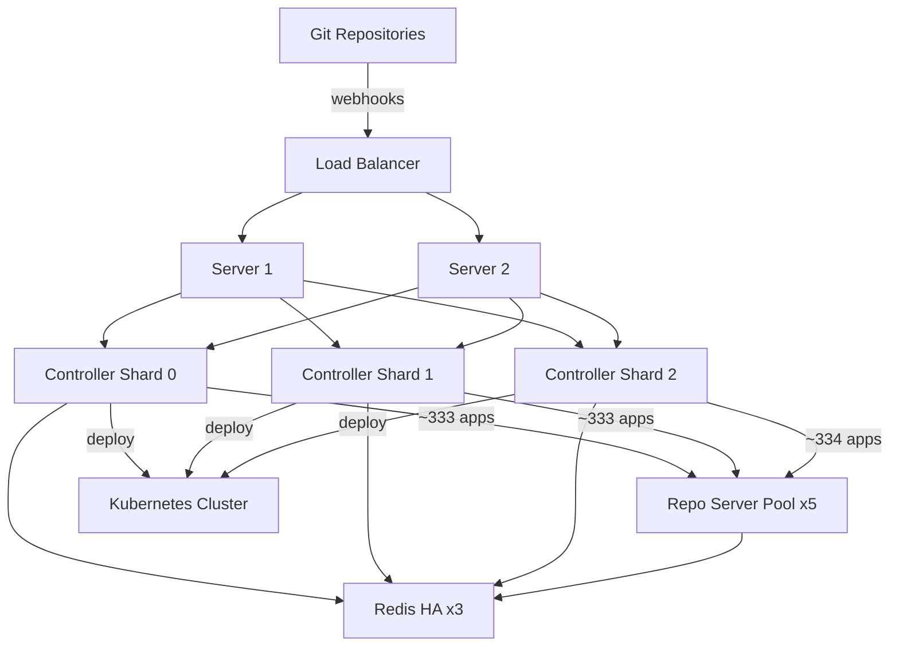

# How to Scale ArgoCD for 1000+ Applications

Author: [nawazdhandala](https://github.com/nawazdhandala)

Tags: ArgoCD, GitOps, Kubernetes, Scaling, Controller Sharding

Description: Learn how to scale ArgoCD to handle 1000 or more applications with controller sharding, aggressive caching, and enterprise-grade performance tuning.

---

At 1,000 applications, you have crossed into large-scale ArgoCD territory. This is where the single application controller hits its limits and sharding becomes necessary. The repo server needs significant horizontal scaling, Redis needs careful sizing, and every configuration decision has measurable performance impact. Many organizations operate at this scale successfully - ArgoCD can handle it - but it requires intentional architecture.

This guide covers the specific techniques needed to run ArgoCD at 1,000+ applications: controller sharding, aggressive caching, repository optimization, and the operational practices that keep everything running smoothly.

## The Challenge at 1,000 Applications

At this scale, the numbers become significant:

- If each app has 20 resources on average, the controller tracks 20,000 Kubernetes resources
- With a 3-minute reconciliation interval, the controller needs to process ~5.5 applications per second continuously
- The repo server handles hundreds of manifest generation requests per cycle
- Redis stores cached state for all 1,000 applications plus their resource trees

A single controller instance simply cannot keep up. The reconciliation queue grows faster than it drains.

## Step 1: Enable Controller Sharding

Controller sharding distributes applications across multiple controller instances. Each controller only manages its assigned subset of applications.

### Configure Sharding

```yaml
apiVersion: apps/v1
kind: StatefulSet
metadata:
  name: argocd-application-controller
  namespace: argocd
spec:
  # Number of shards - each gets ~333 applications
  replicas: 3
  template:
    spec:
      containers:
        - name: argocd-application-controller
          command:
            - argocd-application-controller
            - --status-processors=50
            - --operation-processors=25
            - --repo-server-timeout-seconds=120
            - --logformat=json
            - --loglevel=info
            - --redis-compress=gzip
          env:
            # Tell the controller how many replicas exist
            - name: ARGOCD_CONTROLLER_REPLICAS
              value: "3"
          resources:
            requests:
              cpu: "1"
              memory: 2Gi
            limits:
              cpu: "3"
              memory: 4Gi
```

Each controller replica automatically determines its shard based on its StatefulSet ordinal index. With 3 replicas and 1,000 applications:
- Controller-0 handles ~333 applications
- Controller-1 handles ~333 applications
- Controller-2 handles ~334 applications

### Choosing the Number of Shards

The right number depends on your reconciliation needs:

| Applications | Recommended Shards | Apps per Shard |
|-------------|-------------------|----------------|
| 500-750     | 2                 | 250-375        |
| 750-1000    | 3                 | 250-333        |
| 1000-1500   | 4                 | 250-375        |
| 1500-2000   | 5                 | 300-400        |

Keep each shard under 400 applications for optimal performance.

## Step 2: Scale the Repo Server Aggressively

At 1,000 applications, the repo server cluster needs to handle hundreds of concurrent manifest generation requests.

```yaml
apiVersion: apps/v1
kind: Deployment
metadata:
  name: argocd-repo-server
  namespace: argocd
spec:
  replicas: 5
  template:
    spec:
      containers:
        - name: argocd-repo-server
          command:
            - argocd-repo-server
            - --parallelism-limit=10
            - --git-shallow-clone
            - --redis-compress=gzip
            - --logformat=json
          resources:
            requests:
              cpu: "1"
              memory: 1Gi
            limits:
              cpu: "2"
              memory: 3Gi
          volumeMounts:
            - name: tmp
              mountPath: /tmp
      volumes:
        - name: tmp
          emptyDir:
            sizeLimit: 15Gi
      affinity:
        podAntiAffinity:
          preferredDuringSchedulingIgnoredDuringExecution:
            - weight: 100
              podAffinityTerm:
                labelSelector:
                  matchLabels:
                    app.kubernetes.io/name: argocd-repo-server
                topologyKey: kubernetes.io/hostname
```

5 repo server replicas with a parallelism limit of 10 each gives you 50 concurrent manifest generation operations. This is typically sufficient for 1,000 applications.

## Step 3: Maximize Cache Efficiency

At this scale, cache hits versus cache misses make a massive difference in performance.

### Redis Sizing and Configuration

```yaml
# Redis HA configuration
redis-ha:
  enabled: true
  replicas: 3
  redis:
    resources:
      requests:
        cpu: 500m
        memory: 2Gi
      limits:
        cpu: "2"
        memory: 4Gi
    config:
      maxmemory: 3gb
      maxmemory-policy: allkeys-lru
  haproxy:
    enabled: true
    replicas: 3
```

### Tune Cache Expiration

```yaml
apiVersion: v1
kind: ConfigMap
metadata:
  name: argocd-cmd-params-cm
  namespace: argocd
data:
  # Cache generated manifests for 24 hours
  reposerver.repo.cache.expiration: "24h"

  # Cluster state cache
  controller.default.cache.expiration: "24h"

  # Redis compression is critical at this scale
  redis.compression: "gzip"
```

### Enable Repo Server Request Deduplication

The repo server automatically deduplicates requests. If multiple controllers request manifests for the same repo and revision simultaneously, only one clone/render happens. This is particularly effective with sharding because different controllers might request the same repo.

## Step 4: Optimize Reconciliation

### Increase Reconciliation Interval

At 1,000 applications, you may want to increase the reconciliation interval to reduce load.

```yaml
data:
  # Increase to 5 minutes
  timeout.reconciliation: "300s"

  # Hard resync every 2 hours
  timeout.hard.reconciliation: "7200s"
```

This means drift detection is slightly slower (5 minutes instead of 3), but the reduction in API server load is substantial.

### Rely on Webhooks for Fast Detection

Webhooks provide near-instant detection of Git changes, making the longer reconciliation interval acceptable.

```bash
# Configure webhook secret
kubectl -n argocd patch secret argocd-secret --type merge -p '{
  "stringData": {
    "webhook.github.secret": "strong-secret"
  }
}'
```

## Step 5: Resource Exclusions and Optimizations

### Aggressive Resource Exclusions

```yaml
data:
  resource.exclusions: |
    - apiGroups:
        - "cilium.io"
      kinds:
        - CiliumIdentity
        - CiliumEndpoint
        - CiliumNode
    - apiGroups:
        - "events.k8s.io"
      kinds:
        - Event
    - apiGroups:
        - ""
      kinds:
        - Event
    - apiGroups:
        - "metrics.k8s.io"
      kinds:
        - "*"
    - apiGroups:
        - "coordination.k8s.io"
      kinds:
        - Lease
    - apiGroups:
        - "discovery.k8s.io"
      kinds:
        - EndpointSlice
```

### Ignore Differences for Noisy Fields

Some fields change frequently but are not meaningful for drift detection.

```yaml
data:
  resource.customizations.ignoreDifferences.all: |
    managedFields:
      - manager: kube-controller-manager
    jsonPointers:
      - /status
  resource.customizations.ignoreDifferences.apps_Deployment: |
    jqPathExpressions:
      - .spec.template.metadata.annotations."kubectl.kubernetes.io/restartedAt"
```

## Step 6: Dedicated Node Pools

At this scale, ArgoCD should run on dedicated nodes to avoid resource contention.

```yaml
# Node affinity for ArgoCD components
affinity:
  nodeAffinity:
    requiredDuringSchedulingIgnoredDuringExecution:
      nodeSelectorTerms:
        - matchExpressions:
            - key: role
              operator: In
              values:
                - argocd
tolerations:
  - key: dedicated
    operator: Equal
    value: argocd
    effect: NoSchedule
```

### Node Pool Sizing

For 1,000 applications, plan for dedicated ArgoCD nodes:

| Component | Replicas | Per-Replica Resources | Total |
|-----------|----------|----------------------|-------|
| Controller | 3 | 3 CPU, 4Gi RAM | 9 CPU, 12Gi |
| Repo Server | 5 | 2 CPU, 3Gi RAM | 10 CPU, 15Gi |
| Server | 2 | 1 CPU, 512Mi RAM | 2 CPU, 1Gi |
| Redis HA | 3 | 2 CPU, 4Gi RAM | 6 CPU, 12Gi |
| **Total** | | | **27 CPU, 40Gi** |

Two to three dedicated nodes with 16 CPU / 32GB RAM each would provide this capacity with room to spare.

## Step 7: Repository Architecture

### Split into Multiple Repositories

At 1,000 applications, a single monorepo is a performance bottleneck. Split by team or domain.

```
# Repository structure per team
github.com/my-org/platform-manifests/     # ~50 apps
github.com/my-org/payments-manifests/      # ~80 apps
github.com/my-org/user-service-manifests/  # ~60 apps
github.com/my-org/data-pipeline-manifests/ # ~100 apps
# ... more team repos
```

### Use Credential Templates

With many repositories, credential templates are essential.

```yaml
apiVersion: v1
kind: Secret
metadata:
  name: github-org-creds
  namespace: argocd
  labels:
    argocd.argoproj.io/secret-type: repo-creds
stringData:
  type: git
  url: https://github.com/my-org
  username: git
  password: ghp_xxxxxxxxxxxx
```

## Architecture at 1,000 Applications



## Step 8: Monitoring at Scale

### Critical Alerts

```yaml
rules:
  - alert: ArgocdShardUnbalanced
    expr: |
      max(argocd_app_info) by (controller) /
      min(argocd_app_info) by (controller) > 1.5
    for: 10m
    annotations:
      summary: "Controller shards are significantly unbalanced"

  - alert: ArgocdReconciliationBacklog
    expr: |
      increase(argocd_app_reconcile_count[5m]) < 100
    for: 15m
    annotations:
      summary: "Controller reconciliation rate dropped - possible backlog"

  - alert: ArgocdRepoServerSaturated
    expr: argocd_repo_pending_request_total > 30
    for: 5m
    annotations:
      summary: "Repo server has high pending request queue - consider scaling"
```

## Step 9: Disaster Recovery

At 1,000 applications, you need a recovery plan.

```bash
# Export all applications
kubectl get applications -n argocd -o yaml > argocd-apps-backup.yaml

# Export all projects
kubectl get appprojects -n argocd -o yaml > argocd-projects-backup.yaml

# Export all application sets
kubectl get applicationsets -n argocd -o yaml > argocd-appsets-backup.yaml
```

Store these backups in a separate Git repository that is managed independently of ArgoCD.

## Conclusion

Scaling ArgoCD to 1,000 applications requires controller sharding, significant repo server capacity, Redis HA, and careful tuning. The key architectural decision is sharding the controller into 3 or more replicas, each handling a subset of applications. Combined with 5 repo server replicas, Redis HA with compression, and aggressive caching, ArgoCD handles this load well. The investment in monitoring becomes critical at this scale - without it, you are flying blind. Plan for dedicated node pools, proper resource allocation, and disaster recovery. With these pieces in place, ArgoCD remains a reliable GitOps platform well beyond 1,000 applications.
