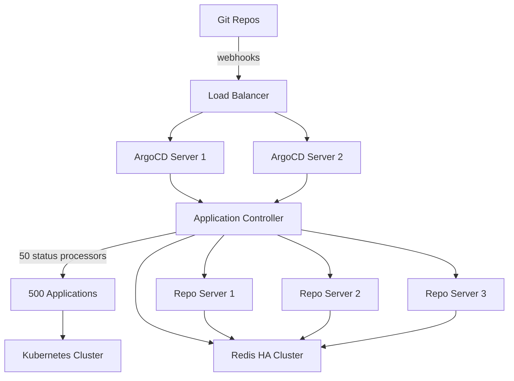

# How to Scale ArgoCD for 500 Applications

Author: [nawazdhandala](https://github.com/nawazdhandala)

Tags: ArgoCD, GitOps, Kubernetes, Scaling, High Availability

Description: Learn how to scale ArgoCD to handle 500 applications with HA configuration, repo server scaling, controller tuning, and monitoring strategies.

---

At 500 applications, ArgoCD transitions from a "set it and forget it" tool to something that requires deliberate architecture decisions. The default single-instance deployment will not cut it anymore. You need high availability, multiple repo server replicas, aggressive caching, and careful resource management. This is the scale where most teams first feel the pain of an under-configured ArgoCD.

This guide covers everything you need to know to run ArgoCD reliably at 500 applications, from HA setup to performance tuning to operational practices.

## Understanding the Load at 500 Applications

At 500 applications, here is what ArgoCD is doing every reconciliation cycle (default: every 3 minutes):

- The controller queries the Kubernetes API for the live state of every resource across all 500 applications
- The repo server generates or retrieves cached manifests for each application
- The controller compares live versus desired state for each application
- Redis stores cached state for all applications
- Any drift triggers sync status updates

If each application has an average of 20 resources, that is 10,000 resources being tracked continuously.

## Step 1: Deploy ArgoCD in HA Mode

Switch from the standard installation to the HA manifests.

```bash
# Install ArgoCD HA
kubectl create namespace argocd
kubectl apply -n argocd -f https://raw.githubusercontent.com/argoproj/argo-cd/stable/manifests/ha/install.yaml
```

The HA installation includes:
- ArgoCD server with multiple replicas
- Redis HA with Sentinel
- Multiple repo server replicas

### Or Using Helm

```yaml
# values-ha.yaml
global:
  logging:
    format: json

controller:
  replicas: 1  # We will use sharding instead of replicas here
  resources:
    requests:
      cpu: "1"
      memory: 2Gi
    limits:
      cpu: "3"
      memory: 4Gi

server:
  replicas: 2
  resources:
    requests:
      cpu: 250m
      memory: 256Mi
    limits:
      cpu: "1"
      memory: 512Mi

repoServer:
  replicas: 3
  resources:
    requests:
      cpu: 500m
      memory: 1Gi
    limits:
      cpu: "2"
      memory: 2Gi

redis-ha:
  enabled: true
  haproxy:
    enabled: true
```

## Step 2: Scale the Repo Server

The repo server is often the first bottleneck. At 500 applications, you need multiple replicas.

```yaml
apiVersion: apps/v1
kind: Deployment
metadata:
  name: argocd-repo-server
  namespace: argocd
spec:
  replicas: 3
  template:
    spec:
      containers:
        - name: argocd-repo-server
          command:
            - argocd-repo-server
            - --parallelism-limit=10
            - --git-shallow-clone
            - --redis-compress=gzip
            - --logformat=json
          resources:
            requests:
              cpu: 500m
              memory: 1Gi
            limits:
              cpu: "2"
              memory: 2Gi
          volumeMounts:
            - name: tmp
              mountPath: /tmp
      volumes:
        - name: tmp
          emptyDir:
            sizeLimit: 10Gi
```

### Why 3 Replicas?

The controller distributes manifest generation requests across all available repo server pods. With 3 replicas and a parallelism limit of 10, you can handle 30 concurrent manifest generation operations. For 500 applications, this provides comfortable headroom.

## Step 3: Tune the Application Controller

```yaml
apiVersion: v1
kind: ConfigMap
metadata:
  name: argocd-cmd-params-cm
  namespace: argocd
data:
  # Status processors: aim for 1/10th of your app count
  controller.status.processors: "50"

  # Operation processors: handle burst sync requests
  controller.operation.processors: "25"

  # Slightly increase reconciliation interval
  timeout.reconciliation: "180s"

  # Increase repo server timeout for large repos
  controller.repo.server.timeout.seconds: "120"

  # Repo server settings
  reposerver.parallelism.limit: "10"

  # Redis compression
  redis.compression: "gzip"
```

### Controller Resource Sizing

```yaml
containers:
  - name: argocd-application-controller
    resources:
      requests:
        cpu: "1"
        memory: 2Gi
      limits:
        cpu: "3"
        memory: 4Gi
```

The controller's memory usage at 500 applications typically ranges from 1.5GB to 3GB, depending on the size of your resource trees.

## Step 4: Configure Redis HA

Redis is critical for ArgoCD's performance. At 500 applications, a single Redis instance is a single point of failure.

```yaml
# Using the Redis HA Helm chart
redis-ha:
  enabled: true
  replicas: 3
  haproxy:
    enabled: true
    replicas: 3
  redis:
    resources:
      requests:
        cpu: 200m
        memory: 512Mi
      limits:
        cpu: "1"
        memory: 1Gi
```

### Enable Redis Compression

Redis memory usage grows with application count. Compression reduces it significantly.

```yaml
data:
  redis.compression: "gzip"
```

## Step 5: Optimize Git Operations

At 500 applications, Git operations become a significant part of the workload.

### Enable Shallow Cloning

```yaml
data:
  reposerver.git.shallow.clone: "true"
```

### Use Webhook-Based Refresh

Polling 500 applications' Git repositories every 3 minutes is wasteful. Use webhooks.

```yaml
# Webhook secret in argocd-secret
stringData:
  webhook.github.secret: "strong-random-secret"
```

### Repository Credential Templates

Instead of configuring credentials for each repository, use templates.

```yaml
apiVersion: v1
kind: Secret
metadata:
  name: github-creds
  namespace: argocd
  labels:
    argocd.argoproj.io/secret-type: repo-creds
stringData:
  type: git
  url: https://github.com/my-org
  username: git
  password: ghp_xxxxxxxxxxxx
```

This single credential template covers all repositories under `https://github.com/my-org`.

## Step 6: Resource Exclusions

Exclude noisy resources that ArgoCD does not need to track.

```yaml
apiVersion: v1
kind: ConfigMap
metadata:
  name: argocd-cm
  namespace: argocd
data:
  resource.exclusions: |
    - apiGroups:
        - "cilium.io"
      kinds:
        - CiliumIdentity
        - CiliumEndpoint
    - apiGroups:
        - "events.k8s.io"
      kinds:
        - Event
    - apiGroups:
        - ""
      kinds:
        - Event
    - apiGroups:
        - "metrics.k8s.io"
      kinds:
        - "*"
```

This reduces the number of resources ArgoCD tracks, lowering memory usage and reconciliation time.

## Step 7: Set Up Comprehensive Monitoring

At 500 applications, monitoring is not optional.

### Prometheus Rules

```yaml
apiVersion: monitoring.coreos.com/v1
kind: PrometheusRule
metadata:
  name: argocd-alerts
  namespace: argocd
spec:
  groups:
    - name: argocd.rules
      rules:
        - alert: ArgocdAppSyncFailed
          expr: argocd_app_info{sync_status="OutOfSync"} == 1
          for: 30m
          labels:
            severity: warning
          annotations:
            summary: "ArgoCD application {{ $labels.name }} is OutOfSync"

        - alert: ArgocdControllerHighMemory
          expr: container_memory_usage_bytes{container="argocd-application-controller"} > 3e9
          for: 5m
          labels:
            severity: warning
          annotations:
            summary: "ArgoCD controller using more than 3GB memory"

        - alert: ArgocdRepoServerPendingRequests
          expr: argocd_repo_pending_request_total > 20
          for: 5m
          labels:
            severity: warning
          annotations:
            summary: "ArgoCD repo server has high pending request queue"

        - alert: ArgocdReconciliationSlow
          expr: histogram_quantile(0.95, rate(argocd_app_reconcile_bucket[10m])) > 30
          for: 10m
          labels:
            severity: warning
          annotations:
            summary: "ArgoCD reconciliation p95 latency exceeds 30 seconds"
```

## Step 8: Organize Applications

### Use Multiple Projects

```yaml
# Project per team
apiVersion: argoproj.io/v1alpha1
kind: AppProject
metadata:
  name: team-payments
  namespace: argocd
spec:
  description: "Payments team services"
  sourceRepos:
    - https://github.com/my-org/payments-*
  destinations:
    - namespace: 'payments-*'
      server: https://kubernetes.default.svc
  roles:
    - name: admin
      policies:
        - p, proj:team-payments:admin, applications, *, team-payments/*, allow
      groups:
        - payments-team
```

### Use Labels for Filtering

```yaml
metadata:
  labels:
    team: payments
    environment: production
    tier: backend
```

This enables filtering in the UI and makes dashboards possible.

## Architecture at 500 Applications



## What to Prepare for Next

At 500 applications, start thinking about:
- **Controller sharding** - If reconciliation is still slow, consider sharding at the 500 to 1000 range
- **Multi-cluster** - If you are deploying to multiple clusters, plan for cluster-specific configurations
- **Repository strategy** - Evaluate if monorepo or multi-repo is scaling better

## Common Mistakes at This Scale

### Not Monitoring Before Tuning

Do not blindly increase numbers. Measure first, then tune based on actual bottlenecks.

### Ignoring Redis

Redis is often overlooked but it is critical. Monitor its memory usage and connection count.

### Running Everything on One Node

Spread ArgoCD components across multiple nodes using pod anti-affinity rules.

```yaml
affinity:
  podAntiAffinity:
    preferredDuringSchedulingIgnoredDuringExecution:
      - weight: 100
        podAffinityTerm:
          labelSelector:
            matchLabels:
              app.kubernetes.io/name: argocd-repo-server
          topologyKey: kubernetes.io/hostname
```

## Conclusion

Scaling ArgoCD to 500 applications requires deliberate architectural choices: HA mode, multiple repo server replicas, Redis HA, and proper resource sizing. The key numbers to remember are 50 status processors, 25 operation processors, 3 repo server replicas with a parallelism limit of 10, and 2 to 4GB of memory for the controller. With these changes and proper monitoring, ArgoCD handles 500 applications comfortably. The investment in monitoring pays dividends as you continue to grow toward 1,000 and beyond.
