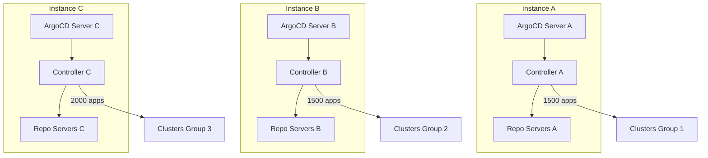

# How to Scale ArgoCD for 5000+ Applications

Author: [nawazdhandala](https://github.com/nawazdhandala)

Tags: ArgoCD, GitOps, Kubernetes, Scaling, Enterprise

Description: Learn how to scale ArgoCD to 5000 or more applications with advanced sharding, multiple ArgoCD instances, performance optimization, and enterprise patterns.

---

At 5,000 applications, you are operating ArgoCD at enterprise scale. Very few organizations push ArgoCD this far on a single installation, and for good reason - it requires significant infrastructure, careful architecture, and deep understanding of ArgoCD's internals. At this point, you need to consider whether a single ArgoCD instance is the right approach or whether splitting into multiple instances makes more sense.

This guide covers both approaches: maxing out a single ArgoCD installation for 5,000+ applications, and the multi-instance pattern that many enterprises prefer.

## The Reality at 5,000 Applications

At this scale, the numbers are staggering:

- **100,000+ Kubernetes resources** being tracked (assuming 20 per app)
- **Controller processing**: ~28 applications per second to reconcile all within 3 minutes
- **Git operations**: Potentially thousands of repository clones/fetches per cycle
- **Redis storage**: Gigabytes of cached state
- **API server load**: Massive read load on every target cluster

This is not an impossible workload for ArgoCD, but it demands serious engineering.

## Approach 1: Single Instance, Maximum Scale

If you want to push a single ArgoCD installation to 5,000 applications, here is how.

### Heavy Controller Sharding

```yaml
apiVersion: apps/v1
kind: StatefulSet
metadata:
  name: argocd-application-controller
  namespace: argocd
spec:
  replicas: 10
  template:
    spec:
      containers:
        - name: argocd-application-controller
          command:
            - argocd-application-controller
            - --status-processors=50
            - --operation-processors=25
            - --kubectl-parallelism-limit=40
            - --repo-server-timeout-seconds=180
            - --redis-compress=gzip
            - --logformat=json
            - --loglevel=info
          env:
            - name: ARGOCD_CONTROLLER_REPLICAS
              value: "10"
          resources:
            requests:
              cpu: "2"
              memory: 4Gi
            limits:
              cpu: "4"
              memory: 8Gi
```

With 10 shards, each controller handles ~500 applications. This keeps each shard in the comfortable zone.

### Massive Repo Server Fleet

```yaml
apiVersion: apps/v1
kind: Deployment
metadata:
  name: argocd-repo-server
  namespace: argocd
spec:
  replicas: 10
  template:
    spec:
      containers:
        - name: argocd-repo-server
          command:
            - argocd-repo-server
            - --parallelism-limit=10
            - --git-shallow-clone
            - --redis-compress=gzip
            - --logformat=json
          resources:
            requests:
              cpu: "1"
              memory: 2Gi
            limits:
              cpu: "3"
              memory: 4Gi
          volumeMounts:
            - name: tmp
              mountPath: /tmp
      volumes:
        - name: tmp
          emptyDir:
            sizeLimit: 20Gi
      topologySpreadConstraints:
        - maxSkew: 1
          topologyKey: kubernetes.io/hostname
          whenUnsatisfiable: DoNotSchedule
          labelSelector:
            matchLabels:
              app.kubernetes.io/name: argocd-repo-server
```

### Redis Cluster

At 5,000 applications, Redis HA Sentinel may not be enough. Consider Redis Cluster for horizontal scaling of the cache layer.

```yaml
# redis-cluster configuration
redis:
  cluster:
    enabled: true
    replicas: 6
    resources:
      requests:
        cpu: "1"
        memory: 4Gi
      limits:
        cpu: "2"
        memory: 8Gi
```

### Maximum Reconciliation Tuning

```yaml
apiVersion: v1
kind: ConfigMap
metadata:
  name: argocd-cmd-params-cm
  namespace: argocd
data:
  # Longer reconciliation to spread the load
  timeout.reconciliation: "600s"

  # Hard resync every 4 hours
  timeout.hard.reconciliation: "14400s"

  # Controller settings per shard
  controller.status.processors: "50"
  controller.operation.processors: "25"
  controller.kubectl.parallelism.limit: "40"

  # Repo server
  reposerver.parallelism.limit: "10"

  # Redis
  redis.compression: "gzip"

  # Increase server replicas
  server.replicas: "3"
```

### Infrastructure Requirements

| Component | Replicas | Resources Per Replica | Total |
|-----------|----------|----------------------|-------|
| Controller | 10 | 4 CPU, 8Gi RAM | 40 CPU, 80Gi |
| Repo Server | 10 | 3 CPU, 4Gi RAM | 30 CPU, 40Gi |
| Server | 3 | 1 CPU, 1Gi RAM | 3 CPU, 3Gi |
| Redis | 6 | 2 CPU, 8Gi RAM | 12 CPU, 48Gi |
| **Total** | | | **85 CPU, 171Gi** |

That is roughly 6 to 8 dedicated nodes with 16 CPU and 32GB RAM each.

## Approach 2: Multiple ArgoCD Instances (Recommended)

For most organizations, splitting into multiple ArgoCD instances is a better approach than pushing one instance to its limits.

### Architecture



### Splitting Strategy

There are several ways to divide applications across instances:

**By team/business unit:**
```text
ArgoCD Instance A: Platform team (500 apps)
ArgoCD Instance B: Payments team (800 apps)
ArgoCD Instance C: Data team (1200 apps)
ArgoCD Instance D: Frontend team (600 apps)
ArgoCD Instance E: Shared services (1900 apps)
```

**By target cluster:**
```text
ArgoCD Instance A: Production clusters (1500 apps)
ArgoCD Instance B: Staging clusters (1500 apps)
ArgoCD Instance C: Development clusters (2000 apps)
```

**By region:**
```text
ArgoCD Instance A: US-East clusters (1800 apps)
ArgoCD Instance B: EU-West clusters (1500 apps)
ArgoCD Instance C: AP-Southeast clusters (1700 apps)
```

### Deployment Pattern for Multiple Instances

Each instance runs in its own namespace.

```yaml
# argocd-platform namespace for platform team
apiVersion: v1
kind: Namespace
metadata:
  name: argocd-platform
---
# argocd-payments namespace for payments team
apiVersion: v1
kind: Namespace
metadata:
  name: argocd-payments
```

Install ArgoCD in each namespace.

```bash
# Install ArgoCD for platform team
kubectl apply -n argocd-platform \
  -f https://raw.githubusercontent.com/argoproj/argo-cd/stable/manifests/ha/install.yaml

# Install ArgoCD for payments team
kubectl apply -n argocd-payments \
  -f https://raw.githubusercontent.com/argoproj/argo-cd/stable/manifests/ha/install.yaml
```

### Shared Authentication

Use the same OIDC provider across all instances so users do not need separate credentials.

```yaml
# Same dex.config across all instances
data:
  dex.config: |
    connectors:
      - type: oidc
        id: okta
        name: Okta
        config:
          issuer: https://company.okta.com
          clientID: $dex.okta.clientID
          clientSecret: $dex.okta.clientSecret
```

## Advanced Performance Techniques

### Selective Sync Windows

Define sync windows to stagger when applications can sync, reducing burst load.

```yaml
apiVersion: argoproj.io/v1alpha1
kind: AppProject
metadata:
  name: platform
  namespace: argocd
spec:
  syncWindows:
    # Only allow syncs during business hours
    - kind: allow
      schedule: "0 8 * * 1-5"
      duration: 10h
      applications:
        - "*"
    # Block syncs during peak traffic
    - kind: deny
      schedule: "0 12 * * *"
      duration: 2h
      applications:
        - "production-*"
```

### Application-Level Sync Optimization

For applications that do not need frequent reconciliation:

```yaml
metadata:
  annotations:
    # Disable auto-refresh for this app
    argocd.argoproj.io/refresh: "normal"
```

### Cluster API Rate Limiting

Prevent ArgoCD from overwhelming target cluster API servers.

```yaml
env:
  - name: ARGOCD_K8S_CLIENT_QPS
    value: "50"
  - name: ARGOCD_K8S_CLIENT_BURST
    value: "100"
```

### Manifest Caching Strategy

At 5,000 applications, cache misses are expensive. Use aggressive caching.

```yaml
data:
  # Cache manifests for 48 hours
  reposerver.repo.cache.expiration: "48h"

  # Rely on webhooks for change detection instead of cache invalidation
```

## Monitoring at Enterprise Scale

### Dashboard Metrics

Create a dedicated Grafana dashboard.

```text
# Applications per controller shard
count(argocd_app_info) by (controller)

# Sync operations per minute
sum(rate(argocd_app_sync_total[5m])) * 60

# P99 reconciliation time
histogram_quantile(0.99, rate(argocd_app_reconcile_bucket[10m]))

# Total resources tracked
sum(argocd_cluster_api_resources)

# Cache hit ratio (if available)
# This requires custom metrics from the repo server
```

### Capacity Planning

Track these trends for capacity planning:
- Application growth rate per month
- Resource count growth rate
- Controller memory growth trend
- Redis memory utilization trend

```text
# Project memory growth
predict_linear(container_memory_usage_bytes{container="argocd-application-controller"}[7d], 86400 * 30)
```

## Disaster Recovery at Scale

### Automated Backups

```bash
#!/bin/bash
# backup-argocd.sh - Run daily via CronJob
DATE=$(date +%Y%m%d)
BACKUP_DIR="/backups/argocd/${DATE}"
mkdir -p "${BACKUP_DIR}"

# Backup all ArgoCD resources
for resource in applications appprojects applicationsets; do
  kubectl get ${resource} -n argocd -o yaml > "${BACKUP_DIR}/${resource}.yaml"
done

# Backup configuration
for cm in argocd-cm argocd-rbac-cm argocd-cmd-params-cm; do
  kubectl get configmap ${cm} -n argocd -o yaml > "${BACKUP_DIR}/${cm}.yaml"
done

# Upload to object storage
aws s3 sync "${BACKUP_DIR}" "s3://argocd-backups/${DATE}/"
```

### Recovery Plan

Document the recovery order:
1. Install ArgoCD
2. Restore ConfigMaps
3. Restore Secrets (credentials)
4. Restore AppProjects
5. Restore Applications
6. Verify sync status

## When to NOT Use a Single Instance

Consider multiple instances when:
- Different teams need different ArgoCD versions
- Blast radius needs to be limited (one instance failure should not affect everyone)
- Teams need full autonomy over their ArgoCD configuration
- Regulatory requirements mandate separation
- You are deploying across multiple regions with significant latency

## Conclusion

Scaling ArgoCD to 5,000 applications is achievable but requires significant infrastructure investment. The recommended approach for most organizations is multiple ArgoCD instances, each handling 1,000 to 2,000 applications. This provides better blast radius isolation, simpler operations, and more flexibility per team. If you choose the single-instance route, heavy controller sharding (10+ shards), a large repo server fleet, and Redis Cluster are the key architectural requirements. Regardless of approach, comprehensive monitoring, automated backups, and a documented recovery plan are non-negotiable at this scale.
