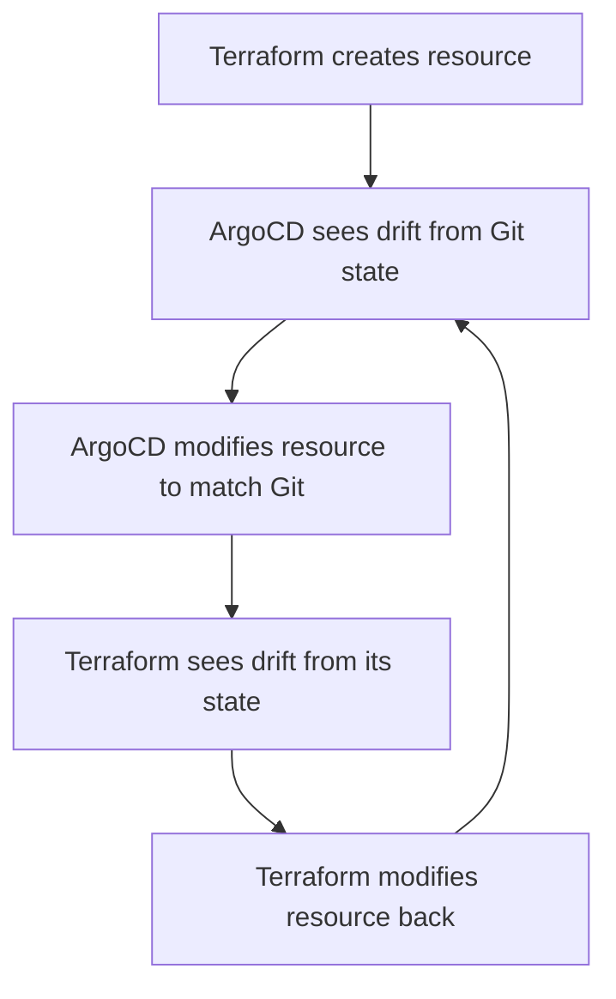
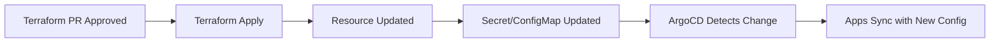

# How to Handle State Management Between Terraform and ArgoCD

Author: [nawazdhandala](https://github.com/nawazdhandala)

Tags: ArgoCD, GitOps, Kubernetes, Terraform, State Management

Description: Learn how to manage the boundary between Terraform state and ArgoCD desired state, avoiding conflicts and ensuring consistency when both tools manage parts of your infrastructure.

---

When Terraform and ArgoCD coexist in the same platform, you have two systems with two different models of "state." Terraform maintains its own state file that tracks what it has created. ArgoCD uses Git as the desired state and compares it against live cluster state. When these two models overlap - when both tools try to manage the same resources - things break in subtle and frustrating ways.

This guide explains where the boundaries should be, how to avoid state conflicts, and how to pass data between the two systems cleanly.

## The State Management Problem

The core issue is ownership. When both Terraform and ArgoCD think they own a resource, you get this cycle:



This reconciliation loop causes constant churn, unexpected changes, and potentially broken services. The solution is clear ownership boundaries.

## Defining Ownership Boundaries

The most effective pattern splits responsibilities by layer:

```
Terraform owns:
  - Cloud infrastructure (VPCs, subnets, DNS zones)
  - Kubernetes cluster provisioning (EKS, GKE, AKS)
  - ArgoCD installation and bootstrap configuration
  - IAM roles and service accounts
  - Cloud databases and storage

ArgoCD owns:
  - Everything running inside Kubernetes
  - Application deployments
  - In-cluster infrastructure (monitoring, ingress, cert-manager)
  - ConfigMaps, Secrets, and RBAC
  - Kubernetes-level networking (Services, Ingress, NetworkPolicies)
```

The handoff point is the Kubernetes cluster itself. Terraform provisions the cluster and installs ArgoCD. ArgoCD manages everything inside the cluster.

## Passing Terraform Outputs to ArgoCD

The biggest challenge is getting Terraform outputs (like database endpoints, S3 bucket names, and IAM role ARNs) into Kubernetes where ArgoCD-managed applications can use them.

### Method 1: Terraform Creates Kubernetes Secrets

Terraform writes outputs directly to Kubernetes Secrets:

```hcl
# Terraform creates the RDS instance
resource "aws_db_instance" "app_db" {
  identifier     = "app-database"
  engine         = "postgres"
  engine_version = "15"
  instance_class = "db.t3.medium"
  # ... other config
}

# Terraform writes connection info to a Kubernetes Secret
resource "kubernetes_secret" "db_credentials" {
  metadata {
    name      = "app-database-credentials"
    namespace = "default"
    labels = {
      "managed-by" = "terraform"
      # Tell ArgoCD to ignore this resource
      "argocd.argoproj.io/managed-by" = "terraform"
    }
  }

  data = {
    host     = aws_db_instance.app_db.address
    port     = tostring(aws_db_instance.app_db.port)
    username = aws_db_instance.app_db.username
    password = var.db_password
    dbname   = aws_db_instance.app_db.db_name
    url      = "postgresql://${aws_db_instance.app_db.username}:${var.db_password}@${aws_db_instance.app_db.address}:${aws_db_instance.app_db.port}/${aws_db_instance.app_db.db_name}"
  }
}
```

The critical part is preventing ArgoCD from managing this Secret. Add it to the ignore list:

```yaml
# ArgoCD Application configuration
spec:
  ignoreDifferences:
    - group: ""
      kind: Secret
      name: app-database-credentials
      jsonPointers:
        - /data
```

Or use resource exclusion in ArgoCD:

```yaml
# argocd-cm ConfigMap
apiVersion: v1
kind: ConfigMap
metadata:
  name: argocd-cm
  namespace: argocd
data:
  resource.exclusions: |
    - apiGroups:
        - ""
      kinds:
        - Secret
      clusters:
        - "*"
      labels:
        managed-by: terraform
```

### Method 2: External Secrets Operator

A cleaner approach uses External Secrets Operator to pull Terraform-managed secrets from an external store:

```hcl
# Terraform writes to AWS Secrets Manager
resource "aws_secretsmanager_secret" "db_credentials" {
  name = "app/database-credentials"
}

resource "aws_secretsmanager_secret_version" "db_credentials" {
  secret_id = aws_secretsmanager_secret.db_credentials.id
  secret_string = jsonencode({
    host     = aws_db_instance.app_db.address
    port     = aws_db_instance.app_db.port
    username = aws_db_instance.app_db.username
    password = var.db_password
    dbname   = aws_db_instance.app_db.db_name
  })
}
```

ArgoCD manages the ExternalSecret resource that pulls from Secrets Manager:

```yaml
# Managed by ArgoCD
apiVersion: external-secrets.io/v1beta1
kind: ExternalSecret
metadata:
  name: app-database-credentials
  namespace: default
spec:
  refreshInterval: 1h
  secretStoreRef:
    name: aws-secrets-manager
    kind: ClusterSecretStore
  target:
    name: app-database-credentials
    creationPolicy: Owner
  data:
    - secretKey: host
      remoteRef:
        key: app/database-credentials
        property: host
    - secretKey: port
      remoteRef:
        key: app/database-credentials
        property: port
    - secretKey: username
      remoteRef:
        key: app/database-credentials
        property: username
    - secretKey: password
      remoteRef:
        key: app/database-credentials
        property: password
```

This is the cleanest separation: Terraform writes to an external secret store, and ArgoCD reads from it. Neither tool touches the other's resources.

### Method 3: ConfigMap Bridge

For non-sensitive data, Terraform writes a ConfigMap that ArgoCD applications reference:

```hcl
resource "kubernetes_config_map" "infrastructure_outputs" {
  metadata {
    name      = "infrastructure-outputs"
    namespace = "default"
    labels = {
      "managed-by" = "terraform"
    }
  }

  data = {
    database_host      = aws_db_instance.app_db.address
    redis_host         = aws_elasticache_cluster.redis.cache_nodes[0].address
    s3_bucket_name     = aws_s3_bucket.app_assets.id
    s3_bucket_region   = aws_s3_bucket.app_assets.region
    cdn_domain         = aws_cloudfront_distribution.cdn.domain_name
    vpc_id             = module.vpc.vpc_id
  }
}
```

Applications reference this ConfigMap:

```yaml
# Managed by ArgoCD
apiVersion: apps/v1
kind: Deployment
metadata:
  name: api-service
spec:
  template:
    spec:
      containers:
        - name: api
          envFrom:
            - configMapRef:
                name: infrastructure-outputs
```

## Avoiding Terraform State Conflicts

### Rule 1: Never Let Both Tools Create the Same Resource

If Terraform creates a namespace, do not have ArgoCD manage the same namespace:

```hcl
# Terraform creates namespaces for infrastructure
resource "kubernetes_namespace" "app" {
  metadata {
    name = "my-app"
    labels = {
      "managed-by" = "terraform"
    }
  }
}
```

In ArgoCD, set the application to not manage the namespace:

```yaml
spec:
  syncPolicy:
    syncOptions:
      # Do NOT create the namespace - Terraform owns it
      - CreateNamespace=false
```

### Rule 2: Use Terraform for Initial Setup, ArgoCD for Ongoing Management

Some resources need to be created by Terraform but then managed by ArgoCD. The pattern is:

1. Terraform creates the resource
2. Terraform removes it from state (`terraform state rm`)
3. ArgoCD takes over management

```bash
# Terraform creates the initial ArgoCD projects
terraform apply

# Remove from Terraform state so ArgoCD can manage them
terraform state rm argocd_project.platform
```

This is a one-time handoff. Use it sparingly.

### Rule 3: Label Everything with Ownership

Every resource should have a label indicating which tool manages it:

```yaml
labels:
  managed-by: terraform    # or "argocd"
```

This makes it easy to identify ownership and configure exclusion rules.

## Terraform State Storage for GitOps

When using Terraform in a GitOps context, state storage needs special consideration:

```hcl
# Use remote state with locking
terraform {
  backend "s3" {
    bucket         = "terraform-state-prod"
    key            = "infrastructure/terraform.tfstate"
    region         = "us-east-1"
    dynamodb_table = "terraform-lock"
    encrypt        = true
  }
}
```

Never store Terraform state in Git. Even though Git is your source of truth for desired state, Terraform state contains sensitive data and should live in a secure remote backend.

## Handling the Upgrade Cycle

When Terraform updates a resource that ArgoCD applications depend on (like a database endpoint change), you need to coordinate:



If you are using External Secrets Operator, this happens automatically. The secret store value changes, ESO refreshes the Secret, and ArgoCD syncs the updated configuration.

For more on bootstrapping ArgoCD with Terraform, see our guide on [bootstrapping ArgoCD with Terraform](https://oneuptime.com/blog/post/2026-02-26-bootstrap-argocd-terraform/view). For the Terraform provider specifically, see [using the Terraform ArgoCD provider](https://oneuptime.com/blog/post/2026-02-26-terraform-argocd-provider/view).

## Best Practices

1. **Define clear ownership** - Document which tool owns which resources. Never let both manage the same thing.
2. **Use External Secrets Operator** - It is the cleanest bridge between Terraform outputs and ArgoCD-managed applications.
3. **Label everything** - Mark resources with `managed-by` labels.
4. **Never store Terraform state in Git** - Use a secure remote backend.
5. **Prefer ArgoCD exclusions over ignore** - Exclude Terraform-managed resources entirely from ArgoCD's scope.
6. **Coordinate upgrades** - When Terraform changes affect ArgoCD applications, ensure the update flow is automated.
7. **Keep the boundary at the cluster level** - Terraform provisions the cluster. ArgoCD manages what runs in it.
8. **Monitor for ownership conflicts** - Use OneUptime to alert when resources show signs of reconciliation loops between Terraform and ArgoCD.

State management between Terraform and ArgoCD is not hard when you establish clear boundaries. The key is ownership: every resource belongs to exactly one tool, and the handoff between tools happens through well-defined interfaces like Secrets, ConfigMaps, or external stores.
