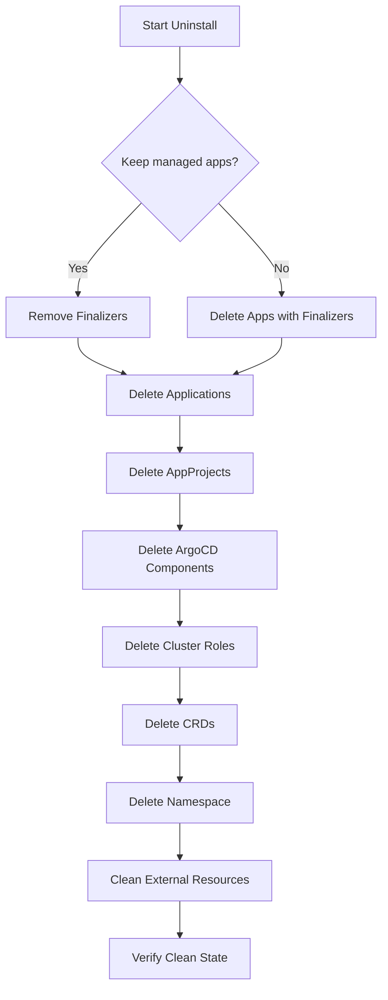

# How to Uninstall ArgoCD Cleanly from Kubernetes

Author: [nawazdhandala](https://github.com/nawazdhandala)

Tags: ArgoCD, GitOps, Kubernetes, DevOps

Description: A step-by-step guide to cleanly uninstalling ArgoCD from Kubernetes, including removing CRDs, finalizers, applications, and leftover resources.

---

Uninstalling ArgoCD is not as simple as deleting the namespace. If you just run `kubectl delete namespace argocd`, you will likely end up with stuck finalizers, orphaned CRDs, and applications that cannot be deleted. ArgoCD uses finalizers on Application resources to control cleanup behavior, and these finalizers can block deletion indefinitely if ArgoCD is already gone.

This guide covers the proper order of operations for a clean uninstall, whether you are removing ArgoCD temporarily, migrating to a different GitOps tool, or cleaning up a test environment.

## Before You Start

Decide what should happen to the applications ArgoCD manages. You have two options:

1. **Keep the deployed applications running** - Remove ArgoCD but leave the workloads in the cluster
2. **Delete everything ArgoCD deployed** - Remove ArgoCD and all the applications it manages

Most people want option 1 - they want to keep their running workloads and just remove the ArgoCD management layer.

## Step 1: Handle Application Finalizers

ArgoCD Applications have a finalizer called `resources-finalizer.argocd.argoproj.io`. When you delete an Application with this finalizer, ArgoCD deletes all the Kubernetes resources the Application manages (Deployments, Services, ConfigMaps, etc.). If you want to keep those resources, you must remove the finalizer first.

### Option A: Keep Deployed Resources (Remove Finalizers)

Remove the finalizer from all Applications so deleting them does not cascade-delete the managed resources.

```bash
# List all applications and their finalizers
kubectl get applications -n argocd -o custom-columns=NAME:.metadata.name,FINALIZERS:.metadata.finalizers

# Remove finalizers from all applications
kubectl get applications -n argocd -o name | while read app; do
  kubectl patch $app -n argocd --type json \
    -p='[{"op": "remove", "path": "/metadata/finalizers"}]' 2>/dev/null
done
```

Now delete the Applications. Since the finalizers are gone, the managed resources will remain.

```bash
# Delete all applications
kubectl delete applications --all -n argocd
```

### Option B: Delete Everything ArgoCD Manages

If you want ArgoCD to clean up all managed resources as it shuts down, keep the finalizers in place and delete the Applications while ArgoCD is still running.

```bash
# Delete all applications (ArgoCD will cascade-delete managed resources)
argocd app delete --all --yes

# Wait for applications to be fully deleted
kubectl get applications -n argocd -w
```

This may take a while if you have many applications with complex resources.

## Step 2: Delete AppProjects

Remove all custom AppProjects. The `default` project is created by ArgoCD and will be removed with the namespace.

```bash
# Remove finalizers from projects if any
kubectl get appprojects -n argocd -o name | while read proj; do
  kubectl patch $proj -n argocd --type json \
    -p='[{"op": "remove", "path": "/metadata/finalizers"}]' 2>/dev/null
done

# Delete all projects
kubectl delete appprojects --all -n argocd
```

## Step 3: Delete ArgoCD Components

Now delete the ArgoCD installation itself. Use the same manifest you used to install.

```bash
# If you installed with kubectl apply from a URL, delete with the same URL
kubectl delete -n argocd -f \
  https://raw.githubusercontent.com/argoproj/argo-cd/stable/manifests/install.yaml

# If you installed a specific version
kubectl delete -n argocd -f \
  https://raw.githubusercontent.com/argoproj/argo-cd/v2.13.3/manifests/install.yaml
```

If you installed with Helm:

```bash
# Uninstall the Helm release
helm uninstall argocd -n argocd
```

If you do not have the original manifest, delete resources by label.

```bash
# Delete all ArgoCD resources by label
kubectl delete all -l app.kubernetes.io/part-of=argocd -n argocd
kubectl delete configmap -l app.kubernetes.io/part-of=argocd -n argocd
kubectl delete secret -l app.kubernetes.io/part-of=argocd -n argocd
kubectl delete serviceaccount -l app.kubernetes.io/part-of=argocd -n argocd
kubectl delete role -l app.kubernetes.io/part-of=argocd -n argocd
kubectl delete rolebinding -l app.kubernetes.io/part-of=argocd -n argocd
```

## Step 4: Delete Cluster-Scoped Resources

ArgoCD creates ClusterRoles and ClusterRoleBindings that are not namespace-scoped. These survive namespace deletion.

```bash
# Delete cluster roles
kubectl delete clusterrole -l app.kubernetes.io/part-of=argocd

# Delete cluster role bindings
kubectl delete clusterrolebinding -l app.kubernetes.io/part-of=argocd
```

## Step 5: Delete CRDs

ArgoCD installs Custom Resource Definitions that persist even after the namespace is deleted.

```bash
# List ArgoCD CRDs
kubectl get crd | grep argoproj.io

# Delete ArgoCD CRDs
kubectl delete crd applications.argoproj.io
kubectl delete crd applicationsets.argoproj.io
kubectl delete crd appprojects.argoproj.io
```

**Warning**: Deleting CRDs will delete ALL instances of those resources across ALL namespaces. If you have multiple ArgoCD installations or if other tools create these resources, do not delete the CRDs.

## Step 6: Delete the Namespace

Finally, delete the ArgoCD namespace.

```bash
kubectl delete namespace argocd
```

If the namespace gets stuck in `Terminating` state, it is usually because of stuck finalizers on remaining resources.

```bash
# Check for resources blocking namespace deletion
kubectl api-resources --verbs=list --namespaced -o name | while read resource; do
  kubectl get $resource -n argocd 2>/dev/null | grep -v "^$" && echo "Found: $resource"
done

# Force remove stuck resources
kubectl get namespace argocd -o json | \
  jq '.spec.finalizers = []' | \
  kubectl replace --raw "/api/v1/namespaces/argocd/finalize" -f -
```

## Step 7: Clean Up External Resources

If ArgoCD managed external clusters, remove the ServiceAccounts it created on those clusters.

```bash
# On each external cluster
kubectl delete serviceaccount argocd-manager -n kube-system
kubectl delete clusterrolebinding argocd-manager-role
```

If ArgoCD created webhooks on your Git repositories, remove those too through your Git provider's settings.

## Verification

Confirm everything is gone.

```bash
# Verify namespace is deleted
kubectl get namespace argocd

# Verify CRDs are gone
kubectl get crd | grep argoproj

# Verify cluster roles are gone
kubectl get clusterrole | grep argocd
kubectl get clusterrolebinding | grep argocd

# Verify no leftover pods
kubectl get pods --all-namespaces | grep argocd
```

## Complete Uninstall Script

Here is a comprehensive uninstall script that handles all steps.

```bash
#!/bin/bash
# uninstall-argocd.sh
# Usage: ./uninstall-argocd.sh [--delete-apps]

NAMESPACE="${NAMESPACE:-argocd}"
DELETE_APPS="${1}"

echo "=== ArgoCD Uninstall ==="
echo "Namespace: $NAMESPACE"

if [ "$DELETE_APPS" = "--delete-apps" ]; then
  echo "Mode: Delete all managed applications"
  echo "Deleting applications with finalizers (cascading delete)..."
  kubectl delete applications --all -n $NAMESPACE --timeout=300s
else
  echo "Mode: Keep managed applications running"
  echo "Removing finalizers from applications..."
  kubectl get applications -n $NAMESPACE -o name 2>/dev/null | while read app; do
    kubectl patch $app -n $NAMESPACE --type json \
      -p='[{"op": "remove", "path": "/metadata/finalizers"}]' 2>/dev/null
  done
  echo "Deleting applications (without cascading)..."
  kubectl delete applications --all -n $NAMESPACE --timeout=60s
fi

echo "Removing project finalizers..."
kubectl get appprojects -n $NAMESPACE -o name 2>/dev/null | while read proj; do
  kubectl patch $proj -n $NAMESPACE --type json \
    -p='[{"op": "remove", "path": "/metadata/finalizers"}]' 2>/dev/null
done
kubectl delete appprojects --all -n $NAMESPACE --timeout=60s

echo "Deleting cluster-scoped resources..."
kubectl delete clusterrole -l app.kubernetes.io/part-of=argocd 2>/dev/null
kubectl delete clusterrolebinding -l app.kubernetes.io/part-of=argocd 2>/dev/null

echo "Deleting namespace..."
kubectl delete namespace $NAMESPACE --timeout=120s

echo "Deleting CRDs..."
kubectl delete crd applications.argoproj.io 2>/dev/null
kubectl delete crd applicationsets.argoproj.io 2>/dev/null
kubectl delete crd appprojects.argoproj.io 2>/dev/null

echo "=== Uninstall Complete ==="

# Verify
echo "Verification:"
kubectl get namespace $NAMESPACE 2>&1
kubectl get crd | grep argoproj 2>&1 || echo "No ArgoCD CRDs found"
kubectl get clusterrole | grep argocd 2>&1 || echo "No ArgoCD ClusterRoles found"
```

## Uninstall Flow



## Troubleshooting

### Namespace Stuck in Terminating

This is the most common issue. It happens when finalizers block deletion.

```bash
# Find what's blocking
kubectl get all -n argocd
kubectl get applications -n argocd
kubectl get appprojects -n argocd
```

### Application Delete Hangs

If an Application delete hangs, the finalizer is waiting for ArgoCD to clean up resources, but ArgoCD may already be partially deleted.

```bash
# Force remove the finalizer
kubectl patch application <app-name> -n argocd --type json \
  -p='[{"op": "remove", "path": "/metadata/finalizers"}]'
```

### CRD Delete Fails

If CRD deletion fails with "resource busy", there may still be instances.

```bash
# Check for remaining instances
kubectl get applications --all-namespaces
kubectl get applicationsets --all-namespaces
```

## Further Reading

- Reinstall ArgoCD: [Install ArgoCD on Kubernetes](https://oneuptime.com/blog/post/2026-01-25-install-argocd-kubernetes/view)
- Migrate to another tool: [ArgoCD to Flux migration](https://oneuptime.com/blog/post/2026-01-27-argocd-to-flux-migration/view)

A clean uninstall prevents orphaned resources from cluttering your cluster and avoids confusion if you reinstall later. Follow the order of operations - finalizers first, then resources, then CRDs, then namespace - and you will have a spotless cluster.
