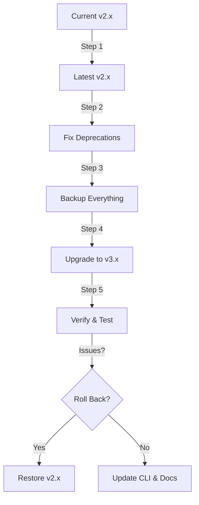

# How to Upgrade ArgoCD from v2.x to v3.x Safely

Author: [nawazdhandala](https://github.com/nawazdhandala)

Tags: ArgoCD, GitOps, Kubernetes, Upgrade

Description: A comprehensive guide to safely upgrading ArgoCD from version 2.x to version 3.x, covering breaking changes, migration steps, and rollback procedures.

---

Major version upgrades in ArgoCD introduce breaking changes that need careful planning. The jump from v2.x to v3.x is significant - it includes API changes, deprecated feature removals, new default behaviors, and configuration format updates. Rushing this upgrade can break your GitOps pipeline and leave applications out of sync.

This guide walks through the complete upgrade process: understanding what changed, preparing your environment, performing the upgrade, and rolling back if something goes wrong.

## What Changed in v3.x

Before upgrading, understand the key breaking changes.

### API Changes

- The `argoproj.io/v1alpha1` API is still supported but some fields have changed
- The `spec.source` field now requires explicit `chart` or `path` specification for Helm applications
- The `sync-option` annotation format has been standardized

### Deprecated Features Removed

- Legacy repository credential format is removed - use `argocd.argoproj.io/secret-type: repository` labels
- The `--app` flag in `argocd repo add` is removed
- Manifest generation via the `argocd-cm` ConfigMap `configManagementPlugins` field is removed - use sidecar plugins instead

### New Default Behaviors

- Server-side diff is enabled by default
- Resource tracking uses annotation-based tracking by default instead of label-based
- Improved health checks for common resource types

### Configuration Changes

- Some ConfigMap keys have been renamed or moved
- RBAC policy format has minor syntax changes
- Notification trigger conditions use a new syntax

## Pre-Upgrade Checklist

Before starting the upgrade, complete this checklist.

### 1. Document Your Current State

```bash
# Record current ArgoCD version
kubectl -n argocd exec deployment/argocd-server -- argocd version

# Export current configuration
kubectl get configmap argocd-cm -n argocd -o yaml > backup-argocd-cm.yaml
kubectl get configmap argocd-rbac-cm -n argocd -o yaml > backup-argocd-rbac-cm.yaml
kubectl get configmap argocd-cmd-params-cm -n argocd -o yaml > backup-argocd-cmd-params-cm.yaml

# Export all applications
kubectl get applications -n argocd -o yaml > backup-applications.yaml

# Export all AppProjects
kubectl get appprojects -n argocd -o yaml > backup-appprojects.yaml

# Export repository secrets
kubectl get secrets -n argocd -l argocd.argoproj.io/secret-type=repository -o yaml > backup-repos.yaml
```

### 2. Check for Deprecated Features

Scan your configuration for deprecated features that will break in v3.x.

```bash
# Check for legacy config management plugins in argocd-cm
kubectl get configmap argocd-cm -n argocd -o yaml | grep configManagementPlugins

# Check for legacy repository format
kubectl get secrets -n argocd -o yaml | grep -c "argocd.argoproj.io/secret-type"

# Check resource tracking method
kubectl get configmap argocd-cm -n argocd -o yaml | grep tracking.method
```

### 3. Verify All Applications Are Healthy

Do not upgrade while applications are in a bad state.

```bash
# Check for unhealthy or out-of-sync applications
argocd app list --output json | jq '.[] | select(.status.sync.status != "Synced" or .status.health.status != "Healthy") | .metadata.name'
```

Fix any issues before proceeding.

### 4. Read the Full Changelog

Always read the official release notes for every minor version between your current version and v3.0.

```bash
# If you're on v2.10, you should read notes for:
# v2.11, v2.12, v2.13, and v3.0
```

## Step 1: Upgrade to the Latest v2.x First

Do not jump directly from an old v2.x to v3.x. Upgrade to the latest v2.x release first. This minimizes the gap and catches any intermediate deprecation warnings.

```bash
# Find the latest v2.x release
LATEST_V2=$(curl -s https://api.github.com/repos/argoproj/argo-cd/releases | \
  jq -r '[.[] | select(.tag_name | startswith("v2.")) | .tag_name][0]')
echo "Latest v2.x: ${LATEST_V2}"

# Apply the latest v2.x manifests
kubectl apply -n argocd -f \
  https://raw.githubusercontent.com/argoproj/argo-cd/${LATEST_V2}/manifests/install.yaml
```

Wait for the rollout to complete.

```bash
kubectl rollout status deployment/argocd-server -n argocd
kubectl rollout status deployment/argocd-repo-server -n argocd
kubectl rollout status statefulset/argocd-application-controller -n argocd
```

Verify everything still works.

```bash
argocd app list
```

## Step 2: Migrate Deprecated Configurations

Before upgrading to v3.x, fix all deprecated configurations while still on v2.x.

### Migrate Config Management Plugins

If you use `configManagementPlugins` in argocd-cm, migrate to sidecar plugins.

Old format (in argocd-cm):

```yaml
# This will NOT work in v3.x
configManagementPlugins: |
  - name: my-plugin
    generate:
      command: ["my-plugin", "generate"]
```

New format (sidecar container in repo-server):

```yaml
# argocd-repo-server-patch.yaml
apiVersion: apps/v1
kind: Deployment
metadata:
  name: argocd-repo-server
  namespace: argocd
spec:
  template:
    spec:
      containers:
      - name: my-plugin
        image: my-org/my-plugin:latest
        command: ["/var/run/argocd/argocd-cmp-server"]
        securityContext:
          runAsNonRoot: true
          runAsUser: 999
        volumeMounts:
        - name: var-files
          mountPath: /var/run/argocd
        - name: plugins
          mountPath: /home/argocd/cmp-server/plugins
        - name: my-plugin-config
          mountPath: /home/argocd/cmp-server/config/plugin.yaml
          subPath: plugin.yaml
```

### Migrate Resource Tracking

If you use label-based tracking, migrate to annotation-based tracking (the v3.x default).

```bash
# Check current tracking method
kubectl get configmap argocd-cm -n argocd -o jsonpath='{.data.application\.resourceTrackingMethod}'

# Switch to annotation-based tracking while still on v2.x
kubectl patch configmap argocd-cm -n argocd --type merge \
  -p '{"data":{"application.resourceTrackingMethod":"annotation"}}'
```

## Step 3: Perform the v3.x Upgrade

Once all deprecations are resolved and you are on the latest v2.x, proceed with the v3.x upgrade.

```bash
# Apply v3.x manifests
ARGOCD_V3=v3.0.0

kubectl apply -n argocd -f \
  https://raw.githubusercontent.com/argoproj/argo-cd/${ARGOCD_V3}/manifests/install.yaml
```

Watch the rollout.

```bash
# Watch pods restart with new version
kubectl get pods -n argocd -w
```

The CRD updates might take a moment. Check that CRDs are updated.

```bash
# Verify CRD versions
kubectl get crd applications.argoproj.io -o jsonpath='{.spec.versions[*].name}'
```

## Step 4: Post-Upgrade Verification

Run a thorough verification after the upgrade.

```bash
# Check ArgoCD version
argocd version

# Verify all applications are still synced and healthy
argocd app list

# Check for any applications that went out of sync during upgrade
argocd app list --output json | \
  jq '.[] | select(.status.sync.status != "Synced") | {name: .metadata.name, sync: .status.sync.status}'

# Check controller logs for errors
kubectl logs -n argocd statefulset/argocd-application-controller --tail=100 | grep -i error

# Check repo-server logs
kubectl logs -n argocd deployment/argocd-repo-server --tail=100 | grep -i error

# Check server logs
kubectl logs -n argocd deployment/argocd-server --tail=100 | grep -i error
```

## Step 5: Update the ArgoCD CLI

Update your CLI to match the server version.

```bash
# Download the v3.x CLI
curl -sSL -o argocd \
  https://github.com/argoproj/argo-cd/releases/download/v3.0.0/argocd-linux-amd64
chmod +x argocd
sudo mv argocd /usr/local/bin/

# Verify version match
argocd version
```

## Rollback Procedure

If the upgrade causes problems, roll back to v2.x.

```bash
# Apply the previous v2.x manifests
kubectl apply -n argocd -f backup-argocd-install.yaml

# If you don't have the backup manifest, use the version URL
kubectl apply -n argocd -f \
  https://raw.githubusercontent.com/argoproj/argo-cd/v2.13.3/manifests/install.yaml

# Restore ConfigMaps if they were modified
kubectl apply -f backup-argocd-cm.yaml
kubectl apply -f backup-argocd-rbac-cm.yaml
kubectl apply -f backup-argocd-cmd-params-cm.yaml

# Wait for rollback
kubectl rollout status deployment/argocd-server -n argocd
```

## Upgrade Path Diagram



## Troubleshooting

### Applications Show "ComparisonError"

This usually means the CRDs were not updated properly.

```bash
# Reapply CRDs
kubectl apply -f \
  https://raw.githubusercontent.com/argoproj/argo-cd/v3.0.0/manifests/crds/application-crd.yaml
kubectl apply -f \
  https://raw.githubusercontent.com/argoproj/argo-cd/v3.0.0/manifests/crds/appproject-crd.yaml
```

### RBAC Policies Not Working

v3.x may have slightly different RBAC syntax. Check the logs.

```bash
kubectl logs deployment/argocd-server -n argocd | grep -i rbac
```

### Config Management Plugin Not Found

If your plugin stopped working, it is because the inline plugin format was removed. Migrate to sidecar plugins as described in Step 2.

## Further Reading

- Verify your installation after upgrade: [Verify ArgoCD installation](https://oneuptime.com/blog/post/2026-02-26-verify-argocd-installation-healthy/view)
- Zero-downtime upgrade techniques: [Upgrade ArgoCD without downtime](https://oneuptime.com/blog/post/2026-02-26-upgrade-argocd-without-downtime/view)
- ArgoCD debugging: [Debug ArgoCD sync issues](https://oneuptime.com/blog/post/2026-02-02-argocd-debugging/view)

Major version upgrades require patience and discipline. Take your time, test in a non-production environment first, and always have a rollback plan ready. The migration effort pays off with better performance, improved security, and access to new features.
