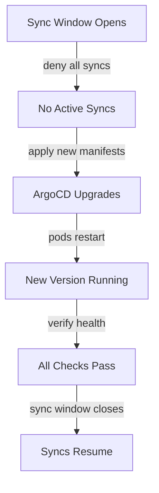

# How to Upgrade ArgoCD Without Downtime

Author: [nawazdhandala](https://github.com/nawazdhandala)

Tags: ArgoCD, GitOps, Kubernetes, High Availability

Description: Learn techniques for upgrading ArgoCD without disrupting running deployments, including rolling updates, blue-green strategies, and HA configurations.

---

Upgrading ArgoCD in production is nerve-wracking because a broken ArgoCD means no deployments happen. If your ArgoCD goes down during an upgrade, existing applications keep running (Kubernetes does not stop them), but new changes will not sync, drift will not be corrected, and your team will be stuck.

The good news is that ArgoCD upgrades are designed to be smooth. Kubernetes handles rolling updates natively, and with the right setup, you can upgrade ArgoCD without any interruption to your GitOps pipeline.

## Understanding What Happens During an Upgrade

When you apply a new version of ArgoCD manifests, Kubernetes performs a rolling update on Deployments and updates StatefulSets. Here is what each component does during the transition:

| Component | During Upgrade | Impact |
|---|---|---|
| argocd-server | Rolling restart | Brief UI/API interruption |
| argocd-repo-server | Rolling restart | Manifest generation paused briefly |
| argocd-application-controller | StatefulSet restart | Sync operations paused briefly |
| argocd-redis | Rolling restart | Cache lost, rebuilt automatically |
| argocd-dex-server | Rolling restart | SSO login interruption |

The key insight is that **existing applications continue running** regardless of ArgoCD state. ArgoCD does not proxy traffic to your applications. It only manages their configuration.

## Strategy 1: Rolling Update (Default)

The default upgrade method works well for most scenarios. Kubernetes replaces old pods with new ones one at a time.

```bash
# Apply the new version
ARGOCD_NEW_VERSION=v2.14.0

kubectl apply -n argocd -f \
  https://raw.githubusercontent.com/argoproj/argo-cd/${ARGOCD_NEW_VERSION}/manifests/install.yaml
```

Monitor the rollout.

```bash
# Watch each component roll out
kubectl rollout status deployment/argocd-server -n argocd &
kubectl rollout status deployment/argocd-repo-server -n argocd &
kubectl rollout status deployment/argocd-dex-server -n argocd &
kubectl rollout status statefulset/argocd-application-controller -n argocd &

wait
echo "All components upgraded"
```

### Minimize Interruption with PodDisruptionBudgets

Add PodDisruptionBudgets to prevent too many pods from being down at once.

```yaml
# argocd-server-pdb.yaml
apiVersion: policy/v1
kind: PodDisruptionBudget
metadata:
  name: argocd-server-pdb
  namespace: argocd
spec:
  minAvailable: 1
  selector:
    matchLabels:
      app.kubernetes.io/name: argocd-server
---
apiVersion: policy/v1
kind: PodDisruptionBudget
metadata:
  name: argocd-repo-server-pdb
  namespace: argocd
spec:
  minAvailable: 1
  selector:
    matchLabels:
      app.kubernetes.io/name: argocd-repo-server
```

```bash
kubectl apply -f argocd-server-pdb.yaml
```

## Strategy 2: High Availability Upgrade

If you are running ArgoCD in HA mode, upgrades are nearly seamless because multiple replicas handle requests.

### Set Up HA Before Upgrading

If you are not already running HA, switch to the HA manifests first (while on the current version).

```bash
# Install HA manifests for your current version
CURRENT_VERSION=v2.13.3
kubectl apply -n argocd -f \
  https://raw.githubusercontent.com/argoproj/argo-cd/${CURRENT_VERSION}/manifests/ha/install.yaml
```

This gives you multiple replicas of the API server and repo server.

```bash
# Verify HA is running
kubectl get deployment -n argocd
```

You should see multiple replicas:

```
NAME                 READY   UP-TO-DATE   AVAILABLE
argocd-server        2/2     2            2
argocd-repo-server   2/2     2            2
argocd-redis-ha      3/3     3            3
```

### Perform the HA Upgrade

```bash
# Apply the new version's HA manifests
ARGOCD_NEW_VERSION=v2.14.0
kubectl apply -n argocd -f \
  https://raw.githubusercontent.com/argoproj/argo-cd/${ARGOCD_NEW_VERSION}/manifests/ha/install.yaml
```

With multiple replicas, Kubernetes replaces pods one at a time while the remaining pods handle traffic. Users will not notice any interruption.

## Strategy 3: Blue-Green with a Second ArgoCD Instance

For the most cautious approach, run a second ArgoCD instance alongside the first, verify it works, then switch over.

### Deploy the New Version in a Separate Namespace

```bash
# Create a namespace for the new version
kubectl create namespace argocd-v2

# Install the new ArgoCD version
kubectl apply -n argocd-v2 -f \
  https://raw.githubusercontent.com/argoproj/argo-cd/v2.14.0/manifests/install.yaml
```

### Copy Configuration

Copy your configuration to the new instance.

```bash
# Export configuration from the old instance
kubectl get configmap argocd-cm -n argocd -o yaml | \
  sed 's/namespace: argocd/namespace: argocd-v2/' | \
  kubectl apply -f -

kubectl get configmap argocd-rbac-cm -n argocd -o yaml | \
  sed 's/namespace: argocd/namespace: argocd-v2/' | \
  kubectl apply -f -

# Copy repository secrets
kubectl get secrets -n argocd -l argocd.argoproj.io/secret-type=repository -o yaml | \
  sed 's/namespace: argocd/namespace: argocd-v2/' | \
  kubectl apply -f -
```

### Test the New Version

```bash
# Port-forward to the new instance
kubectl port-forward svc/argocd-server -n argocd-v2 8081:443 &

# Login and verify
argocd login localhost:8081 --insecure --username admin \
  --password $(kubectl -n argocd-v2 get secret argocd-initial-admin-secret -o jsonpath="{.data.password}" | base64 -d)

# Create a test application
argocd app create test-app \
  --repo https://github.com/argoproj/argocd-example-apps.git \
  --path guestbook \
  --dest-server https://kubernetes.default.svc \
  --dest-namespace test-upgrade

argocd app sync test-app
```

### Switch Traffic

Once verified, move your Application CRDs to the new namespace and update your Ingress/Route to point to the new ArgoCD server.

```bash
# Move applications to the new namespace
kubectl get applications -n argocd -o yaml | \
  sed 's/namespace: argocd/namespace: argocd-v2/' | \
  kubectl apply -f -

# Update your ingress to point to the new namespace
kubectl patch ingress argocd-server -n argocd \
  --type='json' -p='[{"op": "replace", "path": "/spec/rules/0/http/paths/0/backend/service/name", "value":"argocd-server"}]'

# Delete the old instance after confirming everything works
kubectl delete namespace argocd
kubectl rename namespace argocd-v2 argocd
```

## Strategy 4: Canary Upgrade with Sync Windows

Use ArgoCD sync windows to prevent sync operations during the upgrade window.

```yaml
# Pause all syncs during the upgrade window
apiVersion: argoproj.io/v1alpha1
kind: AppProject
metadata:
  name: default
  namespace: argocd
spec:
  syncWindows:
  - kind: deny
    schedule: "0 2 * * *"    # 2 AM
    duration: 1h              # 1 hour maintenance window
    applications:
    - "*"
```

Then upgrade during the sync window when no operations are running.



## Pre-Upgrade Health Checks

Run these before starting any upgrade.

```bash
#!/bin/bash
# pre-upgrade-check.sh

echo "=== ArgoCD Pre-Upgrade Health Check ==="

# Check all pods are running
echo "Checking pods..."
UNHEALTHY=$(kubectl get pods -n argocd --field-selector=status.phase!=Running -o name 2>/dev/null | wc -l)
if [ "$UNHEALTHY" -gt 0 ]; then
  echo "WARNING: $UNHEALTHY unhealthy pods found"
  kubectl get pods -n argocd --field-selector=status.phase!=Running
else
  echo "All pods healthy"
fi

# Check for active syncs
echo "Checking active syncs..."
SYNCING=$(kubectl get applications -n argocd -o json | \
  jq '[.items[] | select(.status.operationState.phase == "Running")] | length')
if [ "$SYNCING" -gt 0 ]; then
  echo "WARNING: $SYNCING applications are currently syncing"
else
  echo "No active syncs"
fi

# Check for out-of-sync apps
echo "Checking sync status..."
OUTOFSYNC=$(kubectl get applications -n argocd -o json | \
  jq '[.items[] | select(.status.sync.status != "Synced")] | length')
echo "$OUTOFSYNC applications out of sync"

echo "=== Pre-Upgrade Check Complete ==="
```

## Post-Upgrade Verification

```bash
#!/bin/bash
# post-upgrade-verify.sh

echo "=== ArgoCD Post-Upgrade Verification ==="

# Check version
echo "Version:"
kubectl -n argocd exec deployment/argocd-server -- argocd version --short 2>/dev/null

# Check all pods
echo "Pod Status:"
kubectl get pods -n argocd

# Check application health
echo "Application Health:"
kubectl get applications -n argocd -o custom-columns=NAME:.metadata.name,SYNC:.status.sync.status,HEALTH:.status.health.status

# Check for errors in logs
echo "Recent Errors:"
kubectl logs -n argocd deployment/argocd-server --tail=50 2>/dev/null | grep -i error | tail -5
kubectl logs -n argocd statefulset/argocd-application-controller --tail=50 2>/dev/null | grep -i error | tail -5

echo "=== Verification Complete ==="
```

## Troubleshooting

### Pods CrashLooping After Upgrade

Check for incompatible configurations.

```bash
kubectl logs -n argocd deployment/argocd-server --previous
```

### Redis Connection Errors

Redis cache is rebuilt on upgrade. Errors should resolve within a minute.

```bash
kubectl logs -n argocd deployment/argocd-redis
```

### CRD Conflicts

If CRDs fail to update, apply them manually.

```bash
kubectl apply -f \
  https://raw.githubusercontent.com/argoproj/argo-cd/v2.14.0/manifests/crds/application-crd.yaml
kubectl apply -f \
  https://raw.githubusercontent.com/argoproj/argo-cd/v2.14.0/manifests/crds/appproject-crd.yaml
```

## Further Reading

- HA setup details: [ArgoCD High Availability](https://oneuptime.com/blog/post/2026-02-02-argocd-high-availability/view)
- Version-specific installation: [Install a specific version of ArgoCD](https://oneuptime.com/blog/post/2026-02-26-install-specific-version-argocd/view)
- Debugging after upgrade: [Debug ArgoCD sync issues](https://oneuptime.com/blog/post/2026-02-02-argocd-debugging/view)

The safest path is HA mode with rolling updates. It requires the least effort and provides near-zero downtime. If your organization requires absolute zero downtime guarantees, the blue-green approach with a second instance is the way to go, but it takes more coordination.
