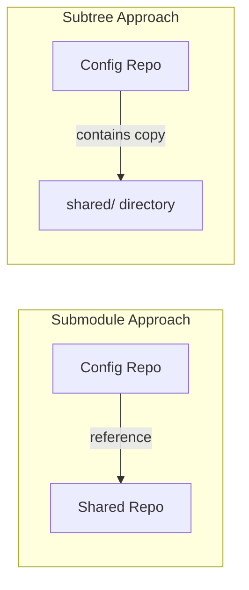

# How to Use Git Subtrees with ArgoCD

Author: [nawazdhandala](https://github.com/nawazdhandala)

Tags: ArgoCD, GitOps, Kubernetes, Git Subtrees, Repository Management

Description: Learn how to use Git subtrees as an alternative to submodules for sharing Kubernetes manifests across ArgoCD-managed repositories.

---

Git subtrees are an alternative to Git submodules for embedding shared code from one repository into another. Unlike submodules, subtrees copy the actual files into your repository, so there is no external dependency at clone time. This makes them simpler to work with in ArgoCD because the repo server does not need any special configuration to handle them.

## Subtrees vs Submodules for ArgoCD

The key difference is where the code lives:

- **Submodules** store a reference (commit SHA) to another repo. ArgoCD must clone both repos.
- **Subtrees** copy the files directly into your repo. ArgoCD sees a normal directory.



For ArgoCD, subtrees have a clear advantage: no special configuration needed. ArgoCD clones one repo and gets everything. No credential issues with nested repos, no submodule initialization step, no extra latency.

## Adding a Subtree to Your Config Repo

Start by adding the shared repository as a remote and pulling it as a subtree:

```bash
cd backend-api-config

# Add the shared repo as a remote
git remote add shared-configs https://github.com/myorg/shared-configs.git

# Pull the shared repo into a subdirectory
git subtree add --prefix=shared shared-configs main --squash
```

The `--squash` flag merges all the shared repo's history into a single commit, keeping your history clean. Without it, you would import the entire commit history of the shared repo.

Your directory structure now looks like this:

```text
backend-api-config/
├── base/
│   ├── kustomization.yaml
│   └── deployment.yaml
├── overlays/
│   └── production/
└── shared/                    # Files from shared-configs repo
    ├── monitoring/
    │   ├── service-monitor.yaml
    │   └── prometheus-rules.yaml
    └── network-policies/
        └── default-deny.yaml
```

## Referencing Subtree Files in Kustomize

Since the subtree files are regular files in your repo, reference them normally:

```yaml
# base/kustomization.yaml
apiVersion: kustomize.config.k8s.io/v1beta1
kind: Kustomization

resources:
  - deployment.yaml
  - service.yaml
  - ../shared/monitoring/service-monitor.yaml
  - ../shared/network-policies/default-deny.yaml

patches:
  - target:
      kind: ServiceMonitor
      name: shared-service-monitor
    patch: |
      - op: replace
        path: /metadata/labels/service
        value: backend-api
```

You can also patch shared resources to customize them for your service, which is harder to do with submodules.

## Updating the Subtree

When the shared repo has new changes you want to pull in:

```bash
cd backend-api-config

# Pull latest changes from the shared repo
git subtree pull --prefix=shared shared-configs main --squash
```

This creates a merge commit that updates the shared directory with the latest changes. If there are conflicts between your local modifications and the upstream changes, Git will ask you to resolve them just like a normal merge.

## Automating Subtree Updates

Create a CI workflow that periodically updates the subtree and creates a PR:

```yaml
# .github/workflows/update-subtree.yaml
name: Update Shared Configs Subtree
on:
  repository_dispatch:
    types: [shared-configs-updated]
  schedule:
    - cron: "0 8 * * 1"  # Weekly on Monday

jobs:
  update-subtree:
    runs-on: ubuntu-latest
    steps:
      - uses: actions/checkout@v4
        with:
          fetch-depth: 0  # Full history needed for subtree
          token: ${{ secrets.PAT_TOKEN }}

      - name: Update subtree
        run: |
          git config user.name "CI Bot"
          git config user.email "ci@myorg.com"

          # Add remote if not present
          git remote add shared-configs https://github.com/myorg/shared-configs.git 2>/dev/null || true
          git fetch shared-configs

          # Create a branch for the update
          git checkout -b update-shared-configs

          # Pull subtree changes
          git subtree pull --prefix=shared shared-configs main --squash -m "update shared-configs subtree"

      - name: Create PR if changes exist
        run: |
          if git diff --quiet main; then
            echo "No changes to update"
            exit 0
          fi
          git push -u origin update-shared-configs
          gh pr create \
            --title "Update shared-configs subtree" \
            --body "Automated update of shared Kubernetes configs from the shared-configs repo."
        env:
          GH_TOKEN: ${{ secrets.PAT_TOKEN }}
```

Important: Subtree operations require full Git history (`fetch-depth: 0`), unlike most CI workflows that use shallow clones.

## Pushing Changes Back to the Shared Repo

One advantage of subtrees over submodules is that you can modify shared files locally and push changes back to the upstream repo:

```bash
# Make changes to shared files
vim shared/monitoring/service-monitor.yaml
git add shared/monitoring/service-monitor.yaml
git commit -m "update service monitor scrape interval"

# Push changes back to the shared repo
git subtree push --prefix=shared shared-configs feature/update-scrape-interval
```

This creates a branch in the shared repo with only the changes under the `shared/` prefix. You can then create a PR in the shared repo.

This bidirectional workflow is powerful but can get confusing. Most teams prefer to make changes directly in the shared repo and pull them down through subtrees.

## ArgoCD Configuration

Since subtrees are just regular files in your repo, no special ArgoCD configuration is needed:

```yaml
apiVersion: argoproj.io/v1alpha1
kind: Application
metadata:
  name: backend-api
  namespace: argocd
spec:
  project: default
  source:
    repoURL: https://github.com/myorg/backend-api-config
    targetRevision: main
    path: overlays/production
  destination:
    server: https://kubernetes.default.svc
    namespace: production
  syncPolicy:
    automated:
      prune: true
      selfHeal: true
```

ArgoCD sees the shared directory as part of the repo. No extra clones, no authentication issues, no special flags.

## Managing Multiple Subtrees

You can have multiple subtrees from different source repos:

```bash
# Add monitoring configs
git subtree add --prefix=shared/monitoring monitoring-configs main --squash

# Add security policies
git subtree add --prefix=shared/security security-policies main --squash

# Add common Helm chart
git subtree add --prefix=charts/common common-chart main --squash
```

Track your subtrees in a file for documentation:

```yaml
# SUBTREES.yaml - documentation of subtree sources
subtrees:
  - prefix: shared/monitoring
    remote: https://github.com/myorg/monitoring-configs
    branch: main
  - prefix: shared/security
    remote: https://github.com/myorg/security-policies
    branch: main
  - prefix: charts/common
    remote: https://github.com/myorg/common-chart
    branch: main
```

## Handling Subtree Conflicts

When pulling subtree updates, you might encounter merge conflicts if you have modified shared files locally:

```bash
# This might conflict
git subtree pull --prefix=shared shared-configs main --squash

# If conflicts occur, resolve them normally
git status  # See conflicted files
vim shared/monitoring/service-monitor.yaml  # Fix conflicts
git add shared/monitoring/service-monitor.yaml
git commit  # Complete the merge
```

To minimize conflicts, follow these guidelines:

1. Avoid modifying shared files directly in service repos when possible
2. Use Kustomize patches to customize shared resources instead of editing them
3. Pull subtree updates frequently to avoid large divergences

## Performance Considerations

Subtrees increase the size of your repo because the files are duplicated. For most Kubernetes configs (which are small YAML files), this is negligible. But if you are sharing large files (like Grafana dashboards or test fixtures), the repo size can grow.

Monitor repo size:

```bash
# Check repo size
git count-objects -vH

# Check subtree directory size
du -sh shared/
```

If repo size becomes a problem, consider:
- Using `.gitattributes` with Git LFS for large files
- Splitting large shared configs into smaller, focused repos
- Using Kustomize remote bases instead of subtrees for rarely-changed configs

## When to Choose Subtrees Over Submodules

Choose subtrees when:
- You want zero configuration in ArgoCD
- Your team finds submodules confusing (most teams do)
- You want to modify shared files locally and push back
- You want a self-contained repo that clones without extra steps
- Your shared configs are small YAML files

Choose submodules when:
- You need strict version pinning with commit SHA references
- You do not want shared files in your repo history
- The shared repo is large and duplicating it is wasteful
- You want clearly separated ownership (submodules make it obvious where files come from)

## Summary

Git subtrees embed shared files directly into your config repo, making them invisible to ArgoCD - it just sees normal files. This eliminates the authentication, configuration, and clone-time issues that come with submodules. Use `git subtree add` to import shared configs, `git subtree pull` to update them, and automate updates through CI pipelines. The tradeoff is a larger repo and potentially more complex merge history, but for most ArgoCD workflows, the simplicity is worth it.
