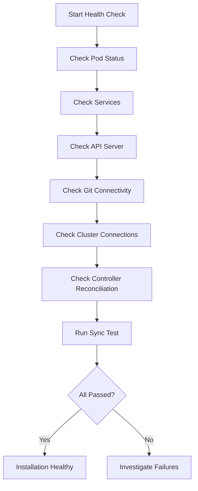

# How to Verify ArgoCD Installation is Healthy

Author: [nawazdhandala](https://github.com/nawazdhandala)

Tags: ArgoCD, GitOps, Kubernetes, Monitoring

Description: A systematic guide to verifying that your ArgoCD installation is healthy and fully functional, covering pod health, connectivity, sync tests, and monitoring.

---

You installed ArgoCD, all the pods show `Running`, and you logged into the UI. But is it actually healthy? Pod status alone does not tell you if ArgoCD can reach your Git repos, if the controller is reconciling applications correctly, or if there are performance issues lurking beneath the surface.

This guide provides a systematic health check you can run after installation, after upgrades, or as part of regular maintenance. Think of it as a post-flight checklist for ArgoCD.

## Quick Health Check

If you just need a fast answer, run these three commands.

```bash
# 1. All pods running?
kubectl get pods -n argocd

# 2. Can ArgoCD reach the Kubernetes API?
kubectl exec -n argocd deployment/argocd-server -- argocd cluster list

# 3. Can you deploy an app?
argocd app create health-test \
  --repo https://github.com/argoproj/argocd-example-apps.git \
  --path guestbook \
  --dest-server https://kubernetes.default.svc \
  --dest-namespace default \
  --core 2>/dev/null || \
argocd app create health-test \
  --repo https://github.com/argoproj/argocd-example-apps.git \
  --path guestbook \
  --dest-server https://kubernetes.default.svc \
  --dest-namespace default

argocd app sync health-test
argocd app delete health-test --yes
```

If all three succeed, your installation is functional. For a deeper check, continue below.

## Step 1: Verify Pod Health

Check that all ArgoCD components are running and not restarting.

```bash
# Check all pods in the argocd namespace
kubectl get pods -n argocd -o wide
```

Expected output for a standard installation:

```
NAME                                  READY   STATUS    RESTARTS   AGE
argocd-application-controller-0       1/1     Running   0          10m
argocd-dex-server-xxxx-xxxxx          1/1     Running   0          10m
argocd-redis-xxxx-xxxxx               1/1     Running   0          10m
argocd-repo-server-xxxx-xxxxx         1/1     Running   0          10m
argocd-server-xxxx-xxxxx              1/1     Running   0          10m
```

Red flags to look for:

- **RESTARTS > 0**: Pods crashing and restarting indicates configuration or resource issues
- **STATUS: CrashLoopBackOff**: A component cannot start, check logs
- **READY: 0/1**: The readiness probe is failing

For each unhealthy pod, check its logs.

```bash
# Check logs for a specific component
kubectl logs -n argocd deployment/argocd-server --tail=50
kubectl logs -n argocd deployment/argocd-repo-server --tail=50
kubectl logs -n argocd statefulset/argocd-application-controller --tail=50
kubectl logs -n argocd deployment/argocd-dex-server --tail=50
```

## Step 2: Verify Services

Check that all services are created and have endpoints.

```bash
# List services
kubectl get svc -n argocd

# Verify endpoints exist (no endpoints = pods not matching the service selector)
kubectl get endpoints -n argocd
```

Each service should have at least one endpoint. If a service has no endpoints, the service selector does not match any pods.

## Step 3: Verify API Server Connectivity

Test that the ArgoCD API server responds.

```bash
# Port-forward to the API server
kubectl port-forward svc/argocd-server -n argocd 8080:443 &
PF_PID=$!

# Test the health endpoint
curl -sk https://localhost:8080/healthz
# Expected: "ok"

# Test the API
curl -sk https://localhost:8080/api/version
# Expected: JSON with version information

# Clean up
kill $PF_PID
```

## Step 4: Verify Git Connectivity

ArgoCD needs to reach your Git repositories. Test this from the repo-server pod.

```bash
# Test connectivity to GitHub
kubectl exec -n argocd deployment/argocd-repo-server -- \
  git ls-remote https://github.com/argoproj/argocd-example-apps.git HEAD

# Test connectivity to your private repos
kubectl exec -n argocd deployment/argocd-repo-server -- \
  git ls-remote https://your-git-server.example.com/org/repo.git HEAD
```

If this fails, check:
- Network policies blocking outbound traffic
- DNS resolution issues
- Proxy configuration
- Repository credentials

## Step 5: Verify Repository Connections

Check that all configured repositories are accessible.

```bash
# List repositories and their connection status
argocd repo list

# Or via kubectl
kubectl get secrets -n argocd -l argocd.argoproj.io/secret-type=repository \
  -o custom-columns=NAME:.metadata.name,URL:.data.url
```

Test each repository connection.

```bash
# Validate a specific repository
argocd repo get https://github.com/your-org/your-repo.git
```

## Step 6: Verify Cluster Connections

If ArgoCD manages external clusters, verify connectivity to each one.

```bash
# List managed clusters and their status
argocd cluster list
```

Each cluster should show as `Successful` in the connection status. If a cluster shows connection issues:

```bash
# Get detailed cluster info
argocd cluster get https://external-cluster-api:6443

# Test direct connectivity from the controller
kubectl exec -n argocd statefulset/argocd-application-controller -- \
  curl -sk https://external-cluster-api:6443/healthz
```

## Step 7: Verify the Controller is Reconciling

The Application Controller is the core engine. Verify it is actively reconciling applications.

```bash
# Check controller metrics
kubectl port-forward svc/argocd-metrics -n argocd 8082:8082 &

# Check reconciliation count (should be > 0 and increasing)
curl -s http://localhost:8082/metrics | grep argocd_app_reconcile

# Check for any stuck applications
curl -s http://localhost:8082/metrics | grep argocd_app_info
```

Check the controller logs for reconciliation activity.

```bash
# Recent controller activity
kubectl logs -n argocd statefulset/argocd-application-controller --tail=20 | \
  grep -i "reconcil"
```

## Step 8: Run a Full Sync Test

Deploy a test application end-to-end to verify the complete pipeline.

```yaml
# health-check-app.yaml
apiVersion: argoproj.io/v1alpha1
kind: Application
metadata:
  name: argocd-health-check
  namespace: argocd
spec:
  project: default
  source:
    repoURL: https://github.com/argoproj/argocd-example-apps.git
    targetRevision: HEAD
    path: guestbook
  destination:
    server: https://kubernetes.default.svc
    namespace: argocd-health-check
  syncPolicy:
    syncOptions:
    - CreateNamespace=true
```

```bash
# Create the test application
kubectl apply -f health-check-app.yaml

# Sync it
argocd app sync argocd-health-check

# Wait for it to be healthy
argocd app wait argocd-health-check --sync --health --timeout 120

# Verify it deployed correctly
kubectl get pods -n argocd-health-check

# Clean up
argocd app delete argocd-health-check --yes
kubectl delete namespace argocd-health-check
```

If this succeeds, your entire pipeline - Git cloning, manifest generation, Kubernetes API interaction, and resource creation - is working.

## Step 9: Check Resource Usage

Verify ArgoCD is not under resource pressure.

```bash
# Check resource usage
kubectl top pods -n argocd
```

Compare against requests and limits.

```bash
# Check resource requests and limits
kubectl get pods -n argocd -o json | \
  jq '.items[] | {name: .metadata.name, resources: .spec.containers[].resources}'
```

Warning signs:
- Memory usage near the limit (risk of OOMKill)
- CPU throttling (causes slow reconciliation)
- High restart count (resource pressure)

## Step 10: Verify RBAC and Authentication

Test that authentication and authorization are working.

```bash
# Test admin login
argocd login localhost:8080 --insecure --username admin --password <password>

# Verify RBAC policies are loaded
argocd admin settings rbac validate --policy-file /dev/stdin <<EOF
g, my-team, role:admin
EOF

# Check if SSO is configured and responding
curl -sk https://localhost:8080/api/dex/.well-known/openid-configuration
```

## Automated Health Check Script

Combine all checks into a reusable script.

```bash
#!/bin/bash
# argocd-health-check.sh

NAMESPACE="${1:-argocd}"
PASSED=0
FAILED=0

check() {
  local desc="$1"
  shift
  if "$@" > /dev/null 2>&1; then
    echo "PASS: $desc"
    ((PASSED++))
  else
    echo "FAIL: $desc"
    ((FAILED++))
  fi
}

echo "=== ArgoCD Health Check ==="
echo "Namespace: $NAMESPACE"
echo ""

# Pod checks
check "All pods running" \
  kubectl wait --for=condition=Ready pods --all -n $NAMESPACE --timeout=10s

check "Server deployment available" \
  kubectl wait --for=condition=Available deployment/argocd-server -n $NAMESPACE --timeout=10s

check "Repo server deployment available" \
  kubectl wait --for=condition=Available deployment/argocd-repo-server -n $NAMESPACE --timeout=10s

# Service checks
check "Server service has endpoints" \
  kubectl get endpoints argocd-server -n $NAMESPACE -o jsonpath='{.subsets[0].addresses[0].ip}'

check "Repo server service has endpoints" \
  kubectl get endpoints argocd-repo-server -n $NAMESPACE -o jsonpath='{.subsets[0].addresses[0].ip}'

# Application check
check "Can list applications" \
  kubectl get applications -n $NAMESPACE

# CRD check
check "Application CRD exists" \
  kubectl get crd applications.argoproj.io

check "AppProject CRD exists" \
  kubectl get crd appprojects.argoproj.io

echo ""
echo "=== Results ==="
echo "Passed: $PASSED"
echo "Failed: $FAILED"

if [ $FAILED -gt 0 ]; then
  exit 1
fi
```

Run it:

```bash
chmod +x argocd-health-check.sh
./argocd-health-check.sh argocd
```

## Health Check Flow



## Further Reading

- Debug specific issues: [Debug ArgoCD sync issues](https://oneuptime.com/blog/post/2026-02-02-argocd-debugging/view)
- Monitor ArgoCD: [Monitor ArgoCD with OpenTelemetry](https://oneuptime.com/blog/post/2026-02-06-monitor-argocd-deployments-opentelemetry/view)
- ArgoCD HA for production: [ArgoCD High Availability](https://oneuptime.com/blog/post/2026-02-02-argocd-high-availability/view)

A healthy ArgoCD installation is more than green pods. It requires verified connectivity, active reconciliation, and end-to-end sync capability. Run these checks after every installation and upgrade, and consider automating them as a periodic health probe.
