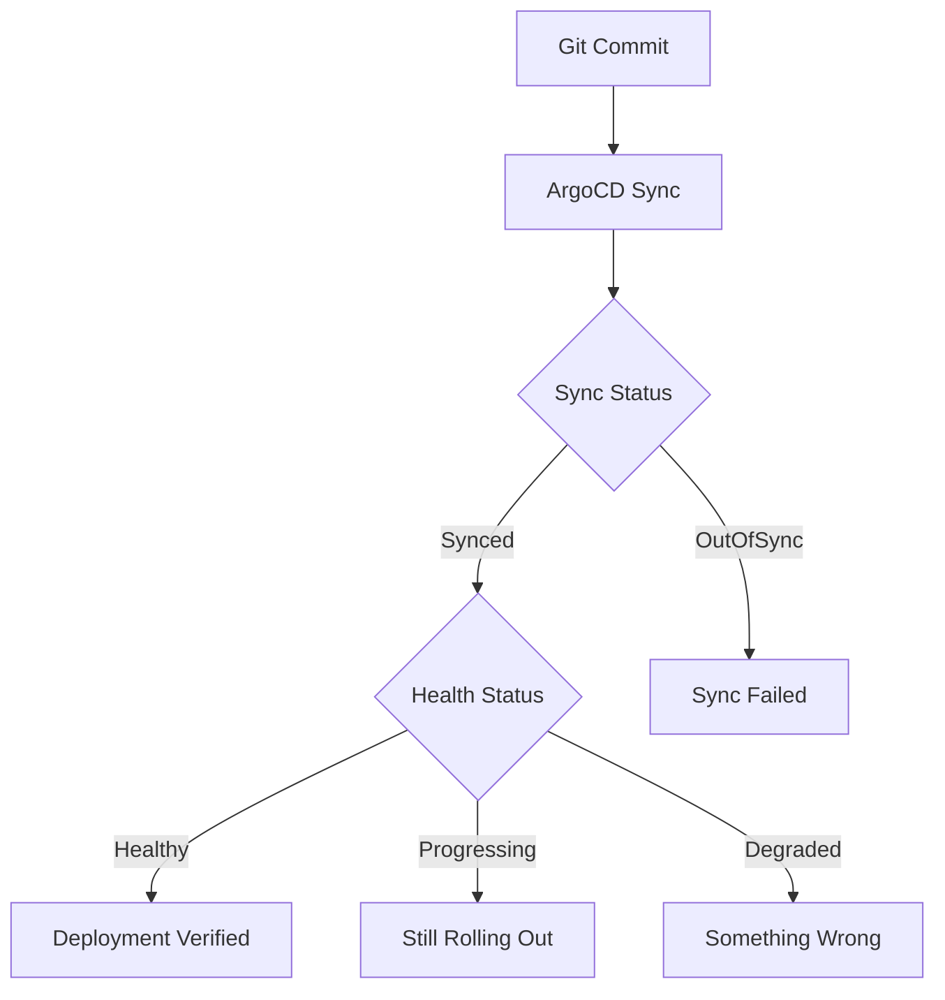

# How to Verify Deployment Success with ArgoCD

Author: [nawazdhandala](https://github.com/nawazdhandala)

Tags: ArgoCD, GitOps, Kubernetes, Deployment Verification, Monitoring

Description: Learn how to verify that ArgoCD deployments are actually working correctly using health checks, sync hooks, and post-deployment validation.

---

ArgoCD telling you a sync succeeded does not mean your deployment is actually working. A sync just means Kubernetes accepted your manifests. The pods might be crash-looping, the service might return 500 errors, or a database migration might have failed silently. Real deployment verification goes beyond sync status to confirm your application is healthy and serving traffic correctly.

## Understanding ArgoCD's Built-In Verification

ArgoCD has two levels of status that together tell you about deployment health:

1. **Sync Status** - Are the live resources matching the desired state in Git?
2. **Health Status** - Are those resources actually working?



Check both with the CLI:

```bash
# Check sync and health status
argocd app get my-app

# Output shows both:
# Sync Status:    Synced
# Health Status:  Healthy

# Detailed resource health
argocd app get my-app --show-resources
```

## Using PostSync Hooks for Verification

PostSync hooks run after ArgoCD finishes syncing. This is where you put verification jobs:

```yaml
# post-deploy-verification.yaml
apiVersion: batch/v1
kind: Job
metadata:
  name: verify-deployment
  annotations:
    argocd.argoproj.io/hook: PostSync
    argocd.argoproj.io/hook-delete-policy: HookSucceeded
spec:
  backoffLimit: 2
  template:
    spec:
      containers:
        - name: verify
          image: curlimages/curl:latest
          command:
            - /bin/sh
            - -c
            - |
              echo "Waiting for service to be ready..."
              sleep 10

              # Health check
              echo "Checking health endpoint..."
              HTTP_CODE=$(curl -s -o /dev/null -w "%{http_code}" http://backend-api.production.svc.cluster.local:8080/healthz)
              if [ "$HTTP_CODE" != "200" ]; then
                echo "FAILED: Health check returned $HTTP_CODE"
                exit 1
              fi
              echo "Health check passed"

              # Smoke test - check a critical endpoint
              echo "Running smoke test..."
              HTTP_CODE=$(curl -s -o /dev/null -w "%{http_code}" http://backend-api.production.svc.cluster.local:8080/api/v1/status)
              if [ "$HTTP_CODE" != "200" ]; then
                echo "FAILED: Smoke test returned $HTTP_CODE"
                exit 1
              fi
              echo "Smoke test passed"

              # Version verification
              echo "Verifying deployed version..."
              VERSION=$(curl -s http://backend-api.production.svc.cluster.local:8080/api/v1/version | jq -r '.version')
              echo "Deployed version: $VERSION"

              echo "All verification checks passed!"
      restartPolicy: Never
```

If the Job fails, ArgoCD marks the sync operation as failed, making it visible in the dashboard and triggering any configured notifications.

## Readiness Gates for Deployment Verification

Kubernetes readiness probes tell you when individual pods are ready, but they do not tell you when the entire deployment rollout is complete and healthy. Use a combination of deployment status checks:

```yaml
# Custom health check for Deployment resources
# Added to argocd-cm ConfigMap
resource.customizations.health.apps_Deployment: |
  hs = {}
  if obj.status ~= nil then
    if obj.status.observedGeneration ~= nil and
       obj.metadata.generation ~= nil and
       obj.status.observedGeneration == obj.metadata.generation then

      if obj.status.updatedReplicas ~= nil and
         obj.status.replicas ~= nil and
         obj.status.availableReplicas ~= nil and
         obj.status.updatedReplicas == obj.spec.replicas and
         obj.status.availableReplicas == obj.spec.replicas then
        hs.status = "Healthy"
        hs.message = "All replicas are updated and available"
      else
        hs.status = "Progressing"
        hs.message = string.format("Waiting for replicas: %d/%d updated, %d/%d available",
          obj.status.updatedReplicas or 0, obj.spec.replicas,
          obj.status.availableReplicas or 0, obj.spec.replicas)
      end
    else
      hs.status = "Progressing"
      hs.message = "Waiting for controller to process update"
    end
  else
    hs.status = "Progressing"
    hs.message = "Waiting for deployment status"
  end
  return hs
```

## Multi-Stage Verification Pipeline

For critical services, use multiple PostSync hooks in sequence:

```yaml
# Stage 1: Basic health check (Wave 0)
apiVersion: batch/v1
kind: Job
metadata:
  name: verify-health
  annotations:
    argocd.argoproj.io/hook: PostSync
    argocd.argoproj.io/hook-delete-policy: HookSucceeded
    argocd.argoproj.io/sync-wave: "0"
spec:
  template:
    spec:
      containers:
        - name: check
          image: curlimages/curl:latest
          command: ["sh", "-c", "curl -f http://backend-api:8080/healthz"]
      restartPolicy: Never

---
# Stage 2: Integration tests (Wave 1)
apiVersion: batch/v1
kind: Job
metadata:
  name: verify-integration
  annotations:
    argocd.argoproj.io/hook: PostSync
    argocd.argoproj.io/hook-delete-policy: HookSucceeded
    argocd.argoproj.io/sync-wave: "1"
spec:
  template:
    spec:
      containers:
        - name: test
          image: myorg/integration-tests:latest
          env:
            - name: API_URL
              value: "http://backend-api:8080"
            - name: TEST_SUITE
              value: "smoke"
          command:
            - /bin/sh
            - -c
            - |
              echo "Running integration tests..."
              npm run test:smoke
              echo "Integration tests passed"
      restartPolicy: Never

---
# Stage 3: Metrics verification (Wave 2)
apiVersion: batch/v1
kind: Job
metadata:
  name: verify-metrics
  annotations:
    argocd.argoproj.io/hook: PostSync
    argocd.argoproj.io/hook-delete-policy: HookSucceeded
    argocd.argoproj.io/sync-wave: "2"
spec:
  template:
    spec:
      containers:
        - name: metrics
          image: curlimages/curl:latest
          command:
            - /bin/sh
            - -c
            - |
              # Wait for metrics to stabilize
              sleep 30

              # Check error rate from Prometheus
              ERROR_RATE=$(curl -s "http://prometheus:9090/api/v1/query?query=rate(http_requests_total{service=\"backend-api\",code=~\"5..\"}[5m])" | jq '.data.result[0].value[1] // "0"' -r)

              echo "Current 5xx error rate: $ERROR_RATE"

              # Fail if error rate is above 1%
              if [ "$(echo "$ERROR_RATE > 0.01" | bc -l)" = "1" ]; then
                echo "FAILED: Error rate too high: $ERROR_RATE"
                exit 1
              fi

              echo "Metrics verification passed"
      restartPolicy: Never
```

## Verification with ArgoCD Notifications

Set up notifications that report verification results:

```yaml
apiVersion: v1
kind: ConfigMap
metadata:
  name: argocd-notifications-cm
  namespace: argocd
data:
  trigger.on-deployed: |
    - when: app.status.operationState.phase in ['Succeeded'] and
            app.status.health.status == 'Healthy'
      send: [deployment-success]

  trigger.on-deploy-failed: |
    - when: app.status.operationState.phase in ['Error', 'Failed'] or
            app.status.health.status in ['Degraded']
      send: [deployment-failed]

  template.deployment-success: |
    message: |
      Deployment verified successfully for {{.app.metadata.name}}
      Sync: {{.app.status.sync.status}}
      Health: {{.app.status.health.status}}
      Revision: {{.app.status.sync.revision}}

  template.deployment-failed: |
    message: |
      DEPLOYMENT VERIFICATION FAILED for {{.app.metadata.name}}
      Sync: {{.app.status.sync.status}}
      Health: {{.app.status.health.status}}
      Error: {{.app.status.operationState.message}}
      Revision: {{.app.status.sync.revision}}
      Action required: Check the application in ArgoCD dashboard

  service.slack: |
    token: $slack-token

  subscriptions: |
    - recipients:
        - slack:deployments
      triggers:
        - on-deployed
        - on-deploy-failed
```

## Verifying Database Migrations

Database migrations are a common source of deployment failures. Verify them with a PreSync hook:

```yaml
apiVersion: batch/v1
kind: Job
metadata:
  name: db-migrate
  annotations:
    argocd.argoproj.io/hook: PreSync
    argocd.argoproj.io/hook-delete-policy: HookSucceeded
spec:
  template:
    spec:
      containers:
        - name: migrate
          image: myorg/backend-api:v2.3.5
          command: ["./migrate", "up"]
          env:
            - name: DATABASE_URL
              valueFrom:
                secretKeyRef:
                  name: db-credentials
                  key: url
      restartPolicy: Never
  backoffLimit: 1
```

If the migration fails, the PreSync hook fails, and ArgoCD stops the sync before deploying the new code. This prevents deploying application code that expects a schema that does not exist yet.

## Checking Deployment via CLI

For manual verification, use these CLI commands:

```bash
# Full application status
argocd app get my-app

# Watch the sync operation in real time
argocd app wait my-app --sync --health --timeout 300

# Check resource-level health
argocd app resources my-app

# View sync operation result
argocd app get my-app -o json | jq '.status.operationState'

# Check recent sync history
argocd app history my-app
```

The `argocd app wait` command is useful in CI pipelines. It blocks until the sync completes and all resources are healthy (or the timeout is reached):

```bash
# In a CI pipeline
argocd app sync my-app
argocd app wait my-app --health --timeout 600
if [ $? -ne 0 ]; then
  echo "Deployment verification failed"
  argocd app rollback my-app
  exit 1
fi
```

## Summary

Deployment verification with ArgoCD goes beyond checking sync status. Use PostSync hooks to run health checks, smoke tests, and integration tests after every sync. Configure custom health checks to ensure ArgoCD accurately reports resource health. Set up notifications for both successful and failed deployments. For critical services, implement multi-stage verification with sync waves - check basic health first, then integration tests, then metrics. Always verify database migrations in PreSync hooks to catch failures before new code deploys. The combination of automated checks and alerting gives you confidence that what ArgoCD deployed is actually working.
