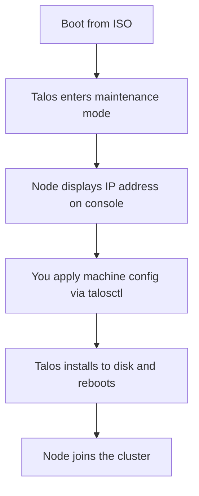

# How to Boot Talos Linux from an ISO Image

Author: [nawazdhandala](https://github.com/nawazdhandala)

Tags: Talos Linux, ISO, Booting, Installation, Bare Metal, Virtual Machine

Description: Learn how to download and boot Talos Linux from an ISO image on both physical servers and virtual machines.

---

Booting from an ISO image is one of the most common ways to get Talos Linux running on a machine. Whether you are setting up a bare metal server in your homelab or spinning up a VM for testing, the ISO provides a straightforward path to getting Talos onto your hardware.

This guide covers downloading the right ISO, creating bootable media, and booting Talos on both physical and virtual machines.

## Understanding the Talos Boot Process

The Talos Linux boot process is fundamentally different from what you might be used to with Ubuntu or CentOS. When you boot from the ISO, Talos does not present you with an installer wizard. Instead, it boots into a maintenance mode and waits for you to push a machine configuration to it via the Talos API.

Here is the general flow:



There is no interactive installer, no questions about timezone or keyboard layout, and no user accounts to create. The entire node configuration comes from the machine config YAML file.

## Downloading the ISO

You have two main sources for Talos Linux ISOs: the GitHub releases page and the Image Factory.

### From GitHub Releases

```bash
# Download the latest standard ISO for amd64 architecture
curl -LO https://github.com/siderolabs/talos/releases/latest/download/talos-amd64.iso

# For arm64 systems
curl -LO https://github.com/siderolabs/talos/releases/latest/download/talos-arm64.iso
```

### From the Image Factory

The Talos Image Factory at `https://factory.talos.dev` lets you build custom images that include specific system extensions. This is useful when you need drivers for particular hardware, like certain NIC drivers or storage controllers that are not in the default image.

You can generate a custom ISO through the web interface or via the API:

```bash
# Example: download an ISO from the Image Factory with default extensions
# The schematic ID defines which extensions to include
curl -LO "https://factory.talos.dev/image/<schematic-id>/v1.9.0/nocloud-amd64.iso"
```

For most first-time setups, the standard ISO from GitHub releases is all you need.

### Choosing Between ISO and Other Formats

The ISO is best for:

- Bare metal servers where you will boot from USB or virtual media
- Virtual machines in VirtualBox, VMware, or Hyper-V
- PXE boot environments (though Talos also supports direct PXE/iPXE)

Other formats like raw disk images, OVA, or cloud images might be better depending on your platform.

## Creating Bootable Media

Once you have the ISO, you need to put it on something bootable.

### USB Drive on Linux

```bash
# Identify your USB drive (be very careful here)
lsblk

# Write the ISO to the USB drive
# Replace /dev/sdX with your actual USB device
sudo dd if=talos-amd64.iso of=/dev/sdX bs=4M status=progress conv=fsync
```

### USB Drive on macOS

```bash
# List disks to find your USB drive
diskutil list

# Unmount the USB drive first
diskutil unmountDisk /dev/disk2

# Write the ISO (use rdisk for faster write speed)
sudo dd if=talos-amd64.iso of=/dev/rdisk2 bs=4m
```

### USB Drive on Windows

On Windows, use a tool like Rufus or balenaEtcher:

1. Download and open Rufus
2. Select your USB drive
3. Select the Talos ISO file
4. Choose "DD Image" mode (not ISO mode)
5. Click Start

The DD Image mode is important. Using standard ISO mode may not create a properly bootable drive for Talos.

## Booting on Bare Metal

With your bootable USB ready, plug it into the server and power on.

### Accessing the Boot Menu

Most servers let you access the boot menu during POST:

- Dell servers: Press F12
- HP/HPE servers: Press F11
- Supermicro: Press F11 or F2
- Lenovo: Press F12
- Generic motherboards: Check for DEL, F2, or F12

Select the USB drive from the boot menu. If you do not see it, you may need to enter the BIOS/UEFI settings and enable USB boot or change the boot order.

### UEFI vs Legacy BIOS

Talos supports both UEFI and legacy BIOS boot. Modern hardware almost always uses UEFI. If your server has Secure Boot enabled, you may need to disable it since Talos does not currently ship with signed bootloaders for all platforms.

```text
# In your server's UEFI settings, check:
# - Secure Boot: Disabled (or enroll Talos keys if supported)
# - Boot Mode: UEFI
# - USB Boot: Enabled
```

### What You See on Boot

When Talos boots from the ISO, the console shows kernel messages followed by the Talos maintenance screen. This screen displays:

- The Talos version
- The node's network interfaces and assigned IP addresses
- A message indicating the node is waiting for configuration

The IP address shown here is what you will use with `talosctl` to apply the machine configuration. If DHCP is available on your network, the node will get an IP automatically. Without DHCP, Talos will use IPv6 link-local addressing.

## Booting in Virtual Machines

### VirtualBox

Create a new VM in VirtualBox with these settings:

- Type: Linux, Version: Other Linux (64-bit)
- Memory: 4096 MB minimum (2048 MB absolute minimum)
- CPUs: 2 or more
- Disk: 20 GB or more
- Network: Bridged Adapter (so the VM gets an IP on your network)

Mount the ISO in the virtual optical drive and boot:

```bash
# Or create the VM from the command line
VBoxManage createvm --name "talos-node1" --ostype "Linux_64" --register
VBoxManage modifyvm "talos-node1" --memory 4096 --cpus 2
VBoxManage createhd --filename "talos-node1.vdi" --size 20480
VBoxManage storagectl "talos-node1" --name "SATA" --add sata
VBoxManage storageattach "talos-node1" --storagectl "SATA" --port 0 --type hdd --medium "talos-node1.vdi"
VBoxManage storageattach "talos-node1" --storagectl "SATA" --port 1 --type dvddrive --medium talos-amd64.iso
VBoxManage modifyvm "talos-node1" --nic1 bridged --bridgeadapter1 "en0"
VBoxManage startvm "talos-node1"
```

### QEMU/KVM

```bash
# Boot the Talos ISO in a QEMU VM
qemu-system-x86_64 \
  -m 4096 \
  -smp 2 \
  -cdrom talos-amd64.iso \
  -drive file=talos-disk.qcow2,format=qcow2,if=virtio \
  -net nic,model=virtio -net bridge,br=br0 \
  -enable-kvm \
  -boot d
```

Create the disk image first:

```bash
# Create a 20 GB disk image
qemu-img create -f qcow2 talos-disk.qcow2 20G
```

### VMware

For VMware Workstation or ESXi, create a new VM with Guest OS type "Other Linux 5.x or later kernel (64-bit)". Attach the ISO to the virtual CD/DVD drive and boot.

## After Booting

Once Talos has booted and you can see its IP address on the console, you are ready to apply a machine configuration. From your workstation:

```bash
# Generate a cluster config if you have not already
talosctl gen config my-cluster https://<control-plane-ip>:6443

# Apply the config to the booted node
talosctl apply-config --insecure \
  --nodes <node-ip> \
  --file controlplane.yaml
```

After the configuration is applied, Talos installs itself to the disk, and the node reboots. You can then remove the USB drive or unmount the ISO - the node will boot from disk going forward.

The ISO-based boot workflow is straightforward and works across nearly every platform. It is the recommended starting point for anyone new to Talos Linux.
