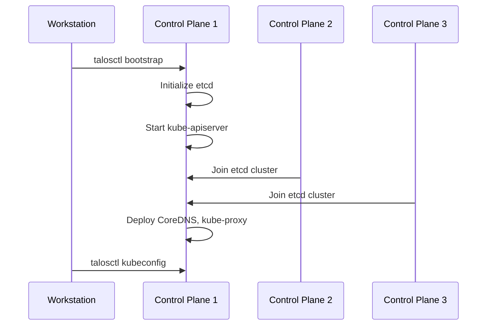

# How to Bootstrap Kubernetes on Talos Linux

Author: [nawazdhandala](https://github.com/nawazdhandala)

Tags: Talos Linux, Kubernetes, Bootstrap, Etcd, Cluster Initialization

Description: Understand the Kubernetes bootstrap process on Talos Linux, including when to run it and how to troubleshoot common issues.

---

After you have applied machine configurations to your Talos Linux nodes and they have rebooted, there is one more step before you have a working Kubernetes cluster: bootstrapping. This is the process that initializes etcd and starts the Kubernetes control plane. It is a one-time operation, and understanding exactly what it does and when to run it will save you from common pitfalls.

## What Does Bootstrap Actually Do

When you run the bootstrap command, it triggers the following sequence on the target control plane node:

1. The node initializes a new etcd cluster (single-member)
2. etcd starts accepting connections
3. The Kubernetes API server starts and connects to etcd
4. Other control plane components start (controller-manager, scheduler)
5. Additional control plane nodes detect the running etcd cluster and join automatically
6. CoreDNS and kube-proxy are deployed

Before bootstrap, your nodes are running Talos Linux with all services in a "waiting" state. They have the configuration, they know they should be control plane nodes, but etcd has not been initialized yet so nothing can start.



## Running the Bootstrap Command

The command itself is simple:

```bash
# Make sure your talosctl configuration is set
export TALOSCONFIG="$(pwd)/talosconfig"

# Bootstrap on the first control plane node
talosctl bootstrap --nodes 192.168.1.101
```

That is it. One command, on one node, one time.

## The Golden Rules of Bootstrap

There are a few rules that are absolutely critical:

**Rule 1: Only run bootstrap once.** Running it on a second node will try to initialize a separate etcd cluster, which will conflict with the first one.

**Rule 2: Only run it on a control plane node.** Worker nodes do not run etcd or the API server, so bootstrapping them makes no sense and will fail.

**Rule 3: Wait for the node to be ready.** After applying the machine config, the node reboots and takes a minute or two to come back up. If you try to bootstrap too early, the API will not be available.

**Rule 4: Do not re-bootstrap an existing cluster.** If your cluster is already running and you want to add nodes, just apply their configuration. They join automatically.

## Checking If the Node Is Ready for Bootstrap

Before running the bootstrap command, verify the node is up and the Talos API is responsive:

```bash
# Check if the node's services are available
talosctl services --nodes 192.168.1.101
```

You should see output showing services in various states. Look for `etcd` being in a "waiting" state. This confirms the node is ready for bootstrap but has not been bootstrapped yet.

```bash
# Check the node's time and basic health
talosctl time --nodes 192.168.1.101

# View the dmesg for any boot issues
talosctl dmesg --nodes 192.168.1.101
```

## What Happens After Bootstrap

Once you run the bootstrap command, things start moving quickly. Here is how to monitor the process:

```bash
# Watch services come online
talosctl services --nodes 192.168.1.101

# You should see etcd transition from "waiting" to "running"
# Then kube-apiserver, kube-controller-manager, kube-scheduler all start
```

In a three-node cluster, the other two control plane nodes will automatically join the etcd cluster and start their control plane components. You do not need to do anything on those nodes.

```bash
# Check etcd membership after a few minutes
talosctl etcd members --nodes 192.168.1.101

# Should show all control plane nodes
# ID      HOSTNAME   PEER URLS
# ...     cp1        https://192.168.1.101:2380
# ...     cp2        https://192.168.1.102:2380
# ...     cp3        https://192.168.1.103:2380
```

## Running a Health Check

The `talosctl health` command waits for all cluster components to be healthy:

```bash
# Run a comprehensive health check
talosctl health --nodes 192.168.1.101 --wait-timeout 10m
```

This command checks:

- etcd is healthy and has the expected number of members
- The Kubernetes API server is responsive
- All nodes have joined the cluster
- System pods are running

The `--wait-timeout` flag tells it how long to wait before giving up. For a fresh cluster, 5-10 minutes is usually sufficient.

## Retrieving kubeconfig After Bootstrap

Once the cluster is healthy, grab your kubeconfig:

```bash
# Merge the new cluster's kubeconfig into your default config
talosctl kubeconfig --nodes 192.168.1.101

# Verify with kubectl
kubectl get nodes
kubectl get pods -n kube-system
```

## Troubleshooting Bootstrap Issues

### etcd Fails to Start

If etcd does not start after bootstrap, check the logs:

```bash
# View etcd logs
talosctl logs etcd --nodes 192.168.1.101
```

Common causes:

- **Disk too slow**: etcd requires decent disk I/O. If you see timeout errors, the disk cannot keep up.
- **Network issues**: etcd peers cannot reach each other. Check that ports 2379 and 2380 are open between control plane nodes.
- **Time skew**: etcd is sensitive to clock differences between nodes. Ensure NTP is working.

### API Server Does Not Start

```bash
# Check API server logs
talosctl logs kube-apiserver --nodes 192.168.1.101
```

The API server depends on etcd. If etcd is not healthy, the API server will keep retrying. Fix etcd first.

### Other Nodes Do Not Join

If you bootstrapped the first node and the others are not joining:

```bash
# Check the services on the other nodes
talosctl services --nodes 192.168.1.102

# Check etcd logs on the other nodes
talosctl logs etcd --nodes 192.168.1.102
```

The most common cause is network connectivity. The joining nodes need to reach the first node on port 2380 (etcd peer port).

### Accidentally Bootstrapped Multiple Nodes

If you ran bootstrap on more than one node, you have a split-brain situation. The fix is to reset and start over:

```bash
# Reset the nodes (this destroys the cluster)
talosctl reset --nodes 192.168.1.101 --graceful=false
talosctl reset --nodes 192.168.1.102 --graceful=false
talosctl reset --nodes 192.168.1.103 --graceful=false

# Re-apply configs
talosctl apply-config --insecure --nodes 192.168.1.101 --file controlplane.yaml
talosctl apply-config --insecure --nodes 192.168.1.102 --file controlplane.yaml
talosctl apply-config --insecure --nodes 192.168.1.103 --file controlplane.yaml

# Wait for nodes to come back, then bootstrap correctly on ONE node
talosctl bootstrap --nodes 192.168.1.101
```

## Bootstrap vs. Recovery

Bootstrap is for new clusters. If you have an existing cluster that has lost its etcd state (for example, all control plane nodes lost their data), you need etcd recovery instead:

```bash
# Recover etcd from a snapshot (this is NOT bootstrap)
talosctl etcd recover --nodes 192.168.1.101 \
  --snapshot etcd-backup.snapshot
```

This is a disaster recovery scenario, not a normal bootstrap.

## Automating Bootstrap

If you are automating cluster creation (in a CI/CD pipeline or with Terraform), you need to wait for the node to be ready before bootstrapping. A simple approach:

```bash
# Wait for the Talos API to be reachable
until talosctl services --nodes 192.168.1.101 2>/dev/null; do
  echo "Waiting for node to be ready..."
  sleep 5
done

# Now bootstrap
talosctl bootstrap --nodes 192.168.1.101
```

The bootstrap step is the moment your collection of configured Talos nodes becomes a Kubernetes cluster. It is simple but important to get right. Remember: one node, one time, and then let the other nodes join on their own.
