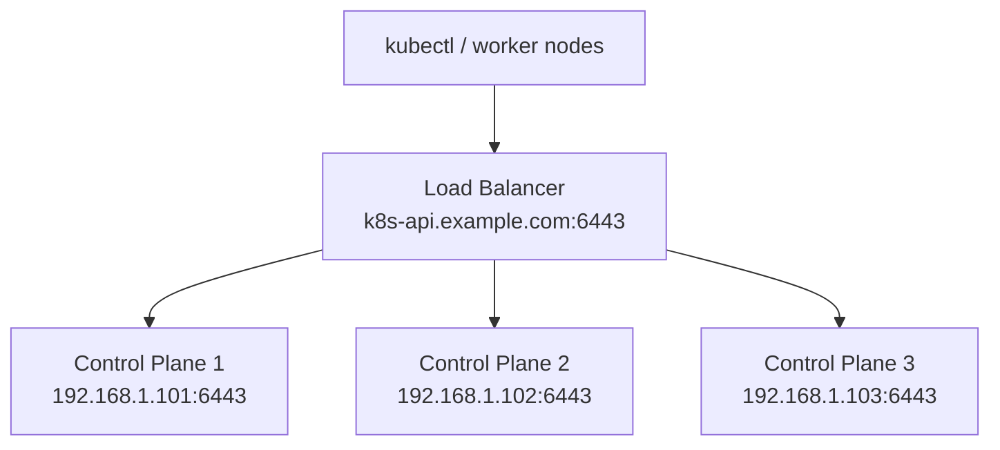

# How to Configure the Kubernetes Endpoint for Talos Linux

Author: [nawazdhandala](https://github.com/nawazdhandala)

Tags: Talos Linux, Kubernetes, API Endpoint, Networking, Cluster Configuration

Description: Learn how to properly configure the Kubernetes API endpoint for your Talos Linux cluster including single-node, HA, and load-balanced setups.

---

When you set up a Talos Linux cluster, one of the first decisions you make is choosing the Kubernetes API endpoint. This endpoint is the address that everything uses to communicate with the Kubernetes API server - kubectl, worker nodes, internal components, and external services all connect through it.

Getting this right is important because changing it later requires reconfiguring the entire cluster. Let us go through what the endpoint is, why it matters, and how to configure it for different scenarios.

## What Is the Kubernetes Endpoint

The Kubernetes API endpoint is simply the network address (IP or hostname) and port where the Kubernetes API server listens. By default, the API server listens on port 6443.

When you run `talosctl gen config`, the second argument is this endpoint:

```bash
# The endpoint is the second argument
talosctl gen config my-cluster https://192.168.1.100:6443
```

This URL gets baked into the machine configurations for every node in the cluster. Control plane nodes use it to configure the API server's advertise address, worker nodes use it to find the API server, and your kubeconfig uses it to connect from your workstation.

## Single Control Plane Node

For the simplest case - a single control plane node - the endpoint is just that node's IP address:

```bash
# Single control plane at 192.168.1.101
talosctl gen config dev-cluster https://192.168.1.101:6443
```

This works fine for development and testing. The obvious downside is that if the node's IP changes or the node goes down, nothing can reach the API server.

## Multiple Control Plane Nodes with a VIP

For high-availability clusters, you need a stable endpoint that can route to any healthy control plane node. Talos Linux has a built-in Virtual IP (VIP) feature that makes this easy.

A VIP is a shared IP address that floats between your control plane nodes. Only one node holds the VIP at any given time. If that node goes down, another node takes over.

First, choose an unused IP address on your network for the VIP. Then configure it when generating your cluster:

```bash
# Generate config with the VIP as the endpoint
talosctl gen config ha-cluster https://192.168.1.100:6443
```

Then patch the control plane configuration to enable the VIP:

```yaml
# vip-patch.yaml
machine:
  network:
    interfaces:
      - interface: eth0
        vip:
          ip: 192.168.1.100
```

Apply this patch to the control plane configuration:

```bash
# Generate config with the VIP patch
talosctl gen config ha-cluster https://192.168.1.100:6443 \
  --config-patch-control-plane @vip-patch.yaml
```

Now the endpoint (192.168.1.100) matches the VIP that will be shared across control plane nodes. No matter which node holds the VIP, the endpoint resolves correctly.

## Using a DNS Name

Instead of an IP address, you can use a DNS name as your endpoint:

```bash
# Use a DNS name as the endpoint
talosctl gen config prod-cluster https://k8s-api.example.com:6443
```

This offers several advantages:

- You can change the underlying IP addresses without reconfiguring the cluster
- DNS round-robin provides simple load distribution across control plane nodes
- It works well with external load balancers that have their own DNS names

For this to work, the DNS name must resolve to an IP that can reach a healthy control plane node. This could be a load balancer IP, a VIP, or multiple A records pointing to each control plane node.

```bash
# Example DNS configuration (in your DNS server)
# A record pointing to a load balancer
k8s-api.example.com.  IN  A  192.168.1.100

# Or multiple A records for DNS round-robin
k8s-api.example.com.  IN  A  192.168.1.101
k8s-api.example.com.  IN  A  192.168.1.102
k8s-api.example.com.  IN  A  192.168.1.103
```

## Using an External Load Balancer

For production clusters, an external load balancer provides the most flexibility. The load balancer sits in front of your control plane nodes and distributes API requests across them.



Configure the endpoint to point at the load balancer:

```bash
# The endpoint is the load balancer's address
talosctl gen config prod-cluster https://k8s-api.example.com:6443
```

The load balancer needs to be configured to:

- Listen on port 6443
- Forward TCP traffic to port 6443 on each control plane node
- Perform health checks (TCP connect to port 6443 works, or HTTP GET to `/healthz`)
- Use TCP mode, not HTTP mode (the API server handles TLS itself)

## Endpoint and the Generated Configuration

Let us look at where the endpoint appears in the generated configuration files.

In `controlplane.yaml`:

```yaml
cluster:
  controlPlane:
    endpoint: https://192.168.1.100:6443
```

In `worker.yaml`:

```yaml
cluster:
  controlPlane:
    endpoint: https://192.168.1.100:6443
```

Both node types reference the same endpoint. Control plane nodes use it to know their advertise address, and worker nodes use it to discover the API server.

## Changing the Endpoint After Cluster Creation

Changing the endpoint on a running cluster is possible but disruptive. You need to update the machine configuration on every node:

```bash
# Create a patch with the new endpoint
cat > endpoint-patch.yaml << 'EOF'
cluster:
  controlPlane:
    endpoint: https://new-endpoint.example.com:6443
EOF

# Apply to each node
talosctl patch machineconfig --nodes 192.168.1.101 --patch @endpoint-patch.yaml
talosctl patch machineconfig --nodes 192.168.1.102 --patch @endpoint-patch.yaml
talosctl patch machineconfig --nodes 192.168.1.103 --patch @endpoint-patch.yaml
```

The nodes will need to restart their Kubernetes components. This causes downtime for the API server. Plan this carefully and do it during a maintenance window.

## Common Mistakes to Avoid

**Using localhost or 127.0.0.1**: The endpoint must be reachable from worker nodes and from your workstation. Using localhost will break worker node joining and external access.

**Using a node IP in a multi-node cluster**: If you use a specific node's IP as the endpoint and that node goes down, your cluster becomes unmanageable even though the other control plane nodes are healthy.

**Forgetting to set up the VIP or load balancer**: The endpoint needs to actually be reachable. If you specify a VIP but do not configure it in the machine config, or specify a load balancer address that does not exist yet, configuration application will succeed but the cluster will not function.

**Using HTTP instead of HTTPS**: The Kubernetes API always uses TLS. The endpoint must start with `https://`.

## Picking the Right Strategy

Here is a quick decision guide:

- **Development / single node**: Use the node's IP directly
- **Homelab / small HA cluster**: Use Talos VIP (simplest, no extra infrastructure)
- **Production on-premises**: Use an external load balancer with a DNS name
- **Cloud deployments**: Use the cloud provider's load balancer (NLB on AWS, etc.)

The endpoint is the front door to your cluster. Spend the time to set it up properly from the beginning, and you will avoid painful reconfiguration down the road.
