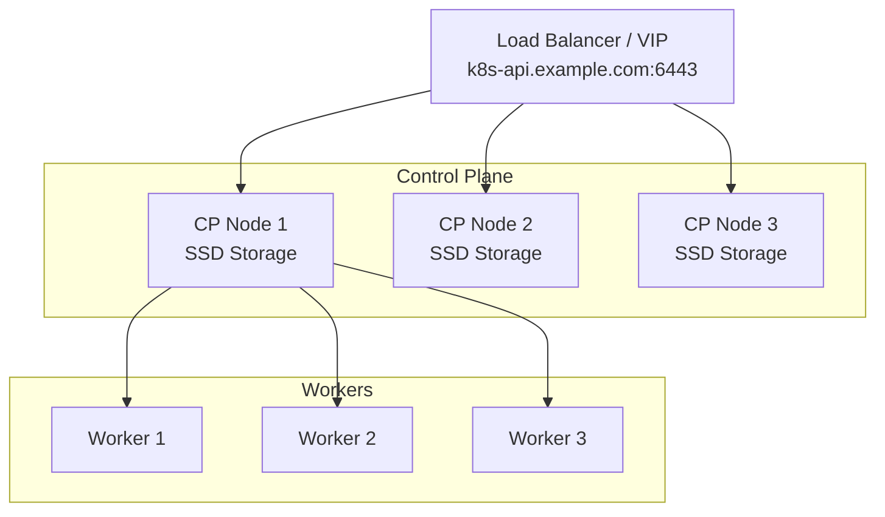

# How to Set Up a Production-Ready Talos Linux Cluster

Author: [nawazdhandala](https://github.com/nawazdhandala)

Tags: Talos Linux, Kubernetes, Production, High Availability, Best Practices

Description: A complete guide to setting up a Talos Linux cluster that is ready for production workloads with high availability and security.

---

Setting up a Talos Linux cluster for testing takes a few minutes. Making it production-ready takes more thought. Production means uptime requirements, data durability, security hardening, monitoring, and the ability to recover from failures without losing sleep.

This guide covers everything you need to turn a basic Talos cluster into one that is ready to run real workloads in production.

## Production Architecture

A production Talos cluster should have at minimum:

- 3 control plane nodes for high availability
- 2 or more worker nodes (scaled to your workload)
- A stable API endpoint (load balancer, VIP, or DNS)
- Separate failure domains for control plane nodes



## Step 1: Prepare Your Secrets

In production, you must save your cluster secrets separately. This allows you to regenerate configurations without losing the ability to manage existing nodes:

```bash
# Generate and save cluster secrets
talosctl gen secrets --output-file cluster-secrets.yaml

# Store this file securely (encrypted vault, secrets manager, etc.)
# You will need it for every future config generation
```

Never commit `cluster-secrets.yaml` to version control unencrypted. Use a secrets manager like HashiCorp Vault, AWS Secrets Manager, or at minimum encrypted at rest.

## Step 2: Create Production Configuration

Build your configuration with production settings:

```bash
# Generate config with saved secrets
talosctl gen config prod-cluster https://k8s-api.example.com:6443 \
  --with-secrets cluster-secrets.yaml \
  --kubernetes-version 1.29.0 \
  --output-dir ./prod-configs \
  --config-patch @common.yaml \
  --config-patch-control-plane @controlplane.yaml \
  --config-patch-worker @worker.yaml
```

### Common Settings Patch

```yaml
# common.yaml - applied to all nodes
machine:
  network:
    nameservers:
      - 8.8.8.8
      - 1.1.1.1
  time:
    servers:
      - time.cloudflare.com
      - time.google.com
  install:
    image: factory.talos.dev/installer/<your-schematic>:v1.9.0
  logging:
    destinations:
      - endpoint: "tcp://syslog.example.com:514"
        format: json_lines
  sysctls:
    net.core.somaxconn: "65535"
    net.ipv4.ip_local_port_range: "1024 65535"
```

### Control Plane Patch

```yaml
# controlplane.yaml
machine:
  network:
    interfaces:
      - interface: eth0
        vip:
          ip: 192.168.1.100
cluster:
  apiServer:
    certSANs:
      - k8s-api.example.com
      - 192.168.1.100
    admissionControl:
      - name: PodSecurity
        configuration:
          apiVersion: pod-security.admission.config.k8s.io/v1
          kind: PodSecurityConfiguration
          defaults:
            enforce: baseline
            audit: restricted
            warn: restricted
  etcd:
    extraArgs:
      election-timeout: "5000"
      heartbeat-interval: "500"
  controllerManager:
    extraArgs:
      bind-address: "0.0.0.0"
  scheduler:
    extraArgs:
      bind-address: "0.0.0.0"
```

### Worker Patch

```yaml
# worker.yaml
machine:
  kubelet:
    extraArgs:
      max-pods: "110"
      rotate-server-certificates: "true"
    extraConfig:
      imageGCHighThresholdPercent: 85
      imageGCLowThresholdPercent: 80
```

## Step 3: Set Up the Load Balancer

For production, use a proper load balancer rather than relying solely on VIP. If you are using HAProxy:

```text
# haproxy.cfg
frontend k8s-api
    bind *:6443
    mode tcp
    default_backend k8s-api-backend

backend k8s-api-backend
    mode tcp
    balance roundrobin
    option tcp-check
    server cp1 192.168.1.101:6443 check fall 3 rise 2
    server cp2 192.168.1.102:6443 check fall 3 rise 2
    server cp3 192.168.1.103:6443 check fall 3 rise 2
```

## Step 4: Apply Configurations

Apply per-node configurations with static IPs:

```bash
# Create per-node patches for static IPs
for i in 1 2 3; do
cat > cp${i}-ip.yaml << EOF
machine:
  network:
    hostname: cp${i}
    interfaces:
      - interface: eth0
        addresses:
          - 192.168.1.10${i}/24
        routes:
          - network: 0.0.0.0/0
            gateway: 192.168.1.1
        vip:
          ip: 192.168.1.100
EOF
done

# Patch and apply each control plane config
for i in 1 2 3; do
  talosctl machineconfig patch ./prod-configs/controlplane.yaml \
    --patch @cp${i}-ip.yaml \
    --output ./prod-configs/cp${i}.yaml

  talosctl apply-config --insecure \
    --nodes 192.168.1.10${i} \
    --file ./prod-configs/cp${i}.yaml
done
```

## Step 5: Bootstrap and Verify

```bash
# Configure talosctl
export TALOSCONFIG="./prod-configs/talosconfig"
talosctl config endpoint 192.168.1.101 192.168.1.102 192.168.1.103
talosctl config node 192.168.1.101

# Bootstrap on exactly one node
talosctl bootstrap --nodes 192.168.1.101

# Wait for the cluster to be healthy
talosctl health --wait-timeout 10m

# Get kubeconfig
talosctl kubeconfig
```

## Step 6: Set Up etcd Backups

etcd backups are non-negotiable for production. Set up automated snapshots:

```bash
# Manual snapshot
talosctl etcd snapshot /backup/etcd-$(date +%Y%m%d-%H%M%S).snapshot \
  --nodes 192.168.1.101
```

Automate this with a Kubernetes CronJob or an external cron job:

```yaml
# etcd-backup-cronjob.yaml
apiVersion: batch/v1
kind: CronJob
metadata:
  name: etcd-backup
  namespace: kube-system
spec:
  schedule: "0 */6 * * *"  # Every 6 hours
  jobTemplate:
    spec:
      template:
        spec:
          containers:
            - name: backup
              image: ghcr.io/siderolabs/talosctl:v1.9.0
              command:
                - /bin/sh
                - -c
                - |
                  talosctl etcd snapshot /backup/etcd-$(date +%Y%m%d-%H%M%S).snapshot \
                    --talosconfig /etc/talos/config \
                    --nodes 192.168.1.101
              volumeMounts:
                - name: talosconfig
                  mountPath: /etc/talos
                - name: backup
                  mountPath: /backup
          restartPolicy: OnFailure
          volumes:
            - name: talosconfig
              secret:
                secretName: talosconfig
            - name: backup
              persistentVolumeClaim:
                claimName: etcd-backup-pvc
```

## Step 7: Install Essential Components

A production cluster needs several additional components:

### CNI Plugin

If you want something more advanced than Flannel:

```bash
# Install Cilium as the CNI
helm repo add cilium https://helm.cilium.io/
helm install cilium cilium/cilium \
  --namespace kube-system \
  --set ipam.mode=kubernetes
```

### Ingress Controller

```bash
# Install nginx ingress controller
helm repo add ingress-nginx https://kubernetes.github.io/ingress-nginx
helm install ingress-nginx ingress-nginx/ingress-nginx \
  --namespace ingress-nginx --create-namespace
```

### Monitoring

```bash
# Install Prometheus and Grafana via the kube-prometheus-stack
helm repo add prometheus-community https://prometheus-community.github.io/helm-charts
helm install monitoring prometheus-community/kube-prometheus-stack \
  --namespace monitoring --create-namespace
```

## Step 8: Security Hardening

### Network Policies

Lock down pod-to-pod communication with network policies:

```yaml
# default-deny.yaml - deny all ingress by default
apiVersion: networking.k8s.io/v1
kind: NetworkPolicy
metadata:
  name: default-deny-ingress
  namespace: default
spec:
  podSelector: {}
  policyTypes:
    - Ingress
```

### Pod Security Standards

The admission control in the control plane patch already sets baseline enforcement. Adjust per-namespace as needed:

```bash
# Set restricted security standard for a namespace
kubectl label namespace production \
  pod-security.kubernetes.io/enforce=restricted \
  pod-security.kubernetes.io/audit=restricted \
  pod-security.kubernetes.io/warn=restricted
```

## Maintenance Procedures

### Rolling Upgrades

Upgrade one node at a time:

```bash
# Upgrade control plane nodes one at a time
for node in 192.168.1.101 192.168.1.102 192.168.1.103; do
  echo "Upgrading ${node}..."
  talosctl upgrade --nodes ${node} \
    --image factory.talos.dev/installer/<schematic>:v1.9.1

  # Wait for the node to rejoin and be healthy
  talosctl health --wait-timeout 10m
  echo "${node} upgraded successfully"
done
```

### Configuration Changes

Use dry-run before applying any configuration changes:

```bash
# Preview changes
talosctl apply-config --nodes 192.168.1.101 --file new-config.yaml --dry-run

# Apply if the diff looks correct
talosctl apply-config --nodes 192.168.1.101 --file new-config.yaml
```

A production Talos Linux cluster combines the inherent security of an immutable OS with the operational discipline of proper planning, monitoring, and backup procedures. Take the time to set it up right, and you will have a cluster that runs reliably with minimal ongoing maintenance.
