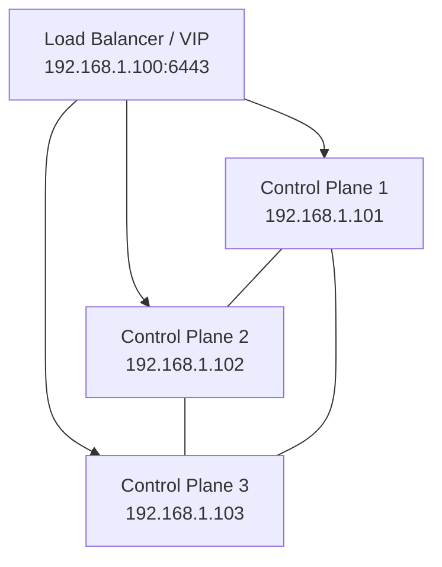

# How to Set Up a Three-Node HA Talos Linux Cluster

Author: [nawazdhandala](https://github.com/nawazdhandala)

Tags: Talos Linux, Kubernetes, High Availability, Cluster Setup, Etcd

Description: Build a highly available Kubernetes cluster with three Talos Linux control plane nodes and automatic failover.

---

A single control plane node is fine for development, but production workloads need high availability. If your one control plane node goes down, the entire Kubernetes API becomes unreachable, and no new pods can be scheduled.

The standard approach is three control plane nodes. This gives you etcd quorum (you can lose one node and still function) and API server redundancy. Talos Linux makes this setup straightforward because the configuration is declarative and repeatable.

## Architecture Overview

In a three-node HA cluster, each control plane node runs:

- etcd (distributed key-value store)
- kube-apiserver
- kube-controller-manager
- kube-scheduler

You also need a stable endpoint for the Kubernetes API that can route to any healthy control plane node. This can be a load balancer, a DNS round-robin record, or a Virtual IP (VIP) managed by Talos itself.



## Prerequisites

You will need:

- Three machines (physical or virtual), each with at least 2 CPUs, 4 GB RAM, and 20 GB disk
- Network connectivity between all three machines
- A load balancer, VIP, or DNS name for the Kubernetes API endpoint
- `talosctl` and `kubectl` installed on your workstation
- Talos Linux ISO or images for your platform

## Step 1: Plan Your IP Addresses

Before generating any configurations, map out your network:

| Role | Hostname | IP Address |
|------|----------|-----------|
| API Endpoint (VIP) | - | 192.168.1.100 |
| Control Plane 1 | cp1 | 192.168.1.101 |
| Control Plane 2 | cp2 | 192.168.1.102 |
| Control Plane 3 | cp3 | 192.168.1.103 |

The API endpoint should be a separate IP from any individual node. This is the address that kubectl, worker nodes, and external systems use to reach the Kubernetes API.

## Step 2: Set Up Your API Endpoint

You have several options for the API endpoint. The simplest for bare metal is Talos's built-in Virtual IP feature:

```yaml
# vip-patch.yaml
# This patch configures a shared VIP on the control plane nodes
machine:
  network:
    interfaces:
      - interface: eth0
        vip:
          ip: 192.168.1.100
```

The VIP floats between control plane nodes. If the current holder goes down, another node takes over the IP automatically.

Alternatively, you can use an external load balancer like HAProxy, nginx, or a hardware load balancer. We will use the VIP approach in this guide since it requires no additional infrastructure.

## Step 3: Generate the Cluster Configuration

Generate the machine configurations using the VIP as the endpoint:

```bash
# Generate configurations with the VIP as the endpoint
talosctl gen config ha-cluster https://192.168.1.100:6443 \
  --config-patch-control-plane @vip-patch.yaml
```

This creates:

- `controlplane.yaml` - configuration for all three control plane nodes
- `worker.yaml` - configuration for worker nodes (if you add any later)
- `talosconfig` - client configuration

## Step 4: Customize Per-Node Settings (Optional)

If you want each node to have a specific hostname or static IP, create per-node patches:

```yaml
# cp1-patch.yaml
machine:
  network:
    hostname: cp1
    interfaces:
      - interface: eth0
        addresses:
          - 192.168.1.101/24
        routes:
          - network: 0.0.0.0/0
            gateway: 192.168.1.1
        vip:
          ip: 192.168.1.100
```

```yaml
# cp2-patch.yaml
machine:
  network:
    hostname: cp2
    interfaces:
      - interface: eth0
        addresses:
          - 192.168.1.102/24
        routes:
          - network: 0.0.0.0/0
            gateway: 192.168.1.1
        vip:
          ip: 192.168.1.100
```

```yaml
# cp3-patch.yaml
machine:
  network:
    hostname: cp3
    interfaces:
      - interface: eth0
        addresses:
          - 192.168.1.103/24
        routes:
          - network: 0.0.0.0/0
            gateway: 192.168.1.1
        vip:
          ip: 192.168.1.100
```

Then generate individual configs:

```bash
# Generate separate configs for each node
talosctl gen config ha-cluster https://192.168.1.100:6443

# Create per-node configs by patching the base
talosctl machineconfig patch controlplane.yaml --patch @cp1-patch.yaml --output cp1.yaml
talosctl machineconfig patch controlplane.yaml --patch @cp2-patch.yaml --output cp2.yaml
talosctl machineconfig patch controlplane.yaml --patch @cp3-patch.yaml --output cp3.yaml
```

## Step 5: Boot All Three Nodes

Boot each machine with the Talos ISO. Once they are all in maintenance mode and have IP addresses, apply the configurations:

```bash
# Apply configs to each node
talosctl apply-config --insecure --nodes 192.168.1.101 --file cp1.yaml
talosctl apply-config --insecure --nodes 192.168.1.102 --file cp2.yaml
talosctl apply-config --insecure --nodes 192.168.1.103 --file cp3.yaml
```

Each node will reboot and install Talos to disk. Wait for all three to come back up.

## Step 6: Configure talosctl

Set up your client configuration:

```bash
# Set up talosctl
export TALOSCONFIG="$(pwd)/talosconfig"
talosctl config endpoint 192.168.1.101 192.168.1.102 192.168.1.103
talosctl config node 192.168.1.101
```

Setting multiple endpoints means talosctl can reach the cluster even if one node is down.

## Step 7: Bootstrap the Cluster

Bootstrap Kubernetes on exactly one control plane node:

```bash
# Bootstrap on the first node only
talosctl bootstrap --nodes 192.168.1.101
```

This is critical: do not run bootstrap on more than one node. The first node initializes etcd, and the other nodes join the existing etcd cluster automatically.

## Step 8: Wait for the Cluster to Converge

The bootstrap process takes a few minutes. The first node starts etcd, then the other two nodes join. After etcd has quorum, the Kubernetes components start up.

```bash
# Watch the cluster health
talosctl health --wait-timeout 10m

# Check etcd membership
talosctl etcd members --nodes 192.168.1.101
```

The etcd members command should show all three nodes:

```text
ID                 HOSTNAME  MEMBER ID          PEER URLS
192.168.1.101:2380 cp1       xxxxxxxxxx         https://192.168.1.101:2380
192.168.1.102:2380 cp2       xxxxxxxxxx         https://192.168.1.102:2380
192.168.1.103:2380 cp3       xxxxxxxxxx         https://192.168.1.103:2380
```

## Step 9: Get kubeconfig and Verify

```bash
# Retrieve kubeconfig
talosctl kubeconfig --nodes 192.168.1.101

# Check the nodes
kubectl get nodes
```

You should see three nodes, all with the `control-plane` role and `Ready` status:

```text
NAME   STATUS   ROLES           AGE   VERSION
cp1    Ready    control-plane   5m    v1.29.x
cp2    Ready    control-plane   4m    v1.29.x
cp3    Ready    control-plane   4m    v1.29.x
```

## Testing Failover

To verify HA is working, simulate a node failure:

```bash
# Check which node currently holds the VIP
talosctl get addresses --nodes 192.168.1.101 192.168.1.102 192.168.1.103 | grep 192.168.1.100

# The Kubernetes API should still be reachable via the VIP
kubectl get nodes
```

If you shut down the node holding the VIP, another node picks it up within seconds. The Kubernetes API remains accessible, and existing workloads continue running on the surviving nodes.

## Adding Worker Nodes

With the control plane running, you can add dedicated worker nodes:

```bash
# Apply worker config to a new node
talosctl apply-config --insecure \
  --nodes 192.168.1.110 \
  --file worker.yaml
```

Worker nodes join the cluster automatically once they have the configuration applied.

## Production Considerations

For a production three-node HA cluster, also consider:

- Placing each control plane node on a separate physical host or failure domain
- Using dedicated disks for etcd for better performance
- Setting up monitoring and alerting for etcd health
- Configuring automated backups of etcd data
- Adding worker nodes so the control plane nodes are not also running application workloads

A three-node HA Talos cluster gives you a solid, resilient foundation for running Kubernetes in production. The immutable nature of Talos means your nodes stay consistent, and upgrades are safe and predictable.
