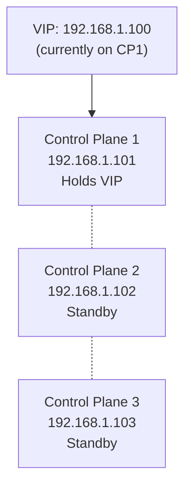
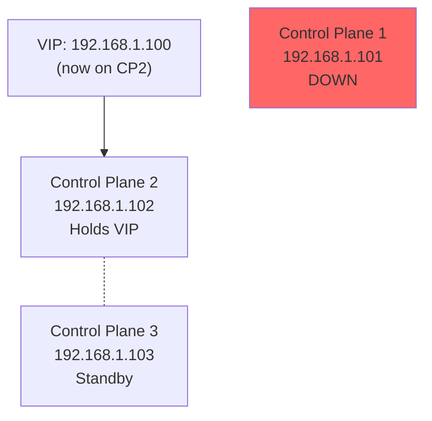

# How to Set Up a Virtual IP (VIP) for Talos Linux Control Plane

Author: [nawazdhandala](https://github.com/nawazdhandala)

Tags: Talos Linux, Virtual IP, VIP, High Availability, Control Plane, Networking

Description: Configure a Virtual IP address for your Talos Linux control plane nodes to provide a stable, highly available Kubernetes API endpoint.

---

When you have multiple control plane nodes in a Talos Linux cluster, you need a stable IP address for the Kubernetes API that does not depend on any single node. Talos Linux has a built-in Virtual IP (VIP) feature that handles this without requiring an external load balancer. A VIP is a shared IP address that floats between your control plane nodes - one node holds it at any time, and if that node goes down, another picks it up automatically.

## How the Talos VIP Works

Talos implements VIP using a simple leader election mechanism. All control plane nodes participate in an election, and the winner assigns the VIP to its network interface. The other nodes monitor the leader, and if it becomes unreachable, a new election happens and the VIP moves to another node.



When CP1 fails, the VIP moves:



The failover typically happens within a few seconds.

## Prerequisites

To use Talos VIP, you need:

- At least two control plane nodes (three recommended)
- An unused IP address on the same network subnet as the control plane nodes
- Layer 2 network connectivity between control plane nodes (they must be on the same broadcast domain)

VIP works at Layer 2 using gratuitous ARP. This means it does not work across subnets or VLANs unless you have ARP proxying configured. For cloud environments where Layer 2 is not available, use a cloud load balancer instead.

## Choosing a VIP Address

Pick an IP address that:

- Is on the same subnet as your control plane nodes
- Is not assigned to any other device
- Is outside your DHCP range (if you use DHCP)
- Is not the gateway or broadcast address

For example, if your control plane nodes are at 192.168.1.101, 192.168.1.102, and 192.168.1.103, a good VIP choice would be 192.168.1.100.

## Configuring VIP During Initial Setup

The cleanest approach is to configure the VIP when you first generate your cluster configuration.

### Create the VIP Patch

```yaml
# vip-patch.yaml
machine:
  network:
    interfaces:
      - interface: eth0
        vip:
          ip: 192.168.1.100
```

Replace `eth0` with the actual interface name on your nodes. To find the interface name, you can check the console output when Talos boots, or query it after the fact:

```bash
# Check interface names on a running node
talosctl get links --nodes 192.168.1.101
```

### Generate Config with VIP

```bash
# Use the VIP as the Kubernetes endpoint
talosctl gen config my-cluster https://192.168.1.100:6443 \
  --config-patch-control-plane @vip-patch.yaml
```

Notice that the endpoint URL uses the VIP address (192.168.1.100), not any individual node's IP. This is important because all clients (kubectl, worker nodes, etc.) will use this address.

### Apply to Control Plane Nodes

```bash
# Apply to all control plane nodes
talosctl apply-config --insecure --nodes 192.168.1.101 --file controlplane.yaml
talosctl apply-config --insecure --nodes 192.168.1.102 --file controlplane.yaml
talosctl apply-config --insecure --nodes 192.168.1.103 --file controlplane.yaml
```

Each node gets the same VIP configuration. The election process determines which one actually holds the IP.

## Adding VIP to an Existing Cluster

If you already have a running cluster and want to add VIP:

```bash
# Patch each control plane node to add VIP
talosctl patch machineconfig --nodes 192.168.1.101 \
  --patch @vip-patch.yaml

talosctl patch machineconfig --nodes 192.168.1.102 \
  --patch @vip-patch.yaml

talosctl patch machineconfig --nodes 192.168.1.103 \
  --patch @vip-patch.yaml
```

The VIP becomes active after the configuration is applied. No reboot is required for VIP changes.

Keep in mind that if the cluster was originally configured with a different endpoint (like a single node's IP), worker nodes and your kubeconfig will still use the old endpoint. You would need to update the cluster endpoint separately, which requires more careful planning.

## Verifying VIP Is Working

After the configuration is applied and the cluster is running, verify the VIP:

### Check Which Node Holds the VIP

```bash
# Check addresses on all control plane nodes
talosctl get addresses --nodes 192.168.1.101,192.168.1.102,192.168.1.103
```

Look for the VIP address (192.168.1.100) in the output. Only one node should have it assigned.

### Ping the VIP

```bash
# From your workstation
ping 192.168.1.100
```

The VIP should respond. The response comes from whichever node currently holds the VIP.

### Test API Access Through the VIP

```bash
# Access the Kubernetes API through the VIP
curl -k https://192.168.1.100:6443/healthz
# Expected output: ok

# Use kubectl through the VIP
kubectl get nodes
```

## Testing Failover

To verify failover works, simulate a node failure:

```bash
# Find which node holds the VIP
talosctl get addresses --nodes 192.168.1.101,192.168.1.102,192.168.1.103 | grep 192.168.1.100

# Say CP1 holds it. Reboot CP1.
talosctl reboot --nodes 192.168.1.101

# Immediately check if the VIP moved
ping 192.168.1.100

# After a few seconds, the VIP should be reachable again
# Check which node now holds it
talosctl get addresses --nodes 192.168.1.102,192.168.1.103 | grep 192.168.1.100
```

The failover should complete within 5-10 seconds. During the failover, API requests will fail, but kubectl and other clients will retry automatically.

## VIP with Static IPs

If your control plane nodes use static IPs, configure them together with the VIP:

```yaml
# cp1-config.yaml
machine:
  network:
    hostname: cp1
    interfaces:
      - interface: eth0
        addresses:
          - 192.168.1.101/24
        routes:
          - network: 0.0.0.0/0
            gateway: 192.168.1.1
        vip:
          ip: 192.168.1.100
    nameservers:
      - 8.8.8.8
```

Note that the VIP is configured on the same interface as the static IP. The VIP is added as a secondary address on the interface.

## VIP Limitations

While VIP is simple and effective, it has some limitations:

**Layer 2 only**: VIP relies on ARP, so all control plane nodes must be on the same network segment. It does not work across routed networks.

**No load balancing**: The VIP directs all traffic to a single node. Unlike a load balancer, it does not distribute requests across multiple nodes. The other control plane nodes are only used if the VIP holder fails.

**Cloud environments**: Most cloud providers do not support gratuitous ARP, so VIP will not work on AWS, GCP, Azure, etc. Use the cloud provider's load balancer instead.

**Single IP**: You get one VIP per interface. If you need multiple highly available services, you will need a proper load balancer.

## VIP vs External Load Balancer

| Feature | VIP | External LB |
|---------|-----|-------------|
| Setup complexity | Very simple | More involved |
| Extra infrastructure | None | Requires LB host(s) |
| Load distribution | Active/standby | Round-robin or least-conn |
| Layer 2 required | Yes | No |
| Cloud support | No | Yes |
| Monitoring | Basic | Full metrics |

For homelabs and small on-premises clusters, VIP is often the right choice. For production or cloud environments, an external load balancer gives you more control and flexibility.

The Talos Linux built-in VIP is one of the simplest ways to achieve a highly available Kubernetes API endpoint. With just a few lines of YAML, you get automatic failover with no external dependencies. It is a great starting point, and you can always move to a more sophisticated load balancing solution later if your needs grow.
