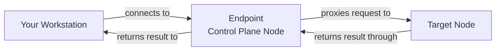

# How to Understand Endpoints vs Nodes in talosctl

Author: [nawazdhandala](https://github.com/nawazdhandala)

Tags: Talos Linux, Talosctl, Networking, Endpoint, Cluster Management

Description: Clear up the confusion between endpoints and nodes in talosctl and learn how to configure them correctly.

---

One of the most common sources of confusion for Talos Linux newcomers is the difference between "endpoints" and "nodes" in talosctl. They sound similar, and both involve IP addresses of your cluster machines, but they serve very different purposes. Getting them mixed up leads to connection errors, commands running on the wrong machines, and general frustration.

Let us break down exactly what each one means and how to use them correctly.

## The Short Version

- **Endpoints** are the addresses talosctl uses to connect to the Talos API. Think of them as the "front door" to your cluster.
- **Nodes** are the machines you want to execute commands against. Think of them as the "target" of your command.

talosctl connects to an endpoint, then the endpoint proxies the request to the specified node. This means you do not need direct network access to every node in your cluster, only to the endpoints.

## How the Proxy Model Works

When you run a talosctl command, the following happens:



For example, if you want to view logs on a worker node:

```bash
# Your workstation connects to the endpoint (control plane)
# The endpoint proxies the request to the target node (worker)
talosctl logs kubelet --endpoints 192.168.1.101 --nodes 192.168.1.110
```

In this case:
- Your workstation connects to `192.168.1.101` (a control plane node)
- The control plane node forwards the request to `192.168.1.110` (a worker node)
- The response comes back through the same path

This proxy model means you only need network access to your control plane nodes. You can manage worker nodes that are on a private network, behind a firewall, or otherwise not directly reachable from your workstation.

## Setting Endpoints

Endpoints should almost always be your control plane nodes. They are the machines running the Talos API that your workstation connects to directly.

```bash
# Set endpoints in your talosconfig
talosctl config endpoint 192.168.1.101 192.168.1.102 192.168.1.103
```

When you specify multiple endpoints, talosctl tries them in order. If the first one is down, it moves to the second, and so on. This gives you resilience - you can still manage the cluster even if one control plane node is down.

You can also use a load balancer or VIP as the endpoint:

```bash
# Use a VIP as the single endpoint
talosctl config endpoint 192.168.1.100
```

The endpoints are stored in your `talosconfig` file:

```yaml
context: my-cluster
contexts:
  my-cluster:
    endpoints:
      - 192.168.1.101
      - 192.168.1.102
      - 192.168.1.103
    nodes:
      - 192.168.1.101
    ca: <base64-encoded-CA>
    crt: <base64-encoded-certificate>
    key: <base64-encoded-key>
```

## Setting Nodes

Nodes are the targets of your commands. When you want to check the health of a specific machine, view its logs, or apply a configuration change, you set that machine as the node.

```bash
# Set the default node
talosctl config node 192.168.1.101

# Or specify per-command
talosctl services --nodes 192.168.1.102
```

You can target multiple nodes at once:

```bash
# Check services on all control plane nodes
talosctl services --nodes 192.168.1.101,192.168.1.102,192.168.1.103

# Or using the flag multiple times
talosctl services --nodes 192.168.1.101 --nodes 192.168.1.102
```

When you target multiple nodes, talosctl sends the command to each one and aggregates the results.

## Common Scenarios

### Scenario 1: Managing Control Plane Nodes

When working with control plane nodes, your endpoints and nodes overlap:

```bash
# Endpoints: control plane nodes
# Node: a specific control plane node

talosctl config endpoint 192.168.1.101 192.168.1.102 192.168.1.103

# Check etcd on control plane 2
talosctl etcd status --nodes 192.168.1.102

# talosctl connects to any endpoint (say .101)
# then proxies the etcd status request to .102
```

### Scenario 2: Managing Worker Nodes

Worker nodes are typically not endpoints. You connect through the control plane:

```bash
# Endpoints are still control plane nodes
talosctl config endpoint 192.168.1.101 192.168.1.102 192.168.1.103

# Target a worker node
talosctl services --nodes 192.168.1.110

# talosctl connects to a control plane endpoint
# then proxies the request to the worker at .110
```

### Scenario 3: Viewing Logs Across Multiple Workers

```bash
# Check kubelet logs on three workers simultaneously
talosctl logs kubelet --nodes 192.168.1.110,192.168.1.111,192.168.1.112
```

The output is prefixed with the node IP so you can tell which logs came from which node.

### Scenario 4: Initial Configuration (Insecure Mode)

When applying the first configuration to a node in maintenance mode, there is no proxy. You connect directly to the node:

```bash
# Direct connection to a node in maintenance mode
# In this case, the --nodes flag IS the endpoint
talosctl apply-config --insecure --nodes 192.168.1.101 --file controlplane.yaml
```

In insecure mode, talosctl ignores the endpoint setting and connects directly to the node specified.

## How They Are Stored in talosconfig

Your `talosconfig` file stores both defaults:

```yaml
context: my-cluster
contexts:
  my-cluster:
    endpoints:
      - 192.168.1.101
      - 192.168.1.102
      - 192.168.1.103
    nodes:
      - 192.168.1.101
```

The `nodes` field here sets the default node for commands. You can override it per-command with the `--nodes` flag.

## Command-Line Override Priority

talosctl resolves endpoints and nodes in this order:

1. Command-line flags (`--endpoints`, `--nodes`) take highest priority
2. Environment variables (`TALOSCONFIG`)
3. Values in the talosconfig file
4. Default talosconfig location (`~/.talos/config`)

```bash
# This overrides everything in the config file
talosctl services \
  --endpoints 10.0.0.1 \
  --nodes 10.0.0.5
```

## Debugging Connection Issues

If commands are timing out or failing, start by checking your endpoint and node settings:

```bash
# Show current configuration
talosctl config info

# Test connectivity to an endpoint
talosctl version --endpoints 192.168.1.101 --nodes 192.168.1.101

# If that works but targeting a different node fails:
talosctl version --endpoints 192.168.1.101 --nodes 192.168.1.110

# If the second command fails, the endpoint cannot reach the target node
# Check network connectivity between the control plane and the worker
```

Common mistakes:

- **Using a worker node as an endpoint**: Worker nodes can technically serve as endpoints, but they do not have the same trust relationships. Stick with control plane nodes.
- **Not setting endpoints at all**: If your talosconfig has no endpoints, talosctl has nowhere to connect. Always set endpoints after generating your config.
- **Using the wrong node**: Double-check which node you are targeting, especially for destructive operations like reset or upgrade.

## Best Practices

1. **Set all control plane nodes as endpoints** for redundancy
2. **Set a single default node** in your talosconfig for routine commands
3. **Override with --nodes** when targeting specific machines
4. **Never use worker nodes as endpoints** unless you have a specific reason
5. **Use the VIP or load balancer** as the endpoint in production for simplicity

Understanding the endpoint-vs-node distinction is fundamental to working effectively with talosctl. Once it clicks, managing even large clusters becomes intuitive because you always know exactly which machine you are connecting through and which machine your command is targeting.
