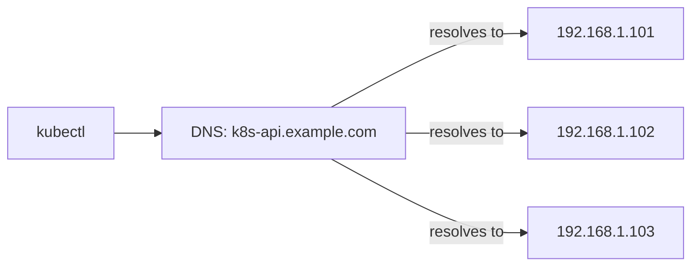

# How to Use DNS Records for High Availability in Talos Linux

Author: [nawazdhandala](https://github.com/nawazdhandala)

Tags: Talos Linux, DNS, High Availability, Kubernetes, Networking, Load Balancing

Description: Configure DNS records to provide a highly available endpoint for your Talos Linux Kubernetes API without requiring a dedicated load balancer.

---

Not every Talos Linux cluster needs a dedicated load balancer or VIP for the Kubernetes API. If you have control over your DNS infrastructure, you can use DNS records to distribute API traffic across multiple control plane nodes. This approach is simple, does not require additional infrastructure, and works across network boundaries where Layer 2 VIP cannot.

## How DNS-Based HA Works

The concept is straightforward: create multiple DNS A records pointing to the same hostname, with each record pointing to a different control plane node. When a client resolves the hostname, it gets back all the IP addresses and can try them in order.

```
k8s-api.example.com.  IN  A  192.168.1.101
k8s-api.example.com.  IN  A  192.168.1.102
k8s-api.example.com.  IN  A  192.168.1.103
```

When kubectl resolves `k8s-api.example.com`, it receives all three IPs. If it cannot connect to the first one, it tries the second, then the third.



## Setting Up DNS Records

The exact method depends on your DNS provider. Here are examples for common setups.

### BIND (Self-Hosted DNS)

Add the following to your zone file:

```
; Zone file for example.com
$TTL 30

k8s-api   IN  A  192.168.1.101
k8s-api   IN  A  192.168.1.102
k8s-api   IN  A  192.168.1.103
```

Note the low TTL (30 seconds). This ensures that if a node goes down and is removed from DNS, clients will pick up the change quickly.

Reload the zone:

```bash
# Reload BIND configuration
sudo rndc reload example.com
```

### CoreDNS (Running Internally)

If you run CoreDNS on your network:

```
# Corefile entry
example.com {
    hosts {
        192.168.1.101 k8s-api.example.com
        192.168.1.102 k8s-api.example.com
        192.168.1.103 k8s-api.example.com
        ttl 30
    }
}
```

### dnsmasq (Common in Homelabs)

Add entries to your dnsmasq configuration:

```
# /etc/dnsmasq.conf
address=/k8s-api.example.com/192.168.1.101
address=/k8s-api.example.com/192.168.1.102
address=/k8s-api.example.com/192.168.1.103
```

Restart dnsmasq:

```bash
sudo systemctl restart dnsmasq
```

### Pi-hole

If you use Pi-hole as your DNS server, add custom DNS entries:

```bash
# /etc/dnsmasq.d/10-talos.conf
address=/k8s-api.example.com/192.168.1.101
address=/k8s-api.example.com/192.168.1.102
address=/k8s-api.example.com/192.168.1.103
```

```bash
# Restart the DNS service
pihole restartdns
```

### Cloud DNS (Route 53, Cloud DNS, etc.)

For AWS Route 53, create an A record set with multiple values:

```bash
# Using the AWS CLI
aws route53 change-resource-record-sets --hosted-zone-id Z123456 \
  --change-batch '{
    "Changes": [{
      "Action": "UPSERT",
      "ResourceRecordSet": {
        "Name": "k8s-api.example.com",
        "Type": "A",
        "TTL": 30,
        "ResourceRecords": [
          {"Value": "192.168.1.101"},
          {"Value": "192.168.1.102"},
          {"Value": "192.168.1.103"}
        ]
      }
    }]
  }'
```

## Generating Talos Configuration with DNS

When generating your Talos cluster configuration, use the DNS name as the endpoint:

```bash
# Use the DNS name as the Kubernetes API endpoint
talosctl gen config my-cluster https://k8s-api.example.com:6443
```

Also add the DNS name as a Subject Alternative Name (SAN) for the API server certificate:

```yaml
# cert-san-patch.yaml
cluster:
  apiServer:
    certSANs:
      - k8s-api.example.com
      - 192.168.1.101
      - 192.168.1.102
      - 192.168.1.103
```

```bash
# Generate config with the SAN patch
talosctl gen config my-cluster https://k8s-api.example.com:6443 \
  --config-patch-control-plane @cert-san-patch.yaml
```

The SAN ensures that the API server's TLS certificate is valid for the DNS name. Without this, clients will get certificate errors when connecting through the DNS name.

## Verifying DNS Resolution

After setting up the DNS records, verify they resolve correctly:

```bash
# Check DNS resolution
dig k8s-api.example.com

# You should see all three A records:
# ;; ANSWER SECTION:
# k8s-api.example.com.  30  IN  A  192.168.1.101
# k8s-api.example.com.  30  IN  A  192.168.1.102
# k8s-api.example.com.  30  IN  A  192.168.1.103

# Or using nslookup
nslookup k8s-api.example.com
```

Verify that the DNS name works with the Kubernetes API:

```bash
# Test API server connectivity through DNS
curl -k https://k8s-api.example.com:6443/healthz

# Use kubectl
kubectl get nodes
```

## TTL Considerations

The DNS Time-To-Live (TTL) value determines how long clients cache the DNS response. This directly impacts failover time.

| TTL | Failover Time | DNS Load |
|-----|---------------|----------|
| 5s | Fast (seconds) | High query volume |
| 30s | Reasonable (under a minute) | Moderate |
| 300s | Slow (up to 5 minutes) | Low |

For the Kubernetes API endpoint, a TTL of 30 seconds is a good balance. It keeps failover reasonably fast without overwhelming your DNS server with queries.

Keep in mind that some DNS clients and libraries cache aggressively and may ignore the TTL. Java applications, for example, cache DNS indefinitely by default unless configured otherwise.

## Handling Node Failures

The weakness of DNS round-robin is that DNS does not know when a node is down. If a control plane node fails, its IP stays in the DNS records until someone manually removes it.

### Manual Approach

When a node goes down, remove its A record from DNS:

```bash
# Remove the failed node's record
# (this depends on your DNS server)

# After the node is back, add it again
```

### Automated Health-Based DNS

For better automation, use a DNS provider that supports health checks:

- **AWS Route 53** supports health checks that automatically remove unhealthy records
- **Cloudflare** offers similar functionality
- **PowerDNS** with Lua scripting can implement health-based responses

With Route 53 health checks:

```bash
# Create a health check for each control plane node
aws route53 create-health-check --caller-reference cp1 \
  --health-check-config '{
    "IPAddress": "192.168.1.101",
    "Port": 6443,
    "Type": "TCP",
    "RequestInterval": 10,
    "FailureThreshold": 3
  }'

# Associate the health check with the DNS record
# (done via the Route 53 console or API)
```

## DNS Round-Robin vs Other Approaches

### Advantages

- **No extra infrastructure** - Uses your existing DNS server
- **Works across subnets** - Unlike VIP, DNS works across routed networks
- **Simple to set up** - Just add A records
- **Works in cloud environments** - Where Layer 2 features are unavailable

### Disadvantages

- **No real health checking** - Standard DNS round-robin has no awareness of node health (unless you use health-check-capable DNS)
- **Client-side caching** - Clients may cache stale DNS records beyond the TTL
- **Uneven distribution** - DNS round-robin does not account for server load
- **Failover delay** - Depends on TTL and client retry behavior

## Combining DNS with Other Approaches

For the best of both worlds, combine DNS with VIP or a load balancer:

```
# DNS points to the VIP
k8s-api.example.com.  IN  A  192.168.1.100   # VIP address

# Or DNS points to the load balancer
k8s-api.example.com.  IN  A  192.168.1.50    # Load balancer IP
```

This gives you the flexibility of DNS (easy to change IPs, works with TLS SANs) combined with the fast failover of VIP or load balancing.

DNS-based high availability is a pragmatic approach that works well for many Talos Linux deployments. It is not as robust as a dedicated load balancer with health checking, but it requires zero additional infrastructure and provides reasonable resilience for clusters where a few seconds of API unavailability during failover is acceptable.
